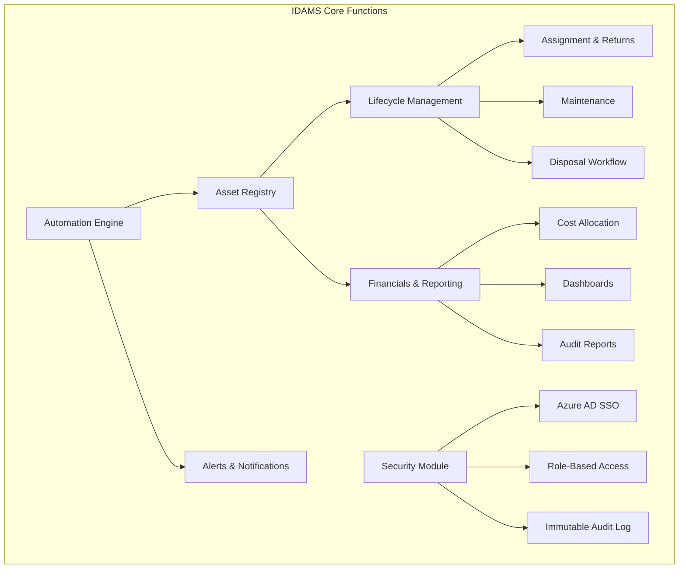
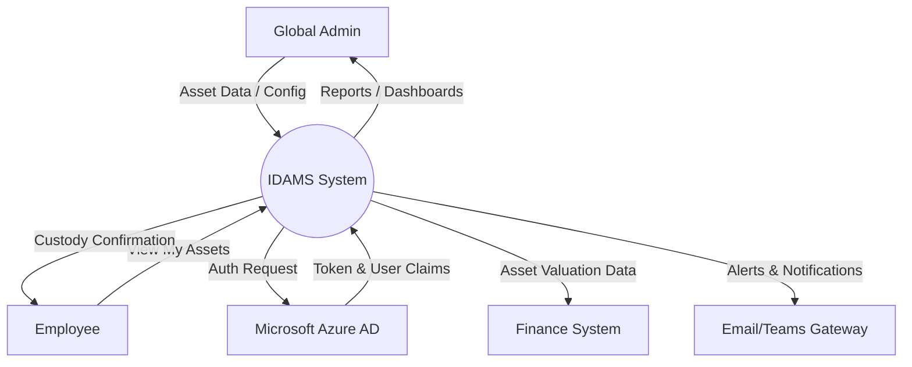
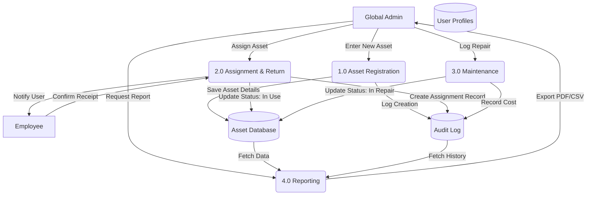
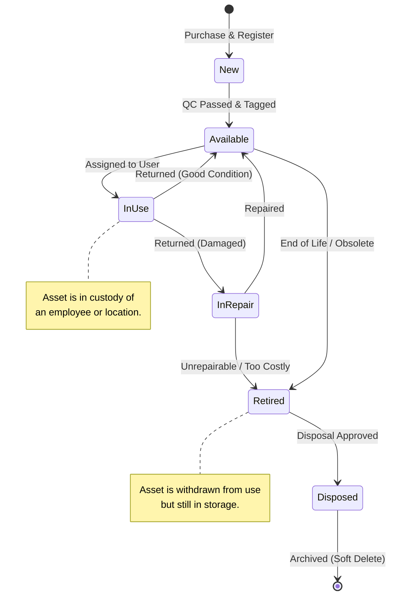
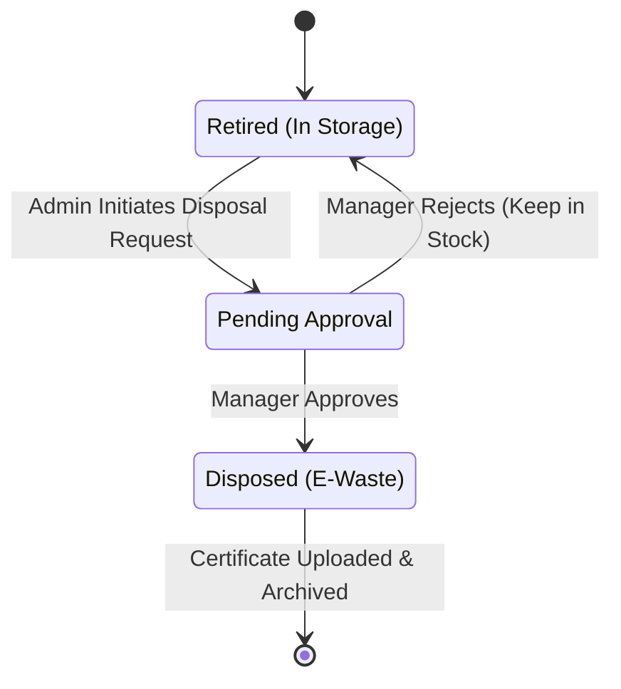
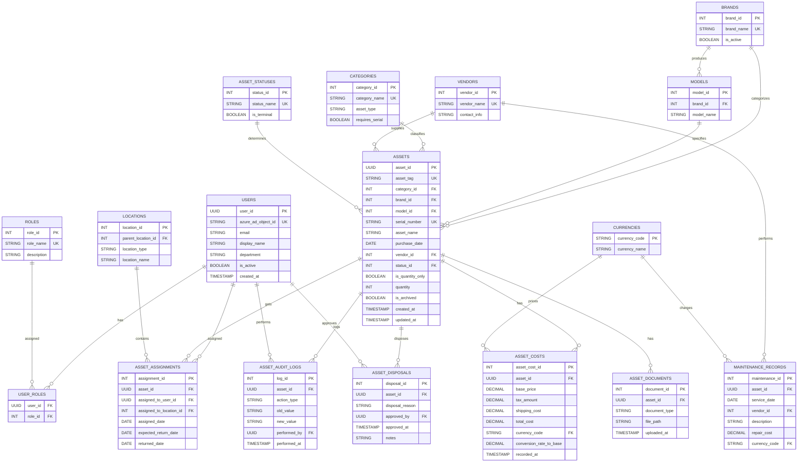

# Software Requirements Specification

## for Integrated Digital Asset Management System

**Version 1.0**  
**Prepared by ITM07 - NovaSoft**  
**University of Moratuwa, Sri Lanka**  
**12/02/2026**

---

## Revision History

| Name | Date       | Reason For Changes | Version |
| :--- | :--------- | :----------------- | :------ |
| Team | 12/02/2026 | Initial draft      | 1.0     |

---

# Table of Contents

- [Revision History](#revision-history)
- [1. Introduction](#1-introduction)
  - [1.1 Purpose](#11-purpose)
  - [1.2 Document Conventions](#12-document-conventions)
  - [1.3 Intended Audience and Reading Suggestions](#13-intended-audience-and-reading-suggestions)
  - [1.4 Product Scope](#14-product-scope)
    - [1.4.1 Purpose and Objectives](#141-purpose-and-objectives)
  - [1.5 References](#15-references)
- [2. Overall Description](#2-overall-description)
  - [2.1 Product Perspective](#21-product-perspective)
    - [2.1.1 Context and Origin](#211-context-and-origin)
    - [2.1.2 Relationship with Other Systems](#212-relationship-with-other-systems)
    - [2.1.3 System Context Diagram](#213-system-context-diagram)
  - [2.2 Product Functions](#22-product-functions)
  - [2.3 User Classes and Characteristics](#23-user-classes-and-characteristics)
  - [2.4 Operating Environment](#24-operating-environment)
  - [2.5 Design and Implementation Constraints](#25-design-and-implementation-constraints)
  - [2.6 User Documentation](#26-user-documentation)
  - [2.7 Assumptions and Dependencies](#27-assumptions-and-dependencies)
- [3. External Interface Requirements](#3-external-interface-requirements)
  - [3.1 User Interfaces](#31-user-interfaces)
  - [3.2 Hardware Interfaces](#32-hardware-interfaces)
  - [3.3 Software Interfaces](#33-software-interfaces)
  - [3.4 Communications Interfaces](#34-communications-interfaces)
- [4. System Features](#4-system-features)
  - [4.1 Core Asset Registry](#41-core-asset-registry)
    - [4.1.1 Description and Priority](#411-description-and-priority)
    - [4.1.2 Stimulus/Response Sequences](#412-stimulusresponse-sequences)
    - [4.1.3 Functional Requirements](#413-functional-requirements)
  - [4.2 User Access & Security](#42-user-access--security)
    - [4.2.1 Description and Priority](#421-description-and-priority)
    - [4.2.2 Functional Requirements](#422-functional-requirements)
  - [4.3 Tracking & Operations](#43-tracking--operations)
    - [4.3.1 Description and Priority](#431-description-and-priority)
    - [4.3.2 Stimulus/Response Sequences](#432-stimulusresponse-sequences)
    - [4.3.3 Functional Requirements](#433-functional-requirements)
  - [4.4 Integration & Reporting](#44-integration--reporting)
    - [4.4.1 Description and Priority](#441-description-and-priority)
    - [4.4.2 Stimulus/Response Sequences](#442-stimulusresponse-sequences)
    - [4.4.3 Functional Requirements](#443-functional-requirements)
  - [4.5 Automation & Optimization](#45-automation--optimization)
    - [4.5.1 Description and Priority](#451-description-and-priority)
    - [4.5.2 Stimulus/Response Sequences](#452-stimulusresponse-sequences)
    - [4.5.3 Functional Requirements](#453-functional-requirements)
- [5. Other Nonfunctional Requirements](#5-other-nonfunctional-requirements)
  - [5.1 Performance Requirements](#51-performance-requirements)
  - [5.2 Safety Requirements](#52-safety-requirements)
  - [5.3 Security Requirements](#53-security-requirements)
  - [5.4 Software Quality Attributes](#54-software-quality-attributes)
  - [5.5 Business Rules](#55-business-rules)
- [6. Other Requirements](#6-other-requirements)
  - [6.1 Internationalization Requirements (i18n)](#61-internationalization-requirements-i18n)
  - [6.2 Legal & Compliance Requirements](#62-legal--compliance-requirements)
  - [6.3 Database & Data Integrity](#63-database--data-integrity)
- [Appendix A: Glossary](#appendix-a-glossary)
- [Appendix B: Analysis Models](#appendix-b-analysis-models)
- [Appendix C: To Be Determined List](#appendix-c-to-be-determined-list)

---

# 1. Introduction

## 1.1 Purpose

The purpose of this document is to specify the software requirements for the Integrated Digital Asset Management System (IDAMS), Version 1.0. This system is being developed by Novasoft for TIQRI Corporation. The scope of the product covered by this SRS includes a centralized enterprise web platform designed to streamline the management of both digital and physical IT assets. It covers the full asset lifecycle from procurement and assignment to maintenance and disposal while facilitating cost tracking, license management, and automated compliance alerts.

## 1.2 Document Conventions

This document follows the IEEE 830-1998 standard for Software Requirements Specifications.

- **Typography:** Important terms and user interface elements are highlighted in **bold**.
- **Requirement IDs:** Detailed requirements in Section 4 are marked with unique identifiers (e.g., REQ-REG-1.1, REQ-SEC-2.1) as defined in the functional requirements documentation to facilitate traceability.
- **Priorities:** Requirements may be classified as High, Medium, or Low priority to guide development phases.

## 1.3 Intended Audience and Reading Suggestions

This Software Requirements Specification (SRS) is intended for the following stakeholders involved in the Integrated Digital Asset Management System (IDAMS) project:

- **Development Team:** This includes the frontend, backend, and mobile developers responsible for implementing the system features. They should use this document as the primary reference for building the core asset registry, automation workflows, and integration points.
- **Project Supervisors & University Faculty:** The University of Moratuwa faculty and supervisors overseeing the IS2901 - Software Development Project. They will use this document to assess the scope, feasibility, and technical depth of the proposed solution.
- **Client Stakeholders (TIQRI Corporation):** Specifically the Product Owner (TIQRI's IT Department Head) and industry mentors. They will use this document to validate that the specified requirements align with their business goals, such as improving asset visibility and automating cost tracking.
- **Quality Assurance (QA) & Testers:** Team members responsible for the "Evaluation" phase. They will use the functional requirements in Section 4 to design test cases and acceptance criteria.

**Document Organization:** The remainder of this SRS is organized as follows:

- **Section 2 (Overall Description):** Provides a high-level overview of the product, including user characteristics, the operating environment, and design constraints.
- **Section 3 (External Interface Requirements):** Details the hardware, software, and communication interfaces, including Azure AD integration and REST API specifications.
- **Section 4 (System Features):** detailed functional requirements organized by feature (e.g., Asset Registry, Procurement, Disposal).
- **Section 5 (Other Nonfunctional Requirements):** Specifies performance, safety, security (RBAC, Encryption), and quality attributes.

**Reading Suggestions:**

- **Client Stakeholders and Supervisors** are recommended to focus on Section 1 and Section 2 to gain a clear understanding of the system's scope, limitations, and user classes without getting lost in technical implementation details.
- **Developers** should read Section 2 for context but focus primarily on Section 3 and Section 4, which contain the specific logic for the database schema, API endpoints, and authentication flows.
- **Testers** should concentrate on Section 4 (Functional Requirements) and Section 5 (Non-functional Requirements) to define pass/fail criteria for system validation.

## 1.4 Product Scope

The Integrated Digital Asset Management System (IDAMS) is a centralized enterprise web platform designed to streamline the management of both digital and physical IT assets. It serves as a "Unified Truth" that consolidates diverse asset types including IT hardware, software licenses, and general office equipment into a single, intelligent registry.

### 1.4.1 Purpose and Objectives

The primary purpose of the software is to replace manual, decentralized tracking methods with an automated system that manages the full asset lifecycle, from procurement to disposal. Key objectives include:

- **Centralized Tracking:** maintaining a digital registry of all assets to eliminate "siloed" tracking sheets.
- **Financial Accountability:** Calculating and displaying total asset value allocated to specific employees, departments, or cost centers to improve budget tracking.
- **Automated Compliance:** Monitoring and sending proactive alerts for software license renewals and hardware warranty expirations to prevent downtime and compliance issues.
- **Operational Efficiency:** Reducing manual administrative effort through automated workflows, such as digital acceptance for asset assignment.
- **Alignment with Corporate Goals:** For TIQRI Corporation, this software directly supports the strategic goal of maintaining complete control over the IT ecosystem and optimizing resource utilization. By resolving the challenges of "decentralized management" and "lack of visibility" into asset ownership, IDAMS enhances organizational transparency. It aligns with corporate financial strategies by providing real-time analytics and cost reporting, enabling data-driven decisions regarding IT expenditure and resource allocation.

## 1.5 References

The following documents and resources were used in the preparation of this SRS or are referenced within it.

1.  Novasoft. Functional Requirements Specification. Internal Project Document, 2026.
2.  IEEE. IEEE Std 830-1998, IEEE Recommended Practice for Software Requirements Specifications. IEEE Computer Society, 1998.
3.  TIQRI Corporation. Corporate Identity and UI Guidelines. (As advised by TIQRI UI Engineer mentorship).
4.  Next.js Documentation (v14+ App Router). Vercel. Available at: https://nextjs.org/docs
5.  Microsoft Entra ID (Azure AD) Documentation. Microsoft. Available at: https://learn.microsoft.com/en-us/entra/identity/
6.  PostgreSQL Documentation. The PostgreSQL Global Development Group. Available at: https://www.postgresql.org/docs/
7.  ShadCN/UI Documentation. Available at: https://ui.shadcn.com/
8.  Tailwind CSS Documentation. Available at: https://tailwindcss.com/docs

---

# 2. Overall Description

## 2.1 Product Perspective

The Integrated Digital Asset Management System (IDAMS) is a new, self-contained software product being developed by the Novasoft team for TIQRI Corporation as part of the IS2901 Software Development Project.

### 2.1.1 Context and Origin

IDAMS is designed to replace the existing manual processes and scattered tracking methods currently used by the client. The current absence of a centralized system has led to decentralized management, lack of visibility into asset ownership, and difficulties in budget tracking. IDAMS unifies these disconnected functions into a single, automated enterprise web platform.

### 2.1.2 Relationship with Other Systems

While IDAMS is a self-contained application, it must operate peacefully within TIQRI's existing enterprise ecosystem. It interfaces with the following external components:

- **Identity Provider (Microsoft Entra ID / Azure AD):** IDAMS relies entirely on the organization's existing Azure Active Directory for user authentication and Role-Based Access Control (RBAC). It does not maintain its own password database.
- **External Business Systems (HR & Finance):** The system exposes secure REST API endpoints to allow external systems, such as HR and Finance software, to fetch asset details and financial data.
- **Mobile/Web Clients:** The system interfaces with standard web browsers and includes a mobile-web scanner interface for physical inventory audits using QR codes.

### 2.1.3 System Context Diagram

The system involves interactions between the User/Admin, IDAMS System, and TIQRI IT Infrastructure (Microsoft Azure AD, Finance System, HR System).

**Major Components**
As outlined in the proposed solution architecture, the system consists of:

1.  **Frontend/UI Layer:** Next.js application with ShadCN/UI for user interaction and dashboards.
2.  **Backend/API Layer:** Processes business logic, workflows, and API requests.
3.  **Database Layer:** PostgreSQL database storing the "Unified Truth" of asset data.
4.  **Automation Engine:** Background services (using Trigger.dev) for license renewals and warranty alerts.

## 2.2 Product Functions

The Integrated Digital Asset Management System (IDAMS) automates the tracking and management of IT assets throughout their entire lifecycle. The system's major functions are organized into five primary modules:

**Core Asset Registry & Identification**

- **Unified Registry:** Consolidates diverse asset types (Hardware, Software Licenses, Office Equipment) into a single, centralized database.
- **Dynamic Data Schema:** Adapts data entry fields based on the asset category (e.g., capturing "License Keys" for software vs. "CPU/RAM" for hardware).
- **Unique Identification:** Auto-generates unique Asset IDs and corresponding QR codes to prevent duplication and facilitate physical tracking.
- **Mobile Audit:** Provides a mobile-web interface for scanning QR codes to perform rapid inventory lookups and audits.

**Lifecycle Operations & Workflow**

- **Assignment & Return:** Manages the assignment of assets to specific employees or locations and tracks the return process.
- **Digital Custody:** Triggers automated "Digital Acceptance" workflows via Email/Teams, requiring employees to acknowledge custody of assigned assets.
- **Maintenance Management:** Tracks service history, repair costs, and schedules upcoming maintenance tasks.
- **Disposal Governance:** Enforces strict approval workflows for retiring assets (e.g., E-waste, Stolen) to ensure compliance and capture disposal reasons.

**Financial Visibility & Reporting**

- **Cost Tracking:** Records comprehensive financial data, including purchase orders (POs), invoices, and vendor details from acquisition to retirement.
- **Asset Valuation:** Calculates and displays the total asset value allocated to each employee, department, or cost center.
- **Interactive Dashboards:** Visualizes real-time metrics such as pending approvals, license utilization, and critical failure trends.
- **Exportable Reports:** Generates audit-ready reports in standard formats (PDF/Excel) for inventory and financial audits.

**Automation & Proactive Alerts**

- **Expiration Alerts:** Automatically monitors and sends notifications for upcoming software license renewals and hardware warranty expirations.
- **Overdue Notifications:** Triggers alerts to IT staff and users when assigned assets are not returned by the due date.

**Security & Administration**

- **Single Sign-On (SSO):** Authenticates users exclusively via Microsoft Azure AD (OIDC/SAML), eliminating local passwords.
- **Role-Based Access Control (RBAC):** Automatically maps Azure AD group attributes to system permissions (e.g., Admin, Viewer).
- **Immutable Audit Log:** Maintains a chronological, read-only ledger of every system change (assignments, status updates) for security and historical traceability.

**Functional Hierarchy Diagram**

The following diagram illustrates the major functional groups and their relationships:

## 2.3 User Classes and Characteristics

The system interactions are divided into three primary user classes, distinguished by their access levels and business responsibilities.

- **Global Administrators (IT Department)**
  - **Role:** The primary "Power Users" of the system. They act as the custodians of the asset registry.
  - **Frequency of Use:** Daily / Continuous.
  - **Technical Expertise:** High. They are comfortable with technical terminology, search queries, and navigating complex data forms.
  - **Privileges:** Full Create-Read-Update-Delete (CRUD) access to all modules. They can register assets, override lifecycle statuses, manage master data (e.g., Brand lists), and view all financial costs.
  - **Key Needs:** Efficiency in data entry, keyboard shortcuts, and detailed error messages.

- **Standard Employees (End Users)**
  - **Role:** General staff members (Developers, HR, Sales) who are assigned IT assets to perform their jobs.
  - **Frequency of Use:** Infrequent (Onboarding, Asset Return, or Incident Reporting).
  - **Technical Expertise:** Low to Medium. They require a simple, intuitive interface that requires no training.
  - **Privileges:** Strictly Read-Only access to their own profile ("My Assets" view). They can trigger specific workflows like "Acknowledge Receipt" or "Report Issue" but cannot edit asset details.
  - **Key Needs:** Clarity on what they are responsible for and a mobile-friendly view for quick verification.

- **Business Viewers (Finance, Management, & Auditors)**
  - **Role:** Stakeholders who require visibility into the system for budgeting, compliance, or decision-making but do not perform operational tasks.
  - **Frequency of Use:** Periodic (Monthly Audits, Annual Budgeting).
  - **Technical Expertise:** Medium (Domain knowledge in Finance/Management).
  - **Privileges:** Read-Only access to Dashboards, Reports, and Cost Analysis features. They cannot alter asset records.
  - **Key Needs:** Accurate, summarized data presented in clear visualizations (Charts/Graphs) and exportable formats (Excel/PDF).

**Importance:** The Global Administrator is the most critical user class to satisfy, as the system's integrity depends entirely on their ability to maintain the "Unified Truth" of the registry. If the system is too cumbersome for them, data hygiene will fail.

## 2.4 Operating Environment

The Integrated Digital Asset Management System (IDAMS) is a cloud-native web application designed to be platform-independent for end-users while relying on specific cloud infrastructure for hosting.

**Client-Side (User Environment)**

- **Web Browsers:** The system is optimized for modern HTML5-compliant browsers.
  - **Desktop:** Google Chrome (v120+), Microsoft Edge (v120+), Mozilla Firefox, and Safari.
  - **Mobile:** Chrome for Android and Safari for iOS (specifically for the QR Code scanning feature).
- **Hardware:**
  - **Desktops/Laptops:** Standard office PCs (Windows/macOS) for administrative tasks and dashboard viewing.
  - **Mobile Devices:** Smartphones with a working camera are required for physical asset audits and barcode scanning.

**Server-Side (Hosting Environment)**

- **Application Server:** The application is built on Node.js (v20+) and Next.js (v14+). It is designed to run in a containerized environment (Docker) or a managed Platform-as-a-Service (PaaS) such as Vercel or Azure App Service.
- **Database:** PostgreSQL (v16+) hosted on a managed cloud provider (e.g., Supabase or Azure Database for PostgreSQL).
- **Network:** The system requires a continuous HTTPS internet connection. All data transmission is secured via TLS 1.2+.

**Coexistence & Integrations**
The software must peacefully coexist and interface with the following external components:

- **Identity Provider:** Microsoft Entra ID (Azure AD). The system does not store passwords; it relies entirely on the corporate tenant for authentication tokens.
- **Communication Channels:** The system integrates with Microsoft Teams (via Webhooks) and SMTP Email Servers to send alerts without interfering with corporate communication policies.

## 2.5 Design and Implementation Constraints

The design and implementation of the Integrated Digital Asset Management System (IDAMS) must adhere to the following strict constraints to ensure compatibility with TIQRI Corporation's existing infrastructure and the academic requirements of the project.

**1. Regulatory & Compliance Policies**

- **GDPR & Data Privacy:** The system processes Personally Identifiable Information (PII) of employees (e.g., Names, Email Addresses). All PII must be handled in accordance with GDPR principles. Specifically, the system must not store sensitive authentication data (passwords) locally.
- **WEEE Directive (Environmental Compliance):** To support corporate sustainability goals, the system must enforce specific workflows for electronic waste disposal, requiring reasons (e.g., "E-Waste") to be logged before an asset is archived.

**2. Technology Stack Constraints**
The development team is restricted to the following pre-approved technology stack to ensure maintainability and alignment with the client's mentorship:

- **Frontend Framework:** Must be built using Next.js 14+ (App Router) with TypeScript.
- **UI Component Library:** Must use ShadCN/UI and Tailwind CSS to maintain a consistent, modern, and accessible design language.
- **Database Engine:** PostgreSQL is the mandatory relational database system.
- **Authentication:** The system must strictly use Microsoft Entra ID (Azure AD) via OpenID Connect (OIDC). Building a custom username/password authentication system is strictly prohibited.

**3. Infrastructure & Scope Limitations**

- **Containerization Scope:** To maintain project feasibility within the academic timeline, complex orchestration tools like Kubernetes (K8s) are out of scope. The application should be deployable as a standard Docker container or via a PaaS (Platform as a Service) provider like Vercel or Azure App Service.
- **Budget:** The solution is a student project and must run on Free Tier or Low-Cost cloud infrastructure during the development and evaluation phases.

**4. Development Standards**

- **Language:** The software interface and all code documentation must be in English.
- **Code Quality:** All code must adhere to ESLint and Prettier configurations to ensure consistency across the student team.
- **Version Control:** All source code must be managed in GitHub, with feature branches and pull requests required for merging changes.

**5. Reliability Constraints**

- **Audit Trail Immutable:** The system must not allow the deletion of audit logs. All historical data regarding asset assignments must be preserved for a minimum of 5 years (simulated) for tax/audit purposes.

## 2.6 User Documentation

To ensure successful adoption and long-term maintainability of the IDAMS platform, the following documentation components will be delivered along with the software:

**1. System Administrator Manual**

- **Target Audience:** Global Administrators (IT Dept).
- **Format:** PDF Document and GitHub Wiki.
- **Content:** Comprehensive step-by-step guides for all administrative functions, including:
  - Registering new asset categories and brands.
  - Managing user roles and Azure AD group mappings.
  - Generating financial and compliance reports.
  - Configuring automated alert thresholds (e.g., "Notify 30 days before expiry").

**2. Employee Quick-Start Guide**

- **Target Audience:** Standard Employees.
- **Format:** Digital PDF (One-pager) distributed via Email/Teams.
- **Content:** A simplified, visual guide covering the essential "Self-Service" actions:
  - How to view assigned assets ("My Assets").
  - How to digitally acknowledge custody of a new device.
  - How to report a broken or lost item.

**3. Technical Deployment & Configuration Guide**

- **Target Audience:** DevOps Engineers / Future Developers.
- **Format:** README.md file in the source code repository.
- **Content:** Technical instructions for deploying and maintaining the system:
  - Environment variable configuration (.env setup for Azure AD keys, Database URLs).
  - Docker container build and run commands.
  - Database schema migration steps.

**4. Contextual On-Screen Help**

- **Target Audience:** All Users.
- **Format:** Embedded Tooltips and "Info" icons within the User Interface.
- **Content:** Short, context-aware definitions for complex fields (e.g., explaining the difference between "Written Off" and "Disposed" status directly on the form).

## 2.7 Assumptions and Dependencies

The feasibility and success of the IDAMS project rely on the following assumptions and dependencies. If any of these factors change, the requirements outlined in this SRS may need to be re-evaluated.

**1. Technological Assumptions**

- **Azure AD Tenant Availability:** It is assumed that TIQRI Corporation will provide a valid Microsoft Entra ID (Azure AD) tenant and the necessary API credentials (Client ID, Client Secret) to configure Single Sign-On (SSO).
- **Modern Browser Usage:** It is assumed that all end-users will access the system using modern, HTML5-compliant web browsers (Chrome, Edge, Safari). Backward compatibility for Internet Explorer (IE11) is not a requirement.
- **Stable Internet Connectivity:** As a cloud-native web application, the system assumes a continuous, stable internet connection. Offline capabilities are limited strictly to the mobile scanning interface (for temporary data caching) and are not supported for the main administrative dashboard.

**2. Data & Operational Assumptions**

- **Data Cleanliness:** It is assumed that the legacy asset data (currently in spreadsheets) provided by the client for the initial "Bulk Import" will be cleansed and formatted according to the CSV templates defined by the development team. The system is not responsible for cleaning inconsistent historical data (e.g., "Dell" vs. "Dell Inc.").
- **Physical Tagging:** It is assumed that all physical assets have a flat, clean surface suitable for affixing a QR code label.

**3. External Dependencies**

- **Third-Party Cloud Services:** The system depends on the continued availability of the following free-tier/low-cost services for the duration of the project:
  - Vercel / Azure App Service: For frontend and API hosting.
  - Supabase / Neon / Azure SQL: For the PostgreSQL database.
  - Trigger.dev / Inngest: For background job processing (e.g., scheduling warranty emails).
- **Client Collaboration:** The project schedule depends on the Product Owner available for bi-weekly feedback sessions to validate UI wireframes and clarify ambiguous requirements, as agreed in the project plan.
- **Notification Gateways:** The system depends on the client's internal network policies allowing outbound traffic to:
  - Microsoft Teams Webhooks (for channel alerts).
  - SMTP Servers (for email notifications).

---

# 3. External Interface Requirements

## 3.1 User Interfaces

The user interface (UI) of the IDAMS platform is designed to be clean, minimalist, and responsive, strictly adhering to the TIQRI Corporation branding guidelines and the ShadCN/UI design system. The interface logic is divided into two primary environments: the Desktop Web Portal (for administration) and the Mobile Web View (for physical audits).

**General GUI Standards**

- **Design System:** The application utilizes ShadCN/UI components styled with Tailwind CSS. This ensures a consistent look and feel across all modules (Buttons, Inputs, Modals).
- **Color Palette:** The UI uses the corporate color scheme (Primary: TIQRI Blue, Secondary: Slate Grey) for branding consistency. Semantic colors are used for status indicators:
  - Green: Available / Active / Compliant.
  - Amber: Warning / Expiring Soon / In Repair.
  - Red: Error / Expired/Lost/Disposed.
- **Typography:** The system uses the Inter font family for maximum readability on digital screens.
- **Dark Mode:** The interface supports system-preferred themes (Light/Dark mode) automatically to reduce eye strain for IT staff working in low-light server rooms.

**Screen Layouts & Navigation**
The standard screen layout consists of three persistent areas:

1.  **Collapsible Sidebar Navigation:** Located on the left, containing links to modules (Dashboard, Assets, Operations, Reports, Settings). It collapses on smaller screens to maximize workspace.
2.  **Top Global Header:** Contains the "Global Search" bar (accessible via Ctrl+K), User Profile dropdown, and Notification Bell.
3.  **Main Content Area:** The dynamic workspace where data grids, forms, and dashboards are rendered.

**Key Screen Types:**

- **Dashboard View:** Grid-based layout with draggable widgets showing high-level metrics (e.g., "Total Valuation," "Pending Approvals").
- **Data Grid View:** Used for the Asset Registry. Features include:
  - Sticky header rows.
  - Pagination controls (Rows per page: 10, 25, 50, 100).
  - "Action" columns with ellipsis menus (...) for Edit/Delete/History.
- **Input Forms:** Multi-step wizards are used for complex tasks like "New Asset Registration" to prevent user overwhelm. Mandatory fields are marked with a red asterisk (\*).

**Mobile Web Scanner Interface**
For the "Physical Audit" feature, the UI adapts to a mobile-first view:

- **Camera Overlay:** A full-screen viewfinder for scanning QR codes.
- **Haptic Feedback:** The device vibrates (if supported) upon a successful scan.
- **Quick Action Cards:** Once scanned, a card slides up from the bottom displaying the Asset Summary (ID, Model, User) with buttons to "Check-In" or "Flag Issue."

**Error Messages & User Feedback**

- **Validation Errors:** Inline error messages appear immediately below invalid form fields (e.g., "Serial Number is required").
- **System Notifications (Toasts):**
  - **Success:** A green toast notification appears at the top-right (e.g., "Asset Saved Successfully") and auto-dismisses after 3 seconds.
  - **Critical Errors:** A persistent red banner appears for system failures (e.g., "Network Connection Lost"), requiring user dismissal.
- **Loading States:** Skeleton loaders (gray pulsing shapes) are used instead of spinning wheels during data fetching to improve perceived performance.

**Keyboard Shortcuts**
To enhance productivity for Power Users (Global Admins), the following global shortcuts are supported:

- `Ctrl+K` / `Cmd+K`: Open Global Search Command Palette.
- `Ctrl+/`: Open Keyboard Shortcut Cheat Sheet.
- `Esc`: Close active modal or clear selection.

## 3.2 Hardware Interfaces

The IDAMS application is a software-only solution that runs on standard commodity hardware. However, it interacts with specific hardware components to facilitate physical asset tracking and reporting.

**1. Mobile Device Cameras (for Barcode/QR Scanning)**

- **Interface:** The application interfaces with the integrated rear-facing camera of mobile devices (Smartphones/Tablets).
- **Protocol:** The interaction is handled via the HTML5 Media Devices API (`navigator.mediaDevices.getUserMedia`) within the web browser.
- **Function:** The camera is used to capture video streams for the QR Code Scanner module. The software processes the video feed in real-time to decode Asset IDs without storing the video data.
- **Constraint:** The device must have a camera with a minimum resolution of 5MP and autofocus capability to successfully scan standard 1x1 inch QR codes.

**2. Standard Office Printers**

- **Interface:** The system uses the operating system's native print dialog drivers.
- **Function:**
  - **Asset Tags:** Printing unique QR Code labels (Avery Standard or continuous roll) to be affixed to physical assets.
  - **Reports:** Printing generated PDF reports (Inventory Audits, Handover Forms) on standard A4 paper.
- **Constraint:** The "Print Asset Tag" layout is optimized for 300 DPI thermal label printers (e.g., Zebra or Dymo) but remains compatible with standard laser printers.

**3. Display Screens**

- **Interface:** The User Interface is responsive and adapts to the physical resolution of the client hardware.
- **Supported Resolutions:**
  - **Desktop:** optimized for 1920x1080 (1080p) but functional down to 1366x768.
  - **Mobile:** optimized for vertical viewports (minimum width 320px) for the "Employee View" and "Scanner" modules.

## 3.3 Software Interfaces

The IDAMS platform interacts with several external software components to handle authentication, data storage, and communications. These interfaces are critical for the system's operation within the TIQRI enterprise environment.

**1. Microsoft Entra ID (Azure AD)**

- **Purpose:** The exclusive Identity Provider (IdP) for the system. It handles user authentication and provides group claims for Role-Based Access Control (RBAC).
- **Version:** Microsoft Graph API v1.0.
- **Interface Mechanism:** OpenID Connect (OIDC) and OAuth 2.0 protocols over HTTPS.
- **Data Exchange:**
  - **Incoming:** Authentication Tokens (JWT), User Profile Data (Name, Email, Job Title, Department), and Group Memberships (e.g., "IT-Admins").
  - **Outgoing:** Authentication Requests (Redirect URIs).
- **Constraint:** The system must not store passwords locally. It must strictly validate the signature of incoming JWT tokens against the Azure AD tenant's public keys.

**2. PostgreSQL Database System**

- **Purpose:** The primary relational database for storing all persistent application data (Assets, Logs, Configurations).
- **Version:** PostgreSQL 16.0 or higher.
- **Interface Mechanism:** TCP/IP connection via a connection pooler (e.g., PgBouncer). The application interacts with the database using Drizzle ORM.
- **Data Exchange:**
  - **Outgoing:** SQL Queries (SELECT, INSERT, UPDATE, DELETE).
  - **Incoming:** Result sets containing Asset records, User activity logs, and Financial summaries.

**3. Microsoft Teams (Notification Gateway)**

- **Purpose:** Delivering real-time alerts to IT operations channels regarding critical events (e.g., "Urgent: Server Warranty Expired").
- **Interface Mechanism:** Incoming Webhooks (HTTPS POST requests).
- **Data Exchange:**
  - **Outgoing:** JSON payloads containing "Adaptive Cards" formatted with the alert details (Asset ID, Issue, Link to Dashboard).
  - **Incoming:** HTTP 200 OK confirmation.

**4. External Finance & HR Systems (REST API)**

- **Purpose:** Allowing external enterprise systems to consume asset valuation and assignment data for payroll or auditing purposes.
- **Interface Mechanism:** RESTful API endpoints exposed by IDAMS.
- **Data Exchange:**
  - **Incoming:** HTTP GET requests with Bearer Token authorization.
  - **Outgoing:** JSON-formatted responses containing Asset Lists, Current Valuations, and Depreciation schedules.
- **Schema Definition:** The API specification follows the OpenAPI 3.0 standard.

## 3.4 Communications Interfaces

The IDAMS system relies on standard network communication protocols to ensure secure and reliable data exchange between the client (browser), the server, and external third-party services.

**1. Client-Server Communication (HTTPS)**

- **Protocol:** All communications between the web browser (Client) and the Application Server must occur over Hypertext Transfer Protocol Secure (HTTPS) using TLS 1.2 or higher.
- **Security:** Unencrypted HTTP traffic is strictly prohibited. The server must enforce HSTS (HTTP Strict Transport Security) to prevent protocol downgrade attacks.
- **Data Format:** Data transferred between the client and server (e.g., form submissions, search results) is formatted as JSON (JavaScript Object Notation).

**2. Email Notifications (SMTP)**

- **Protocol:** The system uses standard SMTP (Simple Mail Transfer Protocol) to dispatch automated email notifications (e.g., "Asset Assignment Confirmation," "Warranty Expiry Warning").
- **Integration:** The system connects to the corporate SMTP relay or a transactional email provider (e.g., Resend/SendGrid) via port 587 (STARTTLS) or 465 (SSL).
- **Message Format:** Emails are sent as MIME Multi-part messages, containing both a text/plain fallback and a text/html version for rich formatting (tables, buttons).

**3. Instant Messaging Integration (Microsoft Teams)**

- **Protocol:** Communication with Microsoft Teams is unidirectional via Incoming Webhooks (HTTPS POST).
- **Message Format:** Payloads must adhere to the Microsoft Adaptive Cards schema (JSON) to ensure notifications render correctly across Teams Desktop and Mobile clients.
- **Rate Limiting:** The system implements a "debounce" mechanism to prevent flooding the Teams channel (e.g., maximum 1 notification per minute per asset).

**4. External API Communication (REST)**

- **Protocol:** The system exposes public-facing endpoints via REST (Representational State Transfer).
- **Authentication:** All API requests must include a valid Bearer Token (JWT) in the Authorization header.
- **Response Standards:**
  - Success: 200 OK with JSON body.
  - Client Error: 400 Bad Request or 401 Unauthorized.
  - Server Error: 500 Internal Server Error.

# 4. System Features

## 4.1 Core Asset Registry

### 4.1.1 Description and Priority

The Core Asset Registry serves as the "Single Source of Truth" for the organization's IT infrastructure. It allows Global Administrators to register, track, and manage the static details of both physical assets (Laptops, Monitors) and digital assets (Software Licenses).This feature enforces data standardization and ensures every item is uniquely identified.

- **Priority:** High (Benefit: 9, Penalty: 9, Cost: 5, Risk: 3).
- **Reasoning:** Without a functioning registry, no other feature (assignment, reporting, automation) can operate.

### 4.1.2 Stimulus/Response Sequences

- **Stimulus:** Administrator clicks the "Add New Asset" button on the Asset Dashboard.
  - **Response:** The system displays the Asset Registration Wizard.
- **Stimulus:** Administrator selects an Asset Category (e.g., "Laptop").
  - **Response:** The system dynamically updates the form to reveal hardware-specific fields (CPU, RAM) and hides irrelevant fields (License Keys).
- **Stimulus:** Administrator submits the form with valid data.
  - **Response:** The system validates uniqueness, auto-generates a sequential Asset ID (e.g., AST-00105), saves the record to the database, and displays a "Success" toast notification.
- **Stimulus:** Administrator attempts to register an asset with a duplicate Serial Number.
  - **Response:** The system blocks the submission and highlights the Serial Number field with the error message: "Duplicate Serial Number detected (linked to AST-00045)."

### 4.1.3 Functional Requirements

The following requirements define the capabilities necessary for the Core Asset Registry:

- **REQ-REG-1.1:** The system shall provide a web-based interface to register new assets, automatically generating a unique, immutable Asset ID for each entry to prevent duplication.
- **REQ-REG-1.2:** The system shall store comprehensive attribute data for each asset, including but not limited to: Brand, Model, Serial Number, Purchase Date, Vendor, and Warranty Expiration.
- **REQ-REG-1.3:** The system shall implement Conditional Field Logic that dynamically shows or hides form fields based on the selected Asset Category (e.g., showing "Seats" for Software, "Screen Size" for Monitors).
- **REQ-REG-1.4:** The system shall allow Administrators to manage Master Data (Brands, Models, Locations) via a dedicated settings console to enforce standardized dropdown selections and prevent data inconsistencies (e.g., "HP" vs. "Hewlett-Packard").
- **REQ-REG-1.5:** The system shall provide a High-Performance Search capability, allowing users to filter the registry by Asset ID, Serial Number, Employee Name, or Status with sub-second response times.
- **REQ-REG-1.6:** The system shall support Multi-Currency Financial Recording, capturing the original purchase cost (in NOK, USD, or LKR) and the exchange rate at the time of purchase.
- **REQ-REG-1.7:** The system shall support Bulk Import functionality via CSV files, capable of validating up to 1,000 rows simultaneously and providing a detailed error report for any failed rows.
- **REQ-REG-1.8:** The system shall support a "Quantity Only" tracking mode for low-value items (e.g., HDMI Cables) without unique IDs.
- **REQ-REG-1.9:** The system shall provide a dedicated "Settings" or "Configuration" interface where Global Admins can Create, Edit, and Delete reference data (Brands, Models, Categories, Locations, Vendors).
- **REQ-REG-1.10:** The system must support asset categories for Furniture and Facilities, allowing for attributes specific to physical infrastructure (e.g., Dimensions, Material) rather than technical specs.

---

## 4.2 User Access & Security

### 4.2.1 Description and Priority

This feature manages the authentication and authorization of all users interacting with the system. It enforces a "Zero Trust" policy by relying exclusively on Microsoft Entra ID (Azure AD) for identity verification, ensuring that no local passwords are stored within the application. It also handles Role-Based Access Control (RBAC) to ensure users only access data pertinent to their job function.

- **Priority:** High (Critical for Security & Compliance).
- **Reasoning:** Without secure authentication, the system cannot protect sensitive financial data or PII, violating GDPR and corporate security policies.

### 4.2.1 Stimulus/Response Sequences

- **Stimulus:** Unauthenticated user attempts to access the application URL.
  - **Response:** The system automatically redirects the user to the Microsoft Online Login page.
- **Stimulus:** User successfully enters valid TIQRI credentials on the Microsoft login page.
  - **Response:** Microsoft redirects the user back to the application with a valid ID Token. The system parses the token, identifies the user's role (e.g., "Global Admin"), and loads the appropriate Dashboard.
- **Stimulus:** A "Standard User" attempts to manually navigate to an Admin-only URL (e.g., `/admin/settings`).
  - **Response:** The system denies the request, displays a 403 Forbidden error page, and logs the unauthorized access attempt.
- **Stimulus:** User clicks "Logout".
  - **Response:** The system destroys the local session token and redirects the user to the Azure AD "End Session" endpoint to clear the browser session.

### 4.2.2 Functional Requirements

- **REQ-SEC-2.1:** The system shall authenticate all users exclusively via Microsoft Entra ID (Azure AD) using the OpenID Connect (OIDC) protocol; no local username/password management shall be implemented.
- **REQ-SEC-2.2:** The system shall automatically map Azure AD Group Claims to application roles upon login (e.g., if a user is in the "IT-Admins" Azure group, they are granted "Global Admin" rights in the system).
- **REQ-SEC-2.3:** The system shall encrypt sensitive data fields (specifically Software License Keys and Purchase Costs) at rest in the database using AES-256 encryption.
- **REQ-SEC-2.4:** The system shall enforce Role-Based Access Control (RBAC) at the API level, ensuring that POST, PUT, and DELETE endpoints are strictly restricted to the "Global Admin" role.
- **REQ-SEC-2.5:** The system shall implement Session Timeouts aligned with the Azure AD tenant policy (defaulting to 1 hour of inactivity), forcing a re-authentication flow to prevent unauthorized access on shared devices.

---

## 4.3 Tracking & Operations

### 4.3.1 Description and Priority

This feature manages the dynamic lifecycle of assets, transforming the system from a static list into an active operational tool. It handles the "Chain of Custody" by tracking exactly who has an asset, where it is located, and its current condition. It ensures accountability by logging every status change in an immutable history ledger.

- **Priority:** High (Benefit: 9, Risk: 8).
- **Reasoning:** This is the core "business logic" of the application. Without it, the organization cannot solve the primary problem of "Asset Loss" or "Unknown Ownership."

### 4.3.2 Stimulus/Response Sequences

- **Stimulus:** Administrator selects an "Available" asset and clicks "Assign to User."
  - **Response:** The system prompts for a User (via search) and a "Due Date." Upon confirmation, the Asset Status changes to "In Use," the User is linked as the Custodian, and an email notification is triggered.
- **Stimulus:** Administrator processes an asset return.
  - **Response:** The system asks for the "Return Condition" (e.g., Good, Damaged). If "Damaged" is selected, the system automatically prompts to flag the asset for "Maintenance."
- **Stimulus:** Administrator attempts to assign an asset that is already "In Use."
  - **Response:** The system blocks the action and displays an error: "Asset is currently assigned to [User Name]. Please process a return first."
- **Stimulus:** Administrator performs a bulk location update for 50 chairs.
  - **Response:** The system updates the "Location" field for all 50 records simultaneously and creates 50 individual audit log entries.

### 4.3.3 Functional Requirements

- **REQ-OPS-3.1:** The system shall provide a Check-in/Check-out workflow that allows Global Admins to assign assets to specific Employees or Physical Locations, enforcing a validation rule that an asset must be in "Available" status to be assigned.
- **REQ-OPS-3.2:** The system shall implement a Return Management process that captures the date of return and the physical condition of the asset (e.g., "Good," "Scratched," "Broken") before releasing it back to the "Available" pool.
- **REQ-OPS-3.3:** The system shall maintain an Immutable Audit Log that automatically records the Who, What, When, and Why for every change in asset state (e.g., "Status changed from Available to In Use by Admin [Name] on [Date]"). This log must be read-only and unalterable.
- **REQ-OPS-3.4:** The system shall support a defined Status Lifecycle (e.g., New -> Available -> In Use -> In Repair -> Retired), preventing invalid transitions (e.g., moving directly from "In Use" to "Retired" without a return step).
- **REQ-OPS-3.5:** The system shall allow Bulk Location Transfers, enabling Admins to select multiple assets and update their physical location (e.g., "Moving IT Lab to Room 304") in a single transaction.

---

## 4.4 Integration & Reporting

### 4.4.1 Description and Priority

This feature unlocks the value of the collected data by transforming it into actionable insights. It provides distinct views for different stakeholders: a high-level Dashboard for management to monitor system health, an Employee Portal for self-verification of assets, and an External API to allow other business systems (HR/Finance) to consume asset data safely.

- **Priority:** High (Dashboards) / Medium (Employee Portal).
- **Reasoning:** While the registry stores data, the reporting module is what allows the business to actually use that data for decision-making and auditing.

### 4.4.2 Stimulus/Response Sequences

- **Stimulus:** Global Admin logs into the system.
  - **Response:** The system renders the Main Dashboard, displaying real-time widgets for "Total Asset Value," "Pending Approvals," and a graph of "Assets by Status."
- **Stimulus:** Standard Employee logs in.
  - **Response:** The system detects their non-admin role and redirects them to the "My Assets" portal, showing a read-only list of devices currently assigned to them.
- **Stimulus:** Auditor requests a list of all laptops purchased in 2024.
  - **Response:** Admin navigates to "Reports," selects the "Asset Inventory" report, applies a "Date Range" filter, and clicks "Export to PDF." The system generates and downloads the file within 10 seconds.
- **Stimulus:** External Finance System sends a `GET /api/v1/assets` request with a valid token.
  - **Response:** The system returns a JSON array of asset objects including ID, Cost, and Depreciation Value.

### 4.4.3 Functional Requirements

- **REQ-REP-4.1:** The system shall provide an interactive Admin Dashboard containing customizable widgets to display real-time metrics, including but not limited to: Total Asset Count, Total Financial Value, Warranty Expirations (Next 30 Days), and Pending Approval Requests.
- **REQ-REP-4.2:** The system shall include a Reporting Engine capable of generating and exporting standard reports (Asset Inventory, Maintenance History, Disposal Audit) in PDF and Excel (CSV) formats.
- **REQ-REP-4.3:** The system shall implement "Filter-before-Run" logic for reports, requiring users to define scope (e.g., Date Range, Location, Category) before processing to ensure performance efficiency.
- **REQ-USR-4.4:** The system shall provide a "My Assets" Portal for standard employees, displaying a read-only list of assets currently assigned to them, allowing them to verify custody without contacting IT.
- **REQ-INT-4.5:** The system shall expose secure, read-only REST API Endpoints to allow authorized external applications (e.g., HR or Finance software) to retrieve asset metadata and current status programmatically.

---

## 4.5 Automation & Optimization

### 4.5.1 Description and Priority

This feature proactively manages the asset lifecycle by reducing manual administrative effort. It replaces static tracking with intelligent workflows, such as sending automatic reminders for expiring warranties, enforcing digital sign-offs for asset handover, and governing the disposal process to prevent unauthorized asset loss.

- **Priority:** Medium (High benefit for operational efficiency).
- **Reasoning:** While the system can technically function without automation, this feature significantly reduces the "human latency" and compliance risks associated with manual tracking.

### 4.5.2 Stimulus/Response Sequences

- **Stimulus:** A Software License is 30 days away from expiration.
  - **Response:** The background "Alert Engine" runs its daily job, identifies the expiry, and sends a "License Renewal Warning" notification to the IT Manager via Microsoft Teams and Email.
- **Stimulus:** Administrator assigns a laptop to a new employee.
  - **Response:** The system triggers a "Digital Acceptance" email to the employee containing a link. The asset status shows "Pending Acceptance" until the user clicks "Confirm Receipt."
- **Stimulus:** Administrator marks an asset as "Disposed - E-Waste."
  - **Response:** The system locks the asset record, changes status to "Pending Disposal Approval," and generates an approval task for the IT Director.
- **Stimulus:** User confirms receipt of an asset via the email link.
  - **Response:** The system updates the asset status from "Pending Acceptance" to "In Use" and logs the confirmation timestamp in the audit trail.

### 4.5.3 Functional Requirements

- **REQ-AUTO-5.1:** The system shall trigger an automated Digital Acceptance Workflow upon asset assignment, sending an email/Teams notification to the assignee with a secure link to acknowledge custody, updating the status to "In Use" only upon confirmation.
- **REQ-AUTO-5.2:** The system shall run a daily background job to identify and dispatch Proactive Alerts to IT Staff for:
  - Hardware Warranties expiring within 30 days.
  - Software Licenses expiring within 30 days.
  - Assets not returned by their "Due Date."
- **REQ-MNT-5.3:** The system shall provide a Maintenance Tracking module to record service history, including Vendor Name, Repair Cost, and Issue Description, linking these records to the asset's permanent history.
- **REQ-OPS-5.4:** The system shall enforce a Disposal Governance Workflow that requires a secondary approval (e.g., from a Manager) before an asset can be permanently set to "Disposed" status, capturing the disposal reason (e.g., Sold, E-Waste, Stolen).
- **REQ-AUTO-5.5:** (Optional) The system shall be architected to allow future integration with Vendor APIs (e.g., Dell/Lenovo) to automatically fetch and update warranty status based on Serial Numbers.

---

# 5. Other Nonfunctional Requirements

## 5.1 Performance Requirements

Performance requirements define the expected speed and responsiveness of the system under workload to ensure a smooth user experience.

- **NFR-PERF-01 (Scan Latency):** The system shall retrieve and display asset details within 1 second of a successful QR code scan on the mobile interface to ensure efficient physical auditing workflows.
- **NFR-PERF-02 (Search Response):** General search queries (filtering by Status, Department, or Asset Type) must return results within 2 seconds for a database size of up to 100,000 assets.
- **NFR-PERF-03 (Report Generation):** Complex export reports (e.g., "Full Compliance Audit") must generate and initiate the file download within 10 seconds of the request.
- **NFR-PERF-04 (Notification Latency):** Automated notifications (Email/Teams) for critical events (e.g., "Warranty Expired") must be dispatched to the message gateway within 60 seconds of the triggering event.
- **NFR-PERF-05 (Concurrency):** The system shall support at least 50 concurrent users (e.g., multiple auditors and managers accessing the system simultaneously) without degradation in response times.

## 5.2 Safety Requirements

Safety requirements in this context refer to the prevention of accidental data loss or corruption that could damage the organization's financial reporting integrity.

- **NFR-SAFE-01 (Data Backup):** The system must perform automated full database backups every 24 hours (Daily).
- **NFR-SAFE-02 (Recovery Targets):** In the event of a catastrophic failure, the system must support a Recovery Point Objective (RPO) of 24 hours (maximum data loss of 1 day) and a Recovery Time Objective (RTO) of 4 hours (time to restore service).
- **NFR-SAFE-03 (Accidental Deletion Prevention):** The system shall strictly prohibit "Hard Deletes" of Asset records. All deletion actions must be implemented as "Soft Deletes" (setting an `is_active` flag to false) to allow for data recovery.

## 5.3 Security Requirements

Security requirements define the specific controls required to protect data confidentiality and integrity, complementing the features in Section 4.2.

- **NFR-SEC-01 (Transport Security):** All data transmitted between the client, server, and external APIs must be encrypted using TLS 1.2 or higher. Unencrypted HTTP traffic must be rejected.
- **NFR-SEC-02 (Data at Rest):** Sensitive fields, specifically Purchase Costs and Software License Keys, must be encrypted in the database using AES-256 standard to prevent unauthorized access via database dumps.
- **NFR-SEC-03 (Session Management):** User sessions must automatically time out after 1 hour of inactivity, forcing a re-authentication with Azure AD to prevent unauthorized access on shared workstations.
- **NFR-SEC-04 (Audit Immutability):** The Audit Log must be implemented as Append-Only. No user, including Global Administrators, shall have the permission to modify or delete existing audit log entries.

## 5.4 Software Quality Attributes

These attributes define the overall quality characteristics expected by the developers and the client.

- **Availability:** The system shall maintain an availability of 99.9% during business hours (08:00 – 18:00 local time), allowing for scheduled maintenance outside of these windows.
- **Usability (Mobile):** The "Employee Portal" and "Scanner" interfaces must be fully responsive and functional on standard mobile viewports (minimum width 320px).
- **Maintainability:** The codebase must adhere to the Airbnb JavaScript Style Guide (enforced via ESLint) to ensure that future student batches or TIQRI engineers can easily read and extend the code.
- **Robustness (Bulk Import):** The system must support "Partial Success" for bulk imports. If a CSV file contains 100 rows and 5 are invalid, the system must import the 95 valid rows and generate an error report for the 5 failed rows, rather than rejecting the entire file.

## 5.5 Business Rules

These rules govern the logic of business operations and must be enforced by the system code.

- **BR-01 (Segregation of Duties):** A user cannot approve their own "Disposal Request." If an Admin initiates a disposal, the approval task must be routed to a different user with "Manager" privileges.
- **BR-02 (Status Lifecycle):** An asset cannot be moved to "Retired" or "Disposed" status directly from "In Use." It must first be returned (Status: "Available" or "Damaged") to ensure condition assessment.
- **BR-03 (Unique Identification):** No two assets can share the same Serial Number within the same Model category.
- **BR-04 (License Compliance):** The system must prevent the assignment of a Software License if the "Used Seats" count equals the "Total Seats" count (i.e., no over-allocation allowed).

---

# 6. Other Requirements

## 6.1 Internationalization Requirements (i18n)

While the user interface language is restricted to English (US) for this version, the system must support multi-regional financial data to accommodate TIQRI's global operations.

- **REQ-OTH-6.1 (Multi-Currency Support):** The system shall support the entry and storage of financial costs in multiple currencies, specifically NOK (Norwegian Krone), USD (US Dollar), and LKR (Sri Lankan Rupee).
- **REQ-OTH-6.2 (Currency Formatting):** Financial values displayed in dashboards and reports must be formatted according to the locale of the currency (e.g., kr 1.200,00 for NOK vs. $1,200.00 for USD) to ensure clarity for finance teams in different regions.
- **REQ-OTH-6.3 (Timezone Handling):** All timestamps in the database (e.g., `created_at`, audit log time) must be stored in UTC. However, the UI must display these times converted to the user's local browser timezone (e.g., IST for Sri Lanka, CET for Norway).

## 6.2 Legal & Compliance Requirements

- **REQ-LEG-6.1 (GDPR - Right to Erasure):** To comply with General Data Protection Regulation (GDPR), the system must allow for the anonymization of user data in the event of an employee leaving the company. Historic asset assignments must remain, but the PII (Name, Email) associated with the User record should be replaceable with a placeholder (e.g., "Former Employee 123").
- **REQ-LEG-6.2 (WEEE Directive):** To comply with the Waste Electrical and Electronic Equipment (WEEE) directive, the system must force the selection of a valid Disposal Reason (e.g., "Recycled via Certified Vendor") and allow the attachment of a "Certificate of Destruction" for all retired electronic hardware.

## 6.3 Database & Data Integrity

- **REQ-DB-6.1 (ACID Transactions):** The system must enforce ACID (Atomicity, Consistency, Isolation, Durability) properties for all inventory transactions. Specifically, a "Bulk Location Update" for 50 assets must either succeed for all 50 or fail for all 50; partial updates are strictly prohibited to prevent data corruption.

---

# Appendix A: Glossary

| Term / Acronym   | Definition                                                                                                                                                                |
| :--------------- | :------------------------------------------------------------------------------------------------------------------------------------------------------------------------ |
| **API**          | Application Programming Interface. A set of rules that allows different software entities (e.g., IDAMS and Azure AD) to communicate with each other.                      |
| **Asset Tag**    | A unique label, typically containing a QR code and a human-readable ID (e.g., AST-001), physically affixed to hardware for identification.                                |
| **Azure AD**     | Microsoft Azure Active Directory (now Microsoft Entra ID). The cloud-based identity and access management service used for Single Sign-On (SSO).                          |
| **CRUD**         | Create, Read, Update, Delete. The four basic operations of persistent storage.                                                                                            |
| **Custodian**    | The specific individual (Employee) or Department currently in possession of and responsible for an asset.                                                                 |
| **Depreciation** | The reduction in the value of an asset over time, due to usage, wear and tear, or obsolescence.                                                                           |
| **GDPR**         | General Data Protection Regulation. A comprehensive data privacy law in the EU that governs how personal data (PII) is handled.                                           |
| **IDAMS**        | Integrated Digital Asset Management System. The name of the software product specified in this document.                                                                  |
| **JWT**          | JSON Web Token. A compact, URL-safe means of representing claims to be transferred between two parties. Used here for secure API authentication.                          |
| **OIDC**         | OpenID Connect. An identity layer on top of the OAuth 2.0 protocol, used to verify the identity of the end-user.                                                          |
| **PII**          | Personally Identifiable Information. Data that can be used to identify a specific individual (e.g., Name, Email Address, Employee ID).                                    |
| **RBAC**         | Role-Based Access Control. A method of restricting network access based on the roles of individual users within an enterprise (e.g., "Global Admin" vs. "Standard User"). |
| **Soft Delete**  | A database operation where a record is not actually removed from the database table but is flagged as "inactive" or "deleted" to preserve historical data.                |
| **SRS**          | Software Requirements Specification. This document.                                                                                                                       |
| **SSO**          | Single Sign-On. An authentication scheme that allows a user to log in with a single ID to any of several related, yet independent, software systems.                      |
| **WEEE**         | Waste Electrical and Electronic Equipment. A directive imposing responsibility for the disposal of waste electrical and electronic equipment.                             |

---

# Appendix B: Analysis Models

**Figure 1: DFD Level 0 - Context Diagram**
This diagram illustrates the high-level interaction between the IDAMS system and external entities (Users, Azure AD, and External Systems).

**Figure 2: DFD Level 1 - System Processes**
This diagram breaks down the system into its core functional processes and data stores.

**Figure 3: Asset Lifecycle State Diagram**
This diagram models the valid status transitions for an IT Asset, enforcing the business rules defined in REQ-OPS-3.4. It ensures an asset cannot jump from "In Use" to "Retired" without being returned first.

**Figure 4: Disposal Approval Workflow**
This diagram details the specific governance workflow for REQ-OPS-5.4, ensuring no asset is disposed of without a manager's approval.

**Figure 5: ER Diagram**

**Figure 6: Class Diagram**

[Image of Class Diagram]

---

# Appendix C: To Be Determined List

The following items have been identified as To Be Determined (TBD). These values or definitions are not currently available but are required prior to the Deployment/Release phase.

| TBD ID     | Section | Description                                                                                                                                              | Responsibility       |
| :--------- | :------ | :------------------------------------------------------------------------------------------------------------------------------------------------------- | :------------------- |
| **TBD-01** | 2.4     | **Production Hosting URL:** The final public-facing domain name (e.g., assets.tiqri.com) for the production environment has not yet been assigned.       | TIQRI IT Ops         |
| **TBD-02** | 3.3     | **Azure AD Tenant Credentials:** The specific Tenant ID, Client ID, and Client Secret for the production identity provider are pending provision.        | TIQRI Security       |
| **TBD-03** | 3.4     | **SMTP Relay Configuration:** The exact Hostname, Port, and Allow-list configurations for the corporate SMTP email relay are pending.                    | TIQRI Infrastructure |
| **TBD-04** | 4.5     | **Disposal Reason Codes:** The finalized list of legally compliant "Disposal Reasons" (e.g., WEEE-Category-A) is pending review by the Legal department. | TIQRI Compliance     |
| **TBD-05** | 6.1     | **Exchange Rate Source:** The specific API source or fixed monthly rate policy for converting NOK/USD to LKR is to be decided by Finance.                | TIQRI Finance        |

---

[< Back to Requirements](./README.md)
