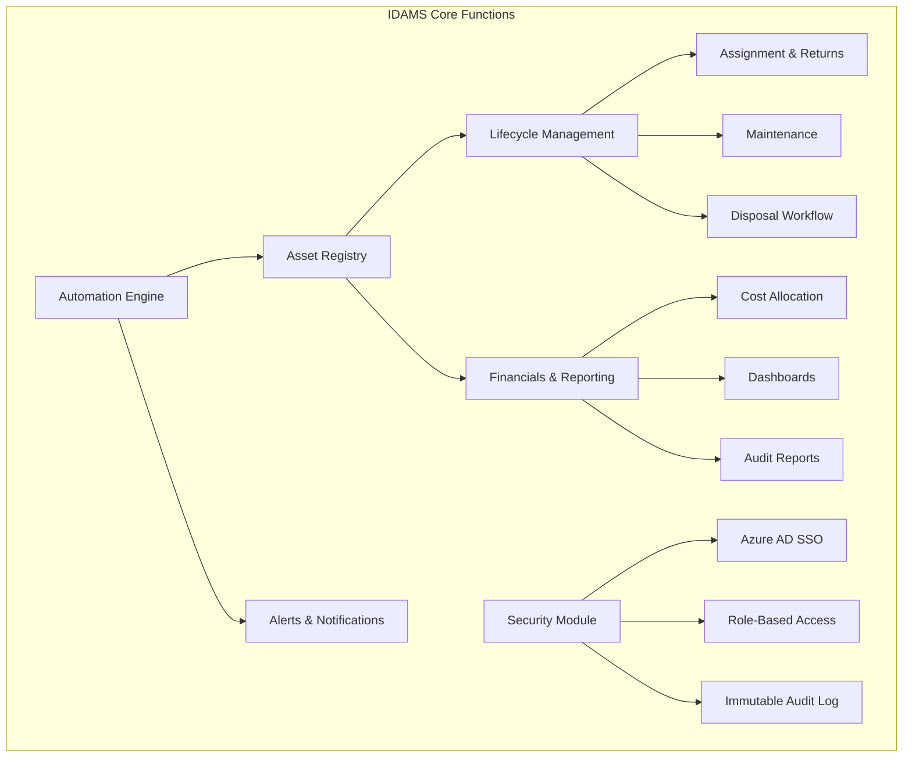
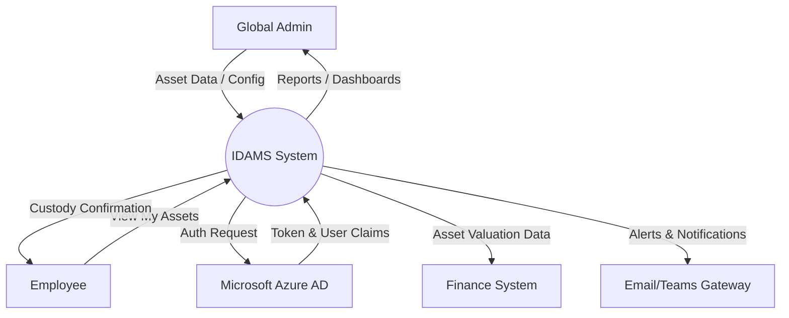
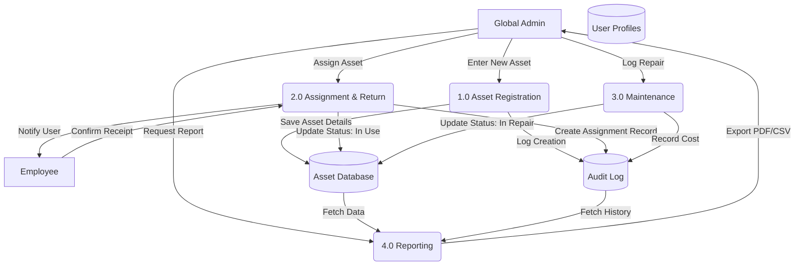
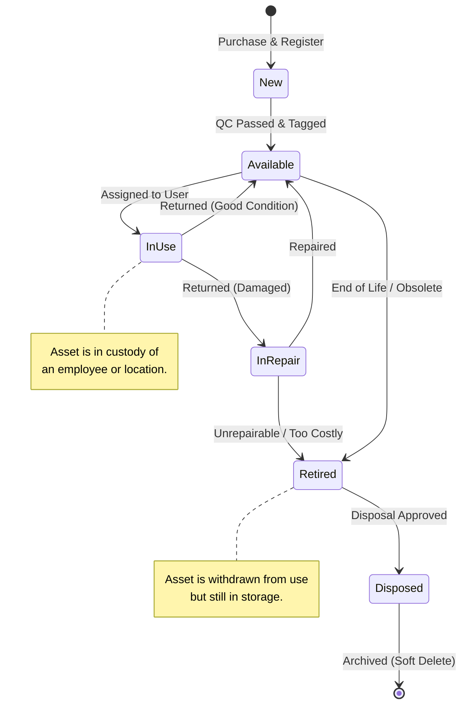
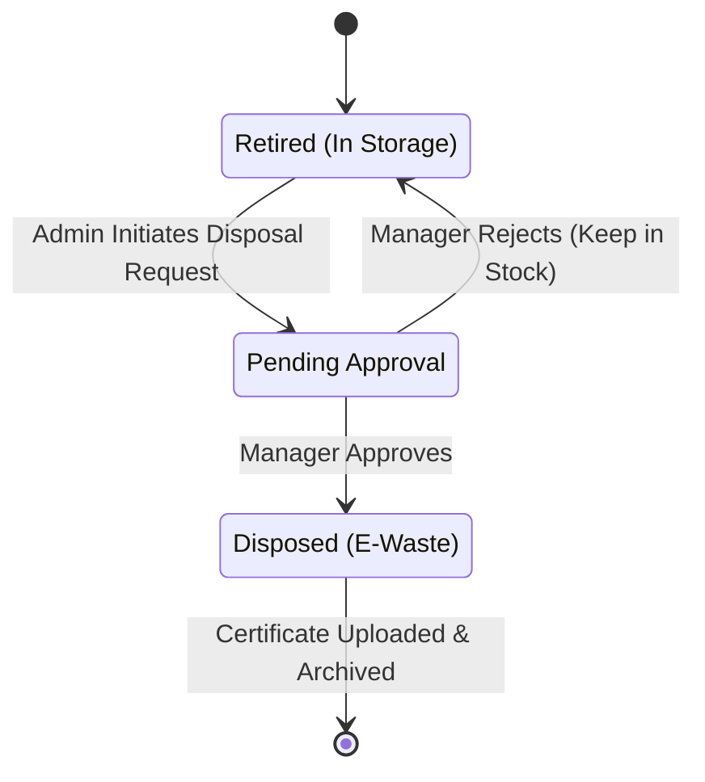

# Software Requirements Specification

## for Integrated Digital Asset Management System

**Version 1.1**  
**Prepared by ITM07 - NovaSoft**  
**University of Moratuwa, Sri Lanka**  
**26/02/2026**

---

## Revision History

| Name | Date       | Reason For Changes                        | Version |
| :--- | :--------- | :---------------------------------------- | :------ |
| Team | 12/02/2026 | Initial draft                             | 1.0     |
| Team | 02/26/2026 | Aligned with updated FRs/NFRs (Epics 1–5) | 1.1     |

---

# Table of Contents

- [Revision History](#revision-history)
- [1. Introduction](#1-introduction)
  - [1.1 Purpose](#11-purpose)
  - [1.2 Document Conventions](#12-document-conventions)
  - [1.3 Intended Audience and Reading Suggestions](#13-intended-audience-and-reading-suggestions)
  - [1.4 Product Scope](#14-product-scope)
    - [1.4.1 Purpose and Objectives](#141-purpose-and-objectives)
  - [1.5 References](#15-references)
- [2. Overall Description](#2-overall-description)
  - [2.1 Product Perspective](#21-product-perspective)
    - [2.1.1 Context and Origin](#211-context-and-origin)
    - [2.1.2 Relationship with Other Systems](#212-relationship-with-other-systems)
    - [2.1.3 System Context Diagram](#213-system-context-diagram)
  - [2.2 Product Functions](#22-product-functions)
  - [2.3 User Classes and Characteristics](#23-user-classes-and-characteristics)
  - [2.4 Operating Environment](#24-operating-environment)
  - [2.5 Design and Implementation Constraints](#25-design-and-implementation-constraints)
  - [2.6 User Documentation](#26-user-documentation)
  - [2.7 Assumptions and Dependencies](#27-assumptions-and-dependencies)
- [3. External Interface Requirements](#3-external-interface-requirements)
  - [3.1 User Interfaces](#31-user-interfaces)
  - [3.2 Hardware Interfaces](#32-hardware-interfaces)
  - [3.3 Software Interfaces](#33-software-interfaces)
  - [3.4 Communications Interfaces](#34-communications-interfaces)
- [4. System Features](#4-system-features)
  - [4.1 Core Platform & API Gateway](#41-platform-foundation-master-data--api-gateway)
    - [4.1.1 Description and Priority](#411-description-and-priority)
    - [4.1.2 Stimulus/Response Sequences](#412-stimulusresponse-sequences)
    - [4.1.3 Functional Requirements](#413-functional-requirements)
  - [4.2 Asset Registry & Onboarding](#42-asset-registry--tethered-scanning)
    - [4.2.1 Description and Priority](#421-description-and-priority)
    - [4.2.2 Stimulus/Response Sequences](#422-stimulusresponse-sequences)
    - [4.2.3 Functional Requirements](#423-functional-requirements)
  - [4.3 Operations & Lifecycle Management](#43-it-operations--hardware-maintenance)
    - [4.3.1 Description and Priority](#431-description-and-priority)
    - [4.3.2 Stimulus/Response Sequences](#432-stimulusresponse-sequences)
    - [4.3.3 Functional Requirements](#433-functional-requirements)
  - [4.4 Secure Disposal & Compliance](#44-compliance-driven-disposals)
    - [4.4.1 Description and Priority](#441-description-and-priority)
    - [4.4.2 Stimulus/Response Sequences](#442-stimulusresponse-sequences)
    - [4.4.3 Functional Requirements](#443-functional-requirements)
  - [4.5 Financial Analytics & Automation](#45-financial-intelligence--automated-alerts)
    - [4.5.1 Description and Priority](#451-description-and-priority)
    - [4.5.2 Stimulus/Response Sequences](#452-stimulusresponse-sequences)
    - [4.5.3 Functional Requirements](#453-functional-requirements)
- [5. Other Nonfunctional Requirements](#5-other-nonfunctional-requirements)
  - [5.1 Performance Requirements](#51-performance-requirements)
  - [5.2 Safety Requirements](#52-safety-requirements)
  - [5.3 Security Requirements](#53-security-requirements)
  - [5.4 Software Quality Attributes](#54-software-quality-attributes)
  - [5.5 Business Rules](#55-business-rules)
- [6. Other Requirements](#6-other-requirements)
  - [6.1 Internationalization Requirements (i18n)](#61-internationalization-requirements-i18n)
  - [6.2 Legal & Compliance Requirements](#62-legal--compliance-requirements)
  - [6.3 Database & Data Integrity](#63-database--data-integrity)
- [Appendix A: Glossary](#appendix-a-glossary)
- [Appendix B: Analysis Models](#appendix-b-analysis-models)
- [Appendix C: To Be Determined List](#appendix-c-to-be-determined-list)

---

# 1. Introduction

## 1.1 Purpose

The purpose of this document is to specify the software requirements for the Integrated Digital Asset Management System (IDAMS), Version 1.0. This system is being developed by Novasoft for TIQRI Corporation. The scope of the product covered by this SRS includes a centralized enterprise web platform designed to streamline the management of both digital and physical IT assets. It covers the full asset lifecycle from procurement and assignment to maintenance and disposal while facilitating cost tracking, license management, and automated compliance alerts.

## 1.2 Document Conventions

This document follows the IEEE 830-1998 standard for Software Requirements Specifications.

- **Typography:** Important terms and user interface elements are highlighted in **bold**.
- **Requirement IDs:** Detailed requirements in Section 4 are marked with unique identifiers (e.g., REQ-FND-1.1, REQ-REG-2.1) as defined in the functional requirements documentation to facilitate traceability.
- **Priorities:** Requirements may be classified as High, Medium, or Low priority to guide development phases.

## 1.3 Intended Audience and Reading Suggestions

This Software Requirements Specification (SRS) is intended for the following stakeholders involved in the Integrated Digital Asset Management System (IDAMS) project:

- **Development Team:** This includes the frontend, backend, and mobile developers responsible for implementing the system features. They should use this document as the primary reference for building the core asset registry, automation workflows, and integration points.
- **Project Supervisors & University Faculty:** The University of Moratuwa faculty and supervisors overseeing the IS2901 - Software Development Project. They will use this document to assess the scope, feasibility, and technical depth of the proposed solution.
- **Client Stakeholders (TIQRI Corporation):** Specifically the Product Owner (TIQRI's IT Department Head) and industry mentors. They will use this document to validate that the specified requirements align with their business goals, such as improving asset visibility and automating cost tracking.
- **Quality Assurance (QA) & Testers:** Team members responsible for the "Evaluation" phase. They will use the functional requirements in Section 4 to design test cases and acceptance criteria.

**Document Organization:** The remainder of this SRS is organized as follows:

- **Section 2 (Overall Description):** Provides a high-level overview of the product, including user characteristics, the operating environment, and design constraints.
- **Section 3 (External Interface Requirements):** Details the hardware, software, and communication interfaces, including Azure AD integration and REST API specifications.
- **Section 4 (System Features):** detailed functional requirements organized by feature (e.g., Asset Registry, Procurement, Disposal).
- **Section 5 (Other Nonfunctional Requirements):** Specifies performance, safety, security (RBAC, Encryption), and quality attributes.

**Reading Suggestions:**

- **Client Stakeholders and Supervisors** are recommended to focus on Section 1 and Section 2 to gain a clear understanding of the system's scope, limitations, and user classes without getting lost in technical implementation details.
- **Developers** should read Section 2 for context but focus primarily on Section 3 and Section 4, which contain the specific logic for the database schema, API endpoints, and authentication flows.
- **Testers** should concentrate on Section 4 (Functional Requirements) and Section 5 (Non-functional Requirements) to define pass/fail criteria for system validation.

## 1.4 Product Scope

The Integrated Digital Asset Management System (IDAMS) is a centralized enterprise web platform designed to streamline the management of both digital and physical IT assets. It serves as a "Unified Truth" that consolidates diverse asset types including IT hardware, software licenses, and general office equipment into a single, intelligent registry.

### 1.4.1 Purpose and Objectives

The primary purpose of the software is to replace manual, decentralized tracking methods with an automated system that manages the full asset lifecycle, from procurement to disposal. Key objectives include:

- **Centralized Tracking:** maintaining a digital registry of all assets to eliminate "siloed" tracking sheets.
- **Financial Accountability:** Calculating and displaying total asset value allocated to specific employees, departments, or cost centers to improve budget tracking.
- **Automated Compliance:** Monitoring and sending proactive alerts for software license renewals and hardware warranty expirations to prevent downtime and compliance issues.
- **Operational Efficiency:** Reducing manual administrative effort through automated workflows, such as digital acceptance for asset assignment.
- **Alignment with Corporate Goals:** For TIQRI Corporation, this software directly supports the strategic goal of maintaining complete control over the IT ecosystem and optimizing resource utilization. By resolving the challenges of "decentralized management" and "lack of visibility" into asset ownership, IDAMS enhances organizational transparency. It aligns with corporate financial strategies by providing real-time analytics and cost reporting, enabling data-driven decisions regarding IT expenditure and resource allocation.

## 1.5 References

The following documents and resources were used in the preparation of this SRS or are referenced within it.

1.  Novasoft. Functional Requirements Specification. Internal Project Document, 2026.
2.  IEEE. IEEE Std 830-1998, IEEE Recommended Practice for Software Requirements Specifications. IEEE Computer Society, 1998.
3.  TIQRI Corporation. Corporate Identity and UI Guidelines. (As advised by TIQRI UI Engineer mentorship).
4.  Next.js Documentation (v14+ App Router). Vercel. Available at: https://nextjs.org/docs
5.  Microsoft Entra ID (Azure AD) Documentation. Microsoft. Available at: https://learn.microsoft.com/en-us/entra/identity/
6.  PostgreSQL Documentation. The PostgreSQL Global Development Group. Available at: https://www.postgresql.org/docs/
7.  ShadCN/UI Documentation. Available at: https://ui.shadcn.com/
8.  Tailwind CSS Documentation. Available at: https://tailwindcss.com/docs

---

# 2. Overall Description

## 2.1 Product Perspective

The Integrated Digital Asset Management System (IDAMS) is a new, self-contained software product being developed by the Novasoft team for TIQRI Corporation as part of the IS2901 Software Development Project.

### 2.1.1 Context and Origin

IDAMS is designed to replace the existing manual processes and scattered tracking methods currently used by the client. The current absence of a centralized system has led to decentralized management, lack of visibility into asset ownership, and difficulties in budget tracking. IDAMS unifies these disconnected functions into a single, automated enterprise web platform.

### 2.1.2 Relationship with Other Systems

While IDAMS is a self-contained application, it must operate peacefully within TIQRI's existing enterprise ecosystem. It interfaces with the following external components:

- **Identity Provider (Microsoft Entra ID / Azure AD):** IDAMS relies entirely on the organization's existing Azure Active Directory for user authentication and Role-Based Access Control (RBAC). It does not maintain its own password database.
- **External Business Systems (HR & Finance):** The system exposes secure REST API endpoints to allow external systems, such as HR and Finance software, to fetch asset details and financial data.
- **Mobile/Web Clients:** The system interfaces with standard web browsers and includes a mobile-web scanner interface for physical inventory audits using QR codes.

### 2.1.3 System Context Diagram

The system involves interactions between the User/Admin, IDAMS System, and TIQRI IT Infrastructure (Microsoft Azure AD, Finance System, HR System).

**Major Components**
As outlined in the proposed solution architecture, the system consists of:

1.  **Frontend/UI Layer:** Next.js application with ShadCN/UI for user interaction and dashboards.
2.  **Backend/API Layer:** Processes business logic, workflows, and API requests.
3.  **Database Layer:** PostgreSQL database storing the "Unified Truth" of asset data.
4.  **Automation Engine:** Background services (using Trigger.dev) for license renewals and warranty alerts.

## 2.2 Product Functions

The Integrated Digital Asset Management System (IDAMS) automates the tracking and management of IT assets throughout their entire lifecycle. The system's major functions are organized into five primary modules:

**Core Asset Registry & Identification**

- **Unified Registry:** Consolidates diverse asset types (Hardware, Software Licenses, Office Equipment, Furniture & Facilities) into a single, centralized database.
- **Dynamic Data Schema:** Adapts data entry fields based on the asset category (e.g., capturing "License Keys" for software vs. "CPU/RAM" for hardware vs. "Dimensions/Material" for furniture) using an EAV schema builder with drag-and-drop field ordering.
- **Unique Identification:** Auto-generates unique Asset IDs (with category Prefix Codes and collision handling) and corresponding QR codes with print layouts (Zebra/Dymo thermal and A4 PDF grid) to prevent duplication and facilitate physical tracking.
- **Serial Number Validation:** Enforces unique Serial Number constraints during registration, blocking duplicates with descriptive errors.
- **Financial Data Capture:** Mandates Initial Cost breakdown (Base Price, Tax, Shipping) with multi-currency support (NOK, USD, LKR) and secure invoice PDF uploads to cloud storage.
- **Bulk Import:** Supports CSV and Excel (.xlsx) uploads with Partial Success processing for mass asset registration.
- **Mobile Audit:** Provides a Progressive Web App (PWA) mobile scanner interface using HTML5 camera APIs for scanning QR codes and 1D barcodes.
- **Tethered Companion Scanning:** Enables real-time WebSocket auto-linking between mobile devices and desktop browsers — when both are logged in under the same Azure AD identity, scanned serial numbers are injected directly into active form fields without manual pairing.

**Lifecycle Operations & Workflow**

- **Assignment & Return:** Manages the assignment of assets strictly to individual Users or physical Locations (team-level assignments blocked), with return-request notifications via Email and Teams.
- **Digital Custody:** Triggers automated "Digital Acceptance" workflows via Email and Microsoft Teams, requiring employees to acknowledge custody of assigned assets.
- **Asset Chain of Custody:** Provides a chronological timeline view of all assignments, returns, and status changes per asset with CSV export.
- **Employee Self-Service:** Provides a "My Assets" portal for standard employees to view assigned equipment and submit "Report Issue" damage tickets.
- **Custom Status Management:** Tracks built-in lifecycle statuses (Available, Assigned, Defective, In Repair, Disposed, Donated, Lost, Missing) and allows admins to configure additional custom statuses with state-machine transition rules.
- **Maintenance Management:** Provides a tabbed Maintenance Ledger (Pending Review, Active Repairs, Repair History) with triage review panels, vendor dispatch (RMA tracking), and cost reconciliation upon repair completion.
- **Disposal Governance:** Enforces multi-step compliance workflows including executive financial review, mandatory E-waste certificate uploads, physical security checkboxes, exact Asset ID confirmation, and bulk disposal processing.

**Financial Visibility & Reporting**

- **Cost Tracking:** Records comprehensive financial data including Initial Cost breakdowns (Base Price, Tax, Shipping), multi-currency values, invoices, and vendor details from acquisition to retirement.
- **Automated Depreciation:** Calculates real-time "Current Book Value" using straight-line depreciation math in a dedicated RBAC-secured Financials module.
- **Total Cost of Ownership (TCO):** Aggregates purchase prices with all historical maintenance costs to calculate true asset cost.
- **Write-Offs & Salvage:** Maintains a ledger of disposed assets alongside salvage values recouped from e-waste recycling.
- **Interactive Dashboards:** Visualizes real-time metrics including Total Assets, Pending Approvals, Overdue Returns, Low Stock Alerts, a "Recent Activity Log" feed, and "Frequently Failing Assets / Problem Asset Counts" widgets.
- **Exportable Reports:** Generates HTML inventory reports with in-browser preview and exports to PDF, CSV, and Excel (.xlsx) formats for inventory and financial audits.

**Automation & Proactive Alerts**

- **Expiration Alerts:** Automatically monitors and sends notifications via Email and Microsoft Teams for upcoming warranty expirations, software license renewals, and overdue active repair tickets.
- **Overdue Notifications:** Triggers alerts to IT staff and users when assigned assets are not returned by the due date.
- **CRON Engine:** Runs scheduled nightly background tasks to scan for threshold breaches and dispatch alert digests.
- **Notification Center:** Provides an in-app Bell Icon inbox with unread alert counts and deep-links routing users directly to affected asset detail panels.

**Security & Administration**

- **Single Sign-On (SSO):** Authenticates users exclusively via Microsoft Azure AD (OIDC/SAML), eliminating local passwords.
- **Role-Based Access Control (RBAC):** Automatically maps Azure AD group attributes to system permissions (e.g., Admin, Viewer).
- **Immutable Audit Log:** Maintains a chronological, read-only ledger of every system change (assignments, status updates) capturing Actor, IP address (`X-Forwarded-For`), and Before/After JSON state diffs for security and historical traceability, with a filterable viewer and CSV export.
- **Open API Gateway:** Exposes rate-limited REST API endpoints with hashed API key authentication for external systems to fetch asset data or trigger assignment workflows, plus configurable outbound Webhooks for real-time push notifications on system events.

**Functional Hierarchy Diagram**

The following diagram illustrates the major functional groups and their relationships:

## 2.3 User Classes and Characteristics

The system interactions are divided into three primary user classes, distinguished by their access levels and business responsibilities.

- **Global Administrators (IT Department)**
  - **Role:** The primary "Power Users" of the system. They act as the custodians of the asset registry.
  - **Frequency of Use:** Daily / Continuous.
  - **Technical Expertise:** High. They are comfortable with technical terminology, search queries, and navigating complex data forms.
  - **Privileges:** Full Create-Read-Update-Delete (CRUD) access to all modules. They can register assets, override lifecycle statuses, manage master data (e.g., Brand lists), and view all financial costs.
  - **Key Needs:** Efficiency in data entry, keyboard shortcuts, and detailed error messages.

- **Standard Employees (End Users)**
  - **Role:** General staff members (Developers, HR, Sales) who are assigned IT assets to perform their jobs.
  - **Frequency of Use:** Infrequent (Onboarding, Asset Return, or Incident Reporting).
  - **Technical Expertise:** Low to Medium. They require a simple, intuitive interface that requires no training.
  - **Privileges:** Strictly Read-Only access to their own profile ("My Assets" view). They can trigger specific workflows like "Acknowledge Receipt" or "Report Issue" but cannot edit asset details.
  - **Key Needs:** Clarity on what they are responsible for and a mobile-friendly view for quick verification.

- **Business Viewers (Finance, Management, & Auditors)**
  - **Role:** Stakeholders who require visibility into the system for budgeting, compliance, or decision-making but do not perform operational tasks.
  - **Frequency of Use:** Periodic (Monthly Audits, Annual Budgeting).
  - **Technical Expertise:** Medium (Domain knowledge in Finance/Management).
  - **Privileges:** Read-Only access to Dashboards, Reports, and Cost Analysis features. They cannot alter asset records.
  - **Key Needs:** Accurate, summarized data presented in clear visualizations (Charts/Graphs) and exportable formats (Excel/PDF).

**Importance:** The Global Administrator is the most critical user class to satisfy, as the system's integrity depends entirely on their ability to maintain the "Unified Truth" of the registry. If the system is too cumbersome for them, data hygiene will fail.

## 2.4 Operating Environment

The Integrated Digital Asset Management System (IDAMS) is a cloud-native web application designed to be platform-independent for end-users while relying on specific cloud infrastructure for hosting.

**Client-Side (User Environment)**

- **Web Browsers:** The system is optimized for modern HTML5-compliant browsers.
  - **Desktop:** Google Chrome (v120+), Microsoft Edge (v120+), Mozilla Firefox, and Safari.
  - **Mobile:** Chrome for Android and Safari for iOS (specifically for the QR Code scanning feature).
- **Hardware:**
  - **Desktops/Laptops:** Standard office PCs (Windows/macOS) for administrative tasks and dashboard viewing.
  - **Mobile Devices:** Smartphones with a working camera are required for physical asset audits and barcode scanning.

**Server-Side (Hosting Environment)**

- **Application Server:** The application is built on Node.js (v20+) and Next.js (v14+). It is designed to run in a containerized environment (Docker) or a managed Platform-as-a-Service (PaaS) such as Vercel or Azure App Service.
- **Database:** PostgreSQL (v16+) hosted on a managed cloud provider (e.g., Supabase or Azure Database for PostgreSQL).
- **Network:** The system requires a continuous HTTPS internet connection. All data transmission is secured via TLS 1.2+.

**Coexistence & Integrations**
The software must peacefully coexist and interface with the following external components:

- **Identity Provider:** Microsoft Entra ID (Azure AD). The system does not store passwords; it relies entirely on the corporate tenant for authentication tokens.
- **Communication Channels:** The system integrates with Microsoft Teams (via Webhooks) and SMTP Email Servers to send alerts without interfering with corporate communication policies.

## 2.5 Design and Implementation Constraints

The design and implementation of the Integrated Digital Asset Management System (IDAMS) must adhere to the following strict constraints to ensure compatibility with TIQRI Corporation's existing infrastructure and the academic requirements of the project.

**1. Regulatory & Compliance Policies**

- **GDPR & Data Privacy:** The system processes Personally Identifiable Information (PII) of employees (e.g., Names, Email Addresses). All PII must be handled in accordance with GDPR principles. Specifically, the system must not store sensitive authentication data (passwords) locally.
- **WEEE Directive (Environmental Compliance):** To support corporate sustainability goals, the system must enforce specific workflows for electronic waste disposal, requiring reasons (e.g., "E-Waste") to be logged before an asset is archived.

**2. Technology Stack Constraints**
The development team is restricted to the following pre-approved technology stack to ensure maintainability and alignment with the client's mentorship:

- **Frontend Framework:** Must be built using Next.js 14+ (App Router) with TypeScript.
- **UI Component Library:** Must use ShadCN/UI and Tailwind CSS to maintain a consistent, modern, and accessible design language.
- **Database Engine:** PostgreSQL is the mandatory relational database system.
- **Authentication:** The system must strictly use Microsoft Entra ID (Azure AD) via OpenID Connect (OIDC). Building a custom username/password authentication system is strictly prohibited.

**3. Infrastructure & Scope Limitations**

- **Containerization Scope:** To maintain project feasibility within the academic timeline, complex orchestration tools like Kubernetes (K8s) are out of scope. The application should be deployable as a standard Docker container or via a PaaS (Platform as a Service) provider like Vercel or Azure App Service.
- **Budget:** The solution is a student project and must run on Free Tier or Low-Cost cloud infrastructure during the development and evaluation phases.

**4. Development Standards**

- **Language:** The software interface and all code documentation must be in English.
- **Code Quality:** All code must adhere to ESLint and Prettier configurations to ensure consistency across the student team.
- **Version Control:** All source code must be managed in GitHub, with feature branches and pull requests required for merging changes.

**5. Reliability Constraints**

- **Audit Trail Immutable:** The system must not allow the deletion of audit logs. All historical data regarding asset assignments must be preserved for a minimum of 7 years for tax/audit purposes.
- **Data Retention (E-Waste):** E-Waste Certificates of Destruction stored in cloud storage must be retained for a minimum of 7 years to satisfy tax compliance requirements.

## 2.6 User Documentation

To ensure successful adoption and long-term maintainability of the IDAMS platform, the following documentation components will be delivered along with the software:

**1. System Administrator Manual**

- **Target Audience:** Global Administrators (IT Dept).
- **Format:** PDF Document and GitHub Wiki.
- **Content:** Comprehensive step-by-step guides for all administrative functions, including:
  - Registering new asset categories and brands.
  - Managing user roles and Azure AD group mappings.
  - Generating financial and compliance reports.
  - Configuring automated alert thresholds (e.g., "Notify 30 days before expiry").

**2. Employee Quick-Start Guide**

- **Target Audience:** Standard Employees.
- **Format:** Digital PDF (One-pager) distributed via Email/Teams.
- **Content:** A simplified, visual guide covering the essential "Self-Service" actions:
  - How to view assigned assets ("My Assets").
  - How to digitally acknowledge custody of a new device.
  - How to report a broken or lost item.

**3. Technical Deployment & Configuration Guide**

- **Target Audience:** DevOps Engineers / Future Developers.
- **Format:** README.md file in the source code repository.
- **Content:** Technical instructions for deploying and maintaining the system:
  - Environment variable configuration (.env setup for Azure AD keys, Database URLs).
  - Docker container build and run commands.
  - Database schema migration steps.

**4. Contextual On-Screen Help**

- **Target Audience:** All Users.
- **Format:** Embedded Tooltips and "Info" icons within the User Interface.
- **Content:** Short, context-aware definitions for complex fields (e.g., explaining the difference between "Written Off" and "Disposed" status directly on the form).

## 2.7 Assumptions and Dependencies

The feasibility and success of the IDAMS project rely on the following assumptions and dependencies. If any of these factors change, the requirements outlined in this SRS may need to be re-evaluated.

**1. Technological Assumptions**

- **Azure AD Tenant Availability:** It is assumed that TIQRI Corporation will provide a valid Microsoft Entra ID (Azure AD) tenant and the necessary API credentials (Client ID, Client Secret) to configure Single Sign-On (SSO).
- **Modern Browser Usage:** It is assumed that all end-users will access the system using modern, HTML5-compliant web browsers (Chrome, Edge, Safari). Backward compatibility for Internet Explorer (IE11) is not a requirement.
- **Stable Internet Connectivity:** As a cloud-native web application, the system assumes a continuous, stable internet connection. Offline capabilities are limited strictly to the mobile scanning interface (for temporary data caching) and are not supported for the main administrative dashboard.

**2. Data & Operational Assumptions**

- **Data Cleanliness:** It is assumed that the legacy asset data (currently in spreadsheets) provided by the client for the initial "Bulk Import" will be cleansed and formatted according to the CSV templates defined by the development team. The system is not responsible for cleaning inconsistent historical data (e.g., "Dell" vs. "Dell Inc.").
- **Physical Tagging:** It is assumed that all physical assets have a flat, clean surface suitable for affixing a QR code label.

**3. External Dependencies**

- **Third-Party Cloud Services:** The system depends on the continued availability of the following free-tier/low-cost services for the duration of the project:
  - Vercel / Azure App Service: For frontend and API hosting.
  - Supabase / Neon / Azure SQL: For the PostgreSQL database.
  - Trigger.dev / Inngest: For background job processing (e.g., scheduling warranty emails).
- **Client Collaboration:** The project schedule depends on the Product Owner available for bi-weekly feedback sessions to validate UI wireframes and clarify ambiguous requirements, as agreed in the project plan.
- **Notification Gateways:** The system depends on the client's internal network policies allowing outbound traffic to:
  - Microsoft Teams Webhooks (for channel alerts).
  - SMTP Servers (for email notifications).

---

# 3. External Interface Requirements

## 3.1 User Interfaces

The user interface (UI) of the IDAMS platform is designed to be clean, minimalist, and responsive, strictly adhering to the TIQRI Corporation branding guidelines and the ShadCN/UI design system. The interface logic is divided into two primary environments: the Desktop Web Portal (for administration) and the Mobile Web View (for physical audits).

**General GUI Standards**

- **Design System:** The application utilizes ShadCN/UI components styled with Tailwind CSS. This ensures a consistent look and feel across all modules (Buttons, Inputs, Modals).
- **Color Palette:** The UI uses the corporate color scheme (Primary: TIQRI Blue, Secondary: Slate Grey) for branding consistency. Semantic colors are used for status indicators:
  - Green: Available / Active / Compliant.
  - Amber: Warning / Expiring Soon / In Repair.
  - Red: Error / Expired/Lost/Disposed.
- **Typography:** The system uses the Inter font family for maximum readability on digital screens.
- **Dark Mode:** The interface supports system-preferred themes (Light/Dark mode) automatically to reduce eye strain for IT staff working in low-light server rooms.

**Screen Layouts & Navigation**
The standard screen layout consists of three persistent areas:

1.  **Collapsible Sidebar Navigation:** Located on the left, containing links to modules (Dashboard, Assets, Operations, Reports, Settings). It collapses on smaller screens to maximize workspace.
2.  **Top Global Header:** Contains the "Global Search" bar (accessible via Ctrl+K), User Profile dropdown, and Notification Bell.
3.  **Main Content Area:** The dynamic workspace where data grids, forms, and dashboards are rendered.

**Key Screen Types:**

- **Dashboard View:** Grid-based layout with draggable widgets showing high-level metrics (e.g., "Total Valuation," "Pending Approvals").
- **Data Grid View:** Used for the Asset Registry. Features include:
  - Sticky header rows.
  - Pagination controls (Rows per page: 10, 25, 50, 100).
  - "Action" columns with ellipsis menus (...) for Edit/Delete/History.
- **Input Forms:** Multi-step wizards are used for complex tasks like "New Asset Registration" to prevent user overwhelm. Mandatory fields are marked with a red asterisk (\*).

**Mobile Web Scanner Interface**
For the "Physical Audit" feature, the UI adapts to a mobile-first view:

- **Camera Overlay:** A full-screen viewfinder for scanning QR codes.
- **Haptic Feedback:** The device vibrates (if supported) upon a successful scan.
- **Quick Action Cards:** Once scanned, a card slides up from the bottom displaying the Asset Summary (ID, Model, User) with buttons to "Check-In" or "Flag Issue."

**Error Messages & User Feedback**

- **Validation Errors:** Inline error messages appear immediately below invalid form fields (e.g., "Serial Number is required").
- **System Notifications (Toasts):**
  - **Success:** A green toast notification appears at the top-right (e.g., "Asset Saved Successfully") and auto-dismisses after 3 seconds.
  - **Critical Errors:** A persistent red banner appears for system failures (e.g., "Network Connection Lost"), requiring user dismissal.
- **Loading States:** Skeleton loaders (gray pulsing shapes) are used instead of spinning wheels during data fetching to improve perceived performance.

**Keyboard Shortcuts**
To enhance productivity for Power Users (Global Admins), the following global shortcuts are supported:

- `Ctrl+K` / `Cmd+K`: Open Global Search Command Palette.
- `Ctrl+/`: Open Keyboard Shortcut Cheat Sheet.
- `Esc`: Close active modal or clear selection.

## 3.2 Hardware Interfaces

The IDAMS application is a software-only solution that runs on standard commodity hardware. However, it interacts with specific hardware components to facilitate physical asset tracking and reporting.

**1. Mobile Device Cameras (for Barcode/QR Scanning)**

- **Interface:** The application interfaces with the integrated rear-facing camera of mobile devices (Smartphones/Tablets).
- **Protocol:** The interaction is handled via the HTML5 Media Devices API (`navigator.mediaDevices.getUserMedia`) within the web browser.
- **Function:** The camera is used to capture video streams for the QR Code Scanner module. The software processes the video feed in real-time to decode Asset IDs without storing the video data.
- **Constraint:** The device must have a camera with a minimum resolution of 5MP and autofocus capability to successfully scan standard 1x1 inch QR codes.

**2. Standard Office Printers**

- **Interface:** The system uses the operating system's native print dialog drivers.
- **Function:**
  - **Asset Tags:** Printing unique QR Code labels (Avery Standard or continuous roll) to be affixed to physical assets.
  - **Reports:** Printing generated PDF reports (Inventory Audits, Handover Forms) on standard A4 paper.
- **Constraint:** The "Print Asset Tag" layout is optimized for 300 DPI thermal label printers (e.g., Zebra or Dymo) but remains compatible with standard laser printers.

**3. Display Screens**

- **Interface:** The User Interface is responsive and adapts to the physical resolution of the client hardware.
- **Supported Resolutions:**
  - **Desktop:** optimized for 1920x1080 (1080p) but functional down to 1366x768.
  - **Mobile:** optimized for vertical viewports (minimum width 320px) for the "Employee View" and "Scanner" modules.

## 3.3 Software Interfaces

The IDAMS platform interacts with several external software components to handle authentication, data storage, and communications. These interfaces are critical for the system's operation within the TIQRI enterprise environment.

**1. Microsoft Entra ID (Azure AD)**

- **Purpose:** The exclusive Identity Provider (IdP) for the system. It handles user authentication and provides group claims for Role-Based Access Control (RBAC).
- **Version:** Microsoft Graph API v1.0.
- **Interface Mechanism:** OpenID Connect (OIDC) and OAuth 2.0 protocols over HTTPS.
- **Data Exchange:**
  - **Incoming:** Authentication Tokens (JWT), User Profile Data (Name, Email, Job Title, Department), and Group Memberships (e.g., "IT-Admins").
  - **Outgoing:** Authentication Requests (Redirect URIs).
- **Constraint:** The system must not store passwords locally. It must strictly validate the signature of incoming JWT tokens against the Azure AD tenant's public keys.

**2. PostgreSQL Database System**

- **Purpose:** The primary relational database for storing all persistent application data (Assets, Logs, Configurations).
- **Version:** PostgreSQL 16.0 or higher.
- **Interface Mechanism:** TCP/IP connection via a connection pooler (e.g., PgBouncer). The application interacts with the database using Drizzle ORM.
- **Data Exchange:**
  - **Outgoing:** SQL Queries (SELECT, INSERT, UPDATE, DELETE).
  - **Incoming:** Result sets containing Asset records, User activity logs, and Financial summaries.

**3. Microsoft Teams (Notification Gateway)**

- **Purpose:** Delivering real-time alerts to IT operations channels regarding critical events (e.g., "Urgent: Server Warranty Expired").
- **Interface Mechanism:** Incoming Webhooks (HTTPS POST requests).
- **Data Exchange:**
  - **Outgoing:** JSON payloads containing "Adaptive Cards" formatted with the alert details (Asset ID, Issue, Link to Dashboard).
  - **Incoming:** HTTP 200 OK confirmation.

**4. External Finance & HR Systems (REST API)**

- **Purpose:** Allowing external enterprise systems to consume asset valuation and assignment data, or trigger operational workflows (e.g., auto-assigning assets to new hires).
- **Interface Mechanism:** RESTful API endpoints exposed by IDAMS, secured via hashed API keys.
- **Data Exchange:**
  - **Incoming:** HTTP GET/POST requests with API key authorization in the `Authorization` header.
  - **Outgoing:** JSON-formatted responses containing Asset Lists, Current Valuations, Depreciation schedules, and assignment confirmations.
- **Schema Definition:** The API specification follows the OpenAPI 3.0 standard.

**5. Cloud Storage (AWS S3 / Azure Blob Storage)**

- **Purpose:** Secure storage for uploaded documents, specifically Purchase Invoice PDFs (during registration) and E-Waste Certificates of Destruction (during disposal).
- **Interface Mechanism:** HTTPS API calls to the cloud storage provider's SDK.
- **Data Exchange:**
  - **Outgoing:** Binary file uploads (PDF) with metadata tags (Asset ID, Document Type).
  - **Incoming:** Signed URL references for secure download/retrieval.
- **Constraint:** E-Waste certificate storage buckets must be configured with retention policies preventing file deletion for a minimum of 7 years.

**6. WebSocket Server (Real-Time Communication)**

- **Purpose:** Enabling the Tethered Companion Scanning feature, where a mobile device authenticated under the same Azure AD user identity automatically links to an active desktop browser session and injects scanned barcode data in real-time.
- **Interface Mechanism:** WebSocket protocol (via Socket.io or native WS) over a secure WSS connection.
- **Data Exchange:**
  - **Incoming (from mobile client):** JSON payloads containing the decoded barcode string and the user's Azure AD identity (JWT).
  - **Outgoing (to desktop client):** JSON payloads injecting the scanned value into the targeted form field, routed by matching `user_id`.
- **Constraint:** Scan-to-display latency must be under 500ms.

**7. External Vendor Warranty APIs (Optional / Phase 2)**

- **Purpose:** Periodically querying vendor APIs (e.g., Dell TechDirect, HP ISEE, Lenovo Support) to auto-fetch and update warranty expiry dates.
- **Interface Mechanism:** Outbound HTTPS REST calls using asset Serial Numbers as query parameters.
- **Data Exchange:**
  - **Outgoing:** HTTP GET requests with Serial Number identifiers.
  - **Incoming:** JSON responses containing warranty status and expiry dates.
- **Constraint:** Must implement exponential backoff retry logic for failed vendor API calls.

## 3.4 Communications Interfaces

The IDAMS system relies on standard network communication protocols to ensure secure and reliable data exchange between the client (browser), the server, and external third-party services.

**1. Client-Server Communication (HTTPS)**

- **Protocol:** All communications between the web browser (Client) and the Application Server must occur over Hypertext Transfer Protocol Secure (HTTPS) using TLS 1.2 or higher.
- **Security:** Unencrypted HTTP traffic is strictly prohibited. The server must enforce HSTS (HTTP Strict Transport Security) to prevent protocol downgrade attacks.
- **Data Format:** Data transferred between the client and server (e.g., form submissions, search results) is formatted as JSON (JavaScript Object Notation).

**2. Email Notifications (SMTP)**

- **Protocol:** The system uses standard SMTP (Simple Mail Transfer Protocol) to dispatch automated email notifications (e.g., "Asset Assignment Confirmation," "Warranty Expiry Warning").
- **Integration:** The system connects to the corporate SMTP relay or a transactional email provider (e.g., Resend/SendGrid) via port 587 (STARTTLS) or 465 (SSL).
- **Message Format:** Emails are sent as MIME Multi-part messages, containing both a text/plain fallback and a text/html version for rich formatting (tables, buttons).

**3. Instant Messaging Integration (Microsoft Teams)**

- **Protocol:** Communication with Microsoft Teams is unidirectional via Incoming Webhooks (HTTPS POST).
- **Message Format:** Payloads must adhere to the Microsoft Adaptive Cards schema (JSON) to ensure notifications render correctly across Teams Desktop and Mobile clients.
- **Rate Limiting:** The system implements a "debounce" mechanism to prevent flooding the Teams channel (e.g., maximum 1 notification per minute per asset).

**4. External API Communication (REST)**

- **Protocol:** The system exposes public-facing endpoints via REST (Representational State Transfer).
- **Authentication:** External API requests must include a valid, system-generated hashed API Key in the Authorization header. Internal user requests use Bearer Tokens (JWT) from Azure AD.
- **Rate Limiting:** The API Gateway enforces a rate limit of 100 requests per minute per API Key to prevent external systems from degrading system performance.
- **Response Standards:**
  - Success: 200 OK with JSON body.
  - Client Error: 400 Bad Request or 401 Unauthorized.
  - Rate Exceeded: 429 Too Many Requests.
  - Server Error: 500 Internal Server Error.

**5. WebSocket Communication (Tethered Scanning)**

- **Protocol:** Secure WebSocket (WSS) over TLS 1.2+ for real-time bidirectional communication between mobile and desktop browser clients.
- **Function:** Enables the "Companion Scanner" feature, automatically linking a mobile device to a desktop session when both are authenticated under the same Azure AD user identity.
- **Latency Requirement:** Scanned barcode data must appear in the desktop input field within 500ms of a successful scan.

**6. Outbound Webhooks**

- **Protocol:** Asynchronous HTTPS POST requests dispatched to admin-configured external target URLs upon specific system events (e.g., Asset Assigned, Asset Disposed).
- **Message Format:** JSON payloads containing event type, asset details, and timestamp.
- **Retry Logic:** Failed webhook deliveries must implement exponential backoff retry logic to ensure delivery reliability.

# 4. System Features

## 4.1 Core Platform & API Gateway

### 4.1.1 Description and Priority

The Platform Foundation is the architectural bedrock of the IDAMS system. It establishes enterprise-grade security via Azure AD SSO and Role-Based Access Control (RBAC), provides a Dynamic Schema Engine (EAV architecture) allowing admins to build custom asset categories with specific attributes, maintains an Immutable System Audit Log for SOC2 compliance, and exposes an Open API Gateway for third-party integrations. This epic also governs all organizational Master Data (Locations, Departments, Vendors, Brands, Models) and the relational safeguards protecting them.

- **Priority:** High (Critical for Security & Compliance).
- **Reasoning:** Without a functioning foundation — authentication, authorization, master data, and audit trails — no other feature (registry, assignment, reporting, automation) can operate securely.

### 4.1.2 Stimulus/Response Sequences

- **Stimulus:** Unauthenticated user attempts to access the application URL.
  - **Response:** The system automatically redirects the user to the Microsoft Online Login page (Azure AD).
- **Stimulus:** User successfully authenticates with valid TIQRI credentials.
  - **Response:** Microsoft redirects the user back to the application with a valid ID Token. The system parses the token, automatically maps Azure AD Group attributes to baseline system permissions (e.g., "Finance Team" group → "Finance Read-Only" role), and loads the appropriate Dashboard view.
- **Stimulus:** A "Standard Employee" attempts to manually navigate to an Admin-only API route (e.g., `/api/v1/master-data/categories`).
  - **Response:** The RBAC middleware blocks the request, returns a `403 Forbidden` error, and logs the unauthorized access attempt in the Audit Log.
- **Stimulus:** Global Admin navigates to the Role Assignment screen and searches for an employee.
  - **Response:** The system displays a master-detail split-view interface. The admin selects a role on the left master-list, searches for the employee on the right, and clicks "Confirm Mapping" to instantly grant elevated access.
- **Stimulus:** Global Admin creates a new asset category named "Wireless Keyboard."
  - **Response:** The system auto-generates a 3-letter Prefix Code ("WKE"), locks it permanently, and presents the Custom Field Builder panel for defining category-specific attributes (Text, Number, Dropdown) with drag-and-drop re-ordering.
- **Stimulus:** Global Admin creates a new category that generates a Prefix Code already in use (e.g., "LAP").
  - **Response:** The system automatically detects the collision and appends a numeric suffix (e.g., "LAP2") to ensure uniqueness.
- **Stimulus:** Global Admin attempts to delete the "Laptops" category that has 142 active assets.
  - **Response:** The system blocks the action, displays the dependent count: "Cannot delete: Category contains 142 active assets," and suggests archival instead.
- **Stimulus:** Global Admin archives an unused Location.
  - **Response:** The system sets the `IsActive` flag to false, hiding it from active dropdowns while preserving all historical references.
- **Stimulus:** Security Auditor navigates to the System Audit Log page and filters by Actor "Jane Doe" and Action "DELETE."
  - **Response:** The high-density table displays only destructive actions performed by Jane, with each entry showing Timestamp, IP Address, and Before/After JSON state diffs. The auditor can export the filtered results to CSV.
- **Stimulus:** Global Admin clicks "Generate New API Key" and names it "Workday HRIS."
  - **Response:** The system displays the secret key exactly once and stores a hashed version in the database for future authentication.
- **Stimulus:** External system sends a `GET` request to `/api/v1/external/assets` exceeding the rate limit.
  - **Response:** The API responds with a `429 Too Many Requests` error.
- **Stimulus:** Global Admin registers an external webhook URL for the "Asset_Assigned" event.
  - **Response:** Upon any future asset assignment, the backend automatically dispatches an asynchronous HTTPS POST payload containing the assignment details to the registered URL.
- **Stimulus:** User clicks "Logout."
  - **Response:** The system destroys the local session token and redirects the user to the Azure AD "End Session" endpoint.

### 4.1.3 Functional Requirements

- **REQ-FND-1.1:** The system shall authenticate users exclusively via Azure Active Directory (Entra ID) using OAuth 2.0. Local credential storage and external guest users are strictly prohibited.
- **REQ-FND-1.2:** The system shall enforce strict HTTPS (TLS 1.2+) for all system connections.
- **REQ-FND-1.3:** The system shall encrypt sensitive financial fields and software license keys at rest using AES-256.
- **REQ-FND-1.4:** The system shall provide a master-detail split-view interface for Global Admins to map active directory users to specific system roles.
- **REQ-FND-1.5:** The system shall automatically assign baseline system permissions (e.g., Finance Read-Only, General Employee) based on Azure AD Group attributes.
- **REQ-FND-1.6:** The system shall allow admins to create custom asset categories and automatically generate a locked, unique 3-letter Prefix Code (e.g., `LAP` for Laptops) to standardize future Asset IDs.
- **REQ-FND-1.7:** The system shall provide a custom panel allowing admins to define category-specific custom inputs (Text, Number, Dropdown) that dynamically render on forms.
- **REQ-FND-1.8:** The system shall support asset categories for Furniture and Facilities, allowing for physical attributes (Dimensions, Material) rather than technical specs.
- **REQ-FND-1.9:** The system shall provide interfaces to manage organizational Master Data, explicitly including Brands, Models, Locations (Building > Floor > Room hierarchy), Departments, and authorized Vendors.
- **REQ-FND-1.10:** The system shall enforce database constraints that physically prevent the deletion of any Master Data entity if active assets are currently assigned to it.
- **REQ-FND-1.11:** The system shall maintain an append-only, chronological system ledger of every CRUD event, automatically capturing the Actor, Timestamp, `X-Forwarded-For` IP Address, and a Before/After JSON state diff.
- **REQ-FND-1.12:** The system shall expose secure, rate-limited REST API endpoints (JSON) for external third-party systems to fetch read-only asset data or trigger assignment workflows.
- **REQ-FND-1.13:** The system shall allow Admins to generate/revoke hashed API keys and register external target URLs for outbound Webhook payloads triggered by system events.
- **REQ-FND-1.14:** The system shall provide a high-density, filterable log viewer allowing authorized users to search the immutable audit ledger by Actor, Action Type, and Date Range, and export the filtered results to CSV.
- **REQ-FND-1.15:** The system shall automatically detect and resolve duplicate Prefix Codes during category creation by appending a numeric suffix (e.g., `LAP2`) to ensure uniqueness.
- **REQ-FND-1.16:** The system shall support drag-and-drop re-ordering of category-specific custom fields, persisting the display sequence for dynamic form rendering.
- **REQ-FND-1.17:** The system shall allow admins to soft-archive unused Master Data entities by setting an `IsActive` flag to false, hiding them from active dropdowns while preserving historical references.

---

## 4.2 Asset Registry & Onboarding

### 4.2.1 Description and Priority

The Asset Registry is the "Single Source of Truth" for the organization's IT infrastructure. It allows Global Administrators to register, track, and manage the static details of both physical assets (Laptops, Monitors, Furniture) and digital assets (Software Licenses). This epic enhances the standard inventory tracker by introducing a Dynamic Asset Registration Form, high-density data grids, a QR Code & Print Engine, a mobile PWA Scanner, and a sophisticated Tethered Companion Scanning infrastructure via WebSockets.

- **Priority:** High (Benefit: 9, Penalty: 9, Cost: 5, Risk: 3).
- **Reasoning:** Without a functioning registry, no other feature (assignment, reporting, automation) can operate.

### 4.2.2 Stimulus/Response Sequences

- **Stimulus:** Administrator clicks the "Add New Asset" button on the Asset Dashboard.
  - **Response:** The system displays the Asset Registration Wizard with standard fields and a Category selector.
- **Stimulus:** Administrator selects an Asset Category (e.g., "Laptop").
  - **Response:** The system fetches the Epic 1 EAV JSON schema for that category and dynamically renders hardware-specific custom fields (e.g., CPU, RAM) while hiding irrelevant fields (e.g., License Keys). Switching to "Software" replaces the monitor fields with "License Key" inputs.
- **Stimulus:** Administrator submits the form with valid data, including Base Price, Tax, Shipping, and currency selection.
  - **Response:** The system validates serial uniqueness, auto-generates a sequential Asset ID using the category Prefix Code (e.g., `LAP-0142`), saves the record, generates a unique routing URL and QR code, and displays a "Success" toast notification.
- **Stimulus:** Administrator attempts to register an asset with a duplicate Serial Number.
  - **Response:** The system blocks the submission and highlights the Serial Number field with a descriptive error: "Duplicate Serial Number detected (linked to AST-00045)."
- **Stimulus:** Administrator drags and drops a "Receipt.pdf" into the invoice upload zone.
  - **Response:** The file is securely stored in cloud storage (AWS S3/Azure Blob) and linked to the asset record.
- **Stimulus:** Administrator uploads a CSV/Excel file with 100 rows, where 5 rows have duplicate Serial Numbers.
  - **Response:** The system imports the 95 valid rows and generates a downloadable error report detailing the 5 failed rows (Partial Success).
- **Stimulus:** Administrator selects 30 laptops in the Asset Grid and clicks "Print Labels," choosing "A4 Grid Layout."
  - **Response:** The system generates a downloadable PDF formatted for standard commercial sticker sheets (e.g., Avery 5160).
- **Stimulus:** Administrator clicks "Enable Mobile Scanner" on the desktop "Add Asset" form.
  - **Response:** The desktop activates the scanner listener. When a mobile device logged in under the same Azure AD account connects via WebSocket, the desktop UI updates to "Scanner Connected" — no QR code or manual pairing required.
- **Stimulus:** Linked mobile device scans a manufacturer barcode.
  - **Response:** The decoded serial number is injected into the active desktop input field within 500ms via WebSocket.
- **Stimulus:** Mobile user scans a TIQRI QR sticker.
  - **Response:** The device vibrates (haptic feedback), and a bottom-sheet UI slides up displaying the Asset ID, Model, Custodian, and quick actions.
- **Stimulus:** Mobile user attempts to navigate to the `/registry` or `/financials` grid URL.
  - **Response:** The system presents a clean "Empty State" UI card illustrating "Desktop Required" and a prompt to switch devices.
- **Stimulus:** Administrator clicks a row in the High-Density Data Grid.
  - **Response:** A Right-Side Slide-Out Panel opens displaying the asset's vitals, assignment history, lifecycle events, and quick actions (Edit/Assign/Dispose), without losing the current grid filters.

### 4.2.3 Functional Requirements

- **REQ-REG-2.1:** The system shall provide a registration form that automatically generates a unique Asset ID and dynamically renders custom fields based on the selected Epic 1 category.
- **REQ-REG-2.2:** The system shall mandate the capture of Initial Cost, including base price, tax, and shipping.
- **REQ-REG-2.3:** The system shall support the entry of financial data in multiple currencies, explicitly including NOK, USD, and LKR.
- **REQ-REG-2.4:** The system shall allow the secure upload of digital Purchase Invoices (PDF) to cloud storage during asset registration.
- **REQ-REG-2.5:** The system shall bypass unique serialization for categories flagged as "Consumables" (e.g., HDMI cables), tracking them strictly via a centralized Quantity Stock integer.
- **REQ-REG-2.6:** The system shall display the inventory in a data table supporting sticky multi-column filtering by Serial Number, ID, Employee, and Status.
- **REQ-REG-2.7:** The system shall enable column visibility toggles and bulk-select checkboxes for batch actions within the main registry grid.
- **REQ-REG-2.8:** The system shall display a comprehensive read-only view of a single asset's vitals, assignments, and lifecycle history in a right-side panel when an asset row is clicked.
- **REQ-REG-2.9:** The system shall support CSV and Excel format uploads for mass asset registration.
- **REQ-REG-2.10:** The system shall ensure the bulk import script skips invalid rows, imports valid ones, and generates a downloadable error report without failing the entire batch.
- **REQ-REG-2.11:** The system shall automatically generate a unique URL routing endpoint (e.g., `assets.tiqri.com/asset/AST-0142`) and convert it into a downloadable 2D QR code upon asset creation.
- **REQ-REG-2.12:** The system shall provide a formatting engine to export selected QR codes as single-tag thermal print files (Zebra/Dymo) or bulk A4 PDF grid layouts for standard sticker paper.
- **REQ-REG-2.13:** The system shall provide a mobile-responsive browser interface utilizing HTML5 `getUserMedia` APIs to scan 1D barcodes and 2D QR codes.
- **REQ-REG-2.14:** The system shall establish a real-time WebSocket connection allowing the mobile camera to inject scanned manufacturer serial numbers directly into active desktop input fields.
- **REQ-REG-2.15:** The system shall display a bottom-sheet UI with asset vitals when a QR is scanned via mobile, and block users from accessing complex desktop-only data grids on mobile devices.
- **REQ-REG-2.16:** The system shall enforce unique Serial Number validation during asset registration, blocking submission and displaying a descriptive error if a duplicate is detected.

---

## 4.3 Operations & Lifecycle Management

### 4.3.1 Description and Priority

This feature manages the dynamic lifecycle of assets, transforming the system from a static list into an active operational tool. It handles the "Chain of Custody" by tracking who has an asset, where it is located, and its current condition. It provides an Employee Support Portal, Digital Acceptance workflows via Email and Microsoft Teams, Check-in/Check-out assignment logic, return management with condition assessment, a Maintenance Ledger for tracking repairs, and bulk operations. It ensures accountability by logging every status change.

- **Priority:** High (Benefit: 9, Risk: 8).
- **Reasoning:** This is the core "business logic" of the application. Without it, the organization cannot solve the primary problem of "Asset Loss" or "Unknown Ownership."

### 4.3.2 Stimulus/Response Sequences

- **Stimulus:** Standard Employee logs in.
  - **Response:** The system detects the non-admin role and displays the "My Assets" portal showing a read-only list of equipment assigned to their Azure AD profile, with a "Report Issue" action.
- **Stimulus:** Employee clicks "Report Issue" from the "My Assets" portal.
  - **Response:** The system creates a triage ticket and routes it to the Maintenance Ledger's "Pending Review" queue.
- **Stimulus:** Administrator assigns an "Available" asset to a user.
  - **Response:** The system prompts for a User or Location (via search). Assignment to generic "Teams" or Departments is blocked. Upon confirmation, the Asset Status changes to "Assigned (Pending)," the User is linked as the Custodian, and an automated "Digital Acceptance" notification is dispatched via Email and Microsoft Teams.
- **Stimulus:** Employee clicks "Confirm Receipt" in the automated email/Teams notification.
  - **Response:** The system updates the asset status from "Assigned (Pending)" to "Assigned (Confirmed)" and logs the confirmation timestamp in the Audit Trail.
- **Stimulus:** Administrator clicks "Request Return" on an assigned asset.
  - **Response:** The system sends a return-request notification to the current custodian via Email and Teams, and transitions the asset status to "Requested."
- **Stimulus:** Administrator processes an asset return.
  - **Response:** The system presents a "Return Dialog" modal requiring the selection of a "Return Condition" (Good Working Condition, Working with Minor Issues, Needs Repair, Beyond Repair). The system routes the asset to the appropriate next status based on the condition assessment (Available, In Repair, or Disposed).
- **Stimulus:** Administrator attempts to assign an asset that is already "Assigned."
  - **Response:** The system blocks the action and displays an error: "Asset is currently checked out to [User Name]. Please return it first."
- **Stimulus:** Administrator manually changes an asset's status to "Lost."
  - **Response:** The system prompts for a mandatory "Reason/Note," removes the asset from the "Available" pool, and logs the event. State-machine rules prevent invalid transitions (e.g., a "Lost" asset cannot be assigned without first transitioning to "Found" or "Available").
- **Stimulus:** Global Admin adds a custom status called "Pending Audit" on the Settings page.
  - **Response:** The new status becomes available in the "Change Status" dropdown across the system and behaves identically to built-in statuses in filters, reports, and the registry grid.
- **Stimulus:** Administrator performs a bulk location update for 50 chairs from the registry grid.
  - **Response:** The system updates the "Location" field for all 50 records in a single database transaction and creates 50 individual audit log entries.
- **Stimulus:** IT Ops Admin navigates to Operations > Maintenance & Repairs.
  - **Response:** The system displays a tabbed data grid with "Pending Review" (employee-reported triage tickets), "Active Repairs" (dispatched to vendors), and "Repair History" tabs.
- **Stimulus:** IT Ops Admin clicks a pending triage ticket row.
  - **Response:** A Right-Side Triage Review Panel slides in showing the user's complaint, the asset's current financial Book Value, and Warranty Status, with actions to "Resolve Internally" or "Log Repair Ticket."
- **Stimulus:** IT Ops Admin clicks "Log Repair Ticket" from the Triage Review Panel.
  - **Response:** An "Initiate Repair" modal opens requiring the Vendor, RMA Ticket Number, Estimated Cost, and Expected Return Date. Upon confirmation, the asset status changes to "In Repair" and moves to the "Active Repairs" tab.
- **Stimulus:** Administrator clicks "Complete Repair" on an active repair ticket.
  - **Response:** A "Close Repair" modal opens requiring the Actual Final Cost. Upon confirmation, the system updates the asset's Total Cost of Ownership (TCO) in the financial engine and routes the asset to its next status (e.g., "Available" or "Flag for Disposal").

### 4.3.3 Functional Requirements

- **REQ-OPS-3.1:** The system shall provide a "My Assets" self-service portal for standard employees to view equipment assigned strictly to their Azure AD profile.
- **REQ-OPS-3.2:** The system shall dispatch automated notifications via Email and Microsoft Teams to employees upon new hardware assignment, requiring them to digitally confirm custody.
- **REQ-OPS-3.3:** The system shall provide modal interfaces to assign available hardware strictly to a User or a Location. Assignment to generic "Teams" must be blocked.
- **REQ-OPS-3.4:** The system shall process returns with a mandatory condition check (Working vs. Defective) to dictate the asset's next lifecycle state.
- **REQ-OPS-3.5:** The system shall support the bulk update of Asset Locations (e.g., moving 50 chairs from Room A to Room B) in a single transaction.
- **REQ-OPS-3.6:** The system shall track specific asset statuses (Available, Assigned, Defective, In Repair, Disposed, Donated, Lost, Missing) and allow admins to configure additional custom statuses.
- **REQ-OPS-3.7:** The system shall provide a tabbed data grid separating triage tickets ("Pending Review"), dispatched hardware ("Active Repairs"), and historical maintenance logs.
- **REQ-OPS-3.8:** The system shall display a slide-out panel allowing IT Admins to assess user-reported damage alongside the asset's current financial book value and warranty status.
- **REQ-OPS-3.9:** The system shall provide an "Initiate Repair" modal to route an asset to a Vendor, capturing the RMA Ticket Number, Estimated Cost, and Expected Return Date.
- **REQ-OPS-3.10:** The system shall provide a "Close Repair" modal requiring the input of the Actual Final Cost upon the asset's return, automatically updating the system's financial engine.
- **REQ-OPS-3.11:** The system shall allow admins to send automated return-request notifications to current custodians via Email and Microsoft Teams, transitioning the asset status to "Requested" pending physical return.
- **REQ-OPS-3.12:** The system shall provide a chronological timeline view of all assignments, returns, and status changes for a single asset, accessible from the Asset Details panel, with CSV export capability.
- **REQ-OPS-3.13:** The system shall enforce state-machine rules for manual status changes (e.g., Lost, Stolen, Found), requiring mandatory justification notes and preventing invalid transitions.
- **REQ-OPS-3.14:** The system shall support the batch editing of Location or Status for multiple selected assets directly from the main registry grid in a single database transaction.
- **REQ-OPS-3.15:** The system shall provide a self-service "Report Issue" interface within the Employee Portal for standard employees to submit damage tickets for assigned assets, routing to the Maintenance Ledger.

---

## 4.4 Secure Disposal & Compliance

### 4.4.1 Description and Priority

This feature governs the secure, multi-step workflow for permanently retiring hardware. It enforces governance to prevent fraud (e.g., "I threw it away" → "I sold it on eBay"), requiring physical security checks, executive financial review, E-Waste certificate uploads, and legal destruction certificates before an item is permanently archived. The disposal process is separated between the person requesting the retirement (IT Ops) and the person authorizing the financial write-off (Finance/Global Admin).

- **Priority:** High (Critical for Security & Compliance).
- **Reasoning:** Improper disposal of IT assets can lead to data breaches (if hard drives aren't wiped) and environmental fines (WEEE compliance). Disposal records must be kept for 7 years to satisfy tax law.

### 4.4.2 Stimulus/Response Sequences

- **Stimulus:** IT Ops Admin flags a defective asset for disposal by clicking "Initiate Disposal" and selecting a reason (e.g., "E-Waste").
  - **Response:** The asset status changes to "Pending Disposal," the item is removed from the "Available" inventory pool, and an approval task is generated on the Admin Dashboard.
- **Stimulus:** Finance/Global Admin clicks a pending disposal request in the Disposals Ledger.
  - **Response:** A Right-Side Review Panel slides out displaying the Original Purchase Cost, Depreciated Book Value, and the IT technician's justification notes, with actions for "Reject Request" and "Approve & Dispose."
- **Stimulus:** Finance Admin clicks "Approve & Dispose."
  - **Response:** The "Hard Stop" Compliance Modal appears, requiring the admin to: check physical security checkboxes ("Data Wiped," "Tags Removed"), drag-and-drop upload a PDF E-Waste Certificate of Destruction, select a Disposal Method (E-Waste Recycling, Sold, Donated, Stolen), and type the exact Asset ID to unlock the "Confirm Disposal" button.
- **Stimulus:** Finance Admin clicks "Reject Request."
  - **Response:** A Rejection Modal opens requiring a mandatory typed justification (e.g., "Device still under warranty") and a new status selection from a dropdown (e.g., "In Repair"). The original IT Ops requester receives an in-app notification with the reason.
- **Stimulus:** Global Admin selects 30 monitors in the Asset Grid and clicks "Bulk Dispose."
  - **Response:** The Bulk Compliance Modal opens allowing a single shared E-Waste PDF upload and requiring "DISPOSE 30 ASSETS" text confirmation. Upon execution, all 30 assets are marked as Disposed and linked to the same uploaded receipt.
- **Stimulus:** An Admin searches for a disposed asset in the main Asset Registry Grid.
  - **Response:** The asset does not appear in the active registry (filtered out by default). The complete record remains accessible in the "Disposal History" tab with a direct download link to its E-Waste certificate.
- **Stimulus:** A Global Admin attempts to edit a Disposed asset's fields via API or UI.
  - **Response:** All fields are locked and `PUT`/`PATCH` requests are blocked.

### 4.4.3 Functional Requirements

- **REQ-DSP-4.1:** The system shall allow IT Admins to flag defective assets for retirement, removing them from active circulation and routing them to a dedicated "Pending Disposals" queue.
- **REQ-DSP-4.2:** The system shall provide a slide-out panel for Finance/Global Admins detailing the technical justification, original purchase cost, and depreciated book value of a pending disposal request.
- **REQ-DSP-4.3:** The system shall provide a modal to reject a disposal request, requiring a mandatory justification note and forcing the re-routing of the asset to an active lifecycle status.
- **REQ-DSP-4.4:** The system shall enforce a final execution modal requiring exact Asset ID text confirmation and physical security checkboxes (Data Wiped, Tags Removed) to unlock the submit button.
- **REQ-DSP-4.5:** The system shall require the approving admin to capture the specific disposal reason (e.g., Sold, Stolen, E-waste, Donated) during the final execution.
- **REQ-DSP-4.6:** The system shall mandate a Drag-and-Drop file upload of the PDF Certificate of Destruction (E-Waste Receipt) during the Hard Stop execution, storing it in AWS S3 / Azure Blob.
- **REQ-DSP-4.7:** The system shall allow the batch selection of identical assets to be processed through the Compliance Modal simultaneously, linking all retired assets to a single shared E-Waste PDF upload.
- **REQ-DSP-4.8:** The system shall ensure disposed assets are Soft Deleted (Archived), locking all fields from future edits and hiding them from active registry endpoints while preserving the data for 7-year historical audits.

---

## 4.5 Financial Analytics & Automation

### 4.5.1 Description and Priority

This feature unlocks the value of the collected data by providing visibility through Dashboards and Reports, transforming raw inventory data into actionable business intelligence. It introduces automation to proactively notify admins of critical events, provides the Finance department with a dedicated RBAC-secured module to analyze depreciation and the Total Cost of Ownership (TCO), and runs a CRON engine for background alert processing.

- **Priority:** High (Dashboards/Financials) / Medium (Alerts/Automation).
- **Reasoning:** While the registry stores data, the reporting and financial modules transform it into decision-making tools. The automation engine significantly reduces human latency and compliance risks.

### 4.5.2 Stimulus/Response Sequences

- **Stimulus:** Global Admin logs into the system.
  - **Response:** The system renders the Main Dashboard displaying real-time widgets: Total Assets count, Pending Approvals, Overdue Returns, Low Stock Alerts for Consumables, a "Recent Activity Log" feed, and a "Frequently Failing Assets / Problem Asset Counts" widget. Widgets stack into a single column on mobile.
- **Stimulus:** Finance Director navigates to the Financials sidebar module.
  - **Response:** The system verifies Finance/Global Admin RBAC permissions and renders the Straight-Line Depreciation Ledger, TCO Engine, and Write-Offs & Salvage Ledger.
- **Stimulus:** Finance Director views the Depreciation Ledger 3 years after a $1,000 laptop purchase (5-year lifespan).
  - **Response:** The system automatically calculates and displays the "Current Book Value" as $400.00 using straight-line depreciation.
- **Stimulus:** IT Ops team completes a $500 vendor repair for a server with a $5,000 base price.
  - **Response:** The TCO Engine instantly updates the server's Total Cost of Ownership to $5,500, and flags the row if repair costs exceed the depreciated book value.
- **Stimulus:** Finance Director navigates to the "Write-Offs & Salvage Ledger."
  - **Response:** The system displays permanently Disposed assets alongside any salvage value recouped from e-waste recycling, with a calculated net financial loss/gain.
- **Stimulus:** Admin selects a report type (e.g., "Inventory by Department") and clicks "Generate Report."
  - **Response:** The system renders an HTML preview in-browser. The admin can then export to PDF, CSV, or Excel (.xlsx). Reports handle up to 50,000 rows and download within 10 seconds.
- **Stimulus:** A hardware warranty expires in 30 days.
  - **Response:** The nightly CRON job identifies the expiry and dispatches alerts via Email and Microsoft Teams to the IT distribution list, adding an entry to the Notification Center.
- **Stimulus:** A software license for "Adobe Creative Cloud" is set to expire in 30 days.
  - **Response:** The nightly CRON job generates a license renewal alert dispatched via Email and Microsoft Teams to the assigned IT Admin.
- **Stimulus:** An active repair ticket has an expected return date that has passed.
  - **Response:** The CRON job detects the overdue status and pushes a high-priority alert to the Notification Center of the IT Ops Admin who dispatched the repair.
- **Stimulus:** Global Admin configures the "Warranty Expiration" alert threshold to 60 days in Settings.
  - **Response:** The CRON job engine updates its scanning parameters accordingly.
- **Stimulus:** User clicks a notification in the Bell Icon dropdown (e.g., "Warranty Expiring for Server X").
  - **Response:** The system marks the alert as read and navigates the user directly to the asset's slide-out details panel.

### 4.5.3 Functional Requirements

- **REQ-FIN-5.1:** The system shall provide an admin landing page featuring real-time aggregate metric cards designed to stack natively on mobile and desktop.
- **REQ-FIN-5.2:** The system shall explicitly include a "Recent Activity Log" and a "Frequently Failing Assets / Problem Asset Counts" widget on the main dashboard.
- **REQ-FIN-5.3:** The system shall restrict access to the dedicated Financials sidebar module strictly to Global Admins and Finance roles.
- **REQ-FIN-5.4:** The system shall calculate and display the real-time "Current Book Value" of all active hardware in a dedicated ledger using straight-line depreciation math.
- **REQ-FIN-5.5:** The system shall aggregate the original purchase price with all historical maintenance costs (from Epic 3) to calculate the Total Cost of Ownership.
- **REQ-FIN-5.6:** The system shall maintain a "Write-Offs & Salvage" ledger combining historical disposal records with any manually inputted monetary salvage values recouped from e-waste recycling.
- **REQ-FIN-5.7:** The system shall allow admins to generate HTML inventory reports (Inventory by Dept, Assets by Status) and export them to PDF, CSV, and Excel formats.
- **REQ-FIN-5.8:** The system shall send automated notifications via Email and Microsoft Teams to IT Staff for upcoming Warranty Expirations, Software License Renewals, and overdue asset returns.
- **REQ-FIN-5.9:** The system shall run scheduled background tasks (nightly) to scan the database for threshold breaches to trigger the alert system.
- **REQ-FIN-5.10:** The system shall display a user-facing Bell Icon containing unread system alerts, featuring deep-links that route the user directly to the affected asset's details panel.
- **REQ-FIN-5.11:** _(Optional)_ The system shall periodically query external Vendor APIs (e.g., Dell, HP, Lenovo) using the Serial Number to automatically fetch and update Warranty Expiry dates.

---

# 5. Other Nonfunctional Requirements

## 5.1 Performance Requirements

Performance requirements define the expected speed and responsiveness of the system under workload to ensure a smooth user experience.

- **NFR-PERF-01 (Dashboard Load Time):** The Global KPI Dashboard metrics and widget counts must aggregate and render in under 2 seconds.
- **NFR-PERF-02 (Search & Grid Latency):** General search results and complex column filtering must load within 2 seconds for a database of up to 100,000 assets.
- **NFR-PERF-03 (WebSocket Scan Latency):** Tethered mobile-to-desktop barcode injections via WebSockets must appear in the desktop input field within 500ms of a successful scan.
- **NFR-PERF-04 (Report Generation):** Complex CSV/PDF export reports (e.g., full compliance audit lists) must handle up to 50,000 rows without crashing, and initiate download within 10 seconds.
- **NFR-PERF-05 (Notification Latency):** Automated Email/Teams notifications and Webhook payloads must be dispatched within 60 seconds of the triggering system event.
- **NFR-PERF-06 (API Rate Limiting):** The Open API Gateway must enforce a rate limit of 100 requests per minute per API Key to prevent external systems from degrading system performance.
- **NFR-PERF-07 (Concurrency):** The system shall support at least 50 concurrent administrative users without database locking or UI degradation.

## 5.2 Safety Requirements

Safety requirements in this context refer to the prevention of accidental data loss or corruption that could damage the organization's financial reporting integrity.

- **NFR-SAFE-01 (Data Backup):** The system must perform automated full database backups every 24 hours (Daily).
- **NFR-SAFE-02 (Recovery Targets):** In the event of a catastrophic failure, the system must support a Recovery Point Objective (RPO) of 24 hours (maximum data loss of 1 day) and a Recovery Time Objective (RTO) of 4 hours (time to restore service).
- **NFR-SAFE-03 (Accidental Deletion Prevention):** The system shall strictly prohibit "Hard Deletes" of Asset records. All deletion actions must be implemented as "Soft Deletes" (setting an `is_active` flag to false) to allow for data recovery.

## 5.3 Security Requirements

Security requirements define the specific controls required to protect data confidentiality and integrity, complementing the features in Section 4.2.

- **NFR-SEC-01 (Session Management):** User sessions must rely exclusively on Azure AD OAuth 2.0 tokens; local session timeouts must align strictly with Azure AD policies (typically 1 hour).
- **NFR-SEC-02 (Role-Based Access):** Enforce strict endpoint routing security. Users attempting to access an unauthorized API route via tools like Postman or direct browser navigation must receive a `403 Forbidden` response.
- **NFR-SEC-03 (Data Encryption — At Rest):** Encrypt Financial Fields (Purchase Cost), Software License Keys, and API Auth Tokens in the database using AES-256 via a secure Key Vault.
- **NFR-SEC-04 (Data Encryption — In Transit):** Secure all system traffic, especially login and external API calls, enforcing HTTPS/TLS 1.2+ minimum. Unencrypted HTTP traffic must be rejected.
- **NFR-SEC-05 (Audit Log Immutability):** History logs must be WORM (Write Once, Read Many). The database user executing application logic must strictly lack `UPDATE` or `DELETE` permissions on the `AuditLogs` table.
- **NFR-SEC-06 (Client IP Tracking):** The backend must evaluate the `X-Forwarded-For` HTTP header to accurately capture the true origin IP address of the user for the immutable Audit Log.
- **NFR-SEC-07 (Soft-Delete Enforcement):** Disposed/Deleted assets must be structurally blocked from being altered. `PUT/PATCH` API requests targeting an asset with `Status=Disposed` must be rejected with an appropriate error.

## 5.4 Software Quality Attributes

These attributes define the overall quality characteristics expected by the developers and the client.

- **Availability (NFR-REL-01):** The system shall maintain an availability of 99.9% during business hours (08:00 – 18:00 local time), allowing for scheduled maintenance outside of these windows.
- **Usability — Mobile PWA (NFR-USE-01):** The "Employee Portal" and "HTML5 Mobile Scanner" interfaces must be fully responsive and accessible via standard mobile browsers (Safari/Chrome) without requiring native App Store installation.
- **Usability — Graceful Mobile Gates (NFR-USE-02):** If a mobile user attempts to navigate to a complex desktop-only view (e.g., the High-Density Data Grid), they must be presented with a clean "Empty State" UI card instructing them to use a desktop.
- **Usability — Scan Interaction (NFR-USE-03):** The mobile scanning interface must utilize the `navigator.vibrate` API to provide haptic feedback (or an audio cue) upon a successful QR/Barcode read.
- **Usability — Error Clarity (NFR-USE-04):** Error messages must clearly state the cause and the actionable next step (e.g., "Serial 123 already exists for Asset ID AST-456. Please review the existing asset.").
- **Usability — Keyboard Navigation (NFR-USE-05):** High-volume data entry screens (like the Dynamic Asset Registration Form) must support full keyboard navigation (Tab-to-next-field, Enter-to-Submit).
- **Maintainability:** The codebase must adhere to the Airbnb JavaScript Style Guide (enforced via ESLint) to ensure that future student batches or TIQRI engineers can easily read and extend the code.
- **Robustness — Bulk Import (NFR-REL-03):** The system must support "Partial Success" for bulk imports. Valid CSV/Excel rows must be imported while invalid rows are skipped and reported; the entire transaction must not fail due to a single row error.
- **Robustness — Currency Precision (NFR-REL-04):** Financial calculations must store original currency values and precise floating points/decimals to prevent rounding errors in the Straight-Line Depreciation math.
- **Robustness — Network Retry (NFR-REL-05):** CRON jobs, Outbound Webhooks, and SMTP Email dispatchers must implement Exponential Backoff retry logic to automatically retry failed requests if the target server is temporarily unavailable.
- **Data Retention (NFR-REL-06):** AWS S3/Azure Blob storage buckets hosting E-Waste Certificates of Destruction must be configured with retention policies to prevent file deletion for a minimum of 7 years to satisfy tax compliance.

## 5.5 Business Rules

These rules govern the logic of business operations and must be enforced by the system code.

- **BR-01 (Segregation of Duties):** A user cannot approve their own "Disposal Request." If an Admin initiates a disposal, the approval task must be routed to a different user with Finance/Global Admin privileges.
- **BR-02 (Status Lifecycle):** An asset cannot be moved to "Retired" or "Disposed" status directly from "In Use." It must first be returned (Status: "Available" or "Damaged") to ensure condition assessment.
- **BR-03 (Unique Identification):** No two assets can share the same Serial Number within the same Model category. The system must validate serial uniqueness across the Model at the point of entry.
- **BR-04 (License Compliance):** The system must prevent the assignment of a Software License if the "Used Seats" count equals the "Total Seats" count (i.e., no over-allocation allowed).
- **BR-05 (Assignment Target Restriction):** Assets may only be assigned to an individual User or a physical Location. Assigning an asset directly to a Team or Department entity is blocked and must display a clear error message.
- **BR-06 (Master Data Referential Integrity):** Deleting a Master Data entry (e.g., a Category, Location, or Brand) is forbidden if any existing asset references it; the system must display the dependent asset count and suggest archival instead.

---

# 6. Other Requirements

## 6.1 Internationalization Requirements (i18n)

While the user interface language is restricted to English (US) for this version, the system must support multi-regional financial data to accommodate TIQRI's global operations.

- **REQ-OTH-6.1 (Multi-Currency Support):** The system shall support the entry and storage of financial costs in multiple currencies, specifically NOK (Norwegian Krone), USD (US Dollar), and LKR (Sri Lankan Rupee).
- **REQ-OTH-6.2 (Currency Formatting):** Financial values displayed in dashboards and reports must be formatted according to the locale of the currency (e.g., kr 1.200,00 for NOK vs. $1,200.00 for USD) to ensure clarity for finance teams in different regions.
- **REQ-OTH-6.3 (Timezone Handling):** All timestamps in the database (e.g., `created_at`, audit log time) must be stored in UTC. However, the UI must display these times converted to the user's local browser timezone (e.g., IST for Sri Lanka, CET for Norway).

## 6.2 Legal & Compliance Requirements

- **REQ-LEG-6.1 (GDPR - Right to Erasure):** To comply with General Data Protection Regulation (GDPR), the system must allow for the anonymization of user data in the event of an employee leaving the company. Historic asset assignments must remain, but the PII (Name, Email) associated with the User record should be replaceable with a placeholder (e.g., "Former Employee 123").
- **REQ-LEG-6.2 (WEEE Directive):** To comply with the Waste Electrical and Electronic Equipment (WEEE) directive, the system must force the selection of a valid Disposal Reason (e.g., "Recycled via Certified Vendor") and allow the upload of a "Certificate of Destruction" (PDF) for all retired electronic hardware, stored in cloud storage (AWS S3/Azure Blob) with a 7-year retention policy per NFR-REL-06.

## 6.3 Database & Data Integrity

- **REQ-DB-6.1 (ACID Transactions):** The system must enforce ACID (Atomicity, Consistency, Isolation, Durability) properties for all inventory transactions. Specifically, a "Bulk Location Update" or "Bulk Status Update" for 50 assets must either succeed for all 50 or fail for all 50; partial updates are strictly prohibited to prevent data corruption.

---

# Appendix A: Glossary

| Term / Acronym   | Definition                                                                                                                                                                |
| :--------------- | :------------------------------------------------------------------------------------------------------------------------------------------------------------------------ |
| **API**          | Application Programming Interface. A set of rules that allows different software entities (e.g., IDAMS and Azure AD) to communicate with each other.                      |
| **Asset Tag**    | A unique label, typically containing a QR code and a human-readable ID (e.g., AST-001), physically affixed to hardware for identification.                                |
| **Azure AD**     | Microsoft Azure Active Directory (now Microsoft Entra ID). The cloud-based identity and access management service used for Single Sign-On (SSO).                          |
| **CRON**         | A time-based job scheduler. In IDAMS, a nightly CRON engine runs background jobs for warranty/license expiry alerts and overdue ticket detection.                         |
| **CRUD**         | Create, Read, Update, Delete. The four basic operations of persistent storage.                                                                                            |
| **Custodian**    | The specific individual (Employee) or Department currently in possession of and responsible for an asset.                                                                 |
| **Depreciation** | The reduction in the value of an asset over time, due to usage, wear and tear, or obsolescence.                                                                           |
| **GDPR**         | General Data Protection Regulation. A comprehensive data privacy law in the EU that governs how personal data (PII) is handled.                                           |
| **IDAMS**        | Integrated Digital Asset Management System. The name of the software product specified in this document.                                                                  |
| **JWT**          | JSON Web Token. A compact, URL-safe means of representing claims to be transferred between two parties. Used here for secure API authentication.                          |
| **OIDC**         | OpenID Connect. An identity layer on top of the OAuth 2.0 protocol, used to verify the identity of the end-user.                                                          |
| **PWA**          | Progressive Web App. A web application that can be installed on a device and provides a native-like experience. Used for the mobile scanner interface.                    |
| **TCO**          | Total Cost of Ownership. The purchase price of an asset plus all cumulative maintenance/repair costs over its lifetime.                                                   |
| **PII**          | Personally Identifiable Information. Data that can be used to identify a specific individual (e.g., Name, Email Address, Employee ID).                                    |
| **RBAC**         | Role-Based Access Control. A method of restricting network access based on the roles of individual users within an enterprise (e.g., "Global Admin" vs. "Standard User"). |
| **Soft Delete**  | A database operation where a record is not actually removed from the database table but is flagged as "inactive" or "deleted" to preserve historical data.                |
| **SRS**          | Software Requirements Specification. This document.                                                                                                                       |
| **SSO**          | Single Sign-On. An authentication scheme that allows a user to log in with a single ID to any of several related, yet independent, software systems.                      |
| **Webhook**      | An HTTP callback that delivers real-time data to other applications. IDAMS dispatches webhooks to external URLs when registered system events fire.                       |
| **WebSocket**    | A communication protocol providing full-duplex channels over a single TCP connection. Used in IDAMS for tethered mobile-to-desktop barcode scanning.                      |
| **WEEE**         | Waste Electrical and Electronic Equipment. A directive imposing responsibility for the disposal of waste electrical and electronic equipment.                             |
| **WORM**         | Write Once, Read Many. A data storage principle ensuring that once data is written (e.g., audit logs), it cannot be modified or deleted.                                  |

---

# Appendix B: Analysis Models

**Figure 1: DFD Level 0 - Context Diagram**
This diagram illustrates the high-level interaction between the IDAMS system and external entities (Users, Azure AD, and External Systems).

**Figure 2: DFD Level 1 - System Processes**
This diagram breaks down the system into its core functional processes and data stores.

**Figure 3: Asset Lifecycle State Diagram**
This diagram models the valid status transitions for an IT Asset, enforcing the business rules defined in REQ-OPS-3.4. It ensures an asset cannot jump from "In Use" to "Retired" without being returned first.

**Figure 4: Disposal Approval Workflow**
This diagram details the specific governance workflow for REQ-DSP-4.4, ensuring no asset is disposed of without a manager's approval.

**Figure 5: ER Diagram**

**Figure 6: Class Diagram**

[Image of Class Diagram]

---

# Appendix C: To Be Determined List

The following items have been identified as To Be Determined (TBD). These values or definitions are not currently available but are required prior to the Deployment/Release phase.

| TBD ID     | Section | Description                                                                                                                                              | Responsibility       |
| :--------- | :------ | :------------------------------------------------------------------------------------------------------------------------------------------------------- | :------------------- |
| **TBD-01** | 2.4     | **Production Hosting URL:** The final public-facing domain name (e.g., assets.tiqri.com) for the production environment has not yet been assigned.       | TIQRI IT Ops         |
| **TBD-02** | 3.3     | **Azure AD Tenant Credentials:** The specific Tenant ID, Client ID, and Client Secret for the production identity provider are pending provision.        | TIQRI Security       |
| **TBD-03** | 3.4     | **SMTP Relay Configuration:** The exact Hostname, Port, and Allow-list configurations for the corporate SMTP email relay are pending.                    | TIQRI Infrastructure |
| **TBD-04** | 4.5     | **Disposal Reason Codes:** The finalized list of legally compliant "Disposal Reasons" (e.g., WEEE-Category-A) is pending review by the Legal department. | TIQRI Compliance     |
| **TBD-05** | 6.1     | **Exchange Rate Source:** The specific API source or fixed monthly rate policy for converting NOK/USD to LKR is to be decided by Finance.                | TIQRI Finance        |

---

[< Back to Requirements](./README.md)

