# User Story Specification

## Epic 1: Platform Foundation, Master Data & API Gateway

### Version History

| Version | Date       | Author | Description of Change     |
| :------ | :--------- | :----- | :------------------------ |
| 1.0     | 02/08/2026 | Team   | Initial Draft             |
| 2.0     | 02/25/2026 | Team   | Architectural restructure |

---

## 1. Overview

### 1.1 Summary

The Platform Foundation is the architectural bedrock of the IDAMS system. It establishes military-grade security via Azure AD SSO and Role-Based Access Control (RBAC). More importantly, it replaces rigid database tables with a Dynamic Schema Engine (EAV architecture) that allows admins to build custom hardware categories with specific attributes on the fly. It also introduces the Immutable System Audit Log to ensure strict SOC2 compliance and an Open API Gateway for third-party integrations.

### 1.2 Scope

- **Enterprise Security**: Azure AD SSO, RBAC middleware, and the Role Mapping split-view UI.
- **Dynamic Master Data**: Organizational data (Locations, Departments, Vendors) and Asset Categories with auto-generated Prefix Codes.
- **Custom Field Builder**: Right-side slide-out panel to define category-specific inputs (Text, Number, Dropdown).
- **Relational Safeguards**: Database constraints to prevent deleting active master data.
- **Immutable Audit Ledger**: Append-only system log capturing all CRUD events, user IPs, and JSON state diffs.
- **Open API Gateway**: Rate-limited REST API endpoints for external software (e.g., HRIS), complete with API key generation.

### 1.3 Out of scope/Limitations

- **Local User Creation**: System strictly relies on Azure AD; there is no local username/password registry.
- **Bi-Directional API Sync**: The Open API is primarily Read-Only and Trigger-based for external systems; full bi-directional data syncing is out of scope for Phase 1.

### 1.4 Business Context

A rigid database becomes obsolete the moment a company buys a new type of hardware. By building a dynamic schema, TIQRI future-proofs their ITAM platform. Furthermore, the combination of SSO, strict RBAC, and an unalterable Audit Log protects the company from both external breaches and internal data manipulation, fulfilling strict enterprise compliance audits.

### 1.5 Assumptions and Dependencies

- **Azure Tenant**: An active Azure AD tenant exists and the App Registration is configured.
- **Infrastructure**: The backend environment supports `X-Forwarded-For` header reading for accurate IP logging.

---

## 2. Functionality: Features & User Stories

### 2.1 Feature 1: Enterprise Authentication & Access Control

**2.1.1 Overview**
Manages how users enter the system and what they are allowed to see/do based on corporate hierarchy, mapping Microsoft identities to internal system roles.

#### 2.1.2 User Story: US-1.1.1 (SSO & RBAC Enforcement)

- **As a** Corporate User,
- **I want to** log in using my Microsoft Azure AD credentials,
- **So that** my access is secured by corporate MFA and I don't need a separate password.

**Acceptance Criteria (Gherkin)**

- **Scenario: First-Time Login Default Mapping**
  - **Given** I am a new employee logging in for the first time
  - **When** I authenticate via Microsoft SSO
  - **Then** the system automatically maps me to the lowest-level "Standard Employee" role.
- **Scenario: Unauthorized Endpoint Access Prevention**
  - **Given** I am mapped as a "Standard Employee"
  - **When** I attempt to access a protected API route (e.g., `/api/v1/master-data/categories`)
  - **Then** the RBAC middleware blocks the request and returns a `403 Forbidden` error.

**Tasks**

- [ ] Configure Azure AD App Registration (Client ID/Secret/Tenant ID).
- [ ] Implement OAuth 2.0 / OIDC Authorization Code Flow.
- [ ] Write RBAC backend middleware to protect API routes.

#### 2.1.3 User Story: US-1.1.2 (Role Mapping UI)

- **As a** Global Admin,
- **I want to** use a split-view interface to map active directory users to specific system roles,
- **So that** I can safely elevate permissions for IT and Finance staff.

**Acceptance Criteria (Gherkin)**

- **Scenario: Mapping a User to IT Operations**
  - **Given** I am on the Role Assignment screen
  - **When** I select the "IT Operations" role on the left master-list
  - **And** I search for an employee in the right-side assignment modal and click "Confirm Mapping"
  - **Then** the employee is instantly granted IT Operations read/write access.
- **Scenario: Removing User Access**
  - **Given** a user is currently mapped to "IT Operations"
  - **When** I click the "Remove Access" trash icon next to their name in the Detail view
  - **Then** their role immediately reverts to "Standard Employee".

**Tasks**

- [ ] Build Master-Detail split-view UI component in React.
- [ ] Implement User Directory Search API endpoint with "Hide already mapped" logic.
- [ ] Create Database mapping table (`UserRoles`).

**Wireframe Reference**
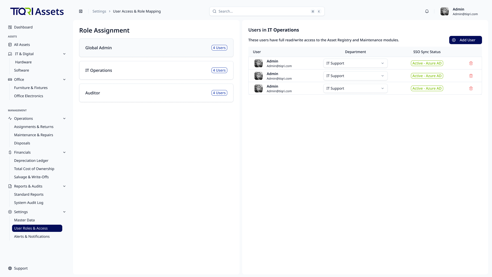
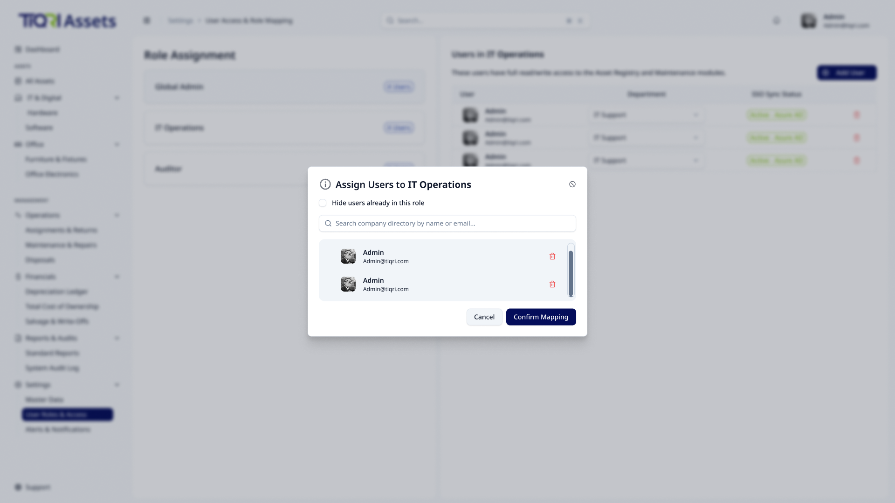

---

### 2.2 Feature 2: Dynamic Schema & Asset Categories

**2.2.1 Overview**
The core engine that allows the system to adapt to any physical asset type without requiring database migrations, utilizing an Entity-Attribute-Value (EAV) schema model.

#### 2.2.2 User Story: US-1.2.1 (Category Creation & Auto-Prefix)

- **As a** Global Admin,
- **I want to** create new hardware categories with an auto-generated Prefix Code,
- **So that** future assets registered under this category have standardized IDs (e.g., AST-LAP-001).

**Acceptance Criteria (Gherkin)**

- **Scenario: Prefix Generation & Locking**
  - **Given** I am creating a new category
  - **When** I type "Wireless Keyboard" into the Category Name field
  - **Then** the Prefix field auto-populates with "WKE"
  - **And** once saved, the Prefix field becomes permanently read-only (locked icon).
- **Scenario: Unique Prefix Validation**
  - **Given** the prefix "LAP" already exists for Laptops
  - **When** the system generates "LAP" for a new "Laser Pointer" category
  - **Then** the system automatically appends a number (e.g., "LAP2") to ensure uniqueness.

**Tasks**

- [ ] Build the "Add Category" slide-out panel (Sheet component).
- [ ] Write JavaScript auto-prefix generation logic (1-word vs 2-word rules).
- [ ] Implement backend lock to prevent Prefix updates via `PUT` requests.

#### 2.2.3 User Story: US-1.2.2 (Custom Field Builder)

- **As a** Global Admin,
- **I want to** define specific custom attributes (Text, Number, Dropdown) for a category,
- **So that** the Asset Registration form dynamically requests the exact right data for that specific hardware.

**Acceptance Criteria (Gherkin)**

- **Scenario: Adding Custom Fields**
  - **Given** I am editing the "Monitors" category
  - **When** I add a custom field called "Screen Resolution" with type "Dropdown" and mark it "Required"
  - **Then** this schema is saved as a JSON payload tied to the category.
- **Scenario: Re-ordering Fields**
  - **Given** I have multiple custom fields defined
  - **When** I drag and drop the fields to change their order
  - **Then** the sequence is saved and will reflect on the final registration form.

**Tasks**

- [ ] Design the dynamic field builder UI (add/remove rows, type selection).
- [ ] Implement JSON/EAV schema storage in the database.
- [ ] Write API to fetch category schema payload for frontend rendering.

**Wireframe Reference**
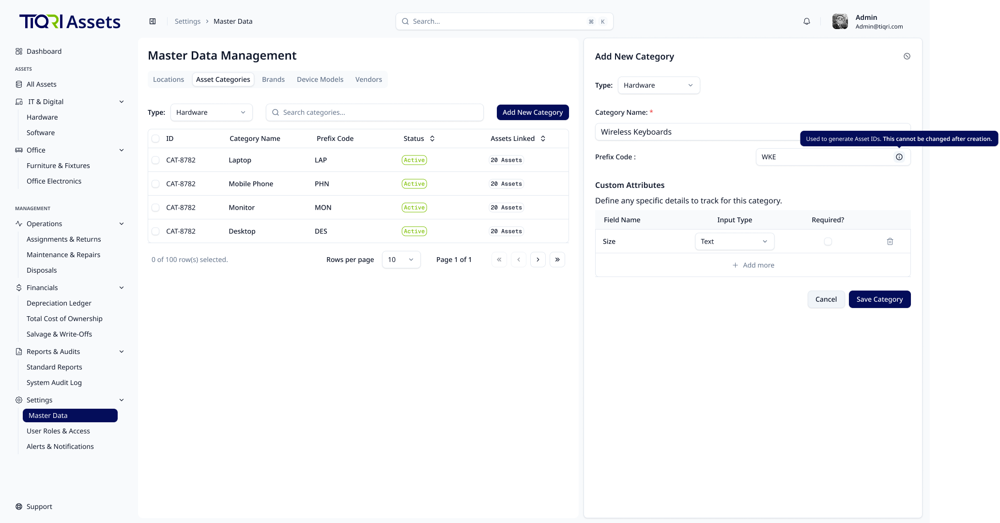
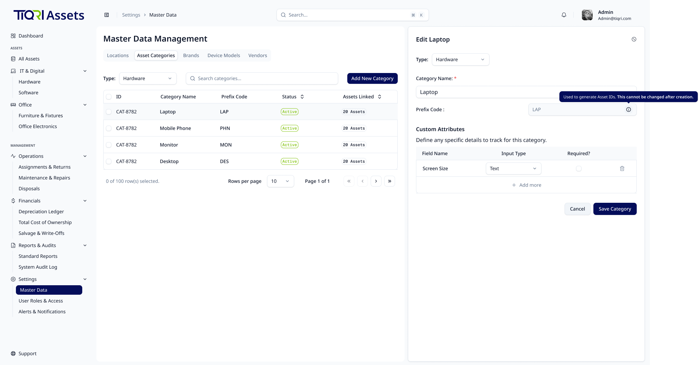

---

### 2.3 Feature 3: Organizational Master Data Management

**2.3.1 Overview**
The CRUD interfaces and safety mechanisms for managing the company's foundational data points, such as Locations, Departments, and Vendors.

#### 2.3.2 User Story: US-1.3.1 (Location & Department CRUD)

- **As a** Global Admin,
- **I want to** manage a directory of company locations, departments, and vendors,
- **So that** I can accurately map where an asset physically resides and who owns it.

**Acceptance Criteria (Gherkin)**

- **Scenario: Creating a new Branch**
  - **Given** I am on the Locations Master Data page
  - **When** I click "Add Location" and fill in "Colombo HQ - Floor 3"
  - **Then** the location is immediately available in the assignment dropdowns globally.
- **Scenario: Editing a Vendor**
  - **Given** a vendor named "Softlogc" was entered with a typo
  - **When** I edit the name to "Softlogic"
  - **Then** the updated name is reflected across all historical repair tickets.

**Tasks**

- [ ] Build standard Data Tables for Locations, Departments, and Vendors.
- [ ] Create simple CRUD Modal forms for each entity.

#### 2.3.3 User Story: US-1.3.2 (Relational Deletion Safeguards)

- **As a** Global Admin,
- **I want** the system to prevent me from deleting master data that is currently in use,
- **So that** I do not accidentally orphan active assets in the database.

**Acceptance Criteria (Gherkin)**

- **Scenario: Blocked Deletion (Category)**
  - **Given** the "Laptops" category has 142 active assets tied to it
  - **When** I view the category in the Master Data table
  - **Then** the "Delete" action is disabled with a tooltip: "Cannot delete: Category contains active assets."
- **Scenario: Soft-Delete Capability**
  - **Given** a Location is no longer used but holds historical audit data
  - **When** I choose to archive it
  - **Then** the `IsActive` flag is set to false, hiding it from future dropdowns but preserving historical records.

**Tasks**

- [ ] Write backend dependency check queries before executing `DELETE`.
- [ ] Implement frontend UI disabled-states based on "Active Count" relational queries.

**Wireframe Reference**
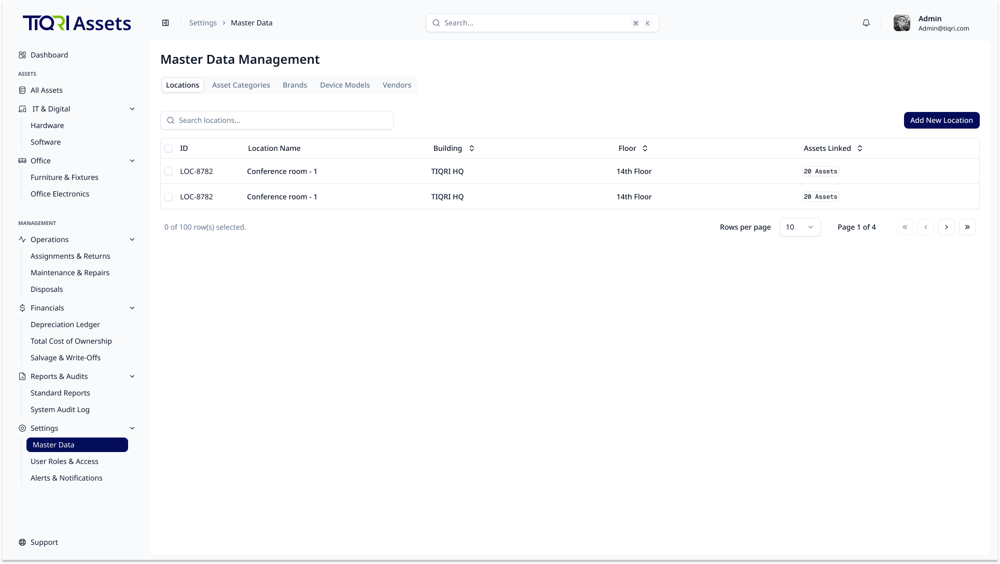
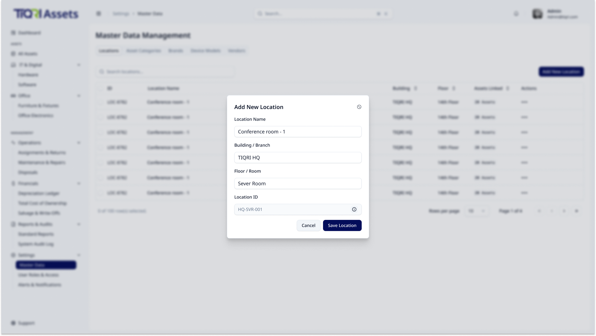
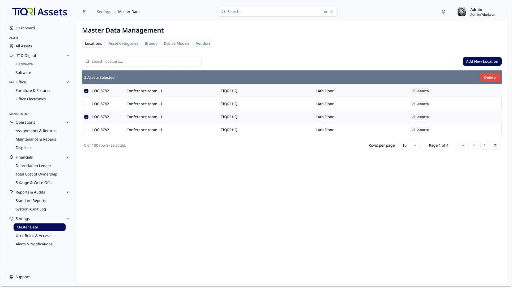

---

### 2.4 Feature 4: Immutable System Audit Log

**2.4.1 Overview**
A strict, read-only ledger that captures every action performed in the system for security and compliance (SOC2).

#### 2.4.2 User Story: US-1.4.1 (Automated Event Tracking & IP Capture)

- **As a** Security Auditor,
- **I want** the system backend to automatically capture the user, IP address, and payload data of every state change,
- **So that** no malicious action goes unrecorded, even if initiated via API.

**Acceptance Criteria (Gherkin)**

- **Scenario: IP and Payload Capture**
  - **Given** an IT Admin updates the status of a server
  - **When** the HTTP request hits the backend
  - **Then** the server intercepts the `X-Forwarded-For` header to get the true IP
  - **And** writes an immutable record to the Audit Log table containing the Before/After JSON states.

**Tasks**

- [ ] Create append-only `AuditLogs` database table.
- [ ] Write backend middleware interceptor to capture `X-Forwarded-For` IP addresses.
- [ ] Revoke `UPDATE` and `DELETE` database privileges on the Audit table.
- [ ] Implement backend utility to compute Before/After object states and serialize them into JSON diff payloads for the database.

#### 2.4.3 User Story: US-1.4.2 (Audit Log Viewing and Export)

- **As a** Security Auditor,
- **I want to** view, filter, and export the system audit ledger,
- **So that** I can conduct forensic investigations into hardware discrepancies.

**Acceptance Criteria (Gherkin)**

- **Scenario: Filtering by Actor and Event**
  - **Given** I am on the System Audit Log page
  - **When** I filter by Actor "Jane Doe" and Action "DELETE"
  - **Then** the high-density table shows only destructive actions performed by Jane.
- **Scenario: Exporting the Ledger**
  - **When** I click "Export Log (CSV)"
  - **Then** a CSV file containing the currently filtered dataset is downloaded.

**Tasks**

- [ ] Build the High-Density Audit UI table with complex Date/Actor filters.
- [ ] Create visual badges for Action Types (e.g., CREATE, UPDATE, DISPOSE).
- [ ] Implement "Export Log to CSV" logic.

**Wireframe Reference**
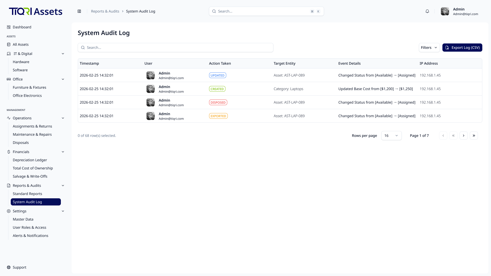
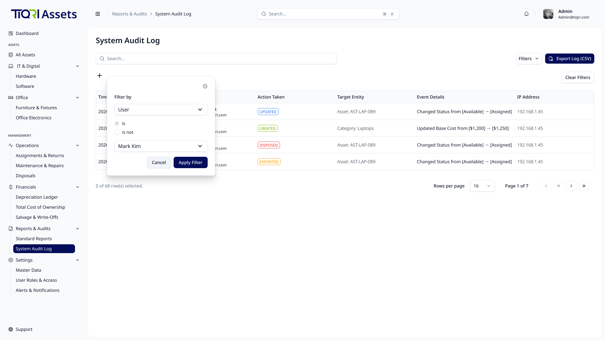
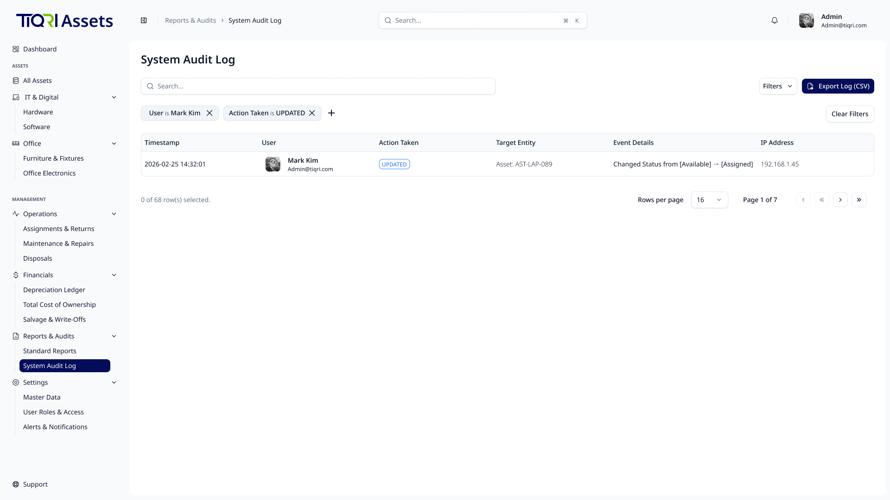

---

### 2.5 Feature 5: Open API & Integration Gateway

**2.5.1 Overview**
Secure endpoints and documentation allowing third-party corporate software (like HRIS or Jira) to communicate with IDAMS.

#### 2.5.2 User Story: US-1.5.1 (API Key Generation)

- **As a** Global Admin,
- **I want to** generate and revoke secure API keys from the Settings dashboard,
- **So that** I can grant external systems programmatic access without sharing user credentials.

**Acceptance Criteria (Gherkin)**

- **Scenario: Generating a Key**
  - **Given** I am in the Integrations Settings tab
  - **When** I click "Generate New API Key" and name it "Workday HRIS"
  - **Then** the system displays the secret key exactly once
  - **And** stores a hashed version of the key in the database.
- **Scenario: Revoking a Key**
  - **When** I click "Revoke" on the "Workday HRIS" key
  - **Then** any subsequent API requests using that key are instantly met with a `401 Unauthorized`.

**Tasks**

- [ ] Build API Key management UI in Settings.
- [ ] Implement backend key generation and hashing logic (similar to password storage).

#### 2.5.3 User Story: US-1.5.2 (External Data Consumption)

- **As a** Third-Party System Developer,
- **I want to** securely query a REST API for asset assignments,
- **So that** our HR system knows if a terminating employee still possesses company hardware.

**Acceptance Criteria (Gherkin)**

- **Scenario: Secure Data Fetch**
  - **Given** I have a valid, system-generated API Token
  - **When** I send a `GET` request to `/api/v1/external/assets/user/{employee_id}`
  - **Then** the API returns a JSON array of active assigned assets.
- **Scenario: Rate Limiting Enforcement**
  - **Given** I am sending 100 requests per second using my API key
  - **When** I exceed the configured threshold
  - **Then** the API responds with a `429 Too Many Requests` error.

**Tasks**

- [ ] Implement Token Authentication & Rate Limiting middleware for `/api/v1/external/*`.
- [ ] Create standard Read-Only endpoints for Assets and Assignments.
- [ ] Write Swagger/OpenAPI documentation for available endpoints.
#### 2.5.4 User Story: US-1.5.3 (Inbound API Action Triggers)
- **As a** Third-Party System Developer,
- **I want to** trigger specific operational workflows (like assigning a laptop to a new hire) via the REST API,
- **So that** our HR system (e.g., Workday) can automate IT onboarding without manual IT admin intervention.

**Acceptance Criteria (Gherkin)**
- **Scenario: Triggering an Assignment via API**
  - **Given** I have a valid API Token with Write permissions
  - **When** I send a `POST` request to `/api/v1/external/assets/assign` with a payload containing the `Employee_ID` and requested `Category_ID`
  - **Then** the system automatically finds an "Available" asset in that category, assigns it to the user, updates the status, and returns a `200 OK` with the `Asset_ID`.
- **Scenario: API Validation Failure**
  - **Given** I trigger an assignment for an `Employee_ID` that does not exist in Azure AD
  - **When** the API processes the request
  - **Then** it aborts the assignment and returns a `400 Bad Request` with a descriptive error message.

**Tasks**
- [ ] Create `POST /api/v1/external/assets/assign` endpoint with transactional database safety.
- [ ] Implement backend logic to auto-select available inventory based on category requests.
- [ ] Ensure API-triggered actions are logged in the System Audit Log, citing the specific API Key Name as the Actor.

#### 2.5.5 User Story: US-1.5.4 (Outbound Webhooks Configuration)
- **As a** Global Admin,
- **I want to** register external webhook URLs for specific system events (e.g., Asset Disposed, Asset Assigned),
- **So that** other corporate systems (like Jira, ServiceNow, or Slack) receive real-time push updates when asset statuses change.

**Acceptance Criteria (Gherkin)**
- **Scenario: Firing a Webhook on Status Change**
  - **Given** a webhook URL is registered for the "Asset_Assigned" event
  - **When** an IT Admin assigns a laptop to a user in the UI
  - **Then** the backend automatically sends an asynchronous `POST` request containing the JSON payload of the assignment details to the registered target URL.

**Tasks**
- [ ] Build a Webhooks configuration UI in the Integrations Settings tab (Event selection dropdown, Target URL input).
- [ ] Create a `WebhookSubscriptions` database table to store event mappings.
- [ ] Write an asynchronous backend service/job to dispatch HTTP POST payloads upon triggered system events, including retry logic for failed deliveries.

---

## 3. Integrated Use Case Diagram

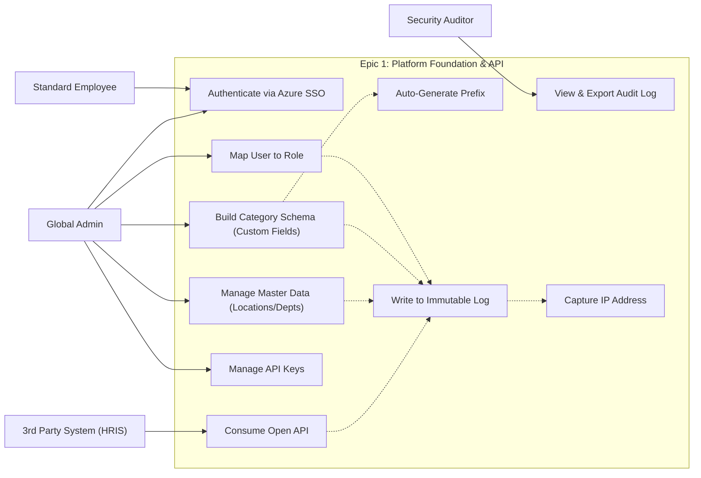
---

[< Back to Requirements](../README.md)