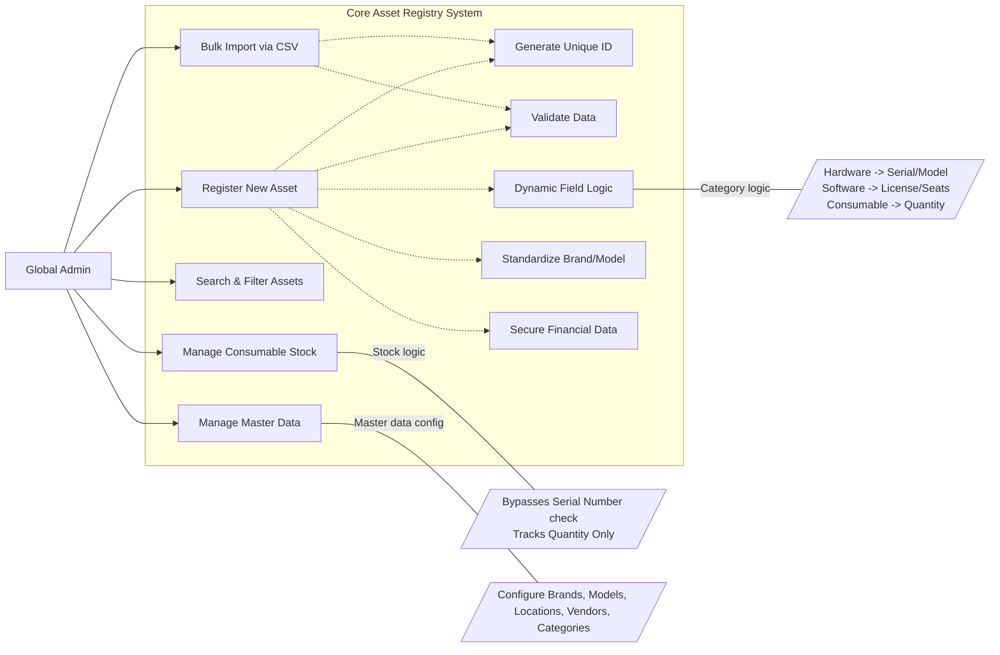

# User Story Specification

## Feature Name: Core Asset Registry

### Version History

| Version | Date       | Author | Description of Change |
| :------ | :--------- | :----- | :-------------------- |
| 1.0     | 02/08/2026 | Team   | Initial Draft         |

---

## 1. Overview of the Feature

### 1.1 Summary Feature
The Core Asset Registry serves as the foundational database for the entire IT Asset Management (ITAM) system. It is designed to be the single source of truth for all physical and digital assets within the organization. The feature provides a robust, validated mechanism for registering new items, ensuring that every asset—whether a high-value server or a bulk consumable—is uniquely identified, accurately categorized, and financially tracked from day one.

### 1.2 Scope
- **Asset Registration**: A dynamic, guided web form that adapts to the type of asset being registered (e.g., hiding irrelevant fields for software).
- **Unique Identification**: Automated generation of immutable Asset IDs to prevent duplication.
- **Data Standardization**: Enforcement of standardized values for Brands, Models, and Currencies to maintain data hygiene.
- **Bulk Operations**: Capability to import large volumes of assets via CSV with robust error handling.
- **Advanced Search**: High-performance filtering to instantly locate assets by any attribute.

### 1.3 Out of scope/Limitations
- **Asset Assignments**: The process of checking out assets to users or locations is handled in the "Tracking & Operations" module.
- **Disposal Workflows**: End-of-life processes such as recycling or selling assets are covered in separate specifications.
- **User Management**: The system assumes users are already authenticated via Azure AD; user creation is not part of this feature.

### 1.4 Business Context
Inaccurate asset data leads to financial invisible costs, failed audits, and security vulnerabilities. By ensuring strictly validated data entry at the point of creation, this feature eliminates downstream errors. It empowers the Admin to maintain a pristine inventory that supports critical financial and operational decisions.

### 1.5 Assumptions and Dependencies
- **Authentication**: Users must be authenticated via Azure AD (SSO) to access the registry.
- **Master Data**: It is assumed that Master Data (e.g., Lists of Brands, Models, Locations) has been pre-populated by the Admin.

---

## 2. Functionality: Core Asset Registry

### 2.1 User Story 1 - US-1.1 (Asset Creation & Unique ID)

**2.1.1 Overview of the requirement**
To prevent inventory conflicts, the system must ensure every registered item has a globally unique identifier. This ID is the primary key for all future lifecycle events.

**2.1.1 Goal**
Establish a guaranteed unique identity for every asset immediately upon creation, eliminating the risk of duplicate records.

**2.1.2 User Story**
- **As a** Global Admin,
- **I want to** register a new asset using a standardized web form,
- **So that** the system automatically verifies its uniqueness and assigns it a permanent, non-editable Asset ID.

**2.1.3 Acceptance Criteria (Gherkin Format)**
- **Scenario: Successful Asset Generation**
  - **Given** I am on the "New Asset" registration page
  - **When** I submit the form with all mandatory fields completed
  - **Then** the system commits the record to the database
  - **And** generates a unique, alphanumeric Asset ID (e.g., "AST-2026-0001")
  - **And** displays a success message containing the new ID.

- **Scenario: Duplicate Serial Number Prevention**
  - **Given** an existing asset already has Serial Number "SN-XYZ-123" for the manufacturer "Dell"
  - **When** I attempt to register a new Dell asset with the exact same Serial Number
  - **Then** the system blocks the submission
  - **And** highlights the "Serial Number" field with an error: "This Serial Number is already in use by Asset [Existing_ID]."

**2.1.5 Validations/Business Rules**
- **System-Generated ID**: The `Asset ID` field is strictly read-only and is generated by the backend upon successful save.
- **Mandatory Fields**: The form cannot be submitted if required fields (Name, Category, Brand) are empty.

**2.1.6 UI/UX requirements**
- The "Save" button should be disabled until all required fields pass client-side validation.
- The `Asset ID` field should show a placeholder like "Auto-generated upon save" to inform the user it is not manual.

**2.1.7 Non-functional requirements**
- **Performance**: The Asset ID generation and uniqueness check must complete within **1 second**.
- **Security**: All data transmission must occur over **HTTPS (TLS 1.2+)**.

**2.1.8 Dependencies**
- **REQ-SEC-2.1**: The user must have a valid, active session.

---

### 2.2 User Story 2 - US-1.2 (Comprehensive Asset Attributes)

**2.2.1 Overview of the requirement**
A simple name is not enough to manage IT assets. The system must capture detailed technical specifications to differentiate between similar items (e.g., differentiating a "MacBook Pro 14 M3" from a "MacBook Pro 16 M1").

**2.2.1 Goal**
Store sufficient technical detail to allow for precise identification, compatibility checks, and replacement planning.

**2.2.2 User Story**
- **As a** Global Admin,
- **I want to** enter specific technical attributes such as Model, Serial Number, and Specifications,
- **So that** I have a complete technical profile of the asset for support and auditing purposes.

**2.2.3 Acceptance Criteria (Gherkin Format)**
- **Scenario: Entering Technical Details**
  - **Given** I am registering a Hardware asset
  - **When** I populate the "Model" and "Serial Number" fields
  - **Then** the system saves these attributes associated with the Asset ID.

**2.2.5 Validations/Business Rules**
- **Unique Serial**: Serial Numbers must be unique within a specific Brand/Category combination.

**2.2.6 UI/UX requirements**
- Group attributes logically: "General Info", "Technical Specs", and "Financials" should be in distinct sections or tabs.

**2.2.7 Non-functional requirements**
- **Data Integrity**: Text fields (Name, Specs) should support UTF-8 characters and be capped at 255 characters to prevent database overflow.

**2.2.8 Dependencies**
- None.

---

### 2.3 User Story 3 - US-1.3 (Dynamic Form Logic)

**2.3.1 Overview of the requirement**
Different assets require different data. Showing "RAM" fields for a "Software License" is confusing and error-prone. The form must be intelligent enough to adapt to the context.

**2.3.1 Goal**
Streamline the data entry process and improve data quality by displaying only the fields relevant to the selected Asset Category.

**2.3.2 User Story**
- **As a** Global Admin,
- **I want** the registration form to dynamically show or hide fields based on the Asset Category I select,
- **So that** I am not presented with irrelevant fields that clutter the interface.

**2.3.3 Acceptance Criteria (Gherkin Format)**
- **Scenario: Switching to Software**
  - **Given** I am viewing the registration form
  - **When** I change the Category dropdown from "Hardware" to "Software"
  - **Then** the "Serial Number", "CPU", and "RAM" fields should immediately disappear
  - **And** the "License Key", "Seat Count", and "Expiry Date" fields should appear.

**2.3.5 Validations/Business Rules**
- **Data Cleanup**: If a user switches categories mid-entry (e.g., fills in "RAM" then switches to "Software"), the system must clear the hidden values to prevent phantom data.

**2.3.6 UI/UX requirements**
- **Instant Feedback**: The field toggle must happen instantly on the client side without reloading the page.

**2.3.7 Non-functional requirements**
- **Usability**: The layout shift should be smooth and stable (Cumulative Layout Shift < 0.1).

**2.3.8 Dependencies**
- The system must have a predefined list of Categories and their associated field mappings.

---

### 2.4 User Story 4 - US-1.4 (Standardization of Master Data)

**2.4.1 Overview of the requirement**
Mapped to **REQ-REG-1.4**. Free-text fields lead to data fragmentation (e.g., "HP", "H.P.", "Hewlett-Packard"). Controlled vocabularies are essential for reporting.

**2.4.1 Goal**
Enforce data consistency by restricting key fields (Brand, Model, Location) to a predefined list of valid options during registration.

**2.4.2 User Story**
- **As a** Global Admin,
- **I want to** select the Brand and Model from a searchable dropdown list,
- **So that** I avoid spelling errors and ensure all assets are grouped correctly in reports.

**2.4.3 Acceptance Criteria (Gherkin Format)**
- **Scenario: Selecting a Brand**
  - **Given** I am on the Brand field
  - **When** I type "Del"
  - **Then** the dropdown should filter to show "Dell" as a selectable option.
  - **And** I cannot type "MyCustomBrand" if it does not exist in the list.

**2.4.5 Validations/Business Rules**
- **Closed List**: Users cannot enter a value that is not in the Master Data. New Brands must be added via Settings (US-1.9).

**2.4.6 UI/UX requirements**
- **Type-ahead**: Dropdowns must support searching/filtering for quick selection from long lists.

**2.4.7 Non-functional requirements**
- **Performance**: The dropdown options must load in **under 1 second**, even if there are thousands of models.

**2.4.8 Dependencies**
- Master Data tables must be populated (US-1.9).

---

### 2.5 User Story 5 - US-1.5 (Advanced Search & Filtering)

**2.5.1 Overview of the requirement**
As the inventory grows to thousands of items, finding a specific asset quickly is critical for audits and support tickets.

**2.5.1 Goal**
Empower admins to instantly locate assets using any combination of their attributes.

**2.5.2 User Story**
- **As a** Global Admin,
- **I want to** filter the asset list by multiple criteria (e.g., Serial Number, Status, Location),
- **So that** I can rapidly find specific assets or groups of assets.

**2.5.3 Acceptance Criteria (Gherkin Format)**
- **Scenario: Filtering by Serial**
  - **Given** a list of 5,000 assets
  - **When** I type "SN-99" into the search bar
  - **Then** the list should update to show only the asset matching that Serial Number.

**2.5.5 Validations/Business Rules**
- **Default View**: By default, the list should exclude "Disposed" assets unless explicitly requested.

**2.5.6 UI/UX requirements**
- **Sticky Filters**: Filters should remain applied if I navigate into an asset and then click "Back".

**2.5.7 Non-functional requirements**
- **Performance**: Search results must populate in **under 2 seconds** (NFR-PERF-02).

**2.5.8 Dependencies**
- All searchable fields must be indexed in the database.

---

### 2.6 User Story 6 - US-1.6 (Financial Tracking)

**2.6.1 Overview of the requirement**
Every asset has a financial cost. Tracking purchase price, currency, and invoices is vital for calculating Today's Value and depreciation.

**2.6.1 Goal**
Maintain a fully auditable financial trail for every asset from the moment of purchase.

**2.6.2 User Story**
- **As a** Global Admin,
- **I want to** record the purchase cost, currency, and attach digital copies of invoices,
- **So that** the organization has verifiable proof of value and ownership.

**2.6.3 Acceptance Criteria (Gherkin Format)**
- **Scenario: Attaching an Invoice**
  - **Given** I am entering financial details
  - **When** I upload a "Receipt.pdf" file
  - **Then** the file is securely stored and linked to the asset record for future download.

**2.6.5 Validations/Business Rules**
- **Non-Negative**: Purchase Cost cannot be a negative number.

**2.6.6 UI/UX requirements**
- **Drag & Drop**: The interface should allow dragging a file directly onto the upload zone.

**2.6.7 Non-functional requirements**
- **Security**: Financial fields (Cost) must be **encrypted at rest** in the database (NFR-SEC-03).

**2.6.8 Dependencies**
- Secure file storage service (e.g., Azure Blob Storage) must be configured.

---

### 2.7 User Story 7 - US-1.7 (Bulk CSV Import)

**2.7.1 Overview of the requirement**
Migrating legacy data or adding batch purchases manually is inefficient. A bulk import tool allows for mass-population of the registry.

**2.7.1 Goal**
Enable the rapid onboarding of hundreds of assets simultaneously with minimal manual effort.

**2.7.2 User Story**
- **As a** Global Admin,
- **I want to** upload a CSV file containing asset details,
- **So that** I can register multiple assets in a single operation.

**2.7.3 Acceptance Criteria (Gherkin Format)**
- **Scenario: Partial Success Handling**
  - **Given** I upload a CSV with 100 rows, where 5 rows have duplicate Serial Numbers
  - **When** the import processes
  - **Then** the system successfully imports the 95 valid rows
  - **And** generates a downloadable error report detailing the 5 failed rows.

**2.7.5 Validations/Business Rules**
- **All-or-Nothing Rule**: The system must NOT reject the entire file for minor errors; it must process what it can (Partial Success logic).

**2.7.6 UI/UX requirements**
- **Progress Report**: A progress bar should show the status of the upload.

**2.7.7 Non-functional requirements**
- **Reliability**: A file with 1,000 records must process within **3 minutes** (NFR-REL-03).

**2.7.8 Dependencies**
- None.

---

### 2.8 User Story 8 - US-1.8 (Consumable Quantity Tracking)

**2.8.1 Overview of the requirement**
Low-value items like cables, mice, or keyboards do not require unique serialization. Tracking them individually is overhead; tracking their count is sufficient.

**2.8.1 Goal**
Efficiently manage inventory levels for low-value, high-volume items without the burden of individual tagging.

**2.8.2 User Story**
- **As a** Global Admin,
- **I want to** maintain a stock count for consumable items (e.g., HDMI Cables),
- **So that** I can see current availability and know when to reorder.

**2.8.3 Acceptance Criteria (Gherkin Format)**
- **Scenario: Adjusting Stock**
  - **Given** I have a "USB-C Cable" consumable record
  - **When** I add 50 units to the inventory
  - **Then** the "Total Quantity" increases by 50
  - **And** no new individual rows are created in the asset list.

**2.8.5 Validations/Business Rules**
- **Logic Trigger**: This mode is triggered when the Category is "Consumable" (See US-1.3). Serial Number validation is bypassed.

**2.8.6 UI/UX requirements**
- **Simple Interface**: Provide simple "+" and "-" buttons or a numeric input field for stock adjustments.

**2.8.7 Non-functional requirements**
- **Consistency**: Updates to stock count must be atomic to prevent race conditions.

**2.8.8 Dependencies**
- None.

---

### 2.9 User Story 9 - US-1.9 (Master Data Management)

**2.9.1 Overview of the requirement**
Mapped to **REQ-REG-1.9**. Markets change. New vendors appear, old ones close. The list of "Valid Options" for Brands, Models, Categories, and Locations must be maintained by the Admin to keep the registry usable.

**2.9.1 Goal**
Provide a centralized interface for Global Admins to manage the reference data that drives the dropdowns throughout the system.

**2.9.2 User Story**
- **As a** Global Admin,
- **I want to** Create, Edit, and Delete/Disable reference data entities (Brands, Models, Categories, Locations, Vendors),
- **So that** the system adapts to new hardware releases and organizational changes.

**2.9.3 Acceptance Criteria (Gherkin Format)**
- **Scenario: Defining a New Location**
  - **Given** our company opened a new office in "Austin"
  - **When** I go to Settings > Locations and click "Add Location"
  - **Then** I can enter "Austin, TX" and save
  - **And** "Austin" becomes available in the Location dropdown for Asset Assignment.

- **Scenario: Renaming a Vendor**
  - **Given** vendor "Facebuk" was entered with a typo
  - **When** I edit the vendor name to "Facebook"
  - **Then** all assets previously linked to "Facebuk" now show "Facebook".

**2.9.5 Validations/Business Rules**
- **Referential Integrity**: Cannot Delete a record (e.g., "Dell") if it is currently used by any Asset. Must use "Soft Delete" (Active = False) instead.
- **Uniqueness**: Name must be unique within its type (e.g., cannot have two Brands named "Dell").

**2.9.6 UI/UX requirements**
- **Tabbed Interface**: A single "Settings" page with tabs for "Brands", "Models", "Categories", etc.

**2.9.7 Non-functional requirements**
- **Audit**: Critical changes (e.g., Merging brands) must be logged in the Audit Trail.

**2.9.8 Dependencies**
- None.

---

## 3. Integrated Use Case Diagram

The following diagram illustrates the complete interactions of the Global Admin with the Core Registry features.

[< Back to Specifications](./README.md)
