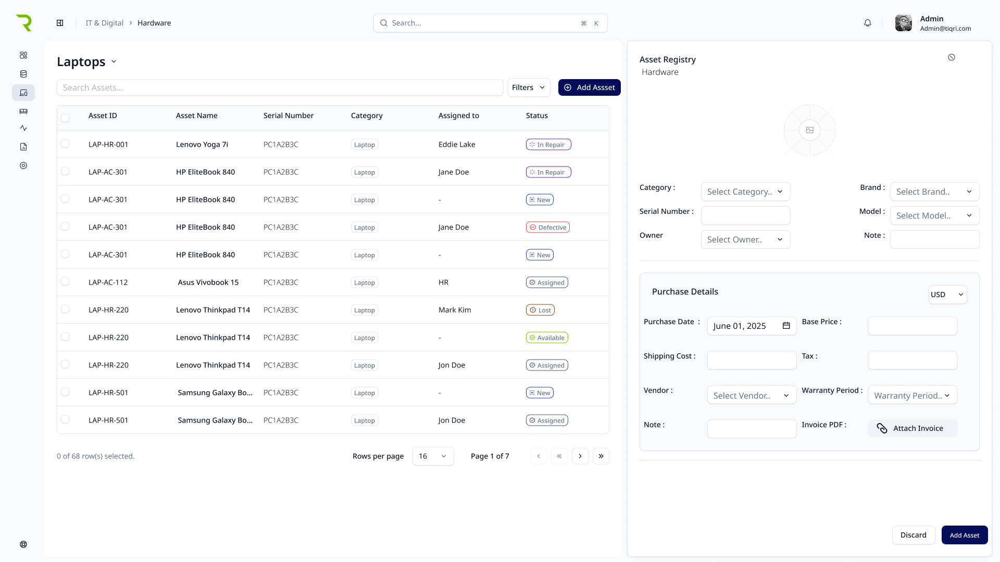
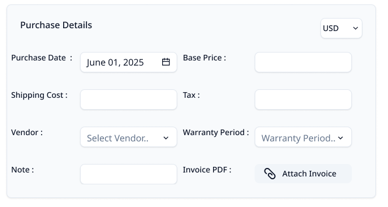
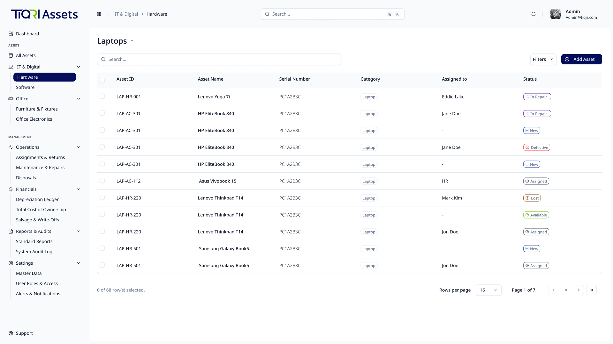
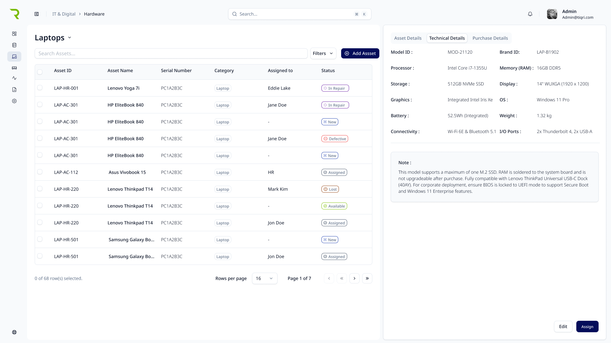
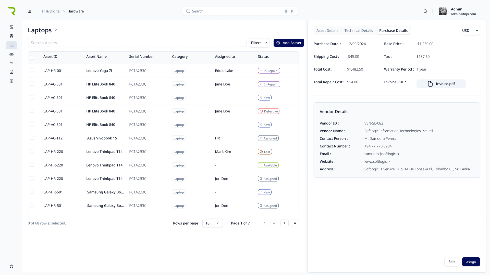
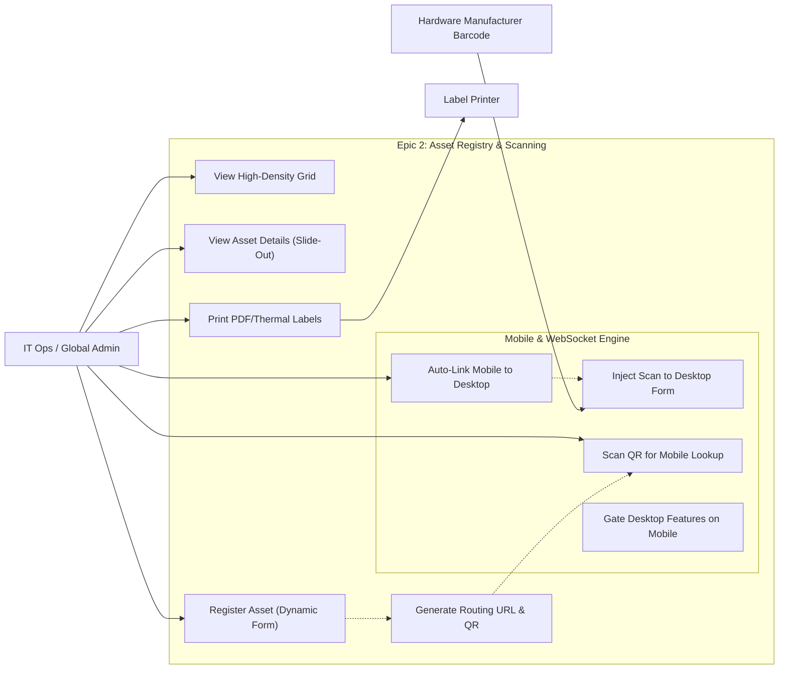

# User Story Specification

## Epic 2: Asset Registry & Onboarding

### Version History

| Version | Date       | Author | Description of Change     |
| :------ | :--------- | :----- | :------------------------ |
| 1.0     | 02/08/2026 | Team   | Initial Draft             |
| 2.0     | 02/25/2026 | Team   | Architectural restructure |

---

## 1. Overview

### 1.1 Summary

The Core Asset Registry serves as the foundational database for the entire IT Asset Management (ITAM) system. This epic elevates the standard inventory tracker by introducing a Dynamic Asset Registration Form, high-density data grids, and a sophisticated Mobile Companion Scanner infrastructure. It bridges the physical and digital worlds using WebSockets to allow mobile devices to scan barcodes directly into desktop sessions, and generates secure routing QR codes for physical asset tagging.

### 1.2 Scope

- **Main Asset Registry Grid**: High-density data table with complex filtering, column visibility toggles, and multi-select bulk actions.
- **Asset Details Slide-Out Panel**: Comprehensive read-only view of a single asset's vitals, assignments, lifecycle, and quick actions.
- **Dynamic Asset Registration Form**: Form that automatically renders exact Custom Fields defined in Epic 1 based on category.
- **QR Code & Print Engine**: Unique URL endpoint generation and formatting logic for Single-Tag (Zebra/Dymo) or Bulk A4 PDF printing.
- **PWA Mobile Web Scanner**: Mobile-responsive browser interface using HTML5 camera APIs.
- **Tethered "Companion" Mode**: Real-time WebSocket auto-linking (by Azure AD user identity) to scan 1D barcodes directly into desktop input fields.
- **Standalone Mobile Lookup & Fallbacks**: Bottom-sheet asset pop-ups and mobile "Empty State" blockers for desktop-only views.

### 1.3 Out of scope/Limitations

- **Native App Store Deployment**: The mobile scanner is a Progressive Web App (PWA) accessed via browser; iOS App Store / Google Play submissions are out of scope.
- **RFID Tracking**: Real-time location services (RTLS) are not in scope; physical location updates rely on QR scanning.

### 1.4 Business Context

Inaccurate asset data leads to financial invisible costs, failed audits, and security vulnerabilities. By tethering a mobile scanner to the desktop, TIQRI drastically reduces manual data-entry errors (typing a 16-digit serial number). The dynamic forms ensure that the data collected is always perfectly aligned with the specific hardware category.

### 1.5 Assumptions and Dependencies

- **Epic 1 Completion**: Master Data (Categories, Locations, Schema) must be configured to populate the dynamic forms.
- **Hardware Access**: Mobile devices must grant browser camera permissions for the HTML5 scanner to function.

---

## 2. Features & User Stories

### 2.1 Feature 1: Dynamic Asset Registration

**2.1.1 Overview**
A smart creation interface that guarantees unique identification while adapting its fields based on the selected hardware category's EAV schema.

#### 2.1.2 User Story: US-2.1.1 (Standard Asset Generation)

- **As a** Global Admin,
- **I want to** register a new asset using a standardized web form,
- **So that** the system automatically verifies its uniqueness and assigns it a permanent, non-editable Asset ID.

**Acceptance Criteria (Gherkin)**

- **Scenario: Successful Asset Generation**
  - **Given** I am on the "New Asset" registration page
  - **When** I submit the form with all mandatory Master Data fields completed
  - **Then** the backend generates a unique ID using the category Prefix (e.g., `LAP-0142`)
  - **And** commits the record to the database and displays a success message.
- **Scenario: Duplicate Serial Number Prevention**
  - **Given** an existing asset already has Serial Number "SN-XYZ-123"
  - **When** I attempt to register a new asset with the exact same Serial Number
  - **Then** the system blocks the submission and highlights the field with a validation error.
- **Scenario: Full Keyboard Navigation**
  - **Given** I am on the asset registration form
  - **When** I use the Tab key to navigate between fields and Enter to submit
  - **Then** all form fields, dropdowns, and the submit button are fully accessible via keyboard without requiring mouse interaction.

**Tasks**

- [ ] Build the base React registration form for standard fields (Name, Location, Vendor).
- [ ] Implement backend auto-increment logic for Asset ID generation linked to Epic 1's Prefix codes.
- [ ] Write database validation rules to enforce unique Serial Numbers per Manufacturer.

**Wireframe Reference**

#### 2.1.3 User Story: US-2.1.2 (Dynamic Schema Form Rendering)

- **As a** Global Admin,
- **I want** the registration form to dynamically render custom inputs based on the selected category,
- **So that** I only see relevant technical specification fields (e.g., RAM for Laptops, Dimensions for Furniture).

**Acceptance Criteria (Gherkin)**

- **Scenario: Switching Category Context**
  - **Given** I am creating a new asset
  - **When** I select "Hardware > Monitors" from the Category dropdown
  - **Then** the UI fetches the Epic 1 JSON schema and dynamically renders a "Screen Size" number input and "Panel Type" dropdown.
  - **And** if I switch the category to "Software", the monitor fields disappear and are replaced by "License Key" inputs.

**Tasks**

- [ ] Implement frontend logic to fetch category schema via API `onChange`.
- [ ] Build dynamic form component renderer supporting Text, Number, and Dropdown types.
- [ ] Write backend logic to save dynamic form values into the EAV/JSONB payload column.

#### 2.1.4 User Story: US-2.1.3 (Financial Proof & Invoice Upload)

- **As a** Global Admin,
- **I want to** attach digital copies of purchase invoices and enter the full initial cost breakdown during registration,
- **So that** the organization has verifiable proof of value to feed into the Epic 5 Depreciation engine.

**Acceptance Criteria (Gherkin)**

- **Scenario: Attaching an Invoice**
  - **Given** I am entering financial details on the New Asset form
  - **When** I drag and drop a "Receipt.pdf" file into the upload zone
  - **Then** the file is securely stored in cloud storage (e.g., AWS S3/Azure Blob)
  - **And** linked to the asset record for future download by the Finance team.
- **Scenario: Initial Cost Breakdown Entry**
  - **Given** I am entering financial details on the New Asset form
  - **When** I fill out the cost section
  - **Then** I must enter the Base Price, Tax Amount, and Shipping Cost as separate fields
  - **And** the system auto-calculates and displays the total Initial Cost.
- **Scenario: Multi-Currency Support**
  - **Given** I am entering financial details for an asset purchased overseas
  - **When** I select the currency dropdown
  - **Then** I can choose from supported currencies (NOK, USD, LKR)
  - **And** the selected currency is stored alongside the financial values for accurate reporting.

**Tasks**

- [ ] Implement secure Drag & Drop file upload component on the frontend.
- [ ] Integrate cloud storage bucket API for storing and retrieving PDF invoices.
- [ ] Add encrypted `PurchaseCost` column to the database to protect financial data at rest.
- [ ] Build separate Base Price, Tax, and Shipping input fields with auto-calculated Total.
- [ ] Implement currency selector dropdown supporting NOK, USD, and LKR.
- [ ] Store original currency code alongside all financial values in the database.

**Wireframe Reference**

## Invoice Attaching Wireframe

---

#### 2.1.5 User Story: US-2.1.4 (Consumable Quantity Tracking)

- **As a** Global Admin,
- **I want to** maintain a stock count for low-value items (like HDMI Cables) without generating individual Asset IDs,
- **So that** I can efficiently manage high-volume inventory levels without database bloat.

**Acceptance Criteria (Gherkin)**

- **Scenario: Adjusting Consumable Stock**
  - **Given** I have a "USB-C Cable" record under a "Consumable" category
  - **When** I add 50 units to the inventory via a numeric input field
  - **Then** the "Total Quantity" increases by 50
  - **And** the system bypasses the unique Serial Number and QR code generation requirements.

**Tasks**

- [ ] Write backend logic flag to bypass ID/QR generation if category type is `Consumable`.
- [ ] Build simple `+` and `-` quantity adjustment UI for consumable records.

#### 2.1.6 User Story: US-2.1.5 (Bulk CSV/Excel Import)

- **As a** Global Admin,
- **I want to** upload a CSV or Excel file containing hundreds of asset details,
- **So that** I can mass-populate the registry during legacy system migration or bulk batch purchases.

**Acceptance Criteria (Gherkin)**

- **Scenario: Partial Success Handling**
  - **Given** I upload a CSV with 100 rows, where 5 rows have duplicate Serial Numbers
  - **When** the import script processes
  - **Then** the system successfully imports the 95 valid rows
  - **And** generates a downloadable error report detailing the 5 failed rows without failing the entire batch.
- **Scenario: Excel Format Support**
  - **Given** I have asset data in an Excel (.xlsx) spreadsheet
  - **When** I upload the file via the bulk import interface
  - **Then** the system parses the Excel file identically to a CSV upload
  - **And** applies the same column-mapping, validation, and Partial Success logic.

**Tasks**

- [ ] Build CSV/Excel parser and column-mapping UI in React.
- [ ] Implement "All-or-Nothing" bypass logic (Partial Success handling) in the backend import script.
- [ ] Write logic to auto-generate Asset IDs and QR URLs for every successfully imported row.
- [ ] Add Excel (.xlsx) file parsing support using a backend library (e.g., `exceljs` or `SheetJS`).

### 2.2 Feature 2: Main Asset Registry Grid & Details

**2.2.1 Overview**
The central hub for viewing, filtering, and interacting with the entire IT inventory database.

#### 2.2.2 User Story: US-2.2.1 (High-Density Data Grid)

- **As a** Global Admin,
- **I want to** view my inventory in a high-density table with complex filtering and column toggles,
- **So that** I can rapidly find specific assets or execute bulk operations.

**Acceptance Criteria (Gherkin)**

- **Scenario: Complex Filtering**
  - **Given** I am viewing the main Asset Registry grid
  - **When** I apply filters for `Category: Laptops` AND `Status: Available`
  - **Then** the grid instantly updates to show only matching records.
- **Scenario: Column Visibility Toggles**
  - **When** I click the "View" button in the table header
  - **Then** I can uncheck the "Purchase Date" column to hide it, optimizing my screen space.

**Tasks**

- [ ] Implement ShadCN Data Table with pagination, sorting, and global search.
- [ ] Build multi-select column visibility dropdown.
- [ ] Implement bulk-select checkboxes enabling batch actions (like Epic 4 Bulk Disposals).
- [ ] Implement a specific "Bulk Edit Modal" allowing admins to update the `Location` or `Status` of 50+ selected checkbox rows in a single database transaction.
      **Wireframe Reference**

## Asset List View Wireframe

---

#### 2.2.3 User Story: US-2.2.2 (Asset Details Slide-Out Panel)

- **As an** IT Support Staff member,
- **I want to** click on a grid row to open a Right-Side Slide-Out Panel,
- **So that** I can see an asset's complete vitals, assignment history, and take quick actions without losing my place in the grid.

**Acceptance Criteria (Gherkin)**

- **Scenario: Viewing Asset Vitals**
  - **Given** I am on the Asset Registry
  - **When** I click the row for `LAP-0142`
  - **Then** a panel slides in from the right displaying its Hardware Specs, current Custodian, and Warranty Status.
  - **And** clicking the "X" closes the panel, leaving my previous grid filters perfectly intact.

**Tasks**

- [ ] Build the Slide-Out Sheet React component.
- [ ] Create layout sections: Header (Status Badges), Vitals (Specs), Assignments, and Quick Actions (Edit/Assign/Dispose).
- [ ] Write `GET /api/v1/assets/{id}` endpoint to aggregate relational data for the panel.

**Wireframe Reference**

## Asset Details Wireframe

-Desktop.png>)

---

### 2.3 Feature 3: QR Code & Print Engine

**2.3.1 Overview**
The bridge between the digital database and the physical world, generating scannable codes and printable sticker formats.

#### 2.3.2 User Story: US-2.3.1 (QR Code Routing Generator)

- **As a** Global Admin,
- **I want** the system to automatically generate a unique URL and 2D QR code for every registered asset,
- **So that** scanning the physical sticker routes the scanner directly to the asset's digital profile.

**Acceptance Criteria (Gherkin)**

- **Scenario: Secure URL Generation**
  - **Given** I have successfully created asset `AST-0142`
  - **When** the backend finalizes the database commit
  - **Then** it generates a routing URL (e.g., `assets.tiqri.com/asset/AST-0142`) and converts it to a downloadable Base64/SVG QR code image.

**Tasks**

- [ ] Implement QR code generation library on the backend (e.g., `qrcode` npm package).
- [ ] Ensure the generated URL points to the secure Mobile Lookup PWA route.

#### 2.3.3 User Story: US-2.3.2 (Print Layout Engine)

- **As an** IT Operations Admin,
- **I want to** select multiple assets and generate a formatted print file,
- **So that** I can print 50+ QR stickers on standard A4 sticker paper or send single tags to a Zebra/Dymo thermal printer.

**Acceptance Criteria (Gherkin)**

- **Scenario: Bulk A4 PDF Generation**
  - **Given** I select 30 laptops in the Asset Grid and click "Print Labels"
  - **When** I select "A4 Grid Layout"
  - **Then** the system generates a downloadable PDF perfectly formatted to align with standard commercial sticker sheets (e.g., Avery 5160).

**Tasks**

- [ ] Integrate a PDF generation library (like `pdfmake` or `puppeteer`).
- [ ] Build exact CSS/PDF millimeter dimensions for A4 Grid and Single Thermal layouts.
- [ ] Add TIQRI Logo and Asset ID text dynamically beneath the QR code in the print layout.

**Wireframe Reference**

## QR Code Generation Wireframe

- Desktop.png>)

---

### 2.4 Feature 4: PWA Mobile Scanner & Standalone Lookup

**2.4.1 Overview**
The mobile-responsive browser interface utilizing device cameras to instantly retrieve asset data in the field.

#### 2.4.2 User Story: US-2.4.1 (HTML5 Camera Scanner Interface)

- **As an** IT Admin in the server room,
- **I want to** access a mobile scanner interface via my phone's web browser,
- **So that** I can scan QR codes without downloading a native app from the App Store.

**Acceptance Criteria (Gherkin)**

- **Scenario: Camera Viewfinder UI**
  - **Given** I navigate to `assets.tiqri.com/scan` on my mobile device
  - **When** I grant camera permissions
  - **Then** a full-screen camera overlay activates with a centered targeting reticle and a "Flashlight" toggle button.

**Tasks**

- [ ] Implement HTML5 `getUserMedia` API and a JavaScript barcode scanning library (e.g., `html5-qrcode`).
- [ ] Design mobile-first CSS for the camera overlay, reticle, and permission prompts.

#### 2.4.3 User Story: US-2.4.2 (Standalone Mobile Lookup)

- **As an** IT Admin,
- **I want** scanning a TIQRI QR sticker to instantly trigger a bottom-sheet pop-up,
- **So that** I can read the asset's vitals on my mobile device.

**Acceptance Criteria (Gherkin)**

- **Scenario: Asset Detection Bottom-Sheet**
  - **Given** I am using the mobile scanner
  - **When** the camera successfully reads a TIQRI asset QR code
  - **Then** the device vibrates briefly
  - **And** a bottom-sheet UI slides up displaying the Asset ID, Model, Custodian, and a "Flag for Repair" quick action.

**Tasks**

- [ ] Build the mobile Bottom-Sheet React component.
- [ ] Implement haptic feedback API (`navigator.vibrate`) upon successful scan.
- [ ] Route the decoded URL string to fetch the specific asset payload.

#### 2.4.4 User Story: US-2.4.3 (Mobile "Empty State" Fallbacks)

- **As a** mobile user,
- **I want** the system to gracefully block me from accessing complex desktop screens,
- **So that** I don't struggle with broken, unreadable, 15-column data grids on a small screen.

**Acceptance Criteria (Gherkin)**

- **Scenario: Desktop-Only Feature Gating**
  - **Given** I am logged into the mobile PWA
  - **When** I try to manually navigate to the `/financials` or `/registry` grid URL
  - **Then** I am presented with a clean Empty State UI card illustrating "Desktop Required" and a prompt to switch devices.

**Tasks**

- [ ] Write CSS Media Queries or React viewport hooks to detect mobile screen widths.
- [ ] Design and implement the fallback Illustration Card components.

## 

### 2.5 Feature 5: Tethered Companion Scanning (WebSockets)

**2.5.1 Overview**
Zero-config auto-linking that turns a standard smartphone into a tethered wireless barcode scanner for a desktop data-entry session. When both devices are logged in under the same Azure AD identity, the WebSocket server matches them automatically — no QR codes or manual pairing required.

#### 2.5.2 User Story: US-2.5.1 (Mobile-Desktop Auto-Link)

- **As an** IT Admin,
- **I want** my mobile phone to automatically link to my current desktop browser session when both are signed in under my Azure AD account,
- **So that** the two devices can communicate in real-time without manual pairing.

**Acceptance Criteria (Gherkin)**

- **Scenario: Identity-Based WebSocket Auto-Link**
  - **Given** I am signed in on both my desktop browser and my mobile device with the same Azure AD account
  - **When** the mobile device connects to the WebSocket server
  - **Then** the server matches both connections by `user_id`, the desktop UI updates to say "Scanner Connected (iPhone 14)", and a WebSocket channel is securely opened.

**Tasks**

- [ ] Set up a WebSocket server (e.g., `Socket.io` or native WS).
- [ ] Implement `UserSessionMap` keyed by `user_id` to track desktop and mobile connections.
- [ ] Build the desktop `ScannerToggle` component (replaces the former pairing QR modal).

#### 2.5.3 User Story: US-2.5.2 (Real-Time Barcode Injection)

- **As an** IT Admin entering new hardware,
- **I want to** scan a 1D manufacturer barcode on a laptop box using my phone,
- **So that** the 16-digit serial number instantly appears in the text field on my desktop monitor without manual typing.

**Acceptance Criteria (Gherkin)**

- **Scenario: Cross-Device Data Injection**
  - **Given** my phone and desktop are auto-linked via WebSockets (same Azure AD identity)
  - **When** I focus my desktop cursor on the "Serial Number" input field
  - **And** I scan the Dell barcode with my phone
  - **Then** the mobile device emits the decoded string over the socket
  - **And** the desktop text field is instantly populated with the scanned value.

- **Scenario: Graceful Payload Buffering**
  - **Given** my phone and desktop are auto-linked via WebSockets
  - **When** I scan a barcode on my phone but my desktop cursor is not focused on any input field
  - **Then** the desktop UI temporarily buffers the payload in memory
  - **And** displays a toast notification: "Barcode scanned. Click an input field to paste."

**Tasks**

- [ ] Configure the mobile scanner library to recognize 1D formats (Code 128, UPC, EAN).
- [ ] Write WebSocket emitter logic on the mobile PWA client.
- [ ] Write WebSocket listener logic on the desktop React client to inject received payloads into active form states.
- [ ] Implement a temporary memory buffer in the React global state for incoming WebSocket payloads when document.activeElement is not an input field.
- [ ] Ensure the WebSocket emitter and listener logic satisfies the NFR for sub-500ms latency.

---

## 3. Integrated Use Case Diagram

---

[< Back to Requirements](../README.md)
