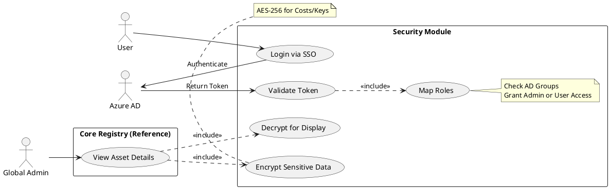

# User Story Specification

## Feature Name: User Access & Security

### Version History

| Version | Date       | Author | Description of Change |
| :------ | :--------- | :----- | :-------------------- |
| 1.0     | 02/08/2026 | Team   | Initial Draft         |

---

## 1. Overview of the Feature

### 1.1 Summary Feature
Security is paramount for an IT Asset Management system that houses financial data and PII. This feature governs how users access the system, enforcing strict Identity Management via Azure Active Directory (Entra ID). It ensures that only authorized personnel can access sensitive data and that all communications and storage are verifyingly secure.

### 1.2 Scope
- **SSO Authentication**: Exclusive reliance on Azure AD for login (No local passwords).
- **Role Mapping**: Automatic assignment of "Global Admin" privileges based on IDP groups (simplified for Phase 1).
- **Data Encryption**: Protection of sensitive financial and licensing data at rest and in transit.

### 1.3 Out of scope/Limitations
- **External Users**: Guest access or non-organizational accounts are strictly prohibited.
- **Local User Management**: No functionality to create users or reset passwords within the application itself.

### 1.4 Business Context
To comply with corporate security policies (ISO 27001), the application must not manage its own credentials. Leveraging Azure AD reduces the attack surface and ensures instant revocation of access when employees leave.

### 1.5 Assumptions and Dependencies
- **Azure Tenant**: An active Azure AD tenant exists.
- **App Registration**: The application is registered in Azure AD with appropriate Client ID/Secret.

---

## 2. Functionality: Security & Access

### 2.1 User Story 1 - US-2.1 (SSO Integration)

**2.1.1 Overview of the requirement**
Mapped to **REQ-SEC-2.1**. The system must authenticate users exclusively via Azure AD to ensure centralized identity management.

**2.1.1 Goal**
Eliminate local credential storage and enforce corporate security policies (MFA, Conditional Access) managed by Azure AD.

**2.1.2 User Story**
- **As a** User,
- **I want to** log in using my existing corporate Microsoft account,
- **So that** I don't have to remember a separate password and my access is secured by MFA.

**2.1.3 Acceptance Criteria (Gherkin Format)**
- **Scenario: Successful Login**
  - **Given** I am an unauthenticated user on the login page
  - **When** I click "Login with Microsoft"
  - **Then** I am redirected to the Azure AD login
  - **And** upon successful auth, I am returned to the App Dashboard.

- **Scenario: Access Denied for External Users**
  - **Given** I try to log in with a personal Outlook address (not in the tenant)
  - **When** Azure AD authenticates me
  - **Then** the application rejects the token
  - **And** shows an "Unauthorized: Internal Use Only" error.

**2.1.5 Validations/Business Rules**
- **Token Validation**: The backend must validate the JWT signature, issuer, and audience.
- **Session Timeout**: Sessions must align with Azure AD token lifetime (typically 1 hour).

**2.1.6 UI/UX requirements**
- Login page should be minimal, featuring a prominent "Sign in with Microsoft" button.

**2.1.7 Non-functional requirements**
- **Security**: OAuth 2.0 / OIDC Authorization Code Flow with PKCE must be used.

**2.1.8 Dependencies**
- Azure AD App Registration configured with Redirect URIs.

---

### 2.2 User Story 2 - US-2.2 (Role Mapping)

**2.2.1 Overview of the requirement**
Mapped to **REQ-SEC-2.2**. Access levels should be determined by the user's groups in Azure AD.

**2.2.1 Goal**
Automate permission assignment. If a user is added to the "IT Admins" group in Azure, they should automatically get Admin access in the app.

**2.2.2 User Story**
- **As a** Global Admin,
- **I want** the system to automatically recognize my administrative privileges based on my AD group membership,
- **So that** I don't need to manually request access inside the app.

**2.2.3 Acceptance Criteria (Gherkin Format)**
- **Scenario: Admin Identification**
  - **Given** my user account is in the "ITAM_Global_Admins" group in Azure AD
  - **When** I log in
  - **Then** I see the "Admin Dashboard" and "Settings" menu items.

- **Scenario: Standard User Identification**
  - **Given** I am not in any Admin group
  - **When** I log in
  - **Then** I only see the "My Assets" employee view.

**2.2.5 Validations/Business Rules**
- **Default Deny**: If a user is in NO relevant groups, they get "Read Only" or "No Access" based on policy. (For Phase 1: Global Admin gets root, others get Employee View).

**2.2.6 UI/UX requirements**
- None specific (backend logic).

**2.2.7 Non-functional requirements**
- **Performance**: Role evaluation must happen during the login handshake (< 500ms).

**2.2.8 Dependencies**
- **NFR-SEC-02**: Strict role separation logic.

---

### 2.3 User Story 3 - US-2.3 (Data Encryption)

**2.3.1 Overview of the requirement**
Mapped to **REQ-SEC-2.3**. Sensitive fields (Cost, License Keys) must be unreadable if the database is compromised.

**2.3.1 Goal**
Protect financial and proprietary data from unauthorized DB dumps or internal threats.

**2.3.2 User Story**
- **As a** Security Officer,
- **I want** financial costs and software keys to be encrypted in the database,
- **So that** raw database access does not reveal sensitive business data.

**2.3.3 Acceptance Criteria (Gherkin Format)**
- **Scenario: Database Inspection**
  - **Given** a direct query is run against the `Assets` table
  - **When** I view the `PurchaseCost` or `LicenseKey` columns
  - **Then** the values should appear as random ciphertext (e.g., `AES256...`).

- **Scenario: App Decryption**
  - **Given** I am a logged-in Admin viewing the asset details
  - **When** the page loads
  - **Then** the system decrypts and displays the correct values (e.g., "$1,200.00").

**2.3.5 Validations/Business Rules**
- Key Management: Encryption keys must be stored in a secure vault (e.g., Azure Key Vault), not in the source code.

**2.3.6 UI/UX requirements**
- Sensitive fields could be masked by default (e.g., `****`) with a "Click to Reveal" eye icon.

**2.3.7 Non-functional requirements**
- **Security Check**: TLS 1.2+ mandatory for all transport.

**2.3.8 Dependencies**
- Encryption library / Key Vault infrastructure.

---

## 3. Integrated Use Case Diagram

