# User Story Specification

## Epic 3: IT Operations & Hardware Maintenance

### Version History

| Version | Date       | Author | Description of Change                                                                              |
| :------ | :--------- | :----- | :------------------------------------------------------------------------------------------------- |
| 1.0     | 02/08/2026 | Team   | Initial Draft                                                                                      |
| 2.0     | 02/25/2026 | Team   | Overhauled to include Employee Support Portal, Digital Acceptance, and Tabbed Maintenance Ledgers. |

---

## 1. Overview

### 1.1 Summary

Asset Tracking is the operational core of the system, moving beyond static registration to managing the dynamic "life" of an asset. This epic handles the physical movement, assignment, and repair tracking of corporate hardware. It includes assigning assets to users or locations, tracking their return, and logging every status change (e.g., from "Available" to "In Repair"). Furthermore, tracking the "Total Cost of Ownership" (TCO) includes repair costs, not just the purchase price.

### 1.2 Scope

- **Employee Support Portal**: Simplified UI for standard employees to view assigned equipment and submit "Report Issue" tickets.
- **Digital Acceptance**: Workflow to get user confirmation when they receive an asset.
- **Assignments & Returns Workflow**: Assignment/Return system to assign hardware or temporary loaners, updating the asset's global status automatically.
- **Maintenance Ledger (Tabbed View)**: Three-part data grid managing "Pending Review", "Active Repairs", and historical "Repair History".
- **Triage Review Sheet**: Slide-out panel for IT to assess user-reported damage alongside current book value and warranty status.
- **Initiate & Close Repair Modals**: Forms to dispatch an item to a vendor (RMA/Estimates) and resolve it upon return (Actual Final Cost) to update TCO.

### 1.3 Out of scope/Limitations

- **Self-Service Requests**: Employees requesting brand new assets is a future feature; currently, Admins initiate all assignments.
- **Predictive Maintenance**: AI predictions for hardware failures are out of scope.

### 1.4 Business Context

Knowing _what_ you own is step 1; knowing _where_ it is and _who_ has it is step 2. This feature prevents asset shrinkage (theft/loss) and optimizes utilization. Additionally, monitoring the reliability of assets and vendors ensures that if a specific model fails frequently, the organization can stop buying it.

### 1.5 Assumptions and Dependencies

- **Core Registry**: Assets must exist in the registry before they can be assigned.
- **Email System**: SMTP or Microsoft Graph API is configured for sending automated assignment emails.

---

## 2. Features & User Stories

### 2.1 Feature 1: Employee Support Portal & Digital Acceptance

**2.1.1 Overview**
A self-service view for employees to verify the assets assigned to them and report physical damages directly to the IT department.

#### 2.1.2 User Story: US-3.1.1 (View "My Assets")

- **As a** Standard Employee,
- **I want to** see a list of "My Assets" when I log in,
- **So that** I can verify the equipment assigned to me and check return dates.

**Acceptance Criteria (Gherkin)**

- **Scenario: View Assigned Assets**
  - **Given** I am logged in as "Jane Doe"
  - **When** I access the "My Assets" page
  - **Then** I see a read-only list of items where `Custodian == Me`.
  - **And** I cannot see assets assigned to other users.

**Tasks**

- [ ] Build a simplified, mobile-responsive "My Assets" UI grid.
- [ ] Implement backend endpoint filtering active assignments by the logged-in user's SSO token.

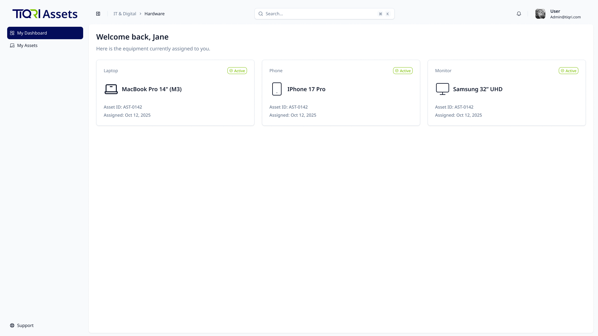

#### 2.1.4 User Story: US-3.1.2 (Digital Acceptance of Responsibility)

- **As a** Global Admin,
- **I want** the system to automatically notify the user via Email and Microsoft Teams when I assign an asset,
- **So that** they can click a link to confirm they have received it in good working order.

**Acceptance Criteria (Gherkin)**

- **Scenario: User Confirmation**
  - **Given** I am the user "User Y"
  - **When** I click "Confirm Receipt" in the automated email
  - **Then** the Asset Status updates from "Assigned (Pending)" to "Assigned (Confirmed)"
  - **And** the timestamp is logged in the Audit Trail.

**Tasks**

- [ ] Implement email generation template with a unique confirmation token link.
- [ ] Implement Microsoft Teams adaptive card notification with a confirmation action button.
- [ ] Create a public-facing (but token-secured) confirmation landing page.
- [ ] Write backend logic to update assignment status upon confirmation.

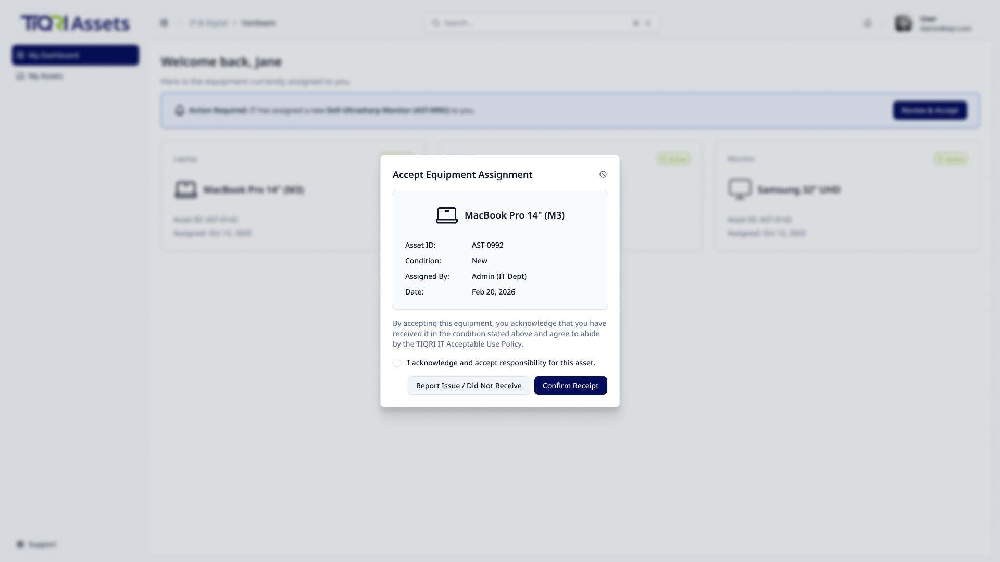

#### 2.2.4 User Story: US-3.2.3 (Asset Chain of Custody / History Tab)

- **As an** Auditor or Global Admin,
- **I want to** view the complete chronological history of a specific asset,
- **So that** I can see every assignment, return, and status change since it was purchased to establish a secure chain of custody.

**Acceptance Criteria (Gherkin)**

- **Scenario: Viewing Asset History**
  - **Given** an asset "Projector X" has moved between 3 rooms
  - **When** I click the "History" tab on the Asset Details slide-out panel
  - **Then** I see a vertical timeline of events with Timestamps, Old Value, New Value, and Actor (Who changed it).

**Tasks**

- [ ] Build a vertical timeline UI component for the Asset Details Slide-Out Panel.
- [ ] Write backend query to fetch and format asset-specific events from the global System Audit Log.
- [ ] Add a "Download History as CSV" button specifically for this asset's timeline.

#### 2.2.5 User Story: US-3.2.4 (Manual Lifecycle Status Management)

- **As a** Global Admin,
- **I want to** manually update the status of an asset to exception states (e.g., "Lost", "Stolen", "Found"),
- **So that** the inventory reflects reality when an asset goes missing outside of the standard repair or assignment workflows.

**Acceptance Criteria (Gherkin)**

- **Scenario: Marking an Asset as Lost**
  - **Given** an asset cannot be located during an audit
  - **When** I manually change its status to "Lost"
  - **Then** the system prompts for a mandatory "Reason/Note"
  - **And** the asset is immediately removed from the "Available" pool.
- **Scenario: Configuring Custom Statuses**
  - **Given** I am a Global Admin on the Settings page
  - **When** I add a new custom status called "Pending Audit"
  - **Then** the new status becomes available in the "Change Status" dropdown across the system
  - **And** the custom status behaves identically to built-in statuses in filters, reports, and the registry grid.

**Tasks**

- [ ] Build a "Change Status" quick-action modal requiring a mandatory justification note.
- [ ] Implement backend state-machine rules preventing a "Lost" asset from being assigned without first transitioning to "Found" or "Available".
- [ ] Build a "Custom Status Configuration" UI in Settings allowing admins to create, label, and manage additional lifecycle statuses.

---

### 2.2 Feature 2: Assignments & Returns Workflow

**2.2.1 Overview**
The core system for checking hardware in and out, linking a specific asset ID to a specific User or Room.

#### 2.2.2 User Story: US-3.2.1 (Asset Check-Out / Assignment)

- **As a** Global Admin,
- **I want to** assign an available asset to a user or a specific location (Building/Room),
- **So that** I know exactly who is responsible for the item.

**Acceptance Criteria (Gherkin)**

- **Scenario: Assign to User**
  - **Given** an asset "Laptop A" is in state "Available"
  - **When** I search for user "John Doe" and click "Assign"
  - **Then** the asset status changes to "Assigned"
  - **And** "John Doe" is recorded as the current custodian.
- **Scenario: Conflict Resolution**
  - **Given** "Laptop B" is already assigned to "Jane"
  - **When** I try to assign it to "Mike"
  - **Then** the system blocks the action and shows an error: "Asset is currently checked out to Jane. Please return it first.".
- **Scenario: Team Assignment Prevention**
  - **Given** I am assigning an asset
  - **When** I search for an assignment target
  - **Then** the system only allows assignment to individual Users or physical Locations
  - **And** generic "Team" or "Department" level assignments are blocked.

**Tasks**

- [ ] Build "Assign Asset" UI modal with searchable User/Location dropdowns.
- [ ] Implement backend validation to ensure only "Available" assets can be assigned.
- [ ] Add an optional "Expected Return Date" calendar picker to the assignment modal specifically for tracking temporary loaners.

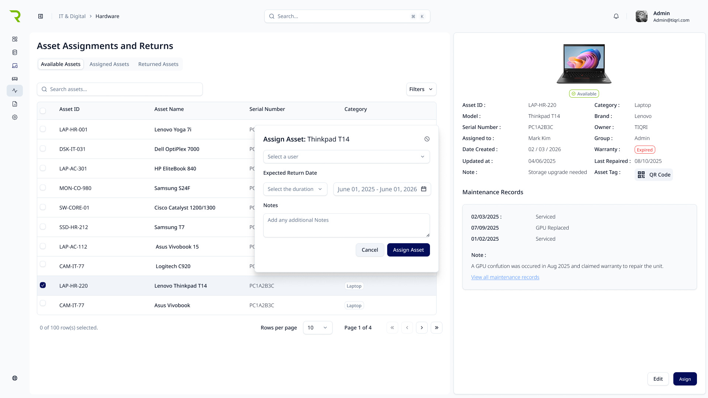
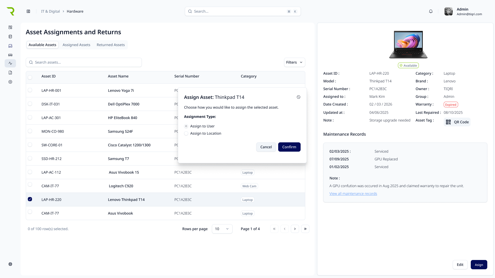

#### US- 3.2.2: (Request Asset Return)

- **As a** Global Admin,
- **I want to** notify a user to return an assigned asset,
- **So that** I can begin the offboarding or reassignment process.

**Acceptance Criteria (Gherkin)**

- **Scenario: Notify user for return**
  - **Given** an asset is currently in the "Assigned Assets" tab.
  - **When** I select the asset and click the "Request Return" button.
  - **Then** a notification is sent to the current custodian (e.g., Mark Kim).
  - **And** the asset status label updates to "Requested" in the asset list.

- **Tasks**
  - [ ] Frontend: Add the "Request Return" button to the Asset Details side panel for assigned assets.
  - [ ] Frontend: Implement the "Requested" status badge/label within the "Assigned Assets" table rows.
  - [ ] Backend: Create an endpoint to trigger a return notification (Email/System Alert) to the current custodian.
  - [ ] Backend: Update the asset status logic to transition the asset state to "Requested" upon button click.

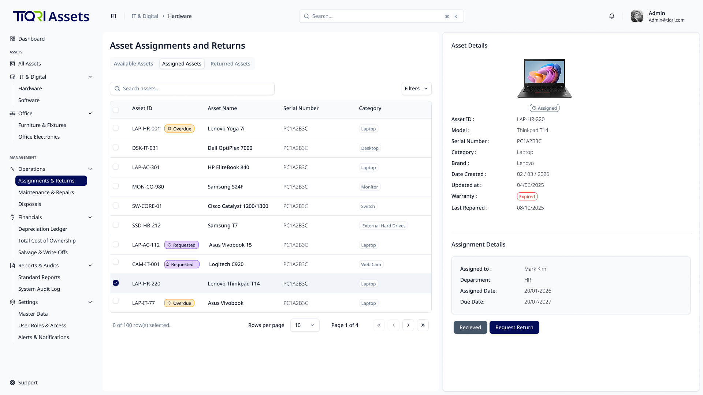

#### US-3.2.3: (Asset Check-In & Condition Review)

- **As a** Global Admin,
- **I want to** process the physical return of an asset and assess its condition,
- **So that** its status is accurately updated in the inventory for future use or disposal.

**Acceptance Criteria (Gherkin)**

- **Scenario 1: Move Asset to Review List**
  - **Given** an asset is currently assigned to a user.
  - **When** I click the "Received" button in the Asset Details pane.
  - **Then** the asset is moved from the "Assigned Assets" tab to the "Returned Assets" tab for final review.

- **Scenario 2: Verify Condition and Update Status**
  - **Given** an asset is in the "Returned Assets" list.
  - **When** I select the asset and a "Return Dialog" modal appears.
  - **And** I select a condition:

  - **If** "Good Working Condition", the status changes to "Available".

  - **If** "Working with Minor Issues" or "Needs Repair", the status changes to "In Repair".

  - **If** "Beyond Repair", the status changes to "Disposed".
  - **Then** the system clears the current custodian and logs the event in the historical ledger.

- **Tasks**
  - [ ] Frontend: Implement the "Received" button to trigger the transfer of an asset from the "Assigned Assets" list to the "Returned Assets" list.

  - [ ] Frontend: Build the "Return-Dialog" modal with mandatory condition radio buttons (Good Working Condition, Working with Minor Issues, Needs Repair, Beyond Repair).

  - [ ] Frontend: Add a "Condition Notes" text area within the modal for detailed admin feedback.

  - [ ] Backend: Write conditional logic to update asset status based on selection:
    - Good Working Condition $\rightarrow$ Available
    - Working with Minor Issues / Needs Repair $\rightarrow$ In Repair
    - Beyond Repair $\rightarrow$ Disposed.
  - [ ] Backend: Write logic to clear the current custodian field and record the return event, condition, and notes into the historical ledger.

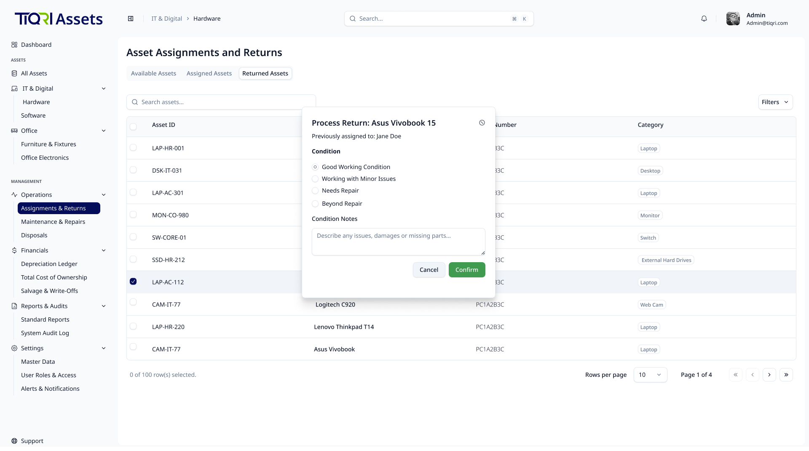

#### US-3.2.5: (Bulk Location Transfer)

- **As a** Global Admin,
- **I want to** bulk-update the location of multiple assets in a single action,
- **So that** I can efficiently reflect large physical moves (e.g., relocating 50 chairs from Room A to Room B) without editing each asset individually.

**Acceptance Criteria (Gherkin)**

- **Scenario: Bulk Location Update**
  - **Given** I have selected 50 assets in the main Asset Registry grid using the bulk-select checkboxes
  - **When** I click "Bulk Edit" and select a new Location from the dropdown
  - **Then** all 50 assets are updated to the new Location in a single database transaction
  - **And** the Audit Log records each individual asset's location change.

**Tasks**

- [ ] Build the "Bulk Edit" modal accessible from the main registry grid's bulk-action toolbar.
- [ ] Implement backend batch-update endpoint processing multiple asset IDs in a single transaction.
- [ ] Write Audit Log entries for each individual asset change within the batch.

---

### 2.3 Feature 3: Maintenance Ledger & Issue Triage

**2.3.1 Overview**
The administrative dashboard for managing broken hardware reports and triaging issues before committing company funds to a vendor repair.

#### 2.3.2 User Story: US-3.3.1 (Tabbed Maintenance Ledger)

- **As an** IT Operations Admin,
- **I want to** view a dedicated ledger with tabs for "Pending Review", "Active Repairs", and "Repair History",
- **So that** I can easily track the current status of all broken or out-for-repair hardware.

**Acceptance Criteria (Gherkin)**

- **Scenario: Navigating the Repair Pipeline**
  - **Given** I navigate to `Operations > Maintenance & Repairs`
  - **When** the page loads
  - **Then** I see a Data Table with 3 tabs.
  - **And** the "Pending Review" tab shows all tickets submitted by employees via the Support Portal.

**Tasks**

- [ ] Build the Tabbed Data Table React component.
- [ ] Implement API routes to fetch maintenance tickets filtered by their current lifecycle state.

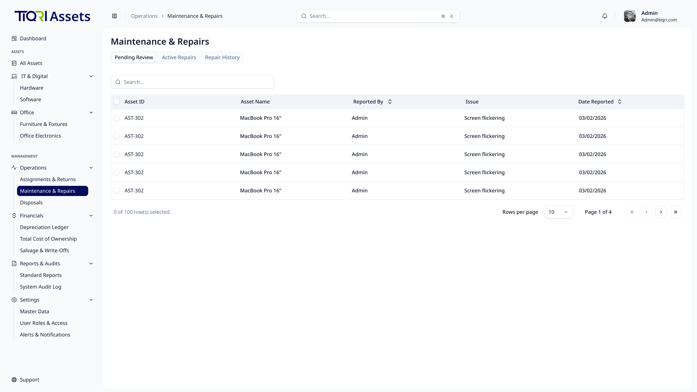

#### 2.3.3 User Story: US-3.3.2 (Triage Review Sheet)

- **As an** IT Operations Admin,
- **I want to** click a pending triage ticket to open a Right-Side Review Panel,
- **So that** I can assess the user's reported damage alongside the asset's current book value and warranty status before making a decision.

**Acceptance Criteria (Gherkin)**

- **Scenario: Assessing an Issue**
  - **Given** I am on the "Pending Review" tab
  - **When** I click the row for a broken monitor
  - **Then** a panel slides in showing the user's complaint ("Screen flickering").
  - **And** the panel displays the Warranty Status (e.g. Expired) and the Book Value.
  - **And** the footer contains actions to "Resolve Internally" or "Log Repair Ticket".

**Tasks**

- [ ] Build the Triage Review Slide-Out Sheet component.
- [ ] Aggregate financial and warranty data into the API response for the triage view.

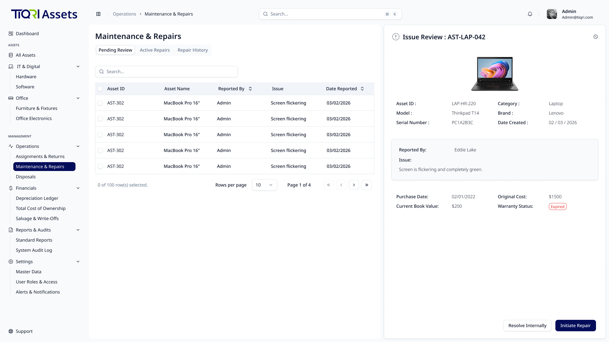

---

### 2.4 Feature 4: Vendor Repair Workflow

**2.4.1 Overview**
The financial and logistical workflow for dispatching broken items to third-party vendors and resolving the tickets upon return.

#### 2.4.2 User Story: US-3.4.1 (Initiate Repair Modal)

- **As an** IT Operations Admin,
- **I want to** log a "Maintenance Event" and dispatch an item to a vendor,
- **So that** I have a history of all repairs performed on an asset and can track its expected return.

**Acceptance Criteria (Gherkin)**

- **Scenario: Dispatching to Vendor**
  - **Given** I am in the Triage Review Sheet
  - **When** I click "Log Repair Ticket"
  - **Then** a modal opens requiring me to select the Vendor, input the RMA Ticket Number, Estimated Cost, and Expected Return Date.
  - **And** upon confirm, the asset's status changes to `In Repair` and moves to the "Active Repairs" tab.

**Tasks**

- [ ] Build the "Initiate Repair" modal form.
- [ ] Write backend state-machine logic to update the asset's global status to `In Repair` and un-assign it from the employee.

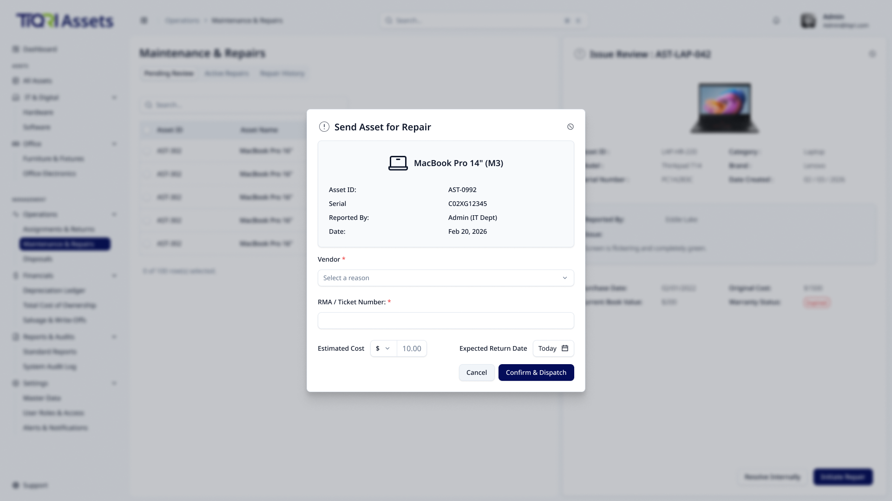

#### 2.4.3 User Story: US-3.4.2 (Close Repair Modal & TCO Update)

- **As a** Global Admin,
- **I want to** close a repair ticket and log the actual final cost,
- **So that** the Asset's "Total Maintenance Cost" field updates and it is routed to its next status.

**Acceptance Criteria (Gherkin)**

- **Scenario: Completing a Repair**
  - **Given** a laptop returns from repair
  - **When** I click "Complete Repair" on the Active tab and enter the Service Date and Cost ($200)
  - **Then** the Asset's "Total Maintenance Cost" field updates
  - **And** the status is manually changed back to "Available".
- **Scenario: Unfixable Return**
  - **When** resolving the repair, I select the post-repair action "Flag for Disposal"
  - **Then** the item is routed directly to the "Pending Disposals" queue.

**Tasks**

- [ ] Build the "Close Repair" modal form requiring Final Cost input.
- [ ] Implement backend aggregation logic to append the new cost to the asset's Total Cost of Ownership (TCO).

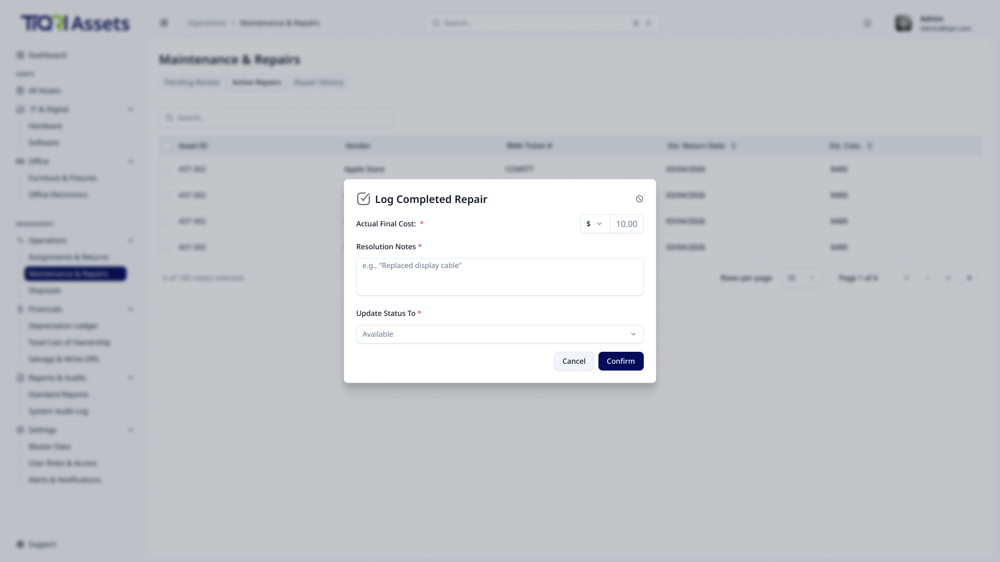

---

## 3. Integrated Use Case Diagram

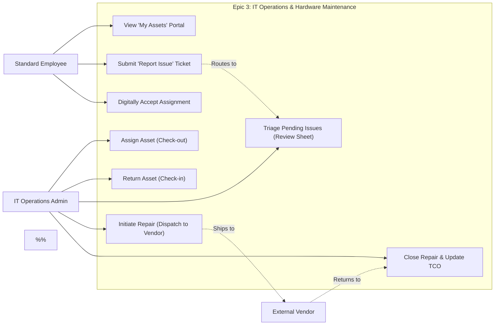

---

[< Back to Requirements](../README.md)
