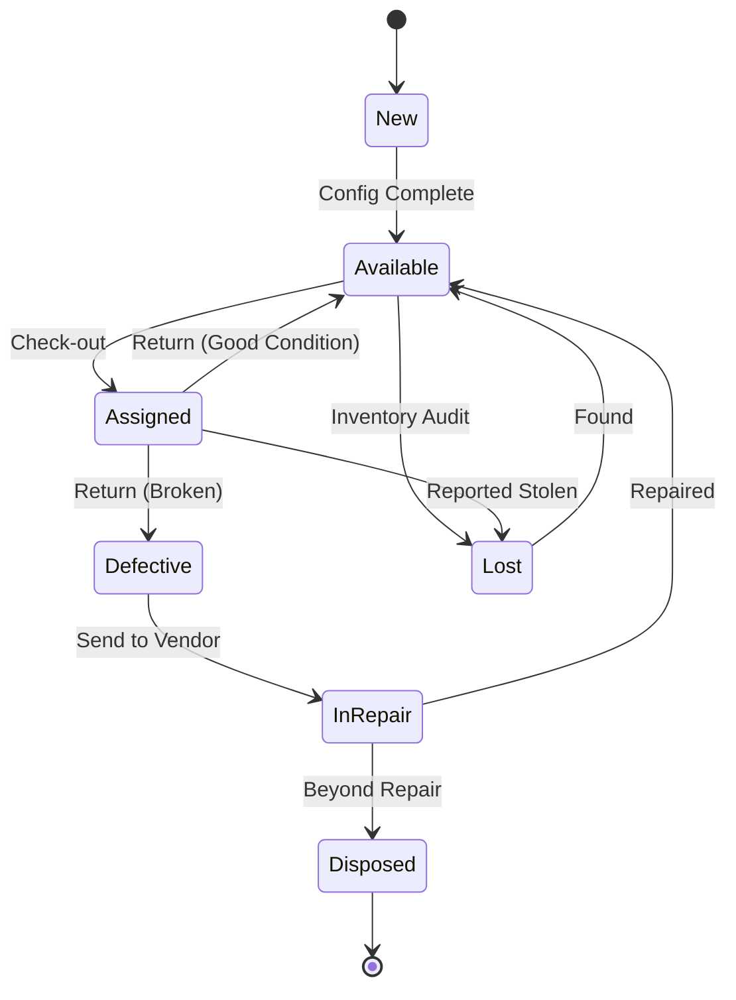
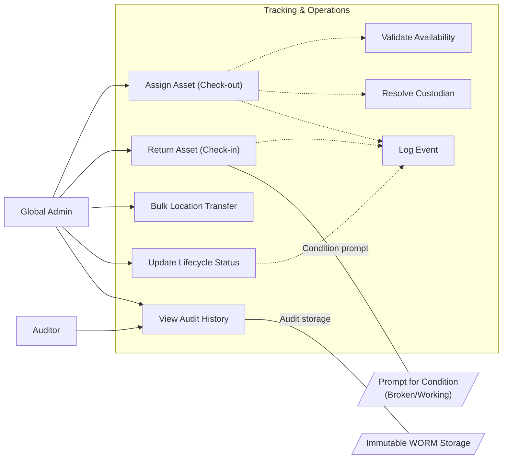

# User Story Specification

## Epic: Tracking & Operations

### Version History

| Version | Date       | Author | Description of Change |
| :------ | :--------- | :----- | :-------------------- |
| 1.0     | 02/08/2026 | Team   | Initial Draft         |

---

## 1. Overview

### 1.1 Summary

Asset Tracking is the operational core of the system. It moves beyond static registration to managing the dynamic "life" of an asset. This feature handles the assignment of assets to users or locations, tracks their return, logs every status change (e.g., from "Available" to "In Repair"), and maintains an immutable audit trail for compliance.

### 1.2 Scope

- **Assignment/Return**: Assigning assets to specific Employees or Physical Locations.
- **Return Management**: Process for receiving assets back into inventory.
- **Audit Logging**: Automatic, chronological recording of all custody changes.
- **Status Lifecycle**: Managing states like "In Use", "Repair", "Lost", "Disposed".

### 1.3 Out of scope/Limitations

- **Self-Service Requests**: Employees requesting assets is a future feature; currently, Admins initiate all assignments.
- **RFID Tracking**: Real-time location services (RTLS) are not in scope; location updates are manual/scan-based.

### 1.4 Business Context

Knowing _what_ you own is step 1; knowing _where_ it is and _who_ has it is step 2. This feature prevents asset shrinkage (theft/loss) and optimizes utilization by ensuring unused assets are identified and re-circulated.

### 1.5 Assumptions and Dependencies

- **User Data**: Employee details are available via Azure AD sync (or manual placeholder).
- **Core Registry**: Assets must exist in the registry (US-1.1) before they can be assigned.

---

## 2. Functionality: Tracking Operations

### 2.1 User Story 1 - US-3.1 (Asset Assignment)

**2.1.1 Overview of the requirement**
Mapped to **REQ-OPS-3.1**. Assets act as tools for employees. The system must link a specific asset ID to a specific User or Room.

**2.1.1 Goal**
Accurately record the custodian or location of an asset to enforce accountability.

**2.1.2 User Story**

- **As a** Global Admin,
- **I want to** assign an available asset to a user or a specific location (Building/Room),
- **So that** I know exactly who is responsible for the item.

**2.1.3 Acceptance Criteria (Gherkin Format)**

- **Scenario: Assign to User**
  - **Given** an asset "Laptop A" is in state "Available"
  - **When** I search for user "John Doe" and click "Assign"
  - **Then** the asset status changes to "Assigned"
  - **And** "John Doe" is recorded as the current custodian
  - **And** the "Assigned Date" is set to today.

- **Scenario: Conflict Resolution**
  - **Given** "Laptop B" is already assigned to "Jane"
  - **When** I try to assign it to "Mike"
  - **Then** the system blocks the action
  - **And** shows an error: "Asset is currently checked out to Jane. Please return it first."

**2.1.5 Validations/Business Rules**

- **Status Check**: Only assets with status "Available" can be assigned.
- **Custodian**: Must be a valid User from the directory or a valid Location entity.
- **Mutually Exclusive Assignment**: An asset can be assigned to a **User** OR a **Location**, but never both simultaneously.
- **Category Constraints**:
  - **IT Devices** (Laptops, Mobiles): Can be assigned to User OR Location.
  - **Furniture/Facilities**: Defaults to **Location** (User assignment is optional/rare).
- **Location Capacity**: If assigning to a Location (e.g., "Server Room B"), the system does not enforce a limit on the number of assets.

**2.1.6 UI/UX requirements**

- **User Lookup**: fast search for employees by Name or Email.
- **Quick Action**: "Assign" button should be prominent on the Asset Details page.

**2.1.7 Non-functional requirements**

- **Data Consistency**: Transaction must be atomic; status update and history log must happen together.

**2.1.8 Dependencies**

- **REQ-REG-1.1**: Asset exists.

---

### 2.2 User Story 2 - US-3.2 (Asset Return)

**2.2.1 Overview of the requirement**
Mapped to **REQ-OPS-3.2**. When an employee leaves or equipment is swapped, assets must be returned to the pool.

**2.2.1 Goal**
Efficiently process the return of assets, update their status, and prepare them for re-assignment or repair.

**2.2.2 User Story**

- **As a** Global Admin,
- **I want to** check-in an asset that was previously assigned,
- **So that** it becomes available for others to use.

**2.2.3 Acceptance Criteria (Gherkin Format)**

- **Scenario: Successful Return**
  - **Given** "Laptop A" is assigned to "John"
  - **When** I click "Return Asset"
  - **Then** the custodian is cleared
  - **And** the status changes to "Available" (default) or I can select "Defective".

- **Scenario: Force Return (Employee Departed)**
  - **Given** "Laptop B" is assigned to "Ex-Employee" who has left the company
  - **When** I use the "Force Check-in" override
  - **Then** the system logs a specific warning: "Forced return by Admin"
  - **And** I can immediately mark the status as "Missing" or "Available".

**2.2.5 Validations/Business Rules**

- **Condition Check**: The system validates that the asset is indeed currently assigned.

**2.2.6 UI/UX requirements**

- **Condition Prompt**: Upon return, prompt the Admin to verify condition: "Is the asset working?" (Yes -> Available, No -> In Repair).

**2.2.7 Non-functional requirements**

- None.

**2.2.8 Dependencies**

- None.

---

### 2.3 User Story 3 - US-3.3 (Audit Log / History)

**2.3.1 Overview of the requirement**
Mapped to **REQ-OPS-3.3**. Compliance requires a "Chain of Custody". We need to know who had the asset at any point in time.

**2.3.1 Goal**
Maintain an unalterable history of every event in an asset's life.

**2.3.2 User Story**

- **As an** Auditor / Global Admin,
- **I want to** view the complete chronological history of an asset,
- **So that** I can see every assignment, return, and status change since it was purchased.

**2.3.3 Acceptance Criteria (Gherkin Format)**

- **Scenario: Viewing History**
  - **Given** an asset "Projector X" has moved between 3 rooms
  - **When** I click the "History" tab
  - **Then** I see a list of 3 events with Timestamps, Old Value, New Value, and Actor (Who changed it).

**2.3.5 Validations/Business Rules**

- **Immutability**: History records cannot be edited or deleted, even by Global Admins (NFR-SEC-05).

**2.3.6 UI/UX requirements**

- **Timeline View**: Visual representation (vertical timeline) is preferred over a raw grid.
- **Log Filters**: The History tab must allow filtering by "Event Type" (e.g., Show only 'Assignments', hide 'Edits').
- **Export**: Provide a "Download History as CSV" button for auditors.

**2.3.7 Non-functional requirements**

- **Storage**: History logs must be stored in WORM (Write Once Read Many) compliant tables or logical equivalents.

**2.3.8 Dependencies**

- None.

---

### 2.4 User Story 4 - US-3.4 (Lifecycle Status Management /Asset status)

**2.4.1 Overview of the requirement**
Mapped to **REQ-OPS-3.4**. Assets are not just "Used" or "Unused". They break, get lost, or are sold.

**2.4.1 Goal**
Track the precise operational state of assets to support maintenance and financial write-offs.

**2.4.2 User Story**

- **As a** Global Admin,
- **I want to** manually update the status of an asset (e.g., to "In Repair" or "Lost"),
- **So that** the inventory reflects reality and we don't try to assign broken equipment.

**2.4.3 Acceptance Criteria (Gherkin Format)**

- **Scenario: Marking as Lost**
  - **Given** an asset needs to be written off
  - **When** I change status to "Lost"
  - **Then** the system prompts for a "Reason/Note"
  - **And** the asset is removed from the "Available" pool.

**2.4.4 Lifecycle State Diagram**

**2.4.5 Validations/Business Rules**

- **Transition Logic**: Cannot move from "Disposed" back to "Available" without a specific 'Re-activation' workflow.
- **Soft Delete**: Deleted assets are marked "Archived", never physically removed from DB.

**2.4.6 UI/UX requirements**

- Status badges should be color-coded (Green for Available, Red for Defective/Lost, Blue for Assigned).

**2.4.7 Non-functional requirements**

- None.

**2.4.8 Dependencies**

- Master list of Statuses (Configurable).

---

### 2.5 User Story 5 - US-3.5 (Bulk Location Transfer)

**2.5.1 Overview of the requirement**
Mapped to **REQ-OPS-3.5**. Moving physical infrastructure happens in batches. Moving 50 chairs from Room A to Room B one by one is not feasible.

**2.5.1 Goal**
Allow Admins to update the location of multiple assets in a single transaction.

**2.5.2 User Story**

- **As a** Global Admin,
- **I want to** select multiple assets and update their Location in one step,
- **So that** I can efficiently manage office moves or bulk deployments.

**2.5.3 Acceptance Criteria (Gherkin Format)**

- **Scenario: Bulk Move of Furniture**
  - **Given** I have filtered the Asset List to show "Office Chairs" in "Room 101"
  - **When** I select 20 records and click "Bulk Edit" > "Change Location"
  - **And** I select "Room 102"
  - **Then** all 20 assets are updated to "Room 102"
  - **And** 20 individual history log entries are created.

**2.5.5 Validations/Business Rules**

- **Validation**: If any selected asset is currently "Assigned to a User", the system must warn the Admin: "Asset [ID] is assigned to [User]. Re-assigning to Location will clear the User."

**2.5.6 UI/UX requirements**

- **Multi-Select**: Grid must support checkboxes and "Select All".

**2.5.7 Non-functional requirements**

- **Performance**: Bulk updates of up to 100 items should complete within 3 seconds.

**2.5.8 Dependencies**

- None.

---

## 3. Integrated Use Case Diagram

[< Back to Specifications](./README.md)
