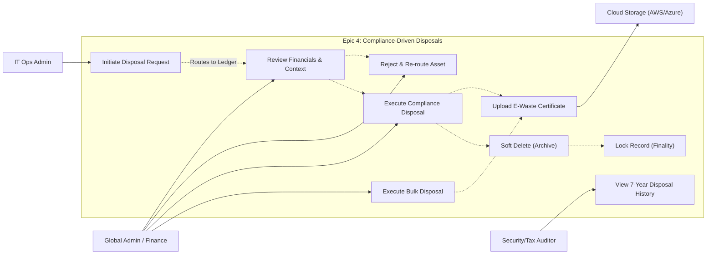

# User Story Specification

## Epic 4: Compliance-Driven Disposals

### Version History

| Version | Date       | Author | Description of Change                                                                                            |
| :------ | :--------- | :----- | :--------------------------------------------------------------------------------------------------------------- |
| 1.0     | 02/08/2026 | Team   | Initial Draft                                                                                                    |
| 2.0     | 02/25/2026 | Team   | Overhauled to include multi-step executive approvals, E-waste certificate uploads, and Soft-Delete architecture. |

---

## 1. Overview

### 1.1 Summary

Disposing of corporate IT assets is a high-risk operational phase. Epic 4 governs the secure, multi-step workflow for permanently retiring hardware. It enforces governance to prevent fraud ("I threw it away" -> "I sold it on eBay"), requiring physical security checks, executive financial review, and the upload of legal destruction certificates before an item is permanently archived.

### 1.2 Scope

- **Disposals Ledger**: Dedicated queue separating pending requests from the permanent disposal history.
- **Disposal Request Review Sheet**: Executive-facing panel detailing technical justification, purchase date, and financial impact for authorization.
- **Reject Disposal Workflow**: Modal requiring a mandatory rejection reason and a status re-routing dropdown.
- **Compliance Execution Modal**: Final approval screen requiring physical security checkboxes, exact Asset ID text confirmation, and disposal method selection.
- **E-Waste Certificate Upload**: Drag-and-drop file upload zone securely storing PDF destruction receipts.
- **Bulk Disposal Processing**: Adapted workflow allowing admins to permanently retire a selected batch of identical assets using a single shared receipt.
- **Soft Delete Architecture**: Backend logic ensuring disposed assets are never dropped from the database, but permanently marked as `Disposed` and hidden from the active registry.

### 1.3 Out of scope/Limitations

- **Automated Vendor Dispatch**: The system will record E-Waste certificates, but it will not automatically dispatch a truck from a recycling vendor to pick up the hardware.
- **Re-activation Workflow**: Once "Disposed", an asset cannot be reactivated without a complex Super Admin database override.

### 1.4 Business Context

Improper disposal of IT assets can lead to massive data breaches (if hard drives aren't wiped) and environmental fines (WEEE compliance). By enforcing a "Hard Stop" modal with mandatory file uploads and multi-person approvals, TIQRI guarantees a pristine audit trail for tax and security auditors. Disposal records must be kept for 7 years to satisfy tax law.

### 1.5 Assumptions and Dependencies

- **Cloud Storage**: AWS S3 or Azure Blob Storage is configured and accessible by the backend for storing PDF certificates.
- **RBAC**: Only users mapped to Global Admin or specific Finance/Ops roles can approve disposals.

---

## 2. Features & User Stories

### 2.1 Feature 1: Disposal Requests & Administrative Review

**2.1.1 Overview**
The intake and review pipeline that separates the person requesting the disposal from the person authorizing the financial write-off.

#### 2.1.2 User Story: US-4.1.1 (Initiate Disposal & The Ledger Queue)

- **As an** IT Ops Admin,
- **I want to** request disposal for an asset and select a reason (e.g., "E-Waste" or "Sold"),
- **So that** it is removed from active circulation and routed to the Pending Disposal queue for executive review.

**Acceptance Criteria (Gherkin)**

- **Scenario: Flagging an Asset for Disposal**
  - **Given** an asset is marked as "Defective"
  - **When** I click "Initiate Disposal" and select Reason = "E-Waste"
  - **Then** the status changes to "Pending Disposal"
  - **And** an approval task is generated and appears on the Admin Dashboard.
  - **And** the item is removed from the "Available" inventory pool.

**Tasks**

- [ ] Build the Disposals Ledger UI (Tabbed data table for "Pending Approval" and "Disposal History").
- [ ] Implement backend logic to change status to `Pending Disposal` and lock the asset from being assigned.
- [ ] Build the read-only "Disposal History" tab within the ledger to display finalized records alongside their selected disposal method and direct download links to their E-Waste certificates.

#### 2.1.3 User Story: US-4.1.2 (Disposal Request Review Sheet)

- **As a** Global Admin or Finance Manager,
- **I want to** click a pending disposal request to view a slide-out panel detailing its financial and technical history,
- **So that** I have the necessary context (e.g., Current Book Value, Technical Diagnosis) to authorize the write-off.

**Acceptance Criteria (Gherkin)**

- **Scenario: Reviewing the Request Context**
  - **Given** I am on the "Pending Approval" tab of the Disposals Ledger
  - **When** I click the row for a requested laptop
  - **Then** a Right-Side Review Panel slides out.
  - **And** the panel displays the Original Purchase Cost, the Depreciated Book Value, and the IT technician's justification notes.
  - **And** the footer displays actions for "Reject Request" and "Approve & Dispose".

**Tasks**

- [ ] Build the Disposal Request Review Sheet component.
- [ ] Write API aggregator to pull Epic 5 financial data (Current Book Value) into the review panel payload.

---

### 2.2 Feature 2: Secure Disposal Execution & Compliance

**2.2.1 Overview**
The strict, destructive action workflows (both Approval and Rejection) that finalize the asset's lifecycle.

#### 2.2.2 User Story: US-4.2.1 (The Hard Stop Compliance Modal & Upload)

- **As a** Global Admin,
- **I want to** upload a Certificate of Destruction and confirm physical security checks,
- **So that** the organization has legal proof of the disposal for environmental and tax audits.

**Acceptance Criteria (Gherkin)**

- **Scenario: Executing the Disposal**
  - **Given** I click "Approve & Dispose" on the Review Sheet
  - **When** the "Hard Stop" modal appears
  - **Then** I must manually check boxes for "Data Wiped" and "Tags Removed".
  - **And** I must drag-and-drop a PDF E-Waste certificate into the upload zone.
  - **And** the final "Confirm Disposal" button remains disabled until I type the exact Asset ID (e.g., `AST-LAP-089`) into a text input.

- **Scenario: Selecting the Disposal Method**
  - **Given** I am confirming a disposal in the Hard Stop modal
  - **When** I fill out the compliance form
  - **Then** I am required to select a specific Disposal Method from a dropdown (e.g., "E-Waste Recycling", "Sold", "Donated") before the final button activates.

**Tasks**

- [ ] Build the Compliance Execution Modal with exact text-match validation logic.
- [ ] Integrate a Drag-and-Drop file upload UI.
- [ ] Connect the frontend upload zone to the backend cloud storage bucket (AWS S3/Azure Blob).
- [ ] Add a mandatory "Disposal Method" dropdown to the Compliance Execution Modal and bind it to the frontend form state.
- [ ] Write backend validation to reject the final disposal `POST` request if the Disposal Method, exact Asset ID text confirmation, or physical security checkbox boolean is missing.

 - Desktop.png>)

#### 2.2.3 User Story: US-4.2.2 (Reject Disposal Workflow)

- **As a** Global Admin,
- **I want to** reject a disposal request, provide a mandatory reason, and re-route the asset,
- **So that** assets that are still under warranty or hold value are put back into circulation.

**Acceptance Criteria (Gherkin)**

- **Scenario: Rejecting a Disposal Request**
  - **Given** I click "Reject Request" on the Review Sheet
  - **When** the Rejection Modal opens
  - **Then** I am forced to type a reason into a text area (e.g., "Device still under warranty").
  - **And** I must select a new status from a dropdown (e.g., "In Repair").
  - **And** upon confirm, the original requester receives an in-app notification with my reason.

**Tasks**

- [ ] Build the Rejection Modal component.
- [ ] Write backend logic to revert the `Pending Disposal` status to the newly selected status.
- [ ] Hook into Epic 5's notification engine to alert the original IT Ops admin.

## 

### 2.3 Feature 3: Bulk Operations & Architectural Safeguards

**2.3.1 Overview**
The efficiency tools for retiring large batches of equipment and the underlying database architecture that preserves historical integrity.

#### 2.3.2 User Story: US-4.3.1 (Bulk Disposal Processing)

- **As a** Global Admin,
- **I want to** request disposal for a batch of assets and approve them using a single shared receipt,
- **So that** I don't have to upload the exact same E-Waste PDF 50 times when retiring a cart of old monitors.

**Acceptance Criteria (Gherkin)**

- **Scenario: Batch Retirement**
  - **Given** I have selected 30 monitors in the main Asset Grid and clicked "Bulk Dispose"
  - **When** the Bulk Compliance Modal opens
  - **Then** I upload one single E-Waste PDF.
  - **And** I type "DISPOSE 30 ASSETS" to unlock the confirmation button.
  - **And** upon execution, all 30 assets are marked as Disposed and linked to the same uploaded receipt URL.

**Tasks**

- [ ] Adapt the Compliance Modal to accept an array of selected Asset IDs.
- [ ] Write backend batch processing logic to update multiple rows in a single database transaction.
- [ ] Optimize the database to store a single file URL reference across multiple asset records.

#### 2.3.4 User Story: US-4.3.2 (Soft Delete Architecture & Finality)

- **As a** Security Auditor,
- **I want** disposed assets to be retained in the database for 7 years,
- **So that** they are hidden from the active registry but available for historical tax audits.

**Acceptance Criteria (Gherkin)**

- **Scenario: Database Preservation (Soft Delete)**
  - **Given** an asset has successfully completed the Disposal workflow
  - **When** an Admin searches for it in the main Asset Registry Grid
  - **Then** it does not appear (filtered out by default).
  - **And** if an Auditor queries the database or views the "Disposal History" tab, the complete record, including the link to its destruction certificate, remains perfectly intact.
- **Scenario: Reactivation Prevention**
  - **When** a standard Global Admin attempts to edit a Disposed asset
  - **Then** all fields are locked and status changes are blocked.

**Tasks**

- [ ] Implement `IsArchived` or `Status = Disposed` global filters across all standard `GET` API endpoints.
- [ ] Write backend permission logic to strictly block `PUT`/`PATCH` requests for any asset carrying the `Disposed` status.
      

---

## 3. Integrated Use Case Diagram

---

[< Back to Requirements](../README.md)
