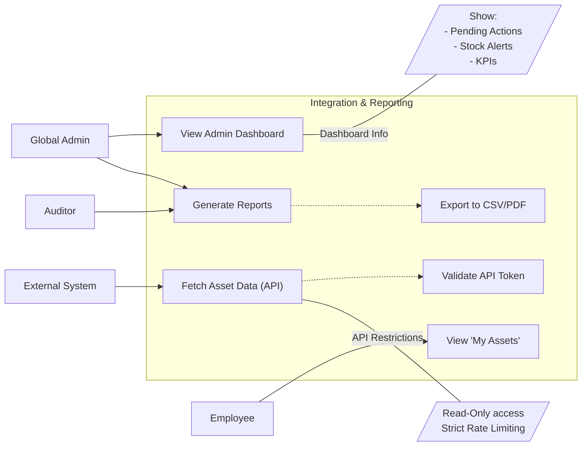

# User Story Specification

## Feature Name: Integration & Reporting

### Version History

| Version | Date       | Author | Description of Change |
| :------ | :--------- | :----- | :-------------------- |
| 1.0     | 02/08/2026 | Team   | Initial Draft         |

---

## 1. Overview of the Feature

### 1.1 Summary Feature
Data is useless if it's trapped. This feature unlocks the value of the ITAM system by providing visibility through Dashboards and Reports, and enabling connectivity via APIs. It serves stakeholders from the Global Admin (Operational Dashboards) to Auditors (Compliance Reports) and other systems (HR/Finance Integrations).

### 1.2 Scope
- **Admin Dashboard**: Real-time snapshot of system health and pending tasks.
- **External API**: RESTful endpoints for other systems to consume asset data.
- **Reporting Engine**: Generation of standard compliance and inventory reports (PDF/CSV).
- **Employee Portal**: A self-service view for standard users to see their assigned assets.

### 1.3 Out of scope/Limitations
- **Bi-Directional Sync**: The API is primarily Read-Only for external systems; full bi-directional sync logic is a future phase.
- **Custom Report Builder**: Users are limited to pre-defined standard reports; ad-hoc SQL queries are out of scope.

### 1.4 Business Context
Executives need high-level summaries, and other departments (like Finance) need raw data. Manual exports are error-prone and slow. This feature automates the flow of information.

### 1.5 Assumptions and Dependencies
- **Data Population**: Reports are only as good as the data in the registry.
- **API Security**: Consumers must have valid API Keys/Tokens.

---

## 2. Functionality: Reporting & Integration

### 2.1 User Story 1 - US-4.1 (Admin Dashboard)

**2.1.1 Overview of the requirement**
Mapped to **REQ-REP-4.1**. When an Admin logs in, they shouldn't have to dig for problems. The problems should be presented to them.

**2.1.1 Goal**
Provide immediate situational awareness of critical issues like "Stockouts" or "Overdue Returns".

**2.1.2 User Story**
- **As a** Global Admin,
- **I want to** see a dashboard upon login with key metrics and pending actions,
- **So that** I know exactly what needs my attention today (e.g., approving disposals or chasing returns).

**2.1.3 Acceptance Criteria (Gherkin Format)**
- **Scenario: Dashboard Load**
  - **Given** I am a Global Admin
  - **When** I log in to the system
  - **Then** the landing page displays:
    - **Total Assets** count.
    - **Pending Approvals** (e.g., 3 Disposal Requests).
    - **Overdue Returns** list.
    - **Low Stock Alerts** for Consumables.

**2.1.5 Validations/Business Rules**
- **Refresh Rate**: Dashboard widgets should refresh on load (Real-time or near real-time).

**2.1.6 UI/UX requirements**
- **Widget Layout**: Clean, grid-based layout. "Clicking" a widget (e.g., "5 Pending Approvals") should navigate to the detailed list view for that topic.

**2.1.7 Non-functional requirements**
- **Performance**: Dashboard must load in **under 2 seconds** (it's the first impression).

**2.1.8 Dependencies**
- Query optimization on the backend.

---

### 2.2 User Story 2 - US-4.2 (External API)

**2.2.1 Overview of the requirement**
Mapped to **REQ-INT-4.2**. The ITAM system does not live in a vacuum. HR systems need to know what a terminated employee has; Finance systems need to know the value of assets.

**2.2.1 Goal**
Allow external, authorized systems to programmatically retrieve asset data without manual intervention.

**2.2.2 User Story**
- **As a** Developer (External System),
- **I want to** query a REST API for asset details,
- **So that** I can synchronize asset data with my HR or Finance application.

**2.2.3 Acceptance Criteria (Gherkin Format)**
- **Scenario: Fetch Asset by ID**
  - **Given** I have a valid API Token
  - **When** I send a GET request to `/api/v1/assets/{id}`
  - **Then** the system returns a JSON object with the asset's current details and status.

- **Scenario: Unauthorized Access**
  - **Given** I use an invalid token
  - **When** I request data
  - **Then** the API returns HTTP 401 Unauthorized.

**2.2.5 Validations/Business Rules**
- **Rate Limiting**: The API should enforce rate limits (e.g., 100 requests/minute) to prevent abuse.
- **Read-Only**: For this phase, external systems generally cannot *write* or *delete* assets via public API.

**2.2.6 UI/UX requirements**
- None (Headless). Documentation (Swagger/OpenAPI) is required.

**2.2.7 Non-functional requirements**
- **Security**: All API traffic MUST be HTTPS. Authentication via Bearer Tokens.

**2.2.8 Dependencies**
- API Gateway configuration.

---

### 2.3 User Story 3 - US-4.3 (Standard Reporting)

**2.3.1 Overview of the requirement**
Mapped to **REQ-REP-4.3**. Audits happen. Managers ask questions. "Show me all laptops in the London office."

**2.3.1 Goal**
Generate formatted, exportable reports for offline analysis and compliance evidence.

**2.3.2 User Story**
- **As a** Global Admin / Auditor,
- **I want to** generate and download standard inventory reports (e.g., "Assets by Location", "Depreciation Schedule"),
- **So that** I can share this data with stakeholders who don't have system access.

**2.3.3 Acceptance Criteria (Gherkin Format)**
- **Scenario: Export to CSV**
  - **Given** I am viewing the "All Assets" report
  - **When** I click "Export to CSV"
  - **Then** a file downloads within 10 seconds containing all grid data.

**2.3.5 Validations/Business Rules**
- **Data Scope**: Auditors should see *all* data; Department Admins (future) might be scoped. Global Admin sees everything.

**2.3.6 UI/UX requirements**
- **Filter-before-Run**: Allow users to set parameters (Date Range, Location) before the report generates to save processing power.

**2.3.7 Non-functional requirements**
- **Capacity**: Must handle exporting up to 50,000 rows without crashing (NFR-PERF-03).

**2.3.8 Dependencies**
- None.

---

### 2.4 User Story 4 - US-4.5 (Employee Portal - My Assets)

**2.4.1 Overview of the requirement**
Mapped to **REQ-USR-4.5**. Employees shouldn't have to email IT to ask "What laptop do you think I have?". Transparency reduces errors.

**2.4.1 Goal**
Provide a self-service view for employees to verify the assets assigned to them.

**2.4.2 User Story**
- **As a** Standard Employee,
- **I want to** see a list of "My Assets" when I log in,
- **So that** I can report any errors (e.g., "I don't have this monitor") or check return dates.

**2.4.3 Acceptance Criteria (Gherkin Format)**
- **Scenario: View Assigned Assets**
  - **Given** I am logged in as "Jane Doe"
  - **When** I access the "My Assets" page
  - **Then** I see a read-only list of items where `Custodian == Me`.

**2.4.5 Validations/Business Rules**
- **Privacy**: I must NEVER see assets assigned to other users (unless I am an Admin).

**2.4.6 UI/UX requirements**
- **Simplicity**: This view should be extremely simple/clean, mobile-responsive (NFR-USE-01).

**2.4.7 Non-functional requirements**
- None.

**2.4.8 Dependencies**
- **REQ-OPS-3.1**: Assignments must exist to be shown.

---

## 3. Integrated Use Case Diagram

[< Back to Specifications](./README.md)
