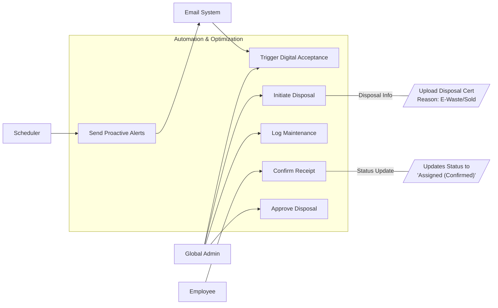

# User Story Specification

## Feature Name: Automation & Optimization

### Version History

| Version | Date       | Author | Description of Change |
| :------ | :--------- | :----- | :-------------------- |
| 1.0     | 02/08/2026 | Team   | Initial Draft         |

---

## 1. Overview of the Feature

### 1.1 Summary Feature

Manual tracking is prone to "human latency" and error. This feature introduces automation to the ITAM lifecycle. It proactively notifies admins of critical events (Expiry, Stockouts), streamlines the "Acceptance of Responsibility" for new hires, and manages the end-of-life disposal process with a rigid audit trail.

### 1.2 Scope

- **Notifications**: Automated emails/Teams messages for key triggers (Warranty Expiry, Overdue Returns).
- **Digital Acceptance**: Workflow to get user confirmation when they receive an asset.
- **Maintenance**: Tracking repair history and costs.
- **Disposal**: Formal approval workflow for decommissioning assets (E-waste/Sale).

### 1.3 Out of scope/Limitations

- **Vendor API Integration**: Direct Warranty lookup from Dell/Lenovo is a nice-to-have (REQ-AUTO-5.5) but considered low priority for Phase 1.
- **AI Predictions**: Predictive maintenance analysis is out of scope.

### 1.4 Business Context

An asset isn't just a row in a database; it requires care. Automating maintenance schedules and disposal approvals ensures compliance with environmental laws (WEEE) and financial governance (SOX), while reducing IT workload.

### 1.5 Assumptions and Dependencies

- **Email Server**: SMTP or Microsoft Graph API is configured for sending emails.
- **Teams**: Bot integration is authorized in the tenant.

---

## 2. Functionality: Automation & Workflows

### 2.1 User Story 1 - US-5.1 (Digital Acceptance)

**2.1.1 Overview of the requirement**
Mapped to **REQ-AUTO-5.1**. "I never received that laptop". To avoid disputes, employees must acknowledge custody.

**2.1.1 Goal**
Create a digital paper trail proving that an employee took possession of an asset.

**2.1.2 User Story**

- **As a** Global Admin,
- **I want** the system to automatically email the user when I assign an asset,
- **So that** they can click a link to confirm they have received it in good working order.

**2.1.3 Acceptance Criteria (Gherkin Format)**

- **Scenario: Assignment Notification**
  - **Given** I assign "Laptop X" to "User Y"
  - **When** the assignment saves
  - **Then** "User Y" receives an email with a "Confirm Receipt" button.

- **Scenario: User Confirmation**
  - **Given** I am the user "User Y"
  - **When** I click "Confirm Receipt"
  - **Then** the Asset Status updates from "Assigned (Pending)" to "Assigned (Confirmed)"
  - **And** the timestamp is logged in the Audit Trail.

**2.1.5 Validations/Business Rules**

- **Conditional Trigger**:
  - **IT Assets** (Laptops/Mobiles): **Trigger** email automatically.
  - **Furniture/Peripherals**: **Do NOT Trigger** (Silent Assignment) unless the "Force Acknowledgement" checkbox is checked manually.
- **SLA**: If not confirmed in 3 days, send a reminder to User and Admin.

**2.1.6 UI/UX requirements**

- **Email Template**: Clean, branded HTML email with Asset Details.

**2.1.7 Non-functional requirements**

- **Reliability**: Email delivery must be retried on failure (exponential backoff).

**2.1.8 Dependencies**

- **REQ-OPS-3.1**: Assignment triggers this workflow.

---

### 2.2 User Story 2 - US-5.2 (Proactive Alerts)

**2.2.1 Overview of the requirement**
Mapped to **REQ-AUTO-5.2**. Admins shouldn't have to check every asset every day. The system should tell them what's expiring.

**2.2.1 Goal**
Prevent service disruptions (expired licenses) and financial loss (renewing warranties unnecessarily).

**2.2.2 User Story**

- **As a** Global Admin,
- **I want to** receive a weekly digest of upcoming expiries (Warranties, Licenses),
- **So that** I can plan budget and replacements proactively.

**2.2.3 Acceptance Criteria (Gherkin Format)**

- **Scenario: Warranty Alert**
  - **Given** a Server's warranty expires in 30 days
  - **When** the daily job runs
  - **Then** an alert is added to the "Admin Dashboard"
  - **And** an email is sent to the IT distribution list.

**2.2.5 Validations/Business Rules**

- **Thresholds**: Alerts trigger at 90, 60, and 30 days before expiry.

**2.2.6 UI/UX requirements**

- **Consolidation**: Do not send 100 emails for 100 assets. Send 1 email with a summary table.

**2.2.7 Non-functional requirements**

- **Performance**: Alert Jobs run in background (off-peak hours).

**2.2.8 Dependencies**

- Scheduler service (e.g., Azure Functions / Hangfire).

---

### 2.3 User Story 3 - US-5.3 (Maintenance & Repairs)

**2.3.1 Overview of the requirement**
Mapped to **REQ-MNT-5.3**. Tracking the "Total Cost of Ownership" (TCO) includes repair costs, not just purchase price.

**2.3.1 Goal**
Monitor the reliability of assets and vendors. If "Model X" fails 50% of the time, we stop buying it.

**2.3.2 User Story**

- **As a** Global Admin,
- **I want to** log a "Maintenance Event" (Date, Vendor, Cost, Issue),
- **So that** I have a history of all repairs performed on an asset.

**2.3.3 Acceptance Criteria (Gherkin Format)**

- **Scenario: Log Repair**
  - **Given** a laptop returns from repair
  - **When** I enter the Service Date and Cost ($200)
  - **Then** the Asset's "Total Maintenance Cost" field updates
  - **And** the status is manually changed back to "Available".

**2.2.5 Validations/Business Rules**

- **Status Lock**: Assets "In Repair" cannot be Assigned until Maintenance is closed.

**2.2.6 UI/UX requirements**

- **History Tab**: Show maintenance logs alongside custody history.

**2.2.7 Non-functional requirements**

- None.

**2.2.8 Dependencies**

- None.

---

### 2.4 User Story 4 - US-5.4 (Disposal Workflow)

**2.4.1 Overview of the requirement**
Mapped to **REQ-OPS-5.4**. Disposing of assets requires governance to prevent fraud ("I threw it away" -> "I sold it on eBay").

**2.4.1 Goal**
Enforce a multi-step approval for permanently removing assets from the ledger.

**2.4.2 User Story**

- **As a** Global Admin,
- **I want to** request disposal for a batch of assets,
- **So that** a Manager (or second approver) can validate the request before they are archived.

**2.4.3 Acceptance Criteria (Gherkin Format)**

- **Scenario: Dispose Asset**
  - **Given** an asset is "Broken"
  - **When** I click "Initiate Disposal" and select Reason = "E-Waste"
  - **Then** the status changes to "Pending Disposal"
  - **And** an approval task is generated.

**2.2.5 Validations/Business Rules**

- **Finality**: Once "Disposed", an asset cannot be reactivated without Super Admin override.

**2.2.6 UI/UX requirements**

- **Certificate**: Allow uploading a "Certificate of Destruction" from the recycling vendor.

**2.2.7 Non-functional requirements**

- **Audit**: Disposal records must be kept for 7 years (Tax Law).

**2.2.8 Dependencies**

- **REQ-REP-4.1**: Pending Disposals appear on Dashboard.

---

## 3. Integrated Use Case Diagram

[< Back to Specifications](./README.md)
