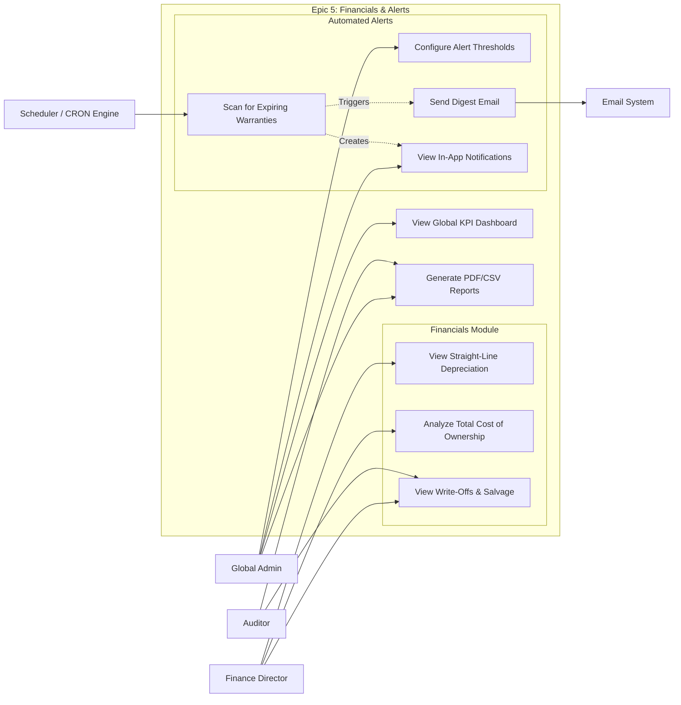

# User Story Specification

## Epic 5: Financial Analytics & Automation

### Version History

| Version | Date       | Author | Description of Change                                                                                                              |
| :------ | :--------- | :----- | :--------------------------------------------------------------------------------------------------------------------------------- |
| 1.0     | 02/08/2026 | Team   | Initial Draft                                                                                                                      |
| 2.0     | 02/25/2026 | Team   | Overhauled to include TCO engine, automated straight-line depreciation, CRON-based alert engine, and comprehensive KPI dashboards. |

---

## 1. Overview

### 1.1 Summary

Data is useless if it's trapped. This epic unlocks the value of the ITAM system by providing visibility through Dashboards and Reports, transforming raw inventory data into actionable business intelligence. It introduces automation to proactively notify admins of critical events (Expiry, Stockouts) and provides the Finance department with a dedicated sandbox to analyze the Total Cost of Ownership (TCO) and hardware depreciation.

### 1.2 Scope

- **Global KPI Dashboard**: Real-time snapshot of system health and pending tasks featuring aggregate metric cards.
- **Dedicated Financials Module**: A secured sidebar group restricted via RBAC to Finance and Global Admins.
- **Straight-Line Depreciation Ledger**: Automated grid calculating and displaying the real-time depreciated "Current Book Value" of all active hardware.
- **Total Cost of Ownership (TCO) Engine**: Aggregation engine summing original purchase prices with all historical maintenance costs.
- **Write-Offs & Salvage Ledger**: Financial view of the Disposal history, capturing salvage value.
- **Standard Report Generation**: Generation of standard compliance and inventory reports (PDF/CSV).
- **Alert Configuration Rules**: Admin interface to define notification thresholds.
- **CRON Job Engine**: Background scheduler service (e.g., Azure Functions / Hangfire) running nightly.
- **Notification Center (Inbox)**: The user-facing bell icon and dropdown UI displaying unread alerts with deep-links.

### 1.3 Out of scope/Limitations

- **Custom Report Builder**: Users are limited to pre-defined standard reports; ad-hoc SQL queries are out of scope.
- **Predictive AI**: Predictive maintenance analysis is out of scope.

### 1.4 Business Context

Executives need high-level summaries, and other departments (like Finance) need raw data. Manual exports are error-prone and slow. Furthermore, Admins shouldn't have to check every asset every day; the system should proactively tell them what's expiring to prevent service disruptions and financial loss.

### 1.5 Assumptions and Dependencies

- **Data Population**: Reports are only as good as the data in the registry.
- **Scheduler**: A background job runner (like Node-cron or Azure Functions) is available in the hosting environment.

---

## 2. Features & User Stories

### 2.1 Feature 1: Global KPI Dashboard & Standard Reporting

**2.1.1 Overview**

The primary interface providing immediate situational awareness of critical issues like "Stockouts" or "Overdue Returns", alongside tools for auditors to extract compliance evidence.

#### 2.1.2 User Story: US-5.1.1 (Admin Dashboard)

- **As a** Global Admin,
- **I want to** see a dashboard upon login with key metrics and pending actions,
- **So that** I know exactly what needs my attention today (e.g., approving disposals or chasing returns).

**Acceptance Criteria (Gherkin)**

- **Scenario: Dashboard Load**
  - **Given** I am a Global Admin
  - **When** I log in to the system
  - **Then** the landing page displays Total Assets count, Pending Approvals, Overdue Returns list, Low Stock Alerts for Consumables, a "Recent Activity Log" feed, and a "Frequently Failing Assets / Problem Asset Counts" widget.
  - **And** the widget layout stacks seamlessly into a single column on mobile devices.

**Tasks**

- [ ] Build responsive CSS Grid layout for KPI metric cards.
- [ ] Write optimized database aggregation queries to fetch live counts (< 2 seconds load time).
- [ ] Implement click-through deep-linking from KPI widgets to their respective filtered grids.

#### 2.1.3 User Story: US-5.1.2 (Standard Reporting)

- **As a** Global Admin / Auditor,
- **I want to** generate and download standard inventory reports (e.g., "Assets by Location", "Depreciation Schedule"),
- **So that** I can share this data with stakeholders who don't have system access.

**Acceptance Criteria (Gherkin)**

- **Scenario: Export to CSV**
  - **Given** I am viewing the "All Assets" report
  - **When** I click "Export to CSV"
  - **Then** a file downloads within 10 seconds containing all grid data.
  - **And** the system successfully handles exporting up to 50,000 rows without crashing.
- **Scenario: Export to Excel**
  - **Given** I am viewing a generated report
  - **When** I click "Export to Excel"
  - **Then** a formatted `.xlsx` file downloads containing the report data with proper column headers and data types.
- **Scenario: HTML Report Preview**
  - **Given** I select a report type (e.g., "Inventory by Department")
  - **When** I click "Generate Report"
  - **Then** the system renders an HTML preview of the report in-browser before I choose to export it to PDF, CSV, or Excel.

**Tasks**

- [ ] Build Report configuration UI (allowing users to set Date Range and Location parameters before generating).
- [ ] Implement robust CSV, Excel (.xlsx), and PDF generation libraries on the backend.
- [ ] Build an HTML report preview renderer for in-browser viewing before export.

### 2.2 Feature 2: Dedicated Financials Module & Cost Analysis

**2.2.1 Overview**
A highly secured sandbox containing financial ledgers that automate depreciation math and track the true cost of corporate hardware.

#### 2.2.2 User Story: US-5.2.1 (Depreciation & Write-Offs Ledger)

- **As a** Finance Director,
- **I want to** access a dedicated, RBAC-secured Financials module with a Depreciation Ledger,
- **So that** I can view the real-time "Current Book Value" and salvage values for corporate tax reporting.

**Acceptance Criteria (Gherkin)**

- **Scenario: Automated Depreciation Calculation**
  - **Given** a laptop was purchased for $1,000 with a 5-year expected lifespan
  - **When** I view the Straight-Line Depreciation Ledger exactly 3 years after the purchase date
  - **Then** the system automatically calculates and displays the "Current Book Value" as $400.00.
- **Scenario: Viewing Salvage Value**
  - **When** I navigate to the "Write-Offs & Salvage Ledger"
  - **Then** I see a list of permanently Disposed assets alongside any salvage value recouped from e-waste recycling.

**Tasks**

- [ ] Update the UI Sidebar to include a "Financials" accordion menu restricted to Finance/Global Admin roles.
- [ ] Build the Straight-Line Depreciation Ledger data grid.
- [ ] Write backend mathematical aggregation logic to calculate depreciation based on `PurchaseDate` and `BaseCost`.

#### 2.2.3 User Story: US-5.2.2 (Total Cost of Ownership Engine)

- **As a** Global Admin,
- **I want to** track the "Total Cost of Ownership" (TCO) which includes repair costs, not just purchase price,
- **So that** I can monitor the reliability of assets and vendors, and stop buying models that fail frequently.

**Acceptance Criteria (Gherkin)**

- **Scenario: TCO Aggregation**
  - **Given** a server has a base purchase price of $5,000
  - **When** the IT Ops team completes a $500 vendor repair ticket in Epic 3
  - **Then** the Financials TCO Engine instantly updates the server's Total Cost of Ownership to $5,500.
  - **And** flags the row in the UI if the repair costs exceed the current depreciated book value.

**Tasks**

- [ ] Create the TCO Ledger UI tab.
- [ ] Write SQL Views or backend aggregators to sum the `BaseCost` from the Assets table with the `FinalCost` from all linked `MaintenanceLogs`.

 - Desktop.png>)

#### 2.2.4 User Story: US-5.2.3 (Write-Offs & Salvage Ledger)

- **As a** Finance Director,
- **I want to** view a financial ledger of the permanent disposal history alongside any captured salvage values,
- **So that** I can accurately report write-offs and recouped cash from e-waste recycling for corporate tax purposes.

**Acceptance Criteria (Gherkin)**

- **Scenario: Reconciling Salvage Value**
  - **Given** an asset was disposed of via "E-Waste Recycling" and the recycling vendor paid TIQRI $50 for the scrap
  - **When** I navigate to the "Write-Offs & Salvage Ledger"
  - **Then** I see the asset's final depreciated book value listed alongside the $50 `SalvageValue`.
  - **And** the ledger calculates the final net financial loss/gain for the write-off.

**Tasks**

- [ ] Create the "Write-Offs & Salvage Ledger" UI tab within the secured Financials sidebar module.
- [ ] Add an optional `SalvageValue` numeric input to the Epic 4 Compliance Execution Modal to capture this data during disposal.
- [ ] Write backend query to fetch assets with the status `Disposed`, joining their original `PurchaseCost`, final depreciated value, and recorded `SalvageValue`.

---

### 2.3 Feature 3: Automated Alerts & Notification Center

**2.3.1 Overview**
The proactive background engine and user-facing inbox that prevent service disruptions by notifying administrators of impending deadlines.

#### 2.3.2 User Story: US-5.3.1 (CRON Engine & Alert Configuration)

- **As a** Global Admin,
- **I want to** receive a weekly digest of upcoming expiries (Warranties, Licenses),
- **So that** I can plan budget and replacements proactively.

**Acceptance Criteria (Gherkin)**

- **Scenario: Warranty Alert Generation**
  - **Given** a Server's warranty expires in 30 days
  - **When** the daily job runs in the background (off-peak hours)
  - **Then** an alert is added to the "Admin Dashboard"
  - **And** notifications are sent via Email and Microsoft Teams to the IT distribution list.
- **Scenario: Software License Renewal Alert**
  - **Given** a software license for "Adobe Creative Cloud" is set to expire in 30 days
  - **When** the nightly CRON job scans the database
  - **Then** the system generates an alert for the upcoming license renewal
  - **And** notifications are sent via Email and Microsoft Teams to the assigned IT Admin.
- **Scenario: Configuring Thresholds**
  - **Given** I am in the Settings > Alert Configuration page
  - **When** I toggle the "Warranty Expiration" rule and set the threshold to 60 days
  - **Then** the CRON job engine updates its scanning parameters accordingly.

- **Scenario: Overdue Active Repair Ticket Alert**
  - **Given** an asset is currently in the "Active Repairs" ledger with an expected return date of yesterday
  - **When** the scheduled nightly CRON job runs
  - **Then** the system detects the overdue status
  - **And** pushes a high-priority alert directly to the Notification Center of the IT Ops Admin who dispatched the repair.

**Tasks**

- [ ] Build the Alert Configuration Rules UI with toggle switches and threshold dropdowns.
- [ ] Configure a background Scheduler service (e.g., Azure Functions / Hangfire) to run nightly queries.
- [ ] Write email aggregation logic to send 1 summary digest email instead of 100 separate emails.
- [ ] Implement Microsoft Teams channel/chat notification delivery alongside email alerts.
- [ ] Write specific CRON job query to scan for upcoming Software License expirations in addition to warranty thresholds.
- [ ] Write specific CRON job query to flag active maintenance tickets where `Status == "In Repair"` AND `ExpectedReturnDate < CURRENT_DATE`.
- [ ] Implement backend routing to ensure the overdue repair alert is sent specifically to the `CreatedBy` user of that repair ticket, rather than the global distribution list.
- [ ] Implement exponential backoff retry logic for the SMTP/Email service to ensure alert delivery reliability in case the mail server temporarily fails.

#### 2.3.3 User Story: US-5.3.2 (Notification Center / Inbox)

- **As a** User,
- **I want** a dedicated Notification Center (Bell Icon) within the application,
- **So that** I can quickly view unread system alerts and navigate directly to the affected items.

**Acceptance Criteria (Gherkin)**

- **Scenario: Receiving an In-App Notification**
  - **Given** an asset requires my approval for disposal
  - **When** I look at the top navigation bar
  - **Then** the Bell icon shows a red badge with the number of unread alerts.
- **Scenario: Deep-Linking**
  - **When** I click the "Warranty Expiring for Server X" notification in the dropdown
  - **Then** the system marks the alert as read and navigates me directly to the slide-out details panel for "Server X".

**Tasks**

- [ ] Build the Notification Center Dropdown UI component with a "Mark all as read" action.
- [ ] Create an `AppNotifications` database table to track unread/read states per user.
- [ ] Implement deep-linking URL routing from the notification payload to the specific UI component.

#### 2.3.4 User Story: US-5.3.3 (Vendor API Sync) _(Optional / Phase 2)_

- **As a** Global Admin,
- **I want** the system to periodically query external Vendor APIs (e.g., Dell, HP, Lenovo) using asset Serial Numbers,
- **So that** Warranty Expiry dates are automatically fetched and updated without manual data entry.

**Acceptance Criteria (Gherkin)**

- **Scenario: Automated Warranty Date Fetch**
  - **Given** a Dell laptop with Serial Number "SN-DELL-5540-001" is registered in the system
  - **When** the scheduled sync job runs
  - **Then** the system queries Dell's warranty API with the Serial Number
  - **And** automatically updates the asset's Warranty Expiry Date field if a newer date is returned.
- **Scenario: Vendor API Unavailability**
  - **Given** the HP warranty API is temporarily unavailable
  - **When** the sync job encounters a connection failure
  - **Then** the system logs the failure, skips the affected assets, and retries on the next scheduled run using exponential backoff.

**Tasks**

- [ ] Research and integrate available vendor warranty API endpoints (Dell TechDirect, HP ISEE, Lenovo Support API).
- [ ] Build a configurable Vendor API Sync settings page with enable/disable toggles per vendor.
- [ ] Implement a scheduled background job to batch-query vendor APIs using stored Serial Numbers.
- [ ] Write resilient error handling with exponential backoff for failed vendor API calls.

---

## 3. Integrated Use Case Diagram

---

[< Back to Requirements](../README.md)
