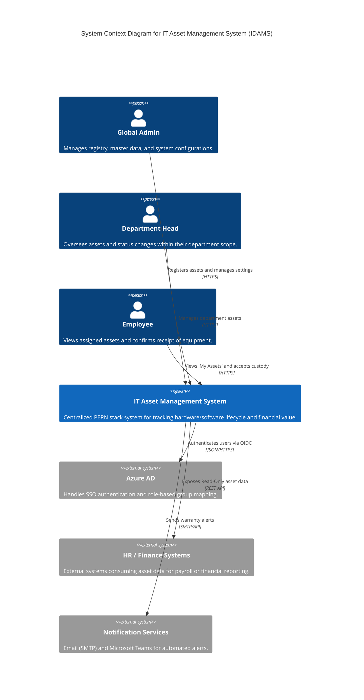

# C4 Level 1 – System Context Diagram

The diagram positions the IT Asset Management System as the central hub.

- User Interaction: It serves three distinct user groups: Global Admins (full lifecycle management), Department Heads (operational oversight), and Employees (custody acknowledgement).

- External Integrations: The system relies on Azure Active Directory for secure Single Sign-On (SSO) and role mapping. It pushes automated alerts via Notification Services (Teams/Email) and provides a read-only API interface for HR & Finance Systems to retrieve asset value data for payroll and depreciation reporting.

