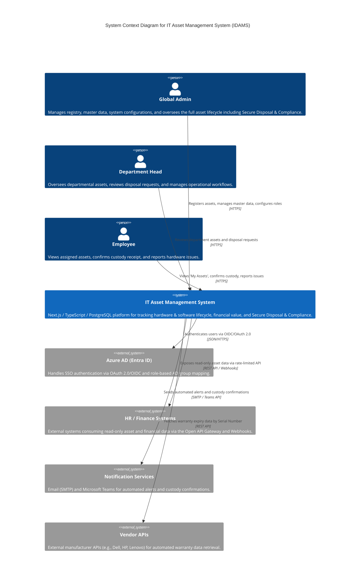

# C4 Level 1 – System Context Diagram

The diagram positions the IT Asset Management System as the central hub.

- **User Interaction:** It serves three distinct user groups: Global Admins (full lifecycle management, master data, compliance), Department Heads (operational oversight and disposal reviews), and Employees (custody acknowledgement and issue reporting).

- **External Integrations:** The system relies on Azure Active Directory (Entra ID) for secure Single Sign-On (SSO) via OAuth 2.0/OIDC and role-based group mapping. It pushes automated alerts via Notification Services (Email/Teams) for custody confirmations, warranty expirations, license renewals, and overdue returns. A rate-limited Open API Gateway provides read-only endpoints and outbound webhooks for HR & Finance Systems. Optionally, the system queries external Vendor APIs to auto-fetch warranty data.

[< Back to Requirements](../README.md)

