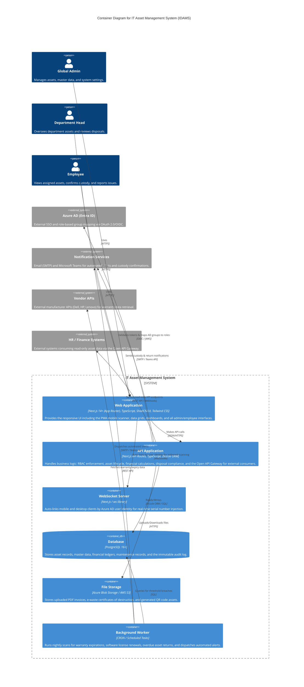

# Level 2: Container Diagram

The Container Diagram zooms into the system boundary to illustrate the high-level technical building blocks and their communication protocols.

The architecture follows a modular, cloud-ready design:

- **Web Application (SPA + PWA):** Built with Next.js 14+ (App Router), TypeScript, ShadCN/UI, and Tailwind CSS. This container provides a responsive user interface that runs in the user's browser, including the PWA mobile scanner for barcode/QR scanning. It communicates with the backend via JSON/HTTPS and with the WebSocket server for identity-based auto-linked scanning sessions.

- **API Application:** The backend, developed using Next.js API Routes with TypeScript and Drizzle ORM, acts as the central logic engine. It handles Azure AD authentication and role mapping, RBAC enforcement, asset lifecycle management, financial calculations (depreciation, TCO), compliance-driven disposal workflows, and exposes the Open API Gateway for external consumers.

- **WebSocket Server:** A dedicated real-time communication layer that auto-links mobile and desktop clients by matching their Azure AD user identity (`user_id`), enabling scanned serial numbers to be injected directly into desktop form fields without manual pairing (REQ-REG-2.14).

- **Database:** A PostgreSQL 16+ database serves as the persistent storage for asset records, master data, financial ledgers, maintenance records, and the immutable append-only audit log.

- **File Storage:** Azure Blob Storage / AWS S3 stores uploaded PDF purchase invoices (REQ-REG-2.4), e-waste certificates of destruction (REQ-DSP-4.6), and generated report artifacts. Configured with 7-year retention policies for compliance (NFR-REL-06).

- **Background Worker:** A CRON-based scheduler (REQ-FIN-5.9) runs nightly scans to detect warranty expirations, software license renewals, and overdue asset returns, dispatching automated alerts via Email and Microsoft Teams. Optionally queries Vendor APIs for warranty data (REQ-FIN-5.11).

[< Back to Requirements](../README.md)
