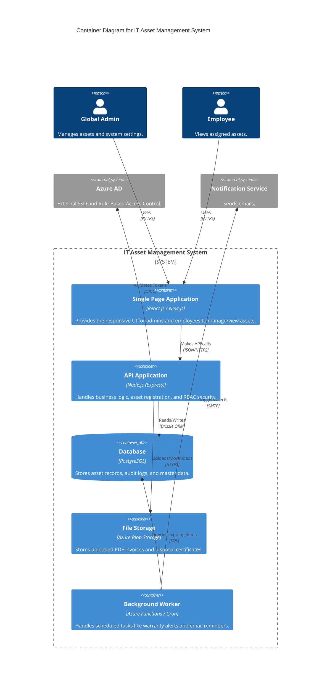

# Level 2: Container Diagram

The Container Diagram zooms into the system boundary to illustrate the high-level technical building blocks and their communication protocols.

The architecture follows a modular, cloud-ready design:

- Single Page Application (SPA): Built with React.js, this container provides a responsive user interface that runs in the user's browser, communicating with the backend via JSON/HTTPS.

- API Application: The backend, developed using Node.js and Express, acts as the central logic engine. It handles authentication, data validation, and business rules.

- Database: A PostgreSQL database serves as the persistent storage for asset records and immutable audit logs.

- Background Worker: To handle resource-intensive tasks without blocking the UI, a separate Azure Function worker is employed to process daily warranty checks and email triggers.