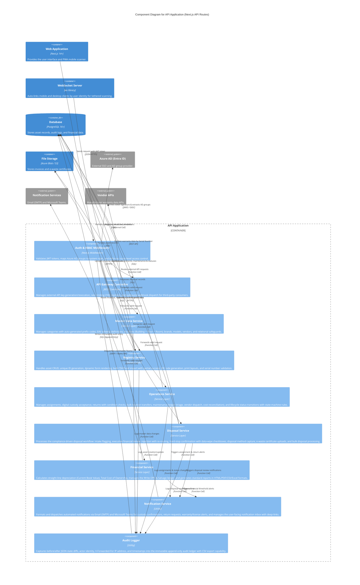

# Level 3: Component Diagram (API Application)

The Component Diagram details the internal modularity of the API Application container, demonstrating the "Separation of Concerns" principle. Each service maps to a specific architectural Epic from the functional requirements.

The API is structured into distinct functional services, each aligned to an architectural Epic:

- **Auth & RBAC Middleware (Epic 1):** Intercepts all incoming requests to validate JWT tokens against Azure AD, extracts AD group memberships, maps them to internal system roles (e.g., Global Admin, Finance Read-Only, Standard Employee), and enforces route-level access control. Unauthorized requests receive a `403 Forbidden` response (REQ-FND-1.1–1.5).

- **API Gateway Controller (Epic 1):** Manages the Open API Gateway for external third-party systems. Handles API key generation/revocation with hashed storage, enforces rate limiting (100 req/min per key), and dispatches outbound webhook payloads triggered by system events (REQ-FND-1.12–1.13, NFR-PERF-06).

- **Master Data Service (Epic 1):** Manages the organizational backbone — asset categories with auto-generated prefix codes and collision handling, EAV schema definitions for dynamic custom fields with drag-and-drop ordering, hierarchical locations, brands, models, departments, and vendors. Enforces relational safeguards preventing deletion of in-use entities and supports soft-archival (REQ-FND-1.6–1.10, 1.15–1.17).

- **Registry Service (Epic 2):** Manages the core asset data logic including unique Asset ID generation using category prefixes, dynamic form rendering based on EAV schemas, financial data capture (base price, tax, shipping, multi-currency), bulk CSV/Excel import with partial success processing, QR code generation with routing URLs, print layout formatting (thermal single-tag and A4 PDF grids), and serial number uniqueness validation (REQ-REG-2.1–2.16).

- **Operations Service (Epic 3):** Handles the complex transactional logic for asset assignments (user or location, with team-blocking), digital custody acceptance via Email/Teams, returns with mandatory condition checks, bulk location transfers, the full maintenance ledger (triage review, vendor dispatch with RMA tracking, cost reconciliation), lifecycle status transitions enforced by state-machine rules, and employee issue reporting (REQ-OPS-3.1–3.15).

- **Disposal Service (Epic 4):** Processes the compliance-driven disposal workflow: intake flagging of defective assets, executive review with financial justification, rejection with mandatory notes and re-routing, hard-stop confirmation requiring exact Asset ID text entry and physical security checkboxes (data wiped, tags removed), disposal method capture (Sold, Stolen, E-waste, Donated), e-waste certificate uploads with 7-year retention, bulk disposal processing, and soft-delete finality (REQ-DSP-4.1–4.8).

- **Financial Service (Epic 5):** Calculates real-time Current Book Value using straight-line depreciation, aggregates Total Cost of Ownership (purchase + maintenance costs), maintains the Write-Offs & Salvage ledger, powers the KPI dashboard with aggregate metric cards and widgets (Recent Activity, Problem Assets), and generates standard reports in HTML/PDF/CSV/Excel (REQ-FIN-5.1–5.7).

- **Notification Service (Epic 3 & 5):** Formats and dispatches automated notifications via both Email (SMTP) and Microsoft Teams for custody confirmations, return requests, warranty expirations, software license renewals, and overdue asset returns. Also manages the user-facing Bell Icon notification inbox with deep-links to affected asset details (REQ-OPS-3.2, REQ-OPS-3.11, REQ-FIN-5.8, REQ-FIN-5.10).

- **Audit Logger (Epic 1):** A dedicated component that captures the state of an asset before and after any modification as a JSON diff, along with the actor identity, `X-Forwarded-For` IP address, and timestamp. Writes to the immutable append-only audit ledger. Supports filtered viewing and CSV export (REQ-FND-1.11, REQ-FND-1.14).

[< Back to Requirements](../README.md)
