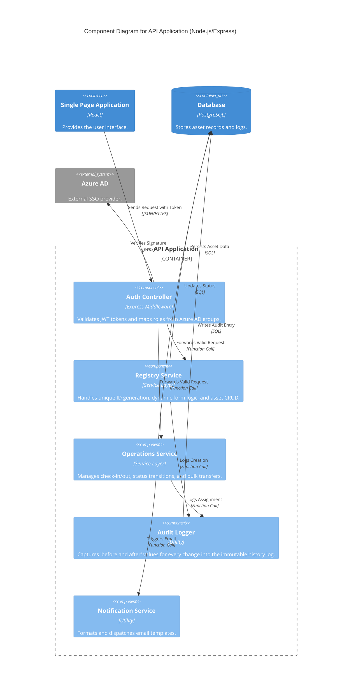

# Level 3: Component Diagram (API Application)

The Component Diagram details the internal modularity of the API Application container, demonstrating the "Separation of Concerns" principle.

The API is structured into distinct functional services:

- Auth Controller: Intercepts incoming requests to validate JWT tokens against Azure AD before granting access.

- Registry Service: Manages the core data logic, including unique ID generation and dynamic form rendering for different asset categories.

- Tracking & Operations Service: Handles the complex transactional logic for asset assignments, returns, and bulk location transfers.

- Audit Logger: A dedicated component that captures the state of an asset before and after any modification, writing to the history log to ensure compliance.