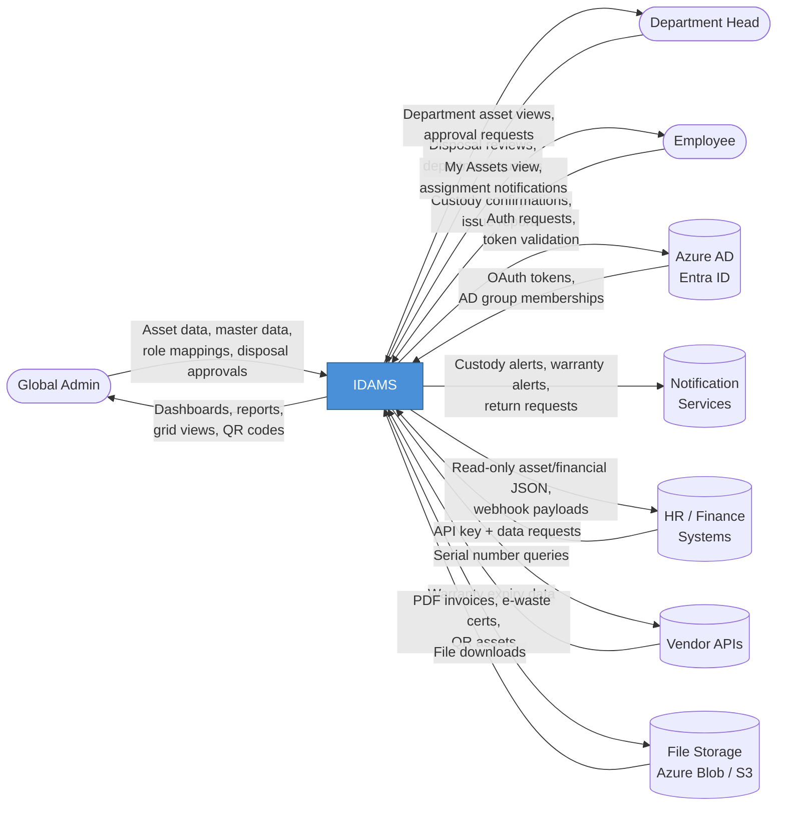
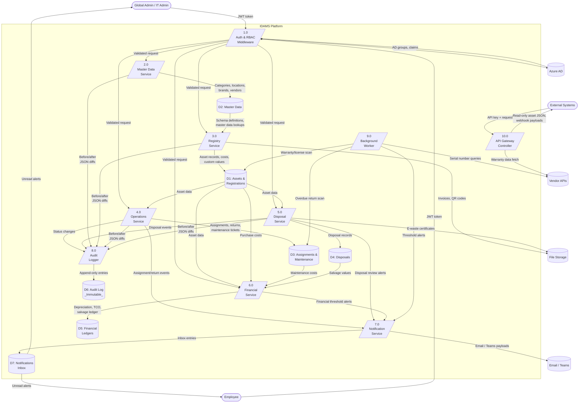
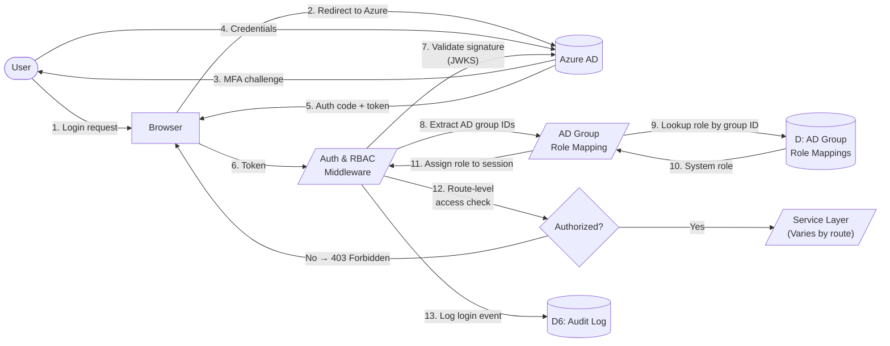
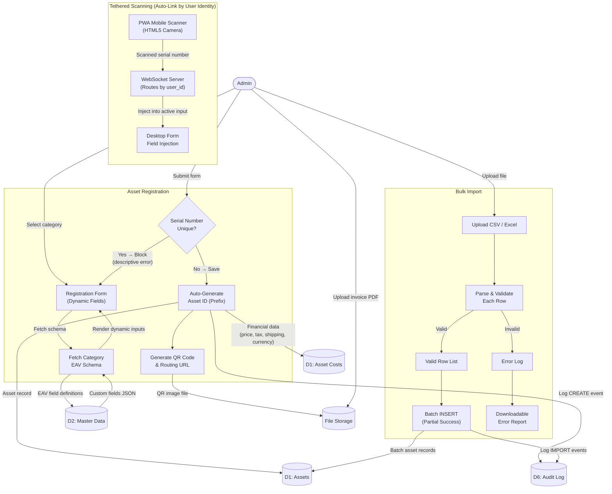
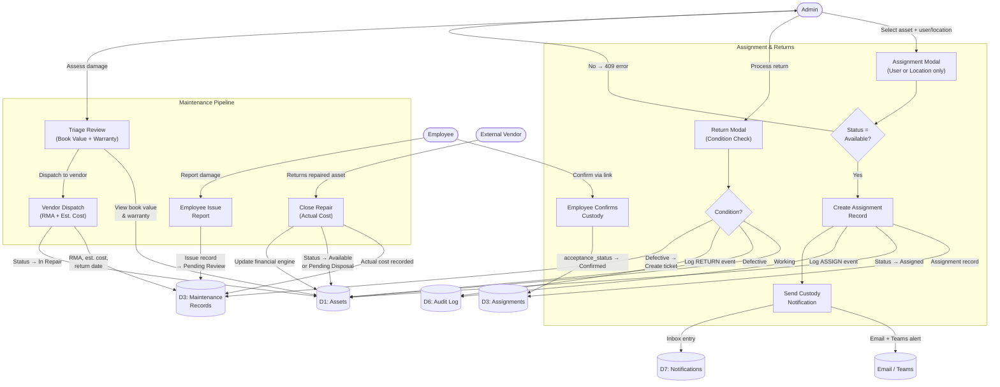
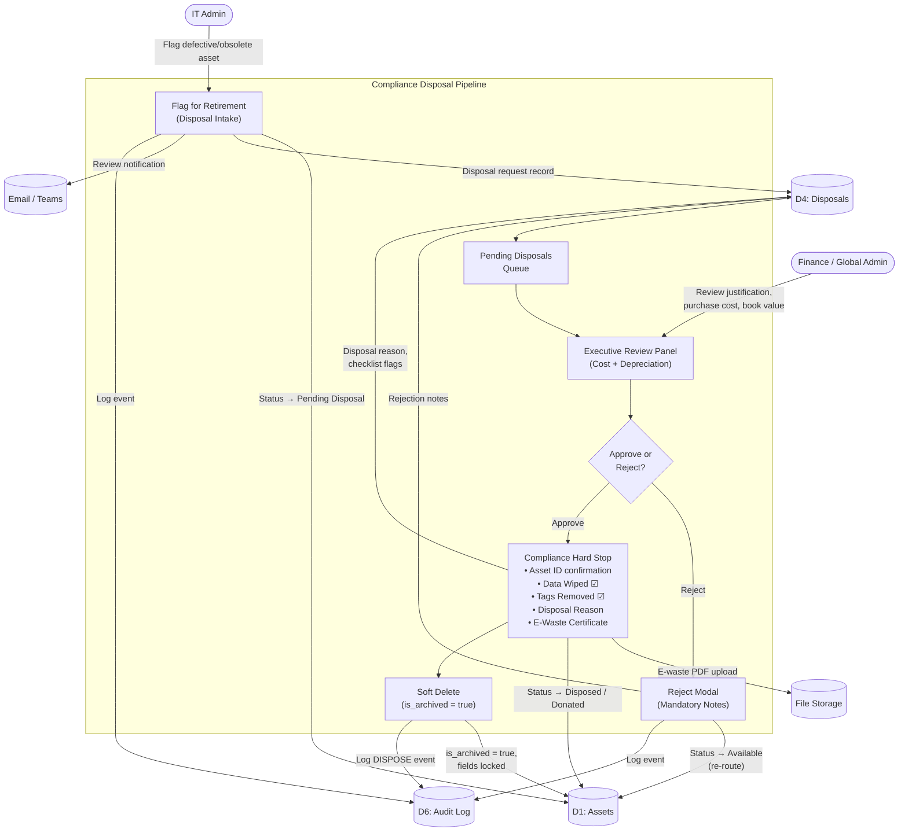
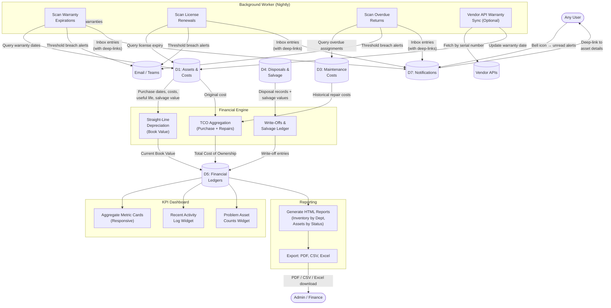

# Data Flow Diagram

This document illustrates how data moves through the Integrated Digital Asset Management System (IDAMS) across all five architectural Epics.

## Table of Contents

- [1. Level 0 — Context Data Flow](#1-level-0--context-data-flow)
- [2. Level 1 — System-Wide Data Flow](#2-level-1--system-wide-data-flow)
- [3. Level 2 — Epic-Specific Data Flows](#3-level-2--epic-specific-data-flows)
  - [3.1 Authentication & Access Control (Epic 1)](#31-authentication--access-control-epic-1)
  - [3.2 Asset Registration & Scanning (Epic 2)](#32-asset-registration--scanning-epic-2)
  - [3.3 Operations & Maintenance (Epic 3)](#33-operations--maintenance-epic-3)
  - [3.4 Secure Disposal & Compliance (Epic 4)](#34-compliance-driven-disposals-epic-4)
  - [3.5 Financial Intelligence & Alerts (Epic 5)](#35-financial-intelligence--alerts-epic-5)
- [4. Data Store Inventory](#4-data-store-inventory)
- [5. External Entity Inventory](#5-external-entity-inventory)
- [6. Traceability Matrix](#6-traceability-matrix)

## 1. Level 0 — Context Data Flow

The highest-level view showing IDAMS as a single process exchanging data with all external entities.

## 2. Level 1 — System-Wide Data Flow

Decomposes the IDAMS process into its core internal processes and data stores, showing how data flows between services, the database, file storage, and external entities.

## 3. Level 2 Epic-Specific Data Flows

### 3.1 Authentication & Access Control (Epic 1)

Covers SSO login, RBAC enforcement, and AD group-to-role mapping (REQ-FND-1.1–1.5).

### 3.2 Asset Registration & Scanning (Epic 2)

Covers single asset creation, bulk import, QR generation, and tethered mobile scanning (REQ-REG-2.1–2.16).

### 3.3 Operations & Maintenance (Epic 3)

Covers asset assignments, custody acceptance, returns, maintenance lifecycle, and employee issue reporting (REQ-OPS-3.1–3.15).

### 3.4 Secure Disposal & Compliance (Epic 4)

Covers the full disposal pipeline from intake to compliance hard stop (REQ-DSP-4.1–4.8).

### 3.5 Financial Intelligence & Alerts (Epic 5)

Covers depreciation, TCO, salvage ledger, reports, dashboard, CRON alerts, and notification inbox (REQ-FIN-5.1–5.11).

## 4. Data Store Inventory

| ID  | Data Store                | Primary Tables                                                                                                      | Description                                                                                                        |
| :-- | :------------------------ | :------------------------------------------------------------------------------------------------------------------ | :----------------------------------------------------------------------------------------------------------------- |
| D1  | Assets & Registrations    | `assets`, `asset_costs`, `asset_custom_values`, `currencies`                                                        | Core asset records, financial costs, dynamic EAV values, and currency references.                                  |
| D2  | Master Data               | `categories`, `category_custom_fields`, `brands`, `models`, `vendors`, `locations`, `departments`, `asset_statuses` | Organizational backbone data — categories with EAV schemas, hierarchical locations, and all reference data.        |
| D3  | Assignments & Maintenance | `asset_assignments`, `maintenance_records`, `issue_reports`                                                         | Operational records tracking custody lifecycle, repair workflows, and employee-reported issues.                    |
| D4  | Disposals                 | `asset_disposals`, `asset_documents` (e-waste certs)                                                                | Compliance disposal records with approval workflow state, security checklists, and linked file storage references. |
| D5  | Financial Ledgers         | Computed views over D1 + D3 + D4                                                                                    | Depreciation calculations, TCO aggregations, and salvage/write-off ledger entries.                                 |
| D6  | Audit Log                 | `system_audit_logs`                                                                                                 | Immutable append-only ledger of all CRUD events with before/after JSONB diffs, actor identity, and IP address.     |
| D7  | Notifications Inbox       | `notifications`                                                                                                     | User-facing alert entries with read/unread state and deep-link URLs to affected entities.                          |

## 5. External Entity Inventory

| External Entity          | Type                 | Data Exchanged                                                       | Protocol                     | Requirement                |
| :----------------------- | :------------------- | :------------------------------------------------------------------- | :--------------------------- | :------------------------- |
| **Azure AD (Entra ID)**  | Identity Provider    | OAuth tokens, AD group memberships, user profile claims              | OIDC / JWKS / HTTPS          | REQ-FND-1.1, REQ-FND-1.5   |
| **Email (SMTP)**         | Notification Channel | Custody confirmations, return requests, warranty/license alerts      | SMTP                         | REQ-OPS-3.2, REQ-FIN-5.8   |
| **Microsoft Teams**      | Notification Channel | Same as Email — adaptive card notifications                          | Teams Incoming Webhook / API | REQ-OPS-3.2, REQ-FIN-5.8   |
| **HR / Finance Systems** | API Consumer         | Read-only asset and financial JSON data; outbound webhook payloads   | REST API (JSON) / Webhooks   | REQ-FND-1.12, REQ-FND-1.13 |
| **Vendor APIs**          | Data Source          | Warranty expiry data fetched by serial number (Dell, HP, Lenovo)     | REST API (JSON)              | REQ-FIN-5.11               |
| **Azure Blob / AWS S3**  | File Storage         | PDF invoices, e-waste certificates, QR code images, report artifacts | HTTPS                        | REQ-REG-2.4, REQ-DSP-4.6   |

## 6. Traceability Matrix

| Data Flow                               | Primary Requirements                    |
| :-------------------------------------- | :-------------------------------------- |
| SSO Login & Role Mapping (3.1)          | REQ-FND-1.1, REQ-FND-1.4, REQ-FND-1.5   |
| Master Data CRUD → D2                   | REQ-FND-1.6–1.10, REQ-FND-1.15–1.17     |
| Dynamic Registration → D1               | REQ-REG-2.1–2.3, REQ-REG-2.16           |
| Bulk Import (Partial Success) → D1      | REQ-REG-2.9, REQ-REG-2.10, NFR-REL-03   |
| QR Generation → File Storage            | REQ-REG-2.11, REQ-REG-2.12              |
| Tethered Scanning (Auto-Link WebSocket) | REQ-REG-2.14                            |
| Assignment → D3 → Notifications         | REQ-OPS-3.2, REQ-OPS-3.3                |
| Return + Condition Check → D3           | REQ-OPS-3.4, REQ-OPS-3.6                |
| Maintenance Pipeline → D3               | REQ-OPS-3.7–3.10                        |
| Employee Issue Reporting → D3           | REQ-OPS-3.15                            |
| Disposal Pipeline → D4 → File Storage   | REQ-DSP-4.1–4.8                         |
| Depreciation & TCO → D5                 | REQ-FIN-5.4, REQ-FIN-5.5                |
| Salvage Ledger → D5                     | REQ-FIN-5.6                             |
| Report Generation & Export              | REQ-FIN-5.7, NFR-PERF-04                |
| CRON Alerts → D7 → Email/Teams          | REQ-FIN-5.8, REQ-FIN-5.9                |
| Notification Inbox → User               | REQ-FIN-5.10                            |
| Vendor API Warranty Sync                | REQ-FIN-5.11                            |
| All state changes → D6 (Audit Log)      | REQ-FND-1.11, NFR-SEC-05, NFR-SEC-06    |
| API Gateway → External Systems          | REQ-FND-1.12, REQ-FND-1.13, NFR-PERF-06 |

[< Back to Requirements](../README.md)

