# Entity Relationship Diagram

This diagram defines the complete data model for the Integrated Digital Asset Management System (IDAMS), covering all five architectural Epics: Platform Foundation & Master Data (Epic 1), Asset Registry (Epic 2), IT Operations & Maintenance (Epic 3), Compliance-Driven Disposals (Epic 4), and Financial Intelligence & Automated Alerts (Epic 5). Each entity is annotated with the primary requirement(s) it fulfills.

```mermaid
erDiagram

    %% ═══════════════════════════════════════════
    %% EPIC 1: Platform Foundation & Master Data
    %% ═══════════════════════════════════════════

    USERS {
        UUID user_id PK
        STRING azure_ad_object_id UK
        STRING email UK
        STRING display_name
        INT department_id FK
        BOOLEAN is_active
        TIMESTAMP created_at
    }

    ROLES {
        INT role_id PK
        STRING role_name UK
        STRING description
    }

    USER_ROLES {
        INT user_role_id PK
        UUID user_id FK
        INT role_id FK
        TIMESTAMP assigned_at
    }

    AD_GROUP_ROLE_MAPPINGS {
        INT mapping_id PK
        STRING azure_ad_group_id UK
        STRING azure_ad_group_name
        INT role_id FK
        BOOLEAN is_active
        TIMESTAMP created_at
    }

    DEPARTMENTS {
        INT department_id PK
        STRING department_name UK
        BOOLEAN is_active
    }

    BRANDS {
        INT brand_id PK
        STRING brand_name UK
        BOOLEAN is_active
    }

    MODELS {
        INT model_id PK
        INT brand_id FK
        STRING model_name
        BOOLEAN is_active
    }

    CATEGORIES {
        INT category_id PK
        STRING category_name UK
        STRING prefix_code UK
        STRING asset_type
        BOOLEAN is_consumable
        BOOLEAN requires_serial
        BOOLEAN is_active
    }

    CATEGORY_CUSTOM_FIELDS {
        INT field_id PK
        INT category_id FK
        STRING field_label
        STRING field_type
        STRING dropdown_options
        INT display_order
        BOOLEAN is_required
        BOOLEAN is_active
    }

    VENDORS {
        INT vendor_id PK
        STRING vendor_name UK
        STRING contact_info
        BOOLEAN is_active
    }

    LOCATIONS {
        INT location_id PK
        INT parent_location_id FK
        STRING location_type
        STRING location_name
        BOOLEAN is_active
    }

    ASSET_STATUSES {
        INT status_id PK
        STRING status_name UK
        BOOLEAN is_terminal
        BOOLEAN is_custom
    }

    SYSTEM_AUDIT_LOGS {
        BIGINT log_id PK
        STRING entity_type
        UUID entity_id
        STRING action_type
        JSONB old_value
        JSONB new_value
        UUID performed_by FK
        STRING ip_address
        TIMESTAMP performed_at
    }

    API_KEYS {
        INT api_key_id PK
        STRING key_hash UK
        STRING label
        UUID created_by FK
        BOOLEAN is_revoked
        TIMESTAMP created_at
        TIMESTAMP revoked_at
    }

    WEBHOOKS {
        INT webhook_id PK
        STRING target_url
        STRING event_type
        UUID created_by FK
        BOOLEAN is_active
        TIMESTAMP created_at
    }

    %% ═══════════════════════════════════════════
    %% EPIC 2: Asset Registry & Tethered Scanning
    %% ═══════════════════════════════════════════

    ASSETS {
        UUID asset_id PK
        STRING asset_tag UK
        INT category_id FK
        INT brand_id FK
        INT model_id FK
        STRING serial_number UK
        STRING asset_name
        DATE purchase_date
        DATE warranty_expiry_date
        INT vendor_id FK
        INT status_id FK
        INT location_id FK
        INT useful_life_months
        DECIMAL salvage_value
        BOOLEAN is_quantity_only
        INT quantity
        STRING qr_code_url
        BOOLEAN is_archived
        TIMESTAMP created_at
        TIMESTAMP updated_at
    }

    ASSET_CUSTOM_VALUES {
        INT value_id PK
        UUID asset_id FK
        INT field_id FK
        STRING field_value
    }

    CURRENCIES {
        STRING currency_code PK
        STRING currency_name
    }

    ASSET_COSTS {
        INT asset_cost_id PK
        UUID asset_id FK
        DECIMAL base_price
        DECIMAL tax_amount
        DECIMAL shipping_cost
        DECIMAL total_cost
        STRING currency_code FK
        DECIMAL conversion_rate_to_base
        TIMESTAMP recorded_at
    }

    ASSET_DOCUMENTS {
        INT document_id PK
        UUID asset_id FK
        STRING document_type
        STRING file_path
        STRING file_name
        TIMESTAMP uploaded_at
        UUID uploaded_by FK
    }

    %% ═══════════════════════════════════════════
    %% EPIC 3: IT Operations & Hardware Maintenance
    %% ═══════════════════════════════════════════

    ASSET_ASSIGNMENTS {
        INT assignment_id PK
        UUID asset_id FK
        UUID assigned_to_user_id FK
        INT assigned_to_location_id FK
        UUID assigned_by FK
        DATE assigned_date
        DATE expected_return_date
        DATE returned_date
        STRING return_condition
        STRING acceptance_status
        TIMESTAMP accepted_at
        TIMESTAMP return_requested_at
    }

    MAINTENANCE_RECORDS {
        INT maintenance_id PK
        UUID asset_id FK
        STRING status
        INT vendor_id FK
        STRING rma_ticket_number
        STRING description
        DECIMAL estimated_cost
        DECIMAL actual_cost
        DECIMAL repair_cost
        STRING currency_code FK
        DATE service_date
        DATE expected_return_date
        TIMESTAMP closed_at
        UUID created_by FK
    }

    ISSUE_REPORTS {
        INT issue_id PK
        UUID asset_id FK
        UUID reported_by FK
        STRING issue_description
        STRING severity
        INT maintenance_id FK
        TIMESTAMP created_at
    }

    %% ═══════════════════════════════════════════
    %% EPIC 4: Compliance-Driven Disposals
    %% ═══════════════════════════════════════════

    ASSET_DISPOSALS {
        INT disposal_id PK
        UUID asset_id FK
        STRING status
        STRING disposal_reason
        STRING justification
        UUID requested_by FK
        TIMESTAMP requested_at
        UUID approved_by FK
        TIMESTAMP approved_at
        BOOLEAN data_wiped
        BOOLEAN tags_removed
        DECIMAL salvage_value
        STRING disposal_batch_id
        STRING rejection_notes
        STRING notes
    }

    %% ═══════════════════════════════════════════
    %% EPIC 5: Financial Intelligence & Alerts
    %% ═══════════════════════════════════════════

    NOTIFICATIONS {
        INT notification_id PK
        UUID user_id FK
        STRING title
        STRING message
        STRING link_url
        BOOLEAN is_read
        TIMESTAMP created_at
        TIMESTAMP read_at
    }

    %% ═══════════════════════════════════════════
    %% RELATIONSHIPS
    %% ═══════════════════════════════════════════

    %% Epic 1: Platform Foundation
    DEPARTMENTS ||--o{ USERS : employs
    USERS ||--o{ USER_ROLES : has
    ROLES ||--o{ USER_ROLES : assigned
    ROLES ||--o{ AD_GROUP_ROLE_MAPPINGS : maps
    USERS ||--o{ API_KEYS : creates
    USERS ||--o{ WEBHOOKS : registers
    USERS ||--o{ SYSTEM_AUDIT_LOGS : performs

    %% Epic 1: Master Data
    BRANDS ||--o{ MODELS : produces
    CATEGORIES ||--o{ CATEGORY_CUSTOM_FIELDS : defines
    LOCATIONS ||--o{ LOCATIONS : contains

    %% Epic 2: Asset Registry
    CATEGORIES ||--o{ ASSETS : classifies
    BRANDS ||--o{ ASSETS : categorizes
    MODELS ||--o{ ASSETS : specifies
    VENDORS ||--o{ ASSETS : supplies
    ASSET_STATUSES ||--o{ ASSETS : determines
    LOCATIONS ||--o{ ASSETS : houses
    ASSETS ||--o{ ASSET_CUSTOM_VALUES : stores
    CATEGORY_CUSTOM_FIELDS ||--o{ ASSET_CUSTOM_VALUES : defines
    ASSETS ||--o{ ASSET_COSTS : has
    CURRENCIES ||--o{ ASSET_COSTS : prices
    ASSETS ||--o{ ASSET_DOCUMENTS : has
    USERS ||--o{ ASSET_DOCUMENTS : uploads

    %% Epic 3: Operations & Maintenance
    USERS ||--o{ ASSET_ASSIGNMENTS : assigned
    ASSETS ||--o{ ASSET_ASSIGNMENTS : gets
    LOCATIONS ||--o{ ASSET_ASSIGNMENTS : contains
    ASSETS ||--o{ MAINTENANCE_RECORDS : serviced
    VENDORS ||--o{ MAINTENANCE_RECORDS : performs
    CURRENCIES ||--o{ MAINTENANCE_RECORDS : charges
    ASSETS ||--o{ ISSUE_REPORTS : reported
    USERS ||--o{ ISSUE_REPORTS : submits
    MAINTENANCE_RECORDS ||--o{ ISSUE_REPORTS : escalates

    %% Epic 4: Disposals
    ASSETS ||--o{ ASSET_DISPOSALS : disposes
    USERS ||--o{ ASSET_DISPOSALS : approves

    %% Epic 5: Notifications
    USERS ||--o{ NOTIFICATIONS : receives

    %% Cross-cutting: Audit
    ASSETS ||--o{ SYSTEM_AUDIT_LOGS : logs
```

[< Back to Requirements](../README.md)
