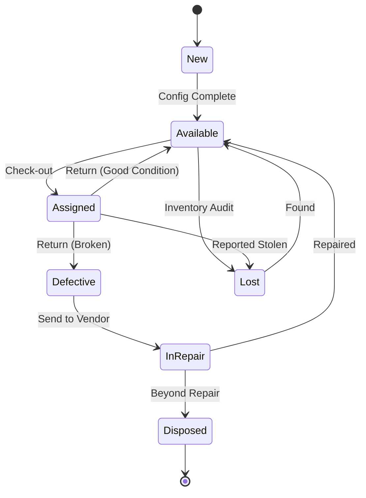

# Lifecycle State Diagram

```mermaid
stateDiagram-v2
    [*] --> New
    New --> Available : Config Complete

    Available --> Assigned : Check-out
    Assigned --> Available : Return (Good Condition)
    Assigned --> Defective : Return (Broken)

    Defective --> InRepair : Send to Vendor
    InRepair --> Available : Repaired
    InRepair --> Disposed : Beyond Repair

    Available --> Lost : Inventory Audit
    Assigned --> Lost : Reported Stolen

    Lost --> Available : Found

    Disposed --> [*]
```
