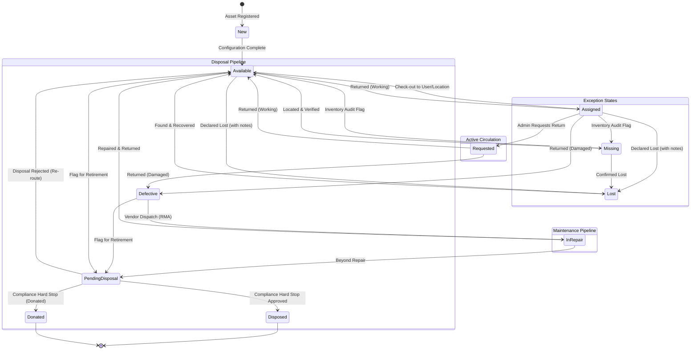
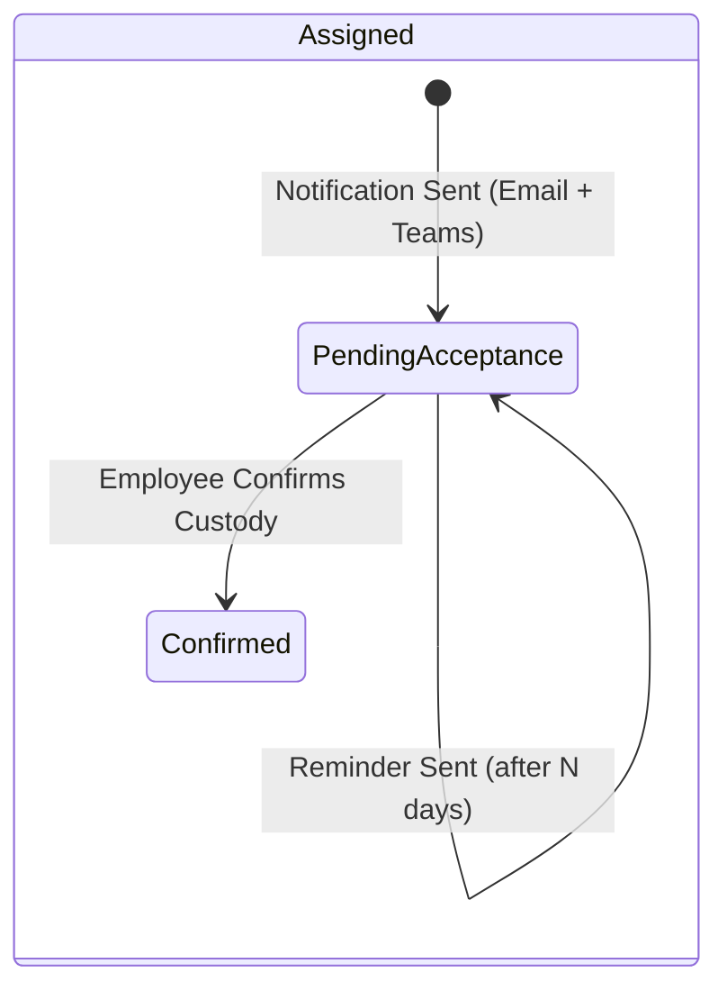

# Asset Lifecycle State Machine

This document defines the complete lifecycle state machine governing every asset in the IDAMS platform. It maps all valid states, transitions, triggers, guard conditions, and the roles authorized to initiate each transition. The state machine is the single source of truth that the Operations Service enforces at the API level (REQ-OPS-3.6, REQ-OPS-3.13).

## Table of Contents

- [1. State Definitions](#1-state-definitions)
- [2. State Machine Diagram](#2-state-machine-diagram)
- [3. Transition Rules](#3-transition-rules)
  - [3.1 Standard Lifecycle Transitions](#31-standard-lifecycle-transitions)
  - [3.2 Maintenance Pipeline Transitions](#32-maintenance-pipeline-transitions)
  - [3.3 Disposal Pipeline Transitions](#33-disposal-pipeline-transitions)
  - [3.4 Exception State Transitions](#34-exception-state-transitions)
- [4. Terminal State Rules](#4-terminal-state-rules)
- [5. Custody Acceptance Sub-States](#5-custody-acceptance-sub-states)
- [6. Blocked Transitions (Explicit Denials)](#6-blocked-transitions-explicit-denials)
- [7. Audit Trail Integration](#7-audit-trail-integration)
- [8. Traceability Matrix](#8-traceability-matrix)

## 1. State Definitions

All statuses listed below are the **built-in system statuses** that ship with IDAMS. Admins may create additional custom statuses via the Settings UI (REQ-OPS-3.6), but custom statuses cannot override or bypass the transition rules defined here.

| State                | `is_terminal` | Description                                                                                                                                               | Requirement              |
| :------------------- | :-----------: | :-------------------------------------------------------------------------------------------------------------------------------------------------------- | :----------------------- |
| **New**              |      No       | Asset record has been created but is not yet fully configured or ready for circulation.                                                                   | REQ-REG-2.1              |
| **Available**        |      No       | Asset is in stock, fully configured, and ready to be assigned to a user or location.                                                                      | REQ-OPS-3.6              |
| **Assigned**         |      No       | Asset is currently checked out to a specific user or location. Includes sub-states for custody acceptance tracking: _Pending Acceptance_ and _Confirmed_. | REQ-OPS-3.3, REQ-OPS-3.2 |
| **Requested**        |      No       | A return has been formally requested by an admin. The asset remains with the current custodian pending physical handover.                                 | REQ-OPS-3.11             |
| **Defective**        |      No       | Asset has been returned in damaged/broken condition and is queued for triage review.                                                                      | REQ-OPS-3.4, REQ-OPS-3.8 |
| **In Repair**        |      No       | Asset has been dispatched to an external vendor for repair, with an active RMA ticket.                                                                    | REQ-OPS-3.9              |
| **Pending Disposal** |      No       | Asset has been flagged for retirement and is awaiting executive financial review and compliance approval.                                                 | REQ-DSP-4.1, REQ-DSP-4.2 |
| **Lost**             |      No       | Asset cannot be located. Requires mandatory justification notes.                                                                                          | REQ-OPS-3.13             |
| **Missing**          |      No       | Asset is unaccounted for during an inventory audit but not formally declared lost.                                                                        | REQ-OPS-3.6              |
| **Disposed**         |      Yes      | Asset has completed the compliance disposal workflow (Hard Stop confirmed). All fields are locked; record is soft-deleted and archived.                   | REQ-DSP-4.4, REQ-DSP-4.8 |
| **Donated**          |      Yes      | Asset has been officially donated to an external party through the disposal compliance workflow.                                                          | REQ-DSP-4.5              |

## 2. State Machine Diagram

## 3. Transition Rules

Every row below defines a valid transition. Any transition **not** listed here is **blocked** by the state machine and returns a `400 Bad Request` with an explanatory error message.

### 3.1 Standard Lifecycle Transitions

|  #  | From          | To            | Trigger / Event                   | Guard Condition                                                             | Actor                  | Requirement               |
| :-: | :------------ | :------------ | :-------------------------------- | :-------------------------------------------------------------------------- | :--------------------- | :------------------------ |
| T1  | —             | **New**       | Asset registration form submitted | All mandatory fields validated; unique Asset ID generated                   | Global Admin           | REQ-REG-2.1               |
| T2  | **New**       | **Available** | Configuration marked complete     | All required master data fields populated                                   | Global Admin           | REQ-REG-2.1               |
| T3  | **Available** | **Assigned**  | Check-out assignment              | Target must be a User or Location (Teams blocked); asset status = Available | Global Admin, IT Admin | REQ-OPS-3.3               |
| T4  | **Assigned**  | **Requested** | Return request notification sent  | Custodian exists; Email/Teams notification dispatched                       | Global Admin, IT Admin | REQ-OPS-3.11              |
| T5  | **Assigned**  | **Available** | Return processed (Working)        | Mandatory condition check = "Working"                                       | Global Admin, IT Admin | REQ-OPS-3.4               |
| T6  | **Assigned**  | **Defective** | Return processed (Damaged)        | Mandatory condition check = "Defective"                                     | Global Admin, IT Admin | REQ-OPS-3.4               |
| T7  | **Requested** | **Available** | Return processed (Working)        | Custodian physically returns asset; condition = "Working"                   | Global Admin, IT Admin | REQ-OPS-3.4, REQ-OPS-3.11 |
| T8  | **Requested** | **Defective** | Return processed (Damaged)        | Custodian physically returns asset; condition = "Defective"                 | Global Admin, IT Admin | REQ-OPS-3.4, REQ-OPS-3.11 |

### 3.2 Maintenance Pipeline Transitions

|  #  | From          | To                   | Trigger / Event                     | Guard Condition                                                  | Actor    | Requirement  |
| :-: | :------------ | :------------------- | :---------------------------------- | :--------------------------------------------------------------- | :------- | :----------- |
| T9  | **Defective** | **In Repair**        | Vendor Dispatch (Initiate Repair)   | RMA Ticket Number, Estimated Cost, Expected Return Date captured | IT Admin | REQ-OPS-3.9  |
| T10 | **In Repair** | **Available**        | Close Repair (Repaired)             | Actual Final Cost entered; financial engine updated              | IT Admin | REQ-OPS-3.10 |
| T11 | **In Repair** | **Pending Disposal** | Beyond Repair — Flag for Retirement | Vendor confirms unrepairable; justification captured             | IT Admin | REQ-DSP-4.1  |

### 3.3 Disposal Pipeline Transitions

|  #  | From                 | To                   | Trigger / Event                | Guard Condition                                                                                                                          | Actor                       | Requirement                           |
| :-: | :------------------- | :------------------- | :----------------------------- | :--------------------------------------------------------------------------------------------------------------------------------------- | :-------------------------- | :------------------------------------ |
| T12 | **Defective**        | **Pending Disposal** | Flag for Retirement            | IT Admin submits disposal intake with justification                                                                                      | IT Admin                    | REQ-DSP-4.1                           |
| T13 | **Available**        | **Pending Disposal** | Flag for Retirement            | Admin submits disposal intake (e.g., obsolete equipment)                                                                                 | Global Admin                | REQ-DSP-4.1                           |
| T14 | **Pending Disposal** | **Available**        | Disposal Rejected — Re-route   | Mandatory rejection note provided; asset returns to active circulation                                                                   | Finance Admin, Global Admin | REQ-DSP-4.3                           |
| T15 | **Pending Disposal** | **Disposed**         | Compliance Hard Stop Approved  | Exact Asset ID text confirmation + Data Wiped checkbox + Tags Removed checkbox + Disposal reason captured + E-Waste certificate uploaded | Finance Admin, Global Admin | REQ-DSP-4.4, REQ-DSP-4.5, REQ-DSP-4.6 |
| T16 | **Pending Disposal** | **Donated**          | Compliance Hard Stop (Donated) | Same as T15 but disposal reason = "Donated"                                                                                              | Finance Admin, Global Admin | REQ-DSP-4.5                           |

### 3.4 Exception State Transitions

|  #  | From          | To            | Trigger / Event                    | Guard Condition                                           | Actor                  | Requirement  |
| :-: | :------------ | :------------ | :--------------------------------- | :-------------------------------------------------------- | :--------------------- | :----------- |
| T17 | **Available** | **Lost**      | Manual status override             | Mandatory justification notes required                    | Global Admin           | REQ-OPS-3.13 |
| T18 | **Assigned**  | **Lost**      | Manual status override             | Mandatory justification notes required                    | Global Admin           | REQ-OPS-3.13 |
| T19 | **Available** | **Missing**   | Inventory audit flag               | Justification notes required                              | Global Admin, IT Admin | REQ-OPS-3.6  |
| T20 | **Assigned**  | **Missing**   | Inventory audit flag               | Justification notes required                              | Global Admin, IT Admin | REQ-OPS-3.6  |
| T21 | **Lost**      | **Available** | Found & recovered                  | Justification notes required confirming physical recovery | Global Admin           | REQ-OPS-3.13 |
| T22 | **Missing**   | **Available** | Located & verified                 | Verification notes required                               | Global Admin, IT Admin | REQ-OPS-3.6  |
| T23 | **Missing**   | **Lost**      | Confirmed lost after investigation | Mandatory justification escalation notes                  | Global Admin           | REQ-OPS-3.13 |

## 4. Terminal State Rules

Once an asset reaches a **terminal state** (`is_terminal = true`), the following immutable rules apply:

| Rule                  | Description                                                                                                                                                             | Requirement             |
| :-------------------- | :---------------------------------------------------------------------------------------------------------------------------------------------------------------------- | :---------------------- |
| **Field Lock**        | All asset fields become read-only. `PUT`/`PATCH` requests targeting a disposed/donated asset are rejected with `403 Forbidden`.                                         | REQ-DSP-4.8, NFR-SEC-07 |
| **Soft Delete**       | The `is_archived` flag is set to `true`. The asset is hidden from all active registry endpoints, filters, and grid views.                                               | REQ-DSP-4.8             |
| **Data Preservation** | The complete asset record, all related assignments, maintenance records, financial data, and documents are retained for a minimum of **7 years** for compliance audits. | REQ-DSP-4.8, NFR-REL-06 |
| **Audit Trail**       | The disposal/donation event is permanently recorded in the `system_audit_logs` table with full before/after state.                                                      | REQ-FND-1.11            |
| **No Reversal**       | There is no valid transition **out** of `Disposed` or `Donated`. These states are irreversible by design.                                                               | REQ-DSP-4.8             |

## 5. Custody Acceptance Sub-States

When an asset transitions from **Available** → **Assigned** (T3), a custody acceptance sub-workflow is triggered:

| Sub-State              | Description                                                                                                                                     | Requirement |
| :--------------------- | :---------------------------------------------------------------------------------------------------------------------------------------------- | :---------- |
| **Pending Acceptance** | Automated Email & Teams notification dispatched to the assigned employee. Asset is functionally assigned but not yet formally acknowledged.     | REQ-OPS-3.2 |
| **Confirmed**          | Employee digitally confirms receipt via the notification link or the "My Assets" portal. Timestamp recorded in `asset_assignments.accepted_at`. | REQ-OPS-3.2 |

## 6. Blocked Transitions (Explicit Denials)

The following transitions are **explicitly prohibited** by the state machine. Attempts trigger a descriptive error:

| Attempted Transition                   | Reason Blocked                                                 | Error Message                                                                         |
| :------------------------------------- | :------------------------------------------------------------- | :------------------------------------------------------------------------------------ |
| **Lost** → **Assigned**                | A lost asset cannot be assigned without first being recovered. | "Asset must be transitioned to 'Available' (Found) before assignment."                |
| **Missing** → **Assigned**             | Same as above.                                                 | "Asset must be located and verified before assignment."                               |
| **In Repair** → **Assigned**           | Asset is physically with a vendor.                             | "Asset is currently dispatched for repair and cannot be assigned."                    |
| **Pending Disposal** → **Assigned**    | Asset is in the disposal compliance pipeline.                  | "Asset is pending disposal review. Reject the disposal request first to re-activate." |
| **Disposed** → _(any state)_           | Terminal state. Irreversible.                                  | "Disposed assets are permanently archived and cannot change state."                   |
| **Donated** → _(any state)_            | Terminal state. Irreversible.                                  | "Donated assets are permanently archived and cannot change state."                    |
| **Available** → **In Repair**          | Must go through Defective triage first.                        | "Asset must be marked 'Defective' before initiating a vendor repair dispatch."        |
| _(any state)_ → **Assigned** to a Team | Team assignment is structurally blocked.                       | "Assets can only be assigned to a User or a Location." (REQ-OPS-3.3)                  |

## 7. Audit Trail Integration

Every state transition listed in Section 3 generates an immutable record in the `system_audit_logs` table:

| Field          | Value                                                                                     |
| :------------- | :---------------------------------------------------------------------------------------- |
| `entity_type`  | `ASSET`                                                                                   |
| `entity_id`    | The asset's UUID                                                                          |
| `action_type`  | `STATUS_CHANGE`, `ASSIGN`, `RETURN`, or `DISPOSE` (depending on the transition)           |
| `old_value`    | JSONB snapshot containing the previous `status_id`, `status_name`, and assignment context |
| `new_value`    | JSONB snapshot containing the new `status_id`, `status_name`, and any justification notes |
| `performed_by` | UUID of the actor who triggered the transition                                            |
| `ip_address`   | True client IP from `X-Forwarded-For`                                                     |
| `performed_at` | Server-side UTC timestamp                                                                 |

For transitions requiring mandatory justification notes (T17–T23, T14), the notes are captured in the `new_value` JSONB payload under a `justification` key, ensuring permanent traceability.

## 8. Traceability Matrix

| Requirement                          | State Machine Element                                             |
| :----------------------------------- | :---------------------------------------------------------------- |
| REQ-OPS-3.2 (Digital Acceptance)     | Custody Acceptance sub-states (Section 5)                         |
| REQ-OPS-3.3 (Asset Assignments)      | T3; Team assignment blocked (Section 6)                           |
| REQ-OPS-3.4 (Asset Returns)          | T5–T8; condition check guard                                      |
| REQ-OPS-3.6 (Lifecycle Status)       | All 11 built-in states (Section 1); custom status support         |
| REQ-OPS-3.9 (Vendor Dispatch)        | T9; RMA/cost guard conditions                                     |
| REQ-OPS-3.10 (Cost Reconciliation)   | T10; Actual Final Cost guard                                      |
| REQ-OPS-3.11 (Request Asset Return)  | T4; Requested state                                               |
| REQ-OPS-3.13 (Status Override Rules) | T17–T23; mandatory justification; blocked transitions (Section 6) |
| REQ-DSP-4.1 (Disposal Intake)        | T11–T13; Pending Disposal state                                   |
| REQ-DSP-4.3 (Reject & Re-route)      | T14; rejection with mandatory notes                               |
| REQ-DSP-4.4 (Compliance Hard Stop)   | T15–T16; Asset ID confirmation + checkboxes guard                 |
| REQ-DSP-4.5 (Disposal Method)        | T15 (Disposed) vs T16 (Donated)                                   |
| REQ-DSP-4.8 (Soft Delete Finality)   | Terminal state rules (Section 4)                                  |
| REQ-FND-1.11 (Immutable Audit Log)   | Audit trail integration (Section 7)                               |
| NFR-SEC-07 (Soft-Delete Enforcement) | PUT/PATCH rejection on terminal states (Section 4)                |

[< Back to Requirements](../README.md)
