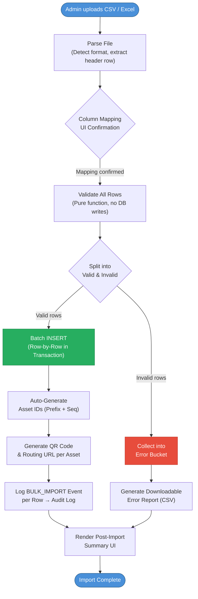

# Bulk Import - Partial Success Processing Engine

This document specifies the business logic for IDAMS's CSV/Excel bulk import system. The engine is designed around a **"Partial Success"** strategy: valid rows are committed individually while invalid rows are skipped and collected into a downloadable error report, ensuring that a single bad row never fails the entire batch.

## Table of Contents

- [1. Design Principles](#1-design-principles)
- [2. Supported File Formats](#2-supported-file-formats)
- [3. Import Pipeline Flowchart](#3-import-pipeline-flowchart)
- [4. Column Mapping & Validation Rules](#4-column-mapping--validation-rules)
- [5. Row-Level Processing Logic](#5-row-level-processing-logic)
- [6. Auto-Generation on Success](#6-auto-generation-on-success)
- [7. Error Report Schema](#7-error-report-schema)
- [8. Transaction & Concurrency Strategy](#8-transaction--concurrency-strategy)
- [9. Post-Import Summary UI](#9-post-import-summary-ui)
- [10. Traceability Matrix](#10-traceability-matrix)

## 1. Design Principles

| Principle                | Description                                                                                                                                                                          |
| :----------------------- | :----------------------------------------------------------------------------------------------------------------------------------------------------------------------------------- |
| **Partial Success**      | Each row is treated as an independent unit. A batch of 100 rows where 5 fail must still commit 95 successfully. The system never rolls back valid rows because of invalid siblings.  |
| **Fail-Safe Validation** | Every row is validated _before_ any database writes begin. Validation is a pure function with no side effects.                                                                       |
| **Descriptive Errors**   | Every rejected row carries a human-readable error message referencing the exact row number and failing column, enabling the uploader to fix and re-import only the failed subset.    |
| **Idempotent Re-Import** | Re-uploading a corrected file containing previously imported rows will hit the duplicate Serial Number guard and skip those rows cleanly, preventing accidental double-registration. |
| **Audit Completeness**   | Every successful row insertion logs a `BULK_IMPORT` action to the immutable audit log, recording the source filename and original row number.                                        |

## 2. Supported File Formats

| Format        | MIME Type                                                           | Parser Library                                   | Notes                                                         |
| :------------ | :------------------------------------------------------------------ | :----------------------------------------------- | :------------------------------------------------------------ |
| CSV           | `text/csv`                                                          | Native Node.js stream parser (e.g., `papaparse`) | UTF-8 BOM-aware. Comma or semicolon delimiters auto-detected. |
| Excel (.xlsx) | `application/vnd.openxmlformats-officedocument.spreadsheetml.sheet` | `exceljs` or `SheetJS`                           | Reads first worksheet only. Header row is mandatory on Row 1. |

- Maximum file size: **10 MB** (configurable).
- Maximum rows per upload: **5,000** rows (to remain within request timeout windows).
- Empty rows are silently skipped; they do not count as errors.

## 3. Import Pipeline Flowchart



## 4. Column Mapping & Validation Rules

### 4.1 Required Column Mappings

After file parsing, the UI displays a column mapping step where the admin confirms which file columns map to which system fields. The system attempts auto-mapping by matching header text to known field names.

| System Field        |  Required   | Expected Type   | Validation Rule                                                                                 |
| :------------------ | :---------: | :-------------- | :---------------------------------------------------------------------------------------------- |
| `asset_name`        |     Yes     | String          | Non-empty, max 255 chars                                                                        |
| `category`          |     Yes     | String (lookup) | Must match an existing active Category name or code in Master Data (D2)                         |
| `serial_number`     | Conditional | String          | Required unless category is flagged as `Consumable`. Must be globally unique across all assets. |
| `brand`             |     Yes     | String (lookup) | Must match an existing Brand in Master Data                                                     |
| `model`             |     Yes     | String (lookup) | Must match an existing Model linked to the matched Brand                                        |
| `location`          |     Yes     | String (lookup) | Must resolve to an active Location in the hierarchy (Building > Floor > Room)                   |
| `vendor`            |     No      | String (lookup) | If provided, must match an existing active Vendor                                               |
| `purchase_date`     |     Yes     | Date            | ISO 8601 (`YYYY-MM-DD`). Cannot be a future date.                                               |
| `base_price`        |     Yes     | Numeric         | Positive decimal, max 2 decimal places                                                          |
| `tax_amount`        |     No      | Numeric         | Non-negative decimal, defaults to `0.00`                                                        |
| `shipping_cost`     |     No      | Numeric         | Non-negative decimal, defaults to `0.00`                                                        |
| `currency`          |     Yes     | String (enum)   | One of: `NOK`, `USD`, `LKR`                                                                     |
| `warranty_expiry`   |     No      | Date            | ISO 8601. Must be after `purchase_date`.                                                        |
| `useful_life_years` |     No      | Integer         | Positive integer (1–50), used for depreciation calculation                                      |
| `notes`             |     No      | String          | Free text, max 1000 chars                                                                       |

### 4.2 Dynamic Custom Fields

If a category defines EAV custom fields (via Epic 1's Schema Builder), the admin can optionally map file columns to those custom fields. Validation rules for each custom field (Text, Number, Dropdown) are applied based on the category's stored schema definition.

## 5. Row-Level Processing Logic

Each row passes through the following sequential validation stages. Processing **stops at the first failure** per row (fail-fast), and the row is moved to the Error Bucket.

```
┌──────────────────────────────────────────────────────────────────┐
│  Stage 1: Structural Check                                       │
│  → All required columns present? Non-empty?                      │
├──────────────────────────────────────────────────────────────────┤
│  Stage 2: Type Coercion                                          │
│  → Can date strings parse? Are numerics valid decimals?          │
├──────────────────────────────────────────────────────────────────┤
│  Stage 3: Referential Integrity (In-Memory Cache)                │
│  → Does the Category exist? Does the Brand/Model pair exist?     │
│  → Does the Location resolve? Is the Vendor active?              │
│  Note: Master Data is pre-loaded into memory before validation.  │
├──────────────────────────────────────────────────────────────────┤
│  Stage 4: Business Rule Check                                    │
│  → Serial Number globally unique? (checked against DB + batch)   │
│  → Purchase date ≤ today?                                        │
│  → Warranty expiry > purchase date?                              │
│  → Consumable rows skip serial number requirement?               │
├──────────────────────────────────────────────────────────────────┤
│  Stage 5: EAV Custom Field Validation (if applicable)            │
│  → Custom fields match the category schema types?                │
│  → Dropdown values are among the allowed options?                │
└──────────────────────────────────────────────────────────────────┘
```

### 5.1 Intra-Batch Duplicate Detection

Serial Numbers must be unique not only against the database but also **within the current batch**. If rows 12 and 47 both contain `SN-DELL-5540-001`, both are rejected with:

> _"Duplicate Serial Number 'SN-DELL-5540-001' found within the uploaded file (rows 12 and 47). Remove the duplicate and re-import."_

## 6. Auto-Generation on Success

For each valid row that passes all five validation stages, the system performs the following auto-generation steps during the INSERT:

| Generated Artifact     | Logic                                                                                                                                          | Example                           |
| :--------------------- | :--------------------------------------------------------------------------------------------------------------------------------------------- | :-------------------------------- |
| **Asset ID**           | Category Prefix + zero-padded sequential number. The sequence is scoped per-category and uses `SELECT MAX()` + 1 within the batch transaction. | `LAP-0143`                        |
| **QR Code**            | Routing URL `assets.tiqri.com/asset/{ASSET_ID}` encoded as an SVG/Base64 QR image, stored in File Storage (Azure Blob / S3).                   | `assets.tiqri.com/asset/LAP-0143` |
| **Initial Status**     | All newly imported assets default to `Available` (matching single-asset registration behaviour).                                               | `Available`                       |
| **Total Initial Cost** | `base_price + tax_amount + shipping_cost`, computed and stored alongside the original breakdown.                                               | `$1,250.00`                       |

## 7. Error Report Schema

The downloadable error report is generated as a CSV file named `import-errors-{timestamp}.csv`. It contains the following columns:

| Column          | Description                                                                                       |
| :-------------- | :------------------------------------------------------------------------------------------------ |
| `row_number`    | The 1-based row index from the original uploaded file (excluding header)                          |
| `asset_name`    | The value from the Name column (for easy identification)                                          |
| `serial_number` | The Serial Number value (if provided)                                                             |
| `error_stage`   | Which validation stage failed: `STRUCTURAL`, `TYPE`, `REFERENTIAL`, `BUSINESS_RULE`, `EAV_SCHEMA` |
| `error_field`   | The specific column/field that caused the failure                                                 |
| `error_message` | Human-readable description of the failure                                                         |

### Example Error Report

```csv
row_number,asset_name,serial_number,error_stage,error_field,error_message
5,Dell Latitude 5540,SN-DELL-5540-001,BUSINESS_RULE,serial_number,"Duplicate Serial Number 'SN-DELL-5540-001' already exists as Asset ID LAP-0089."
12,HP Monitor 27f,,STRUCTURAL,serial_number,"Serial Number is required for non-consumable category 'Monitors'."
23,Lenovo ThinkPad X1,SN-LEN-X1-042,REFERENTIAL,location,"Location 'Building C / Floor 5' does not exist in Master Data."
47,Dell Latitude 5540,SN-DELL-5540-001,BUSINESS_RULE,serial_number,"Duplicate Serial Number 'SN-DELL-5540-001' found within the uploaded file (rows 5 and 47)."
88,USB-C Cable,,TYPE,base_price,"Value 'twelve dollars' is not a valid numeric amount."
```

## 8. Transaction & Concurrency Strategy

### 8.1 Row-Level Commits

The engine does **not** wrap the entire batch in a single database transaction. Instead, each row is inserted within its own micro-transaction:

```
BEGIN;
  INSERT INTO assets (...) VALUES (...);
  INSERT INTO asset_costs (...) VALUES (...);
  INSERT INTO asset_custom_values (...) VALUES (...);  -- if EAV fields
COMMIT;
```

**Rationale**: A single-transaction approach for 5,000 rows would hold long-lived locks and risk timeout. Row-level commits ensure that completed inserts are durable even if the process crashes mid-batch.

### 8.2 Sequence Number Safety

Asset ID generation uses a `SELECT ... FOR UPDATE` lock on the category's current sequence counter to prevent two concurrent imports from generating overlapping IDs:

```
BEGIN;
  SELECT next_sequence FROM categories WHERE id = $1 FOR UPDATE;
  -- Increment by the number of valid rows for this category
  UPDATE categories SET next_sequence = next_sequence + $batch_count WHERE id = $1;
COMMIT;
```

The reserved sequence range is then distributed across valid rows without further locking.

### 8.3 Concurrent Import Guard

Only **one bulk import job** may execute at a time. A database advisory lock (`pg_advisory_lock`) is acquired at the start of the import job. If a second admin attempts to upload simultaneously, the system responds:

> _"A bulk import is currently in progress. Please wait for it to complete before uploading another file."_

---

## 9. Post-Import Summary UI

Upon completion, the system renders a modal summary card:

```
┌─────────────────────────────────────────────────────┐
│  ✓  Bulk Import Complete                            │
│                                                     │
│  File:        asset-migration-batch-3.xlsx          │
│  Total Rows:  100                                   │
│  ─────────────────────────────────────────────      │
│  ✓ Imported:  95 assets                             │
│  ✗ Failed:    5 rows                                │
│  ⊘ Skipped:   0 empty rows                          │
│                                                     │
│  ┌───────────────────────────────────────────┐      │
│  │  ↓ Download Error Report (CSV)            │      │
│  └───────────────────────────────────────────┘      │
│                                                     │
│  [ View Imported Assets ]     [ Close ]             │
└─────────────────────────────────────────────────────┘
```

- **"View Imported Assets"** deep-links to the main registry grid pre-filtered to show only assets created in this batch (filtered by `created_at` timestamp range).
- **"Download Error Report"** triggers the CSV download described in Section 7.
- The summary card also displays if 0 rows failed (100% success) — in which case the error report download link is hidden.

## 10. Traceability Matrix

| Specification Section                          | Requirement IDs          | User Story |
| :--------------------------------------------- | :----------------------- | :--------- |
| Supported File Formats (CSV + Excel)           | REQ-REG-2.9              | US-2.1.5   |
| Partial Success Processing                     | REQ-REG-2.10, NFR-REL-03 | US-2.1.5   |
| Serial Number Uniqueness (DB + intra-batch)    | REQ-REG-2.16             | US-2.1.1   |
| Downloadable Error Report                      | REQ-REG-2.10             | US-2.1.5   |
| Auto-Generated Asset ID (Category Prefix)      | REQ-REG-2.1, REQ-FND-1.6 | US-2.1.1   |
| Auto-Generated QR Code per Row                 | REQ-REG-2.11             | US-2.3.1   |
| Financial Data Capture (Base + Tax + Shipping) | REQ-REG-2.2, REQ-REG-2.3 | US-2.1.3   |
| Master Data Referential Validation             | REQ-FND-1.10             | —          |
| Dynamic EAV Custom Field Validation            | REQ-FND-1.7              | US-2.1.2   |
| Audit Log Entry per Imported Row               | REQ-FND-1.11, NFR-SEC-05 | —          |
| Descriptive Error Messages                     | NFR-USE-04               | —          |
| Concurrent Import Guard                        | NFR-PERF-07              | —          |

[< Back to Requirements](../README.md)
