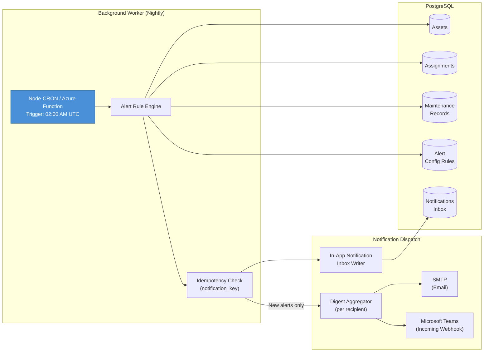
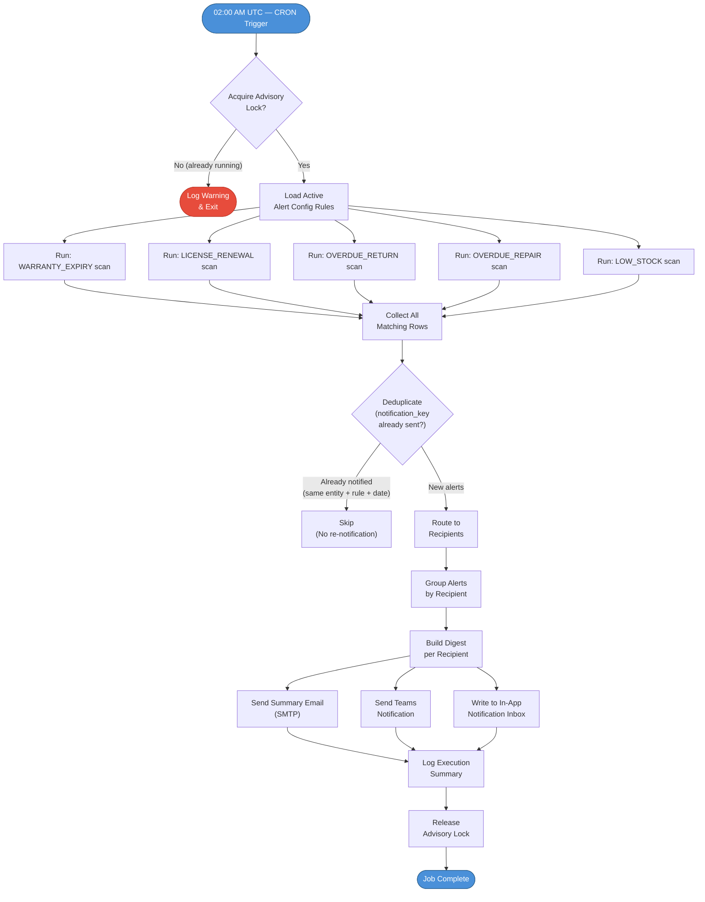
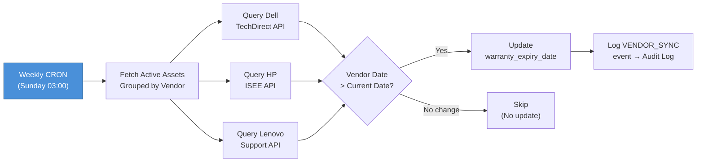

# CRON Alert Engine — Background Scheduler & Notification Dispatch

This document specifies the business logic for IDAMS's background CRON engine the nightly scheduler service that proactively scans the database for threshold breaches and dispatches notifications to the relevant stakeholders via Email, Microsoft Teams, and the in-app Notification Inbox.

## Table of Contents

- [1. Design Principles](#1-design-principles)
- [2. Architecture Overview](#2-architecture-overview)
- [3. Scheduler Configuration](#3-scheduler-configuration)
- [4. Alert Rule Definitions](#4-alert-rule-definitions)
  - [4.1 Warranty Expiration Alert](#41-warranty-expiration-alert)
  - [4.2 Software License Renewal Alert](#42-software-license-renewal-alert)
  - [4.3 Overdue Asset Return Alert](#43-overdue-asset-return-alert)
  - [4.4 Overdue Active Repair Alert](#44-overdue-active-repair-alert)
  - [4.5 Low Consumable Stock Alert](#45-low-consumable-stock-alert)
- [5. CRON Execution Flowchart](#5-cron-execution-flowchart)
- [6. Notification Dispatch Logic](#6-notification-dispatch-logic)
- [7. Digest Aggregation Strategy](#7-digest-aggregation-strategy)
- [8. Retry & Failure Handling](#8-retry--failure-handling)
- [9. Admin Alert Configuration UI](#9-admin-alert-configuration-ui)
- [10. Vendor API Warranty Sync (Optional)](#10-vendor-api-warranty-sync-optional)
- [11. Notification Inbox Integration](#11-notification-inbox-integration)
- [12. Traceability Matrix](#12-traceability-matrix)

## 1. Design Principles

| Principle                   | Description                                                                                                                                             |
| :-------------------------- | :------------------------------------------------------------------------------------------------------------------------------------------------------ |
| **Proactive, Not Reactive** | The system detects threshold breaches before they become incidents — admins are warned 30/60/90 days ahead, not after expiry.                           |
| **Single Digest**           | The engine sends **one aggregated summary email** per recipient per nightly run, not one email per alert. This prevents inbox flooding.                 |
| **Configurable Thresholds** | Global Admins control alert lead times and toggle rules on/off from the Settings UI. The CRON engine reads these settings dynamically each run.         |
| **Exponential Backoff**     | All outbound delivery channels (SMTP, Teams webhook, vendor API) implement retry with exponential backoff to handle transient failures.                 |
| **Idempotent Execution**    | Running the same job twice on the same night must not produce duplicate notifications. Each alert is keyed by `(entity_id, rule_type, threshold_date)`. |
| **Targeted Routing**        | Alerts are sent to the most relevant actor: overdue repair alerts go to the IT Admin who dispatched the ticket, not the global distribution list.       |

## 2. Architecture Overview



## 3. Scheduler Configuration

| Parameter           | Value                                                                   | Notes                                                                                                    |
| :------------------ | :---------------------------------------------------------------------- | :------------------------------------------------------------------------------------------------------- |
| **Schedule**        | `0 2 * * *` (02:00 AM UTC daily)                                        | Runs during off-peak hours to minimise database load.                                                    |
| **Runtime**         | Node-CRON (self-hosted) or Azure Functions Timer Trigger                | Environment-dependent; both execute the same alert rule engine code.                                     |
| **Timeout**         | 10 minutes max                                                          | If the job exceeds this timeout, it terminates gracefully, logs the partial run, and retries next night. |
| **Singleton Guard** | Database advisory lock (`pg_advisory_lock(42001)`)                      | Prevents overlapping executions if the previous run has not finished.                                    |
| **Config Reload**   | Every execution reads the latest `alert_config_rules` from the database | Admins can change thresholds during the day; the next nightly run picks up the changes automatically.    |

## 4. Alert Rule Definitions

### 4.1 Warranty Expiration Alert

| Property               | Value                                                                                                                               |
| :--------------------- | :---------------------------------------------------------------------------------------------------------------------------------- |
| **Rule Key**           | `WARRANTY_EXPIRY`                                                                                                                   |
| **Default Threshold**  | 30 days before expiry                                                                                                               |
| **Configurable Range** | 14 – 180 days                                                                                                                       |
| **Query Target**       | `assets` table where `warranty_expiry_date` is NOT NULL, `is_archived = false`, and the asset status is not `Disposed` or `Donated` |
| **Recipient**          | Global Admins + IT Operations distribution list                                                                                     |
| **Deep-Link**          | `/assets/{asset_id}` (Asset Details panel)                                                                                          |

**SQL Logic (Pseudocode)**:

```sql
SELECT id, asset_name, serial_number, warranty_expiry_date,
       warranty_expiry_date - CURRENT_DATE AS days_remaining
FROM assets
WHERE is_archived = false
  AND status NOT IN ('Disposed', 'Donated')
  AND warranty_expiry_date IS NOT NULL
  AND warranty_expiry_date BETWEEN CURRENT_DATE
      AND CURRENT_DATE + INTERVAL '{threshold} days';
```

### 4.2 Software License Renewal Alert

| Property               | Value                                                                                                    |
| :--------------------- | :------------------------------------------------------------------------------------------------------- |
| **Rule Key**           | `LICENSE_RENEWAL`                                                                                        |
| **Default Threshold**  | 30 days before expiry                                                                                    |
| **Configurable Range** | 14 – 180 days                                                                                            |
| **Query Target**       | `assets` table where category type is `Software`, `license_expiry_date` is NOT NULL, and asset is active |
| **Recipient**          | Assigned IT Admin for the software asset                                                                 |
| **Deep-Link**          | `/assets/{asset_id}`                                                                                     |

**SQL Logic (Pseudocode)**:

```sql
SELECT a.id, a.asset_name, a.license_expiry_date,
       a.license_expiry_date - CURRENT_DATE AS days_remaining
FROM assets a
JOIN categories c ON a.category_id = c.id
WHERE a.is_archived = false
  AND c.is_software = true
  AND a.license_expiry_date IS NOT NULL
  AND a.license_expiry_date BETWEEN CURRENT_DATE
      AND CURRENT_DATE + INTERVAL '{threshold} days';
```

### 4.3 Overdue Asset Return Alert

| Property               | Value                                                                                                          |
| :--------------------- | :------------------------------------------------------------------------------------------------------------- |
| **Rule Key**           | `OVERDUE_RETURN`                                                                                               |
| **Default Threshold**  | 0 days (triggers when `expected_return_date < CURRENT_DATE`)                                                   |
| **Configurable Range** | 0 – 14 days grace period                                                                                       |
| **Query Target**       | `asset_assignments` table where `expected_return_date < CURRENT_DATE - grace_period` and `returned_at IS NULL` |
| **Recipient**          | Global Admins + the specific Admin who created the assignment                                                  |
| **Deep-Link**          | `/operations/assignments/{assignment_id}`                                                                      |

**SQL Logic (Pseudocode)**:

```sql
SELECT aa.id, aa.asset_id, a.asset_name, aa.assigned_to_user_id,
       u.display_name AS custodian_name,
       aa.expected_return_date,
       CURRENT_DATE - aa.expected_return_date AS days_overdue
FROM asset_assignments aa
JOIN assets a ON aa.asset_id = a.id
JOIN users u ON aa.assigned_to_user_id = u.id
WHERE aa.returned_at IS NULL
  AND aa.expected_return_date IS NOT NULL
  AND aa.expected_return_date < CURRENT_DATE - INTERVAL '{grace_days} days';
```

### 4.4 Overdue Active Repair Alert

| Property               | Value                                                                                        |
| :--------------------- | :------------------------------------------------------------------------------------------- |
| **Rule Key**           | `OVERDUE_REPAIR`                                                                             |
| **Default Threshold**  | 0 days (triggers when `expected_return_date < CURRENT_DATE`)                                 |
| **Configurable Range** | 0 – 7 days grace period                                                                      |
| **Query Target**       | `maintenance_records` where `status = 'In Repair'` and `expected_return_date < CURRENT_DATE` |
| **Recipient**          | The specific IT Admin who dispatched the repair ticket (`created_by` user)                   |
| **Deep-Link**          | `/operations/maintenance/{ticket_id}`                                                        |

**SQL Logic (Pseudocode)**:

```sql
SELECT mr.id, mr.asset_id, a.asset_name, mr.vendor_id,
       v.vendor_name, mr.expected_return_date,
       CURRENT_DATE - mr.expected_return_date AS days_overdue,
       mr.created_by AS dispatcher_user_id
FROM maintenance_records mr
JOIN assets a ON mr.asset_id = a.id
JOIN vendors v ON mr.vendor_id = v.id
WHERE mr.status = 'In Repair'
  AND mr.expected_return_date IS NOT NULL
  AND mr.expected_return_date < CURRENT_DATE - INTERVAL '{grace_days} days';
```

### 4.5 Low Consumable Stock Alert

| Property               | Value                                                              |
| :--------------------- | :----------------------------------------------------------------- |
| **Rule Key**           | `LOW_STOCK`                                                        |
| **Default Threshold**  | 10 units minimum                                                   |
| **Configurable Range** | 1 – 500 units                                                      |
| **Query Target**       | `assets` where category is `Consumable` and `quantity < threshold` |
| **Recipient**          | Global Admins                                                      |
| **Deep-Link**          | `/assets/{asset_id}`                                               |

## 5. CRON Execution Flowchart



## 6. Notification Dispatch Logic

Each alert is dispatched to **three channels simultaneously**:

| Channel             | Mechanism                                                                       | Payload                                                                                                                    |
| :------------------ | :------------------------------------------------------------------------------ | :------------------------------------------------------------------------------------------------------------------------- |
| **Email (SMTP)**    | Aggregated HTML digest email sent to the recipient's Azure AD email address     | Subject: `[IDAMS] Daily Alert Digest — {date}`. Body contains an HTML table grouped by alert type with deep-link URLs.     |
| **Microsoft Teams** | Incoming Webhook or Graph API adaptive card posted to the designated IT channel | Card includes alert summary counts, top 5 critical items, and a "View All" button linking to the IDAMS Notification Inbox. |
| **In-App Inbox**    | Row inserted into the `notifications` table per alert per recipient             | Stores: `user_id`, `title`, `body`, `deep_link_url`, `is_read = false`, `created_at`.                                      |

### Channel Priority

If a channel fails after all retries:

1. **In-App Inbox** — always written (direct DB insert, highest reliability).
2. **Email** — retried with exponential backoff (see Section 8).
3. **Teams** — retried with exponential backoff; failure is logged but does not block email or inbox delivery.

Channels operate independently. A Teams failure does not prevent email delivery.

## 7. Digest Aggregation Strategy

Instead of sending N emails for N alerts, the engine groups all alerts per recipient into a single digest:

```
┌─────────────────────────────────────────────────────────────┐
│  Subject: [IDAMS] Daily Alert Digest — Feb 26, 2026        │
│                                                             │
│   WARRANTY EXPIRING (3 assets)                            │
│  ├─ LAP-0142 — Dell Latitude 5540 — Expires: Mar 28, 2026  │
│  ├─ MON-0089 — HP 27f Monitor — Expires: Mar 15, 2026      │
│  └─ SRV-0011 — Lenovo ThinkSystem — Expires: Apr 01, 2026  │
│                                                             │
│  LICENSE RENEWAL (1 asset)                               │
│  └─ SFT-0023 — Adobe Creative Cloud — Expires: Mar 20, 2026│
│                                                             │
│   OVERDUE RETURNS (2 assignments)                         │
│  ├─ LAP-0077 — Assigned to Mark Kim — 5 days overdue       │
│  └─ TAB-0031 — Assigned to Jane Doe — 2 days overdue       │
│                                                             │
│   OVERDUE REPAIRS (1 ticket)                              │
│  └─ LAP-0099 — At HP Service Center — 3 days overdue       │
│                                                             │
│  [View All in IDAMS →]                                      │
└─────────────────────────────────────────────────────────────┘
```

### Aggregation Rules

- Alerts within the same `rule_type` are grouped together.
- Within each group, items are sorted by urgency (fewest days remaining first).
- If a single digest exceeds **50 alert items**, the email truncates to the top 50 and appends: _"... and {N} more. View all alerts in the Notification Center."_

## 8. Retry & Failure Handling

All outbound dispatchers implement **exponential backoff** to handle transient delivery failures:

| Attempt |   Delay    | Max Attempts |
| :-----: | :--------: | :----------: |
|    1    | Immediate  |      —       |
|    2    | 30 seconds |      —       |
|    3    | 2 minutes  |      —       |
|    4    | 8 minutes  |      —       |
|    5    | 30 minutes |    Final     |

### Failure Scenarios

| Scenario                                   | Behaviour                                                                                                               |
| :----------------------------------------- | :---------------------------------------------------------------------------------------------------------------------- |
| **SMTP server temporarily unavailable**    | Retry 5 times with backoff. After exhaustion, log error and mark email as `FAILED` in the job execution log.            |
| **Teams webhook returns 429 (rate limit)** | Honour the `Retry-After` header, then resume dispatch.                                                                  |
| **Teams webhook permanently fails**        | Log error; email and inbox delivery proceed independently.                                                              |
| **Database connection loss during scan**   | Job terminates, releases advisory lock, and logs a `CRITICAL` error. Retries automatically on the next nightly trigger. |
| **Vendor API unavailable (Section 10)**    | Skip affected vendor, log warning, apply exponential backoff on next run.                                               |

### Execution Log

Every CRON execution writes a summary row to `cron_execution_log`:

| Column             | Type        | Description                                      |
| :----------------- | :---------- | :----------------------------------------------- |
| `id`               | BIGSERIAL   | Auto-increment PK                                |
| `executed_at`      | TIMESTAMPTZ | Job start time                                   |
| `duration_ms`      | INTEGER     | Total execution time                             |
| `alerts_generated` | INTEGER     | Count of new alerts created                      |
| `emails_sent`      | INTEGER     | Successful email dispatches                      |
| `emails_failed`    | INTEGER     | Failed email dispatches (after all retries)      |
| `teams_sent`       | INTEGER     | Successful Teams dispatches                      |
| `teams_failed`     | INTEGER     | Failed Teams dispatches                          |
| `inbox_entries`    | INTEGER     | Notification Inbox rows written                  |
| `status`           | ENUM        | `SUCCESS`, `PARTIAL_FAILURE`, `CRITICAL_FAILURE` |
| `error_log`        | TEXT        | Concatenated error messages (if any)             |

## 9. Admin Alert Configuration UI

Global Admins configure alert rules from **Settings > Alert Configuration**:

```
┌──────────────────────────────────────────────────────────────────┐
│  Alert Configuration Rules                                       │
│                                                                  │
│  ┌──── Rule ──────────────── Active ─── Threshold ─────────┐    │
│  │ Warranty Expiration        [✓]       [30] days before    │    │
│  │ Software License Renewal   [✓]       [30] days before    │    │
│  │ Overdue Asset Returns      [✓]       [ 0] days grace     │    │
│  │ Overdue Active Repairs     [✓]       [ 0] days grace     │    │
│  │ Low Consumable Stock       [ ]       [10] minimum units  │    │
│  └──────────────────────────────────────────────────────────┘    │
│                                                                  │
│  Email Distribution List: it-team@tiqri.com                      │
│  Teams Webhook URL:       https://outlook.office.com/webhook/... │
│                                                                  │
│  [ Save Configuration ]                                          │
└──────────────────────────────────────────────────────────────────┘
```

Each rule has:

- **Toggle switch** (`is_active`): Enabled/disabled. Disabled rules are skipped during the nightly scan.
- **Threshold input**: Numeric value with rule-specific unit (days / units).
- **Last triggered**: Read-only timestamp showing when this rule last generated alerts.

## 10. Vendor API Warranty Sync (Optional)

An optional sixth rule that periodically queries external vendor APIs to refresh warranty data:

| Property                     | Value                                                                                  |
| :--------------------------- | :------------------------------------------------------------------------------------- |
| **Rule Key**                 | `VENDOR_WARRANTY_SYNC`                                                                 |
| **Schedule**                 | Weekly (Sunday 03:00 AM UTC) — less frequent to respect vendor rate limits             |
| **Supported Vendors**        | Dell TechDirect, HP ISEE, Lenovo Support API                                           |
| **Query**                    | Batch serial numbers per vendor, query warranty endpoint                               |
| **On Success**               | Update `warranty_expiry_date` in the `assets` table if the vendor returns a newer date |
| **On Partial Failure**       | Log failed serial numbers; skip and retry next week                                    |
| **On Vendor Unavailability** | Log warning, skip vendor entirely, apply exponential backoff multiplier on next run    |



Admin configuration includes **per-vendor toggle switches** and optional API credential fields stored encrypted in the database (AES-256 via Key Vault).

## 11. Notification Inbox Integration

Every alert generated by the CRON engine creates a row in the `notifications` table:

| Column             | Type         | Description                                                                           |
| :----------------- | :----------- | :------------------------------------------------------------------------------------ |
| `id`               | BIGSERIAL    | Auto-increment PK                                                                     |
| `user_id`          | UUID (FK)    | Recipient user                                                                        |
| `title`            | VARCHAR(255) | Alert headline (e.g., _"Warranty Expiring: LAP-0142"_)                                |
| `body`             | TEXT         | Detailed alert message                                                                |
| `alert_type`       | ENUM         | `WARRANTY_EXPIRY`, `LICENSE_RENEWAL`, `OVERDUE_RETURN`, `OVERDUE_REPAIR`, `LOW_STOCK` |
| `deep_link_url`    | VARCHAR(500) | Relative URL to navigate directly to the affected entity                              |
| `is_read`          | BOOLEAN      | Default `false`. Set to `true` when user clicks the notification.                     |
| `notification_key` | VARCHAR(255) | Unique key `{entity_id}:{rule_type}:{threshold_date}` for idempotency                 |
| `created_at`       | TIMESTAMPTZ  | Auto-set on insert                                                                    |

### UI Behaviour

- **Bell Icon Badge**: Displays the count of `WHERE is_read = false AND user_id = $current_user`.
- **Dropdown List**: Shows latest 20 unread notifications sorted by `created_at DESC`.
- **Click Action**: Marks `is_read = true` and navigates to `deep_link_url`.
- **"Mark All as Read"**: Bulk updates `is_read = true` for all the user's unread notifications.

## 12. Traceability Matrix

| Specification Section               | Requirement IDs           | User Story |
| :---------------------------------- | :------------------------ | :--------- |
| Warranty Expiration Alert           | REQ-FIN-5.8, REQ-FIN-5.9  | US-5.3.1   |
| Software License Renewal Alert      | REQ-FIN-5.8, REQ-FIN-5.9  | US-5.3.1   |
| Overdue Asset Return Alert          | REQ-FIN-5.8, REQ-OPS-3.11 | US-5.3.1   |
| Overdue Active Repair Alert         | REQ-FIN-5.8, REQ-FIN-5.9  | US-5.3.1   |
| Low Consumable Stock Alert          | REQ-FIN-5.1, REQ-FIN-5.2  | US-5.1.1   |
| Email Digest (SMTP)                 | REQ-FIN-5.8, NFR-PERF-05  | US-5.3.1   |
| Microsoft Teams Dispatch            | REQ-FIN-5.8, REQ-OPS-3.2  | US-5.3.1   |
| Notification Inbox (Bell Icon)      | REQ-FIN-5.10              | US-5.3.2   |
| Admin Alert Configuration UI        | REQ-FIN-5.8, REQ-FIN-5.9  | US-5.3.1   |
| Exponential Backoff Retry Logic     | NFR-REL-05                | US-5.3.1   |
| Vendor API Warranty Sync            | REQ-FIN-5.11              | US-5.3.3   |
| Idempotent Execution                | NFR-REL-05                | —          |
| Targeted Alert Routing (dispatcher) | REQ-FIN-5.8               | US-5.3.1   |

[< Back to Requirements](../README.md)
