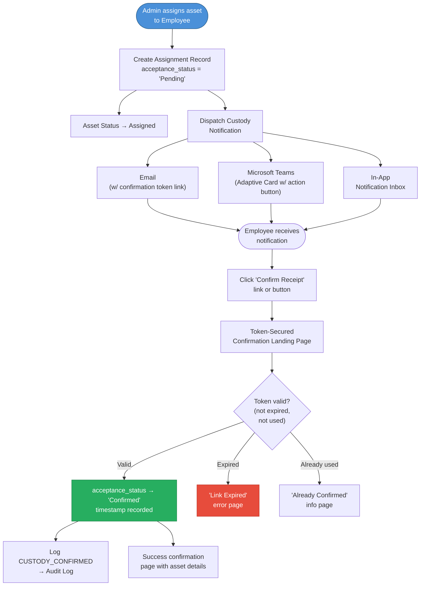
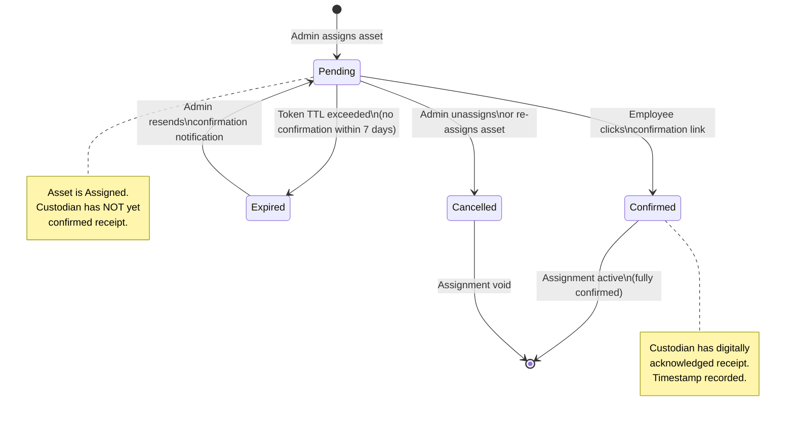
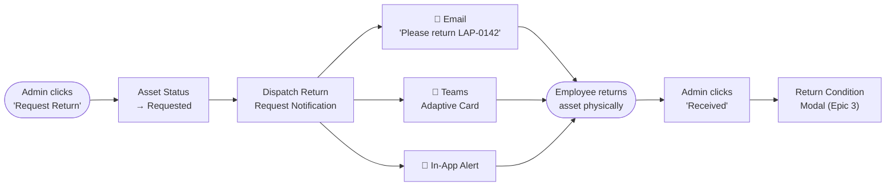

# Digital Acceptance — Custody Confirmation Workflow

This document specifies the business logic for IDAMS's Digital Acceptance system the automated workflow that dispatches custody confirmation requests to employees when hardware is assigned, and records their digital acknowledgement as proof of receipt.

## Table of Contents

- [1. Design Principles](#1-design-principles)
- [2. Workflow Overview](#2-workflow-overview)
- [3. Acceptance State Machine](#3-acceptance-state-machine)
- [4. Notification Dispatch](#4-notification-dispatch)
  - [4.1 Email Notification](#41-email-notification)
  - [4.2 Microsoft Teams Notification](#42-microsoft-teams-notification)
  - [4.3 In-App Notification](#43-in-app-notification)
- [5. Confirmation Token Security](#5-confirmation-token-security)
- [6. Confirmation Landing Page](#6-confirmation-landing-page)
- [7. Admin Visibility & Tracking](#7-admin-visibility--tracking)
- [8. Timeout & Escalation Rules](#8-timeout--escalation-rules)
- [9. Return Request Flow](#9-return-request-flow)
- [10. Audit Trail Integration](#10-audit-trail-integration)
- [11. Traceability Matrix](#11-traceability-matrix)

## 1. Design Principles

| Principle                      | Description                                                                                                                                                                                             |
| :----------------------------- | :------------------------------------------------------------------------------------------------------------------------------------------------------------------------------------------------------ |
| **Mandatory Confirmation**     | Every user-targeted assignment triggers a digital acceptance request. The system distinguishes between `Pending` (unconfirmed) and `Confirmed` (accepted) custody.                                      |
| **Multi-Channel Delivery**     | Custody notifications are dispatched simultaneously via Email, Microsoft Teams, and the in-app Notification Inbox to maximise reach.                                                                    |
| **Token-Secured Confirmation** | The confirmation link embeds a cryptographically secure, single-use, time-limited token. No authentication is required to confirm (the token _is_ the credential), but the token can only be used once. |
| **Non-Blocking Assignment**    | The assignment itself commits immediately. The asset status changes to `Assigned` upon admin action. The acceptance status is a **secondary sub-state** tracked on the `asset_assignments` record.      |
| **Audit Completeness**         | Every custody confirmation (or expiry) is logged as an immutable audit event with timestamp and actor identity.                                                                                         |

## 2. Workflow Overview



## 3. Acceptance State Machine

The `acceptance_status` field on the `asset_assignments` table tracks the custody confirmation sub-state independently from the asset's primary lifecycle status.



### State Definitions

| State         | Description                                                                                      | Trigger                               |
| :------------ | :----------------------------------------------------------------------------------------------- | :------------------------------------ |
| **Pending**   | Asset has been assigned by an admin; notification dispatched; employee has not yet confirmed.    | Admin completes the assignment modal. |
| **Confirmed** | Employee has clicked the confirmation link and the token was validated. Timestamp and IP logged. | Employee clicks valid token link.     |
| **Expired**   | The confirmation token's TTL has elapsed (default: 7 days) without employee action.              | Automatic (TTL expiry check).         |
| **Cancelled** | The assignment was voided before confirmation — admin unassigned or re-assigned the asset.       | Admin action (unassign / re-assign).  |

## 4. Notification Dispatch

When an admin completes an asset assignment, the system dispatches custody notifications to the assignee through all three channels simultaneously within 60 seconds (NFR-PERF-05).

### 4.1 Email Notification

An HTML email is sent to the employee's Azure AD email address:

```
┌──────────────────────────────────────────────────────────────┐
│  From: noreply@assets.tiqri.com                              │
│  To:   jane.doe@tiqri.com                                    │
│  Subject: [IDAMS] Asset Assigned — Please Confirm Receipt    │
│                                                              │
│  Hi Jane,                                                    │
│                                                              │
│  You have been assigned the following IT equipment:          │
│                                                              │
│  ┌────────────────────────────────────────────────────┐      │
│  │  Asset ID:    LAP-0142                             │      │
│  │  Description: Dell Latitude 5540                   │      │
│  │  Serial No:   SN-DELL-5540-001                     │      │
│  │  Category:    Laptops                              │      │
│  │  Assigned By: John Admin                           │      │
│  │  Assigned On: Feb 26, 2026                         │      │
│  │  Location:    Building A / Floor 3 / Room 301      │      │
│  └────────────────────────────────────────────────────┘      │
│                                                              │
│  By clicking the button below, you confirm that you have     │
│  physically received this equipment in good working order.   │
│                                                              │
│  ┌──────────────────────────────────────────┐                │
│  │        ✓  Confirm Receipt                │                │
│  └──────────────────────────────────────────┘                │
│  Link: https://assets.tiqri.com/confirm/{token}              │
│                                                              │
│  This link expires on: Mar 05, 2026 (7 days).               │
│  If you did not receive this equipment, contact IT support.  │
└──────────────────────────────────────────────────────────────┘
```

### 4.2 Microsoft Teams Notification

An Adaptive Card is posted to the employee's Teams chat (or the IT channel, depending on configuration):

```json
{
  "type": "AdaptiveCard",
  "version": "1.4",
  "body": [
    {
      "type": "TextBlock",
      "text": "📦 Asset Assigned to You",
      "weight": "Bolder",
      "size": "Medium"
    },
    {
      "type": "FactSet",
      "facts": [
        { "title": "Asset ID", "value": "LAP-0142" },
        { "title": "Description", "value": "Dell Latitude 5540" },
        { "title": "Assigned By", "value": "John Admin" },
        { "title": "Date", "value": "Feb 26, 2026" }
      ]
    },
    {
      "type": "TextBlock",
      "text": "Please confirm you have received this equipment.",
      "wrap": true
    }
  ],
  "actions": [
    {
      "type": "Action.OpenUrl",
      "title": "✓ Confirm Receipt",
      "url": "https://assets.tiqri.com/confirm/{token}"
    }
  ]
}
```

### 4.3 In-App Notification

A row is inserted into the `notifications` table:

| Field           | Value                                                         |
| :-------------- | :------------------------------------------------------------ |
| `user_id`       | Employee's user ID                                            |
| `title`         | _"Asset Assigned: LAP-0142 — Dell Latitude 5540"_             |
| `body`          | _"You have been assigned equipment. Please confirm receipt."_ |
| `alert_type`    | `CUSTODY_CONFIRMATION`                                        |
| `deep_link_url` | `/confirm/{token}`                                            |
| `is_read`       | `false`                                                       |

The Bell Icon badge increments, and clicking the notification navigates to the confirmation landing page.

## 5. Confirmation Token Security

| Property              | Specification                                                                                                                                                                         |
| :-------------------- | :------------------------------------------------------------------------------------------------------------------------------------------------------------------------------------ |
| **Token Format**      | 128-bit cryptographically random UUID v4 (e.g., `a3f8c9e2-1b4d-4a7e-9f2c-8d1e3a5b7c0d`)                                                                                               |
| **Generation**        | Generated server-side using `crypto.randomUUID()` at assignment time                                                                                                                  |
| **Storage**           | Stored as `confirmation_token` column on the `asset_assignments` table alongside `token_expires_at`                                                                                   |
| **TTL**               | 7 days from generation (configurable by Global Admin)                                                                                                                                 |
| **Single Use**        | Token is invalidated after first successful confirmation. Subsequent clicks receive "Already Confirmed" page.                                                                         |
| **No Auth Required**  | The confirmation page is publicly accessible — the token itself serves as the authentication credential. This enables confirmation from email clients without requiring IDAMS login.  |
| **HTTPS Enforcement** | The confirmation URL is always served over HTTPS (TLS 1.2+) per NFR-SEC-04.                                                                                                           |
| **Token Hashing**     | The token is stored as a SHA-256 hash in the database. The URL contains the raw token; the server hashes it on receipt for comparison. This prevents token theft via database access. |

## 6. Confirmation Landing Page

The public-facing confirmation page at `/confirm/{token}` handles three scenarios:

### 6.1 Successful Confirmation

```
┌────────────────────────────────────────────────────────────┐
│                                                            │
│            ✓  Receipt Confirmed Successfully               │
│                                                            │
│  You have confirmed custody of the following equipment:    │
│                                                            │
│  Asset ID:    LAP-0142                                     │
│  Description: Dell Latitude 5540                           │
│  Serial No:   SN-DELL-5540-001                             │
│  Confirmed:   Feb 26, 2026, 2:34 PM                        │
│                                                            │
│  This confirmation has been recorded in the system.        │
│  If you experience any issues with this equipment,         │
│  please use the "Report Issue" feature in IDAMS.           │
│                                                            │
│  [ Open My Assets → ]                                      │
│                                                            │
└────────────────────────────────────────────────────────────┘
```

**Backend Actions on Confirmation:**

1. Hash the raw token and compare against the stored SHA-256 hash.
2. Verify `token_expires_at > NOW()`.
3. Verify `acceptance_status = 'Pending'` (not already used).
4. Update `acceptance_status = 'Confirmed'`, `confirmed_at = NOW()`, `confirmed_ip = request IP`.
5. Invalidate the token (set `confirmation_token = NULL`).
6. Write audit log entry: `CUSTODY_CONFIRMED` with actor = employee, entity = assignment.

### 6.2 Expired Token

```
┌────────────────────────────────────────────────────────────┐
│                                                            │
│            ✗  Confirmation Link Expired                     │
│                                                            │
│  This confirmation link expired on Mar 05, 2026.           │
│                                                            │
│  Please contact your IT administrator to resend            │
│  the confirmation request.                                 │
│                                                            │
└────────────────────────────────────────────────────────────┘
```

### 6.3 Already Confirmed

```
┌────────────────────────────────────────────────────────────┐
│                                                            │
│            ℹ  Already Confirmed                             │
│                                                            │
│  This asset was already confirmed on Feb 26, 2026.         │
│  No further action is required.                            │
│                                                            │
│  [ Open My Assets → ]                                      │
│                                                            │
└────────────────────────────────────────────────────────────┘
```

## 7. Admin Visibility & Tracking

### 7.1 Assignment Table Badge

In the Admin's "Assigned Assets" tab, each assignment row displays a badge indicating the acceptance sub-state:

| Badge       | Colour | Meaning                                   |
| :---------- | :----- | :---------------------------------------- |
| `Pending`   | Yellow | Awaiting employee confirmation            |
| `Confirmed` | Green  | Employee has confirmed receipt            |
| `Expired`   | Red    | 7-day window elapsed without confirmation |

### 7.2 Resend Confirmation Action

If an acceptance is `Pending` or `Expired`, the admin can click **"Resend Confirmation"** from the Asset Details panel. This:

1. Generates a **new** token (invalidates the old one).
2. Resets `token_expires_at` to 7 days from now.
3. Sets `acceptance_status = 'Pending'` (if it was `Expired`).
4. Dispatches a fresh notification via Email, Teams, and Inbox.
5. Logs `ACCEPTANCE_RESENT` in the audit trail.

### 7.3 Bulk Acceptance Report

Admins can filter the Assigned Assets grid by `acceptance_status` to quickly identify all `Pending` or `Expired` confirmations and take action.

## 8. Timeout & Escalation Rules

| Rule                      | Threshold                     | Action                                                                                                                                            |
| :------------------------ | :---------------------------- | :------------------------------------------------------------------------------------------------------------------------------------------------ |
| **Token Expiry**          | 7 days (configurable)         | `acceptance_status` transitions to `Expired`. No automatic re-notification.                                                                       |
| **Escalation Reminder**   | 5 days (2 days before expiry) | CRON engine sends a reminder notification to the employee: _"Reminder: Please confirm receipt of LAP-0142. This link expires in 2 days."_         |
| **Admin Alert on Expiry** | 7 days (on expiry)            | CRON engine sends a notification to the assigning admin: _"Custody confirmation for LAP-0142 assigned to Jane Doe has expired without response."_ |

### Escalation Timeline

```
Day 0:  Asset assigned → Notification sent (Pending)
Day 5:  CRON sends reminder to employee (still Pending)
Day 7:  Token expires → acceptance_status = 'Expired'
        CRON alerts admin of expired acceptance
Day 7+: Admin manually resends or unassigns
```

## 9. Return Request Flow

When an admin initiates a return request (REQ-OPS-3.11), a separate notification is dispatched to the current custodian:



The return request notification uses the same multi-channel dispatch as custody confirmation but does **not** require a confirmation token — the physical return is verified by the admin in the "Return Condition" modal.

## 10. Audit Trail Integration

All custody-related events are logged to the immutable `system_audit_logs` table:

| Event                | `action_type`       | `old_values` (JSONB)                               | `new_values` (JSONB)                                                                           |
| :------------------- | :------------------ | :------------------------------------------------- | :--------------------------------------------------------------------------------------------- |
| Asset assigned       | `ASSIGN`            | `{ status: "Available" }`                          | `{ status: "Assigned", custodian: "Jane Doe", acceptance: "Pending" }`                         |
| Custody confirmed    | `CUSTODY_CONFIRMED` | `{ acceptance: "Pending" }`                        | `{ acceptance: "Confirmed", confirmed_at: "2026-02-26T14:34:00Z", confirmed_ip: "10.0.1.42" }` |
| Confirmation resent  | `ACCEPTANCE_RESENT` | `{ acceptance: "Expired" }`                        | `{ acceptance: "Pending", new_token_expires: "2026-03-05" }`                                   |
| Return requested     | `RETURN_REQUESTED`  | `{ status: "Assigned" }`                           | `{ status: "Requested" }`                                                                      |
| Assignment cancelled | `UNASSIGN`          | `{ custodian: "Jane Doe", acceptance: "Pending" }` | `{ custodian: null, acceptance: "Cancelled" }`                                                 |

## 11. Traceability Matrix

| Specification Section                     | Requirement IDs          | User Story |
| :---------------------------------------- | :----------------------- | :--------- |
| Multi-Channel Custody Notification        | REQ-OPS-3.2, NFR-PERF-05 | US-3.1.2   |
| Acceptance Sub-States (Pending/Confirmed) | REQ-OPS-3.2              | US-3.1.2   |
| Token-Secured Confirmation Page           | REQ-OPS-3.2              | US-3.1.2   |
| Email Template with Token Link            | REQ-OPS-3.2              | US-3.1.2   |
| Teams Adaptive Card Notification          | REQ-OPS-3.2              | US-3.1.2   |
| In-App Notification Inbox Entry           | REQ-FIN-5.10             | US-5.3.2   |
| Escalation Reminder (Day 5)               | REQ-FIN-5.9              | US-5.3.1   |
| Admin Expiry Alert                        | REQ-FIN-5.8              | US-5.3.1   |
| Resend Confirmation Action                | REQ-OPS-3.2              | US-3.1.2   |
| Return Request Notification               | REQ-OPS-3.11             | US-3.3.2   |
| Assignment to User or Location Only       | REQ-OPS-3.3              | US-3.3.1   |
| Audit Log (Custody Events)                | REQ-FND-1.11, NFR-SEC-05 | —          |
| HTTPS Token Security                      | NFR-SEC-04               | —          |
| Token Hashing (SHA-256)                   | NFR-SEC-03               | —          |
| "My Assets" Employee View                 | REQ-OPS-3.1              | US-3.1.1   |

[< Back to Requirements](../README.md)
