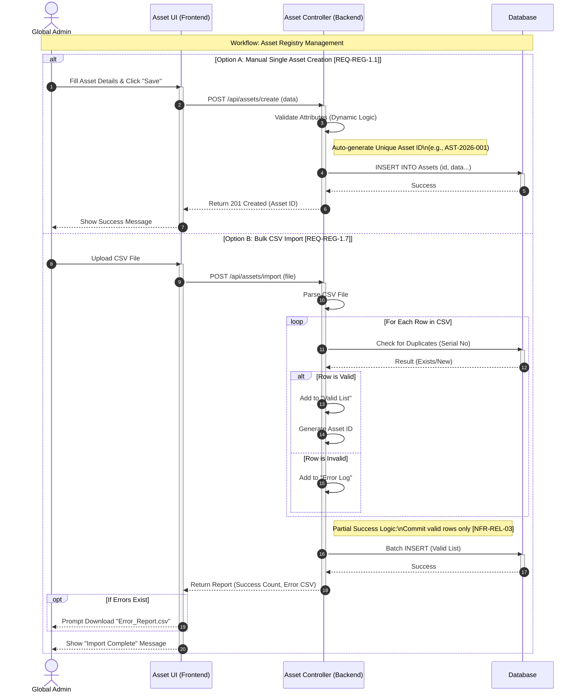
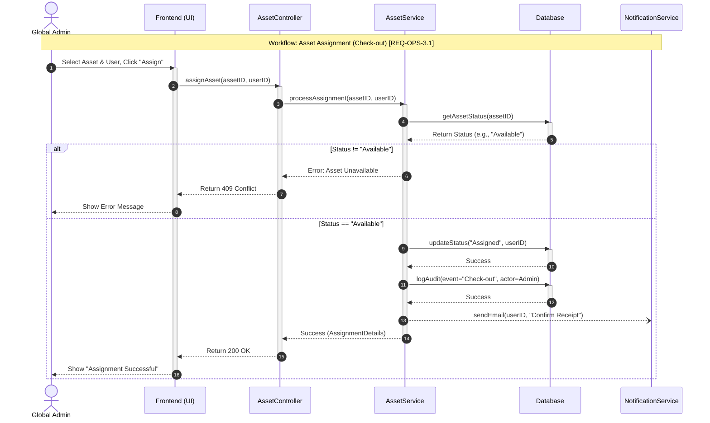
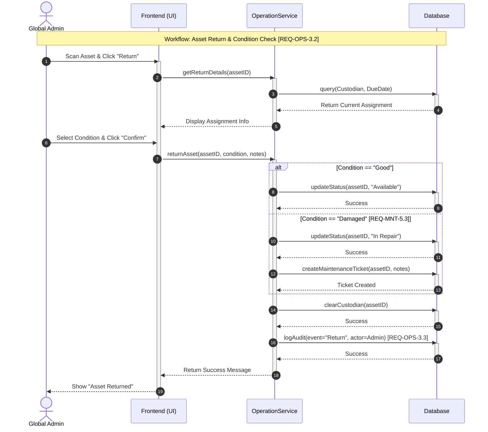
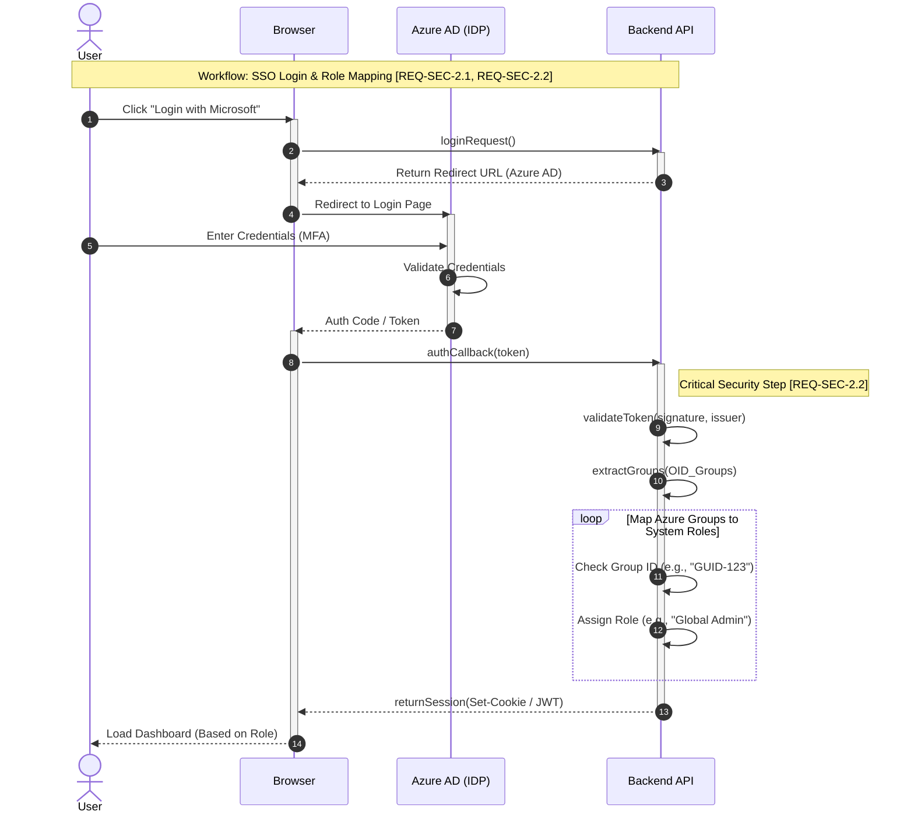

# Sequence Diagrams

This document contains key sequence diagrams for the IT Asset Management System.

## 1. Asset Registry

This diagram elaborates on the data flow for creating assets, specifically the Bulk Import logic.

- Loop Fragment: A loop block demonstrates the system iterating through parsed CSV rows. Inside, an alt (alternative) block separates valid rows from invalid ones.
- Partial Success: The logic concludes with a "Batch INSERT" for valid rows only, generating a "Success Count" and an "Error CSV" for the user, addressing the reliability requirement NFR-REL-03.

## 2. Asset assignment

This diagram traces the API calls required to assign an asset.

- Service Layer Logic: The AssetController delegates logic to AssetService. The service first calls getAssetStatus().
- Alternative Flow: An alt block handles the logic: if the status is not "Available," an error 409 is returned. If "Available," the system proceeds to updateStatus(), logAudit(), and finally calls the NotificationService to send the confirmation email.

## 3. Asset return

This diagram shows the complex logic of processing returns.

- Conditional Updates: The OperationService receives the returnAsset() call. An alt block differentiates the outcome based on the physical condition:
  - Condition = "Good": Status updates to "Available".
  - Condition = "Damaged": Status updates to "In Repair," and a secondary call createMaintenanceTicket() is triggered to initiate the repair workflow.
- Audit: Regardless of the condition, the flow ensures logAudit() is called to close the
  custody loop.

## 4. System login

This diagram visualizes the handshake between the User, the System, and the Azure AD Identity Provider (IDP).

- Critical Security Step: The diagram highlights the logic occurring after authCallback(token) is received. The Backend API validates the token signature and extracts the OID_Groups. It then iterates through these groups to map them to internal System Roles (e.g., "Global Admin"), fulfilling REQ-SEC-2.2.

