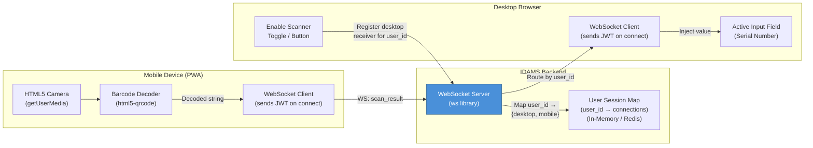
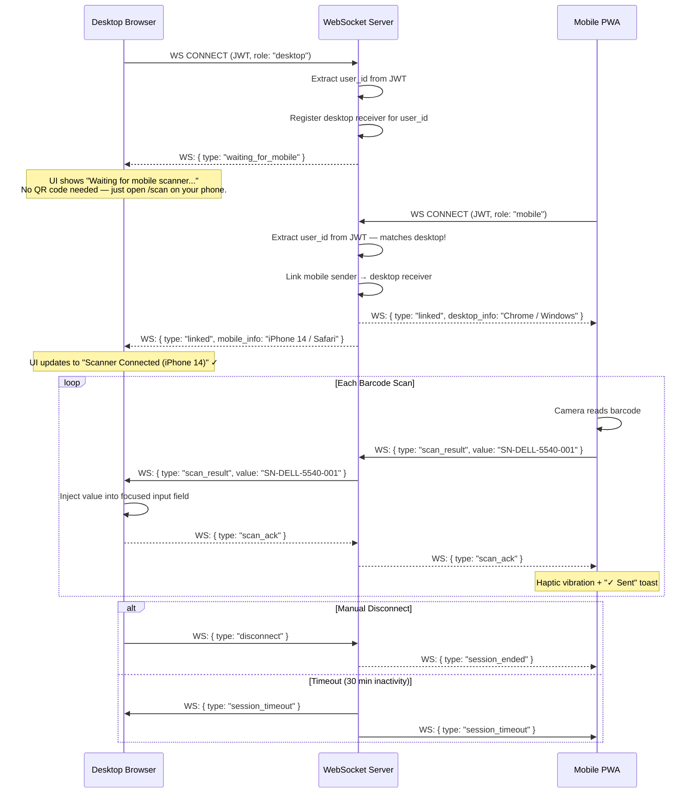
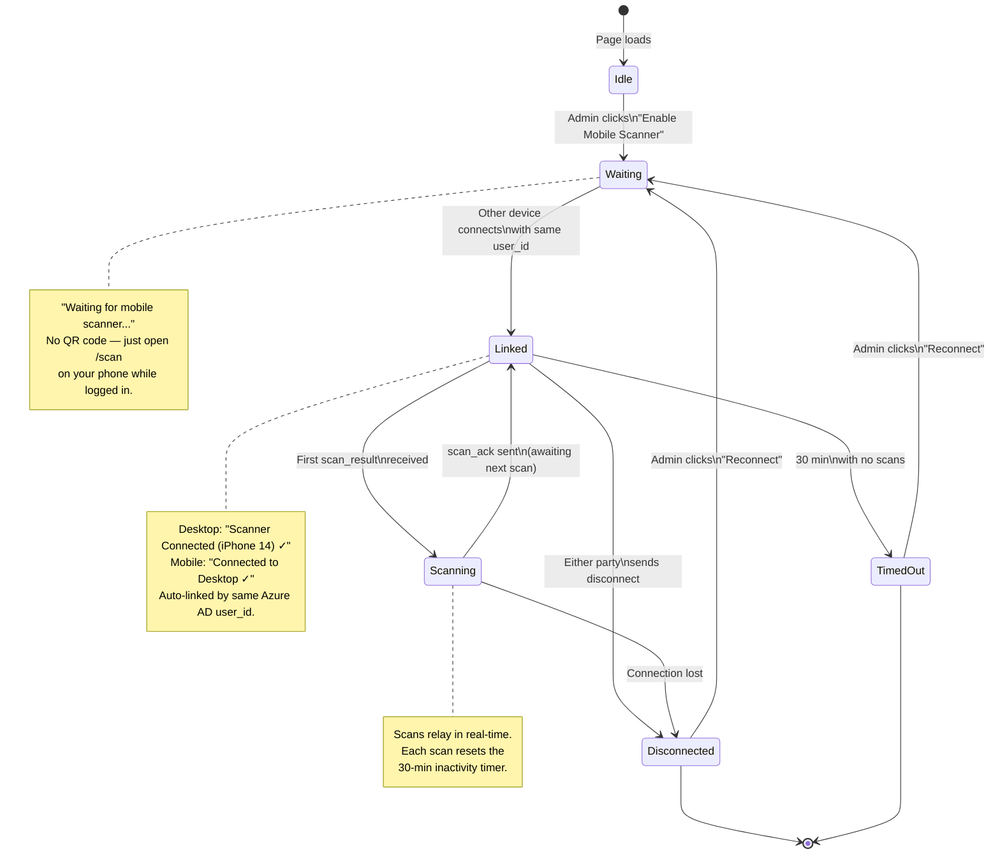
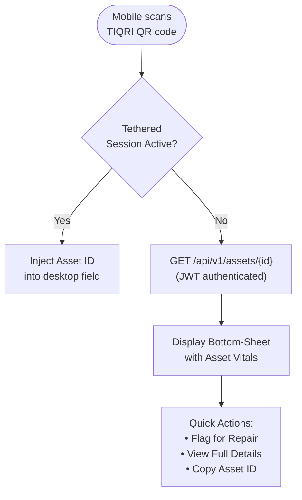

# Tethered Scanner — WebSocket Companion Mode

This document specifies the business logic for IDAMS's Tethered Scanner system — a zero-configuration, identity-based WebSocket link that turns a standard smartphone into a wireless barcode scanner. When the same user is logged in on both a desktop browser and the mobile PWA, scanned barcodes are automatically relayed to the desktop input fields with no manual pairing step required.

## Table of Contents

- [1. Design Principles](#1-design-principles)
- [2. Architecture Overview](#2-architecture-overview)
- [3. Auto-Link Workflow](#3-auto-link-workflow)
- [4. WebSocket Protocol Specification](#4-websocket-protocol-specification)
  - [4.1 Message Types](#41-message-types)
  - [4.2 Session Lifecycle Events](#42-session-lifecycle-events)
- [5. Mobile Scanner Interface](#5-mobile-scanner-interface)
- [6. Desktop Injection Logic](#6-desktop-injection-logic)
- [7. Supported Barcode Formats](#7-supported-barcode-formats)
- [8. Security Model](#8-security-model)
- [9. Connection State Machine](#9-connection-state-machine)
- [10. Error Handling & Recovery](#10-error-handling--recovery)
- [11. Standalone Mobile Lookup (Non-Tethered)](#11-standalone-mobile-lookup-non-tethered)
- [12. Performance Requirements](#12-performance-requirements)
- [13. Traceability Matrix](#13-traceability-matrix)

## 1. Design Principles

| Principle                 | Description                                                                                                                                                                                                                          |
| :------------------------ | :----------------------------------------------------------------------------------------------------------------------------------------------------------------------------------------------------------------------------------- |
| **Zero Install**          | The mobile scanner is a PWA accessed via the standard mobile browser — no App Store download required. The employee navigates to `assets.tiqri.com/scan` and grants camera permission.                                               |
| **Sub-500ms Latency**     | From the moment the phone reads a barcode to the value appearing in the desktop input field must be < 500ms (NFR-PERF-03).                                                                                                           |
| **Zero-Config Auto-Link** | No manual pairing, QR scanning, or session codes are needed. If the same Azure AD user is logged in on both desktop and mobile, the WebSocket server automatically links the two sessions by matching their authenticated `user_id`. |
| **Focused Injection**     | The scanned value is injected only into the currently focused (active) input field on the desktop. If no field is focused, the scan is buffered until a field gains focus.                                                           |
| **Graceful Degradation**  | If the auto-link fails or no desktop session is active, the mobile device falls back to Standalone Lookup mode (bottom-sheet asset details).                                                                                         |

## 2. Architecture Overview



## 3. Auto-Link Workflow

The system automatically links desktop and mobile sessions when the **same Azure AD user** is logged in on both devices. No QR codes, session tokens, or manual pairing steps are required.

### 3.1 How Auto-Link Works

1. Both desktop and mobile authenticate via the same Azure AD SSO flow, producing a JWT containing the user's `user_id`.
2. When the admin enables scanner mode on the desktop (clicking **"Enable Mobile Scanner"**), the desktop opens a WebSocket connection and registers itself as a **receiver** for that `user_id`.
3. When the admin opens `assets.tiqri.com/scan` on their mobile device, the mobile authenticates with the same JWT and opens a WebSocket connection, registering itself as a **sender** for that `user_id`.
4. The WebSocket server matches both connections by `user_id` and notifies both sides that the link is active.
5. Any barcode scanned on mobile is instantly relayed to the desktop input field.



### 3.2 Connection Order Flexibility

The auto-link works regardless of which device connects first:

| Scenario                        | Behaviour                                                                                                                                                                                                                                                                                                           |
| :------------------------------ | :------------------------------------------------------------------------------------------------------------------------------------------------------------------------------------------------------------------------------------------------------------------------------------------------------------------ |
| **Desktop first, then mobile**  | Desktop enters `WAITING` state. When mobile connects with the same `user_id`, the server links them instantly and both transition to `LINKED`.                                                                                                                                                                      |
| **Mobile first, then desktop**  | Mobile enters `WAITING` state (camera active, showing "Waiting for desktop..."). When desktop connects and enables scanner mode, the server links them and both transition to `LINKED`. Scans performed while waiting are **not buffered** — the mobile shows "No desktop connected" until the link is established. |
| **Both connect simultaneously** | Server processes connections sequentially; the second connection triggers the link.                                                                                                                                                                                                                                 |

### 3.3 User Steps (User Perspective)

1. Admin clicks **"Enable Mobile Scanner"** on the desktop registration form — a status badge appears: _"Waiting for mobile scanner..."_
2. Admin opens `assets.tiqri.com/scan` on their phone (already logged in via SSO).
3. Both devices automatically detect each other and display a **"Connected"** indicator with the paired device name.
4. Admin focuses the "Serial Number" input on the desktop.
5. Admin scans the manufacturer barcode on the hardware packaging with the phone.
6. The serial number instantly appears in the desktop input field.

## 4. WebSocket Protocol Specification

### 4.1 Message Types

All WebSocket messages use JSON format:

| Message Type          | Direction                 | Payload                         | Description                                                    |
| :-------------------- | :------------------------ | :------------------------------ | :------------------------------------------------------------- |
| `waiting_for_mobile`  | Server → Desktop          | `{ user_id }`                   | Desktop registered as receiver; awaiting mobile with same user |
| `waiting_for_desktop` | Server → Mobile           | `{ user_id }`                   | Mobile registered as sender; awaiting desktop with same user   |
| `linked`              | Server → Both             | `{ partner_info, linked_at }`   | Both devices connected — auto-link established by `user_id`    |
| `scan_result`         | Mobile → Server → Desktop | `{ value, format, timestamp }`  | Decoded barcode data                                           |
| `scan_ack`            | Desktop → Server → Mobile | `{ received: true }`            | Confirmation that scan was injected into the field             |
| `scan_error`          | Desktop → Server → Mobile | `{ error: "no_focused_field" }` | No input field was focused; scan buffered                      |
| `heartbeat`           | Both → Server             | `{ type: "ping" }`              | Keep-alive ping every 30 seconds                               |
| `disconnect`          | Either → Server           | `{ reason }`                    | Voluntary session termination                                  |
| `session_timeout`     | Server → Both             | `{ reason: "inactivity" }`      | Server-initiated timeout after 30 min of no scans              |

### 4.2 Session Lifecycle Events

```
┌──────────────────────────────────────────────────────────┐
│  Either device connects first (JWT authenticated)        │
│  → Server extracts user_id from JWT                      │
│  → Registers connection in User Session Map              │
│  → State: WAITING (for the other device)                 │
│                                                          │
│  Second device connects with the same user_id            │
│  → Server matches user_id → auto-link established        │
│  → State: LINKED                                         │
│  → Session remains active for up to 30 minutes           │
│                                                          │
│  Scan activity resets the inactivity timer               │
│  → Each scan_result resets the 30-min countdown          │
│                                                          │
│  Session ends when:                                      │
│  • Either party sends disconnect                         │
│  • 30 minutes of inactivity (no scans)                   │
│  • Desktop disables scanner mode or navigates away       │
│  • WebSocket connection drops (network failure)          │
│  • User's Azure AD JWT expires or is revoked             │
└──────────────────────────────────────────────────────────┘
```

## 5. Mobile Scanner Interface

The mobile PWA scanner at `assets.tiqri.com/scan` provides a full-screen camera interface:

### 5.1 Camera Viewfinder UI

```
┌────────────────────────────────────────────┐
│                                            │
│    ┌──────────────────────────────┐        │
│    │                              │        │
│    │                              │        │
│    │      Camera Viewfinder       │        │
│    │                              │        │
│    │         [ + ]                │        │
│    │      Targeting Reticle       │        │
│    │                              │        │
│    │                              │        │
│    └──────────────────────────────┘        │
│                                            │
│    🔦 Flashlight Toggle                    │
│                                            │
│    Status: Connected to Desktop ✓          │
│    Last scan: SN-DELL-5540-001 ✓           │
│                                            │
└────────────────────────────────────────────┘
```

### 5.2 Scanner Library

| Property            | Specification                                                                          |
| :------------------ | :------------------------------------------------------------------------------------- |
| **Library**         | `html5-qrcode` (lightweight, no native dependencies)                                   |
| **Camera API**      | HTML5 `navigator.mediaDevices.getUserMedia()`                                          |
| **Resolution**      | Prefer rear camera, minimum 720p for reliable barcode reading                          |
| **Haptic Feedback** | `navigator.vibrate(200)` on successful decode (NFR-USE-03)                             |
| **Audio Cue**       | Optional beep tone via Web Audio API as fallback for devices without vibration support |
| **Flashlight**      | `MediaStreamTrack.applyConstraints({ torch: true })` for rear-camera flash activation  |

### 5.3 Permission Handling

If the user denies camera permission, the scanner page displays:

```
┌──────────────────────────────────────────────────────────┐
│                                                          │
│    📷 Camera Permission Required                         │
│                                                          │
│    The barcode scanner needs access to your camera.      │
│    Please grant camera permission in your browser        │
│    settings and reload this page.                        │
│                                                          │
│    [ Open Browser Settings ]                             │
│                                                          │
└──────────────────────────────────────────────────────────┘
```

## 6. Desktop Injection Logic

When the desktop receives a `scan_result` message via WebSocket, the following logic executes:

### 6.1 Injection Algorithm

```
1. Check if an input field currently has focus (document.activeElement)
2. If focused field exists AND field is a text/number input:
   a. Set field value to scanned string
   b. Dispatch 'input' and 'change' React synthetic events
      (to properly update React/form state)
   c. Send scan_ack back to mobile
   d. Show desktop toast: "✓ SN-DELL-5540-001 injected into Serial Number"
3. If no field is focused:
   a. Buffer the scanned value in memory
   b. Send scan_error { error: "no_focused_field" } to mobile
   c. Mobile displays: "⚠ No field focused on desktop — click a field"
   d. When any input field gains focus within 10 seconds:
      - Inject the buffered value
      - Clear the buffer
      - Send delayed scan_ack
4. If buffer expires (10 seconds with no focus):
   a. Discard the buffer
   b. Mobile displays: "⚠ Scan discarded — no field received focus"
```

### 6.2 Field Targeting

By default, the scanned value is injected into **whichever input has focus**. However, the desktop form can register specific fields as "scan targets":

```typescript
// Desktop form component
useTetheredScanner({
  targetFields: ['serialNumber', 'assetTag', 'rmaTicketNumber'],
  onScan: (value: string, field: string) => {
    // Custom handler per field
  },
});
```

If `targetFields` is configured, the system only injects into those fields — scanning while a non-target field is focused triggers the "no valid field" error.

## 7. Supported Barcode Formats

The scanner supports all common manufacturer barcode formats:

| Format          | Type | Common Usage                            | Example                           |
| :-------------- | :--- | :-------------------------------------- | :-------------------------------- |
| **Code 128**    | 1D   | Dell, HP, Lenovo serial number stickers | `SN-DELL-5540-001`                |
| **Code 39**     | 1D   | Government/military asset tags          | `US-GOV-2026-0142`                |
| **UPC-A**       | 1D   | Retail product packaging                | `012345678905`                    |
| **EAN-13**      | 1D   | International product codes             | `4901234567890`                   |
| **QR Code**     | 2D   | IDAMS asset routing QR codes            | `assets.tiqri.com/asset/LAP-0142` |
| **Data Matrix** | 2D   | Small component tracking                | Compact binary data               |

### Format Detection Behaviour

The scanner library auto-detects the barcode format. When a **TIQRI QR code** is detected (URL matches `assets.tiqri.com/asset/*`), the system changes behaviour based on the mode:

| Mode                | QR Code Action                                                                                   |
| :------------------ | :----------------------------------------------------------------------------------------------- |
| **Tethered Mode**   | Extracts the Asset ID from the URL path and injects it into the desktop field (e.g., `LAP-0142`) |
| **Standalone Mode** | Navigates to the full URL, triggering the mobile bottom-sheet lookup (Section 11)                |

## 8. Security Model

| Aspect                  | Specification                                                                                                                                                                                                 |
| :---------------------- | :------------------------------------------------------------------------------------------------------------------------------------------------------------------------------------------------------------ |
| **Identity-Based Auth** | Both desktop and mobile authenticate via the same Azure AD JWT. The WebSocket server extracts `user_id` from the JWT on connect and uses it to match the two sessions. No separate pairing tokens are needed. |
| **JWT Validation**      | The WebSocket handshake validates the JWT signature against Azure AD's JWKS endpoint. Expired or revoked tokens are rejected immediately.                                                                     |
| **Transport**           | WebSocket over TLS (`wss://`) exclusively. Plaintext `ws://` connections are rejected.                                                                                                                        |
| **Session Isolation**   | Each `user_id` maps to at most one desktop receiver and one mobile sender. A second mobile from a different browser for the same user replaces the previous mobile connection (last-write-wins).              |
| **No Data Persistence** | Scanned barcode values are relayed in real-time and never persisted on the WebSocket server. The server is a stateless relay.                                                                                 |
| **CORS**                | WebSocket handshake validates `Origin` header against allowed IDAMS domains.                                                                                                                                  |
| **No Shared Secrets**   | Unlike QR-code pairing, no session tokens or pairing codes are exchanged between devices. The user's Azure AD identity is the sole link.                                                                      |

## 9. Connection State Machine



### Desktop UI Status Indicators

| State            | Desktop UI                                        | Mobile UI                                  |
| :--------------- | :------------------------------------------------ | :----------------------------------------- |
| **Idle**         | "Enable Mobile Scanner" button visible            | Scanner page idle                          |
| **Waiting**      | "Waiting for mobile scanner..." status badge      | "Waiting for desktop..." (if mobile first) |
| **Linked**       | "Scanner Connected (iPhone 14) ✓" green badge     | "Connected to Desktop ✓" status bar        |
| **Scanning**     | Toast: "✓ {value} injected" per scan              | "✓ Sent" toast + haptic per scan           |
| **Disconnected** | "Scanner Disconnected — Reconnect?" warning badge | "Connection Lost — Reconnect?" prompt      |
| **Timed Out**    | "Session Expired — Enable Scanner Again?" prompt  | "Session Expired" message                  |

## 10. Error Handling & Recovery

| Scenario                     | Behaviour                                                                                                                                                                                                               |
| :--------------------------- | :---------------------------------------------------------------------------------------------------------------------------------------------------------------------------------------------------------------------- |
| **Mobile loses WiFi**        | WebSocket `onclose` fires. Desktop shows "Scanner Disconnected". Mobile auto-reconnects with exponential backoff (1s, 2s, 4s, 8s) for up to 60 seconds. On reconnect, the server re-matches by `user_id` automatically. |
| **Desktop navigates away**   | Desktop `beforeunload` sends `disconnect` to server. Mobile shows "Desktop session ended." and returns to standalone scanner mode.                                                                                      |
| **Second mobile connection** | Last-write-wins: the new mobile connection replaces the previous one. Desktop receives `{ type: "linked", mobile_info: ... }` with the new device info. The old mobile receives `{ type: "replaced" }`.                 |
| **Different user on mobile** | Server cannot match `user_id`. Mobile enters standalone mode and displays: "No desktop session found. Open IDAMS on your computer and enable the scanner."                                                              |
| **JWT expired on mobile**    | WebSocket handshake is rejected with `401 Unauthorized`. Mobile prompts: "Session expired. Please log in again."                                                                                                        |
| **Camera permission denied** | Scanner interface shows permission-required message (Section 5.3). WebSocket connection still opens (for auto-link) but no scans are possible.                                                                          |
| **Barcode unreadable**       | Scanner library continues attempting decode. After 10 seconds of failed reads, mobile shows: "Having trouble? Try adjusting the angle or distance."                                                                     |
| **Server restart**           | All active sessions are dropped. Both clients receive `onclose`. Mobile and desktop auto-reconnect; server re-establishes the link by `user_id`.                                                                        |

## 11. Standalone Mobile Lookup (Non-Tethered)

When the mobile scanner is **not** paired to a desktop session, scanning a TIQRI QR code triggers the standalone asset lookup:



### Bottom-Sheet Content

```
┌────────────────────────────────────────────┐
│  Asset ID:   LAP-0142                      │
│  Name:       Dell Latitude 5540            │
│  Status:     Assigned ● (Green)            │
│  Custodian:  Jane Doe                      │
│  Location:   Building A / F3 / R301        │
│  Serial:     SN-DELL-5540-001              │
│  Warranty:   Valid until Mar 2027          │
│                                            │
│  [ 🔧 Flag for Repair ]  [ 📋 Copy ID ]   │
└────────────────────────────────────────────┘
```

### Mobile Empty-State Fallbacks

If a mobile user attempts to navigate to complex desktop-only views (e.g., `/registry`, `/financials`), the system renders a clean Empty State card:

```
┌──────────────────────────────────────────────────────────┐
│                                                          │
│    🖥  Desktop Required                                  │
│                                                          │
│    This feature is optimized for desktop browsers.       │
│    Please switch to a computer to access the full        │
│    Asset Registry and Financial modules.                 │
│                                                          │
│    On mobile, you can:                                   │
│    • Scan QR codes for asset lookup                      │
│    • View your assigned assets ("My Assets")             │
│    • Report issues with equipment                        │
│                                                          │
└──────────────────────────────────────────────────────────┘
```

---

## 12. Performance Requirements

| Metric                    | Target                                                                        | Requirement |
| :------------------------ | :---------------------------------------------------------------------------- | :---------- |
| **Scan-to-Field Latency** | < 500ms end-to-end                                                            | NFR-PERF-03 |
| **Auto-Link Handshake**   | < 2 seconds from second device connecting to "Connected" status               | NFR-PERF-03 |
| **Camera Initialization** | < 3 seconds from permission grant to active viewfinder                        | NFR-USE-01  |
| **Concurrent Sessions**   | Support 50 simultaneous paired sessions per WebSocket server instance         | NFR-PERF-07 |
| **Memory Footprint**      | WebSocket server holds no scan data in memory beyond relay — pure passthrough | —           |
| **Heartbeat Interval**    | 30 seconds; 3 missed heartbeats = connection presumed dead                    | —           |

---

## 13. Traceability Matrix

| Specification Section                          | Requirement IDs           | User Story |
| :--------------------------------------------- | :------------------------ | :--------- |
| PWA Mobile Scanner (Zero Install)              | REQ-REG-2.13, NFR-USE-01  | US-2.4.1   |
| HTML5 Camera Interface                         | REQ-REG-2.13              | US-2.4.1   |
| Identity-Based Auto-Link (WebSocket)           | REQ-REG-2.14, REQ-FND-1.1 | US-2.5.1   |
| Real-Time Barcode Injection                    | REQ-REG-2.14, NFR-PERF-03 | US-2.5.2   |
| 1D Barcode Format Support (Code 128, UPC, EAN) | REQ-REG-2.14              | US-2.5.2   |
| QR Code Routing Detection                      | REQ-REG-2.11              | US-2.3.1   |
| Standalone Mobile Lookup (Bottom-Sheet)        | REQ-REG-2.15              | US-2.4.2   |
| Mobile Empty-State Fallbacks                   | REQ-REG-2.15, NFR-USE-02  | US-2.4.3   |
| Haptic Feedback on Scan                        | NFR-USE-03                | US-2.4.2   |
| Scan Latency < 500ms                           | NFR-PERF-03               | US-2.5.2   |
| JWT Identity-Based Security                    | NFR-SEC-04, REQ-FND-1.1   | US-2.5.1   |
| WSS Transport Only (TLS)                       | NFR-SEC-04, REQ-FND-1.2   | —          |
| Desktop Field Injection Logic                  | REQ-REG-2.14              | US-2.5.2   |
| Camera Permission Handling                     | REQ-REG-2.13              | US-2.4.1   |
| Flashlight Toggle                              | REQ-REG-2.13              | US-2.4.1   |

[< Back to Requirements](../README.md)
